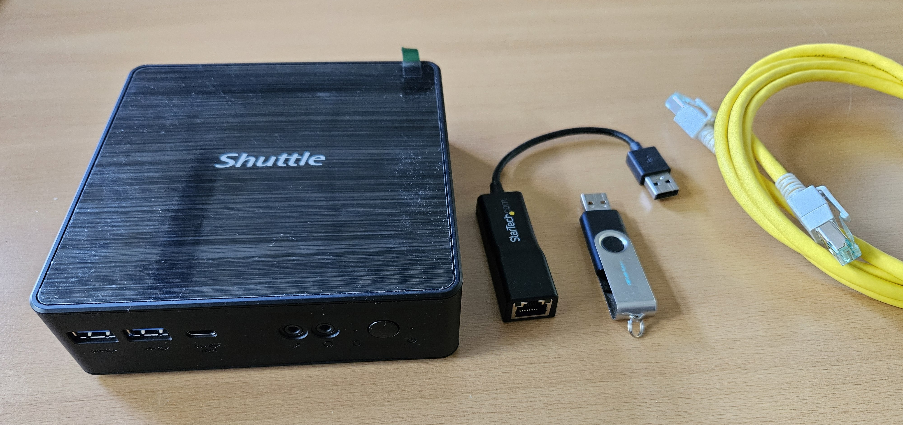

English text below.

# Lernen mit dem PDAL (Personal Distributed Applications Lab): Grundlagen für verteilte Anwendungen und Systeme

### Die Bedeutung verteilter Systeme

**Verteilte Systeme** sind der Motor unserer modernen Welt. Sie bezeichnen die Infrastruktur aus miteinander verbundenen Computern, die zusammenarbeiten, um ein gemeinsames Ziel zu erreichen. Jede Nutzung einer App wie TikTok, ein Video-Stream auf Netflix oder ein Online-Einkauf bei Amazon basiert auf solchen Systemen, die aus Tausenden von Servern bestehen. Innerhalb dieser Systeme laufen **verteilte Anwendungen**, wie z. B. eine Microservices-Architektur. Das Verständnis dieser Infrastrukturen und der darauf laufenden Anwendungen ist eine der gefragtesten Kompetenzen auf dem heutigen Arbeitsmarkt.

### Die Herausforderung des praktischen Lernens

Um verteilte Systeme zu verstehen, ist es unerlässlich, sie selbst aufzubauen und darauf Anwendungen zu entwickeln. In traditionellen Kursen ist dies oft schwierig, da das Arbeiten auf echten, produktiven Servern zu riskant ist. Gleichzeitig bleiben theoretische Konzepte ohne praktische Anwendung abstrakt. Das **PDAL (Personal Distributed Applications Lab)** schließt genau diese Lücke.

### Das PDAL: Das eigene Rechenzentrum

Das PDAL ist eine sichere, persönliche Lernumgebung für den Aufbau **verteilter Systeme** und die Entwicklung **verteilter Anwendungen**. Es ermöglicht den Aufbau eines eigenen kleinen Rechenzentrums, das vom Hauptrechner isoliert ist. Hier kann man ohne Risiko experimentieren, Fehler machen und daraus lernen. Der Lernende wird angeleitet, virtuelle Umgebungen (LXC-Container) zu erstellen, zu vernetzen und darauf Middleware-Dienste wie Webserver und Datenbanken zu installieren. Darauf aufbauend werden dann die eigenen **verteilten Anwendungen** implementiert.

### Was das PDAL bietet und was nicht

Das PDAL ist **keine vollständige Ausbildung zum Systemadministrator** und setzt keine spezifischen Vorkenntnisse voraus. Es dient als erster, angeleiteter Einstieg in die Welt der **verteilten Systeme** und **Anwendungen**. Der Fokus liegt auf der Vermittlung von Grundlagen, die schnelle Erfolge ermöglichen und die Motivation aufrechterhalten. Der Lernpfad lehrt nicht nur die Durchführung einzelner Schritte, sondern auch die Fähigkeit zur eigenständigen Problemlösung. Am Ende dieses Pfades ist eine solide Basis für die selbstständige Weiterbildung in diesem Themenfeld geschaffen.

### Benötigte Voraussetzungen

Für den Start sind folgende Materialien notwendig:

* **Eigener Rechner:** Ein Windows-PC, der als Host dient.
* **USB-Stick (mind. 8 GB):** Wird für die Installation des Hypervisors Proxmox VE benötigt.
* **USB-Netzwerkkarte:** Ermöglicht die Isolation des PDAL vom Heimnetzwerk.
* **Übungsrechner:** Ein dedizierter Rechner (z.B. ein älterer Laptop oder ein Mini-PC), der ausschließlich für das PDAL genutzt wird.

### Lernziele des PDAL

Am Ende des Lernpfades werden folgende Kompetenzen erworben:

* **Infrastruktur-Grundlagen:** Ein Host-Rechner kann mit einem Bare-Metal-Hyperviser (Proxmox VE) eingerichtet und virtuelle Umgebungen (LXC-Container) können verwaltet werden.
* **Betriebssystem- und Container-Management** Dieser Block ist der Fähigkeit gewidmet, Ubuntu LTS LXC-Container zu erstellen, zu konfigurieren und grundlegende Linux-Aufgaben innerhalb der Container auszuführen.
* **Praktische Anwendung:** Verschiedene Middleware-Systeme wie Apache, MariaDB, JupyterLab, Grafana und MQTT-Broker können installiert und konfiguriert werden.
* **Verteilte Anwendungen:** Eine einfache verteilte Anwendung (Microservices) kann entworfen und implementiert werden, wobei das Zusammenspiel der einzelnen Komponenten verstanden wird.

---

### Lizenz
Dieses Werk ist lizenziert unter der **Creative Commons - Namensnennung - Weitergabe unter gleichen Bedingungen 4.0 International Lizenz**.
 
[Zum Lizenztext auf der Creative Commons Webseite](https://creativecommons.org/licenses/by-sa/4.0/legalcode.de)

---
---

### PDAL(Personal Distributed Applications Lab): The Foundation for Distributed Applications and Systems

**Distributed Systems** are the engine of our modern world. They describe the infrastructure of interconnected computers that work together to achieve a common goal. Every time you use an app like TikTok, stream a video on Netflix, or make a purchase on Amazon, you're interacting with such systems, which are composed of thousands of servers. Within these systems, **distributed applications** run, such as a microservices architecture. Understanding this infrastructure and the applications that run on it is one of the most sought-after skills in today's job market.

### The Challenge of Practical Learning

To truly understand distributed systems, it's essential to build them yourself and develop applications for them. In traditional courses, this is often difficult, as working on real, production servers is too risky. At the same time, theoretical concepts often remain abstract without practical application. The **PDAL (Personal Distributed Applications Lab)** bridges this gap.

### The PDAL: Your Personal Data Center

The PDAL is a safe, personal learning environment for building **distributed systems** and developing **distributed applications**. It allows you to set up your own small data center, completely isolated from your main computer. Here, you can experiment, make mistakes, and learn from them without risk. You'll be guided through creating and networking virtual environments (LXC containers) and installing middleware services like web servers and databases. Building on this foundation, you will then implement your own **distributed applications**.

### What the PDAL Offers and What It Doesn't

The PDAL is **not a complete system administration degree** and doesn't require any specific prior knowledge. It serves as your first guided entry into the world of **distributed systems** and **applications**. The focus is on teaching you the fundamentals in a way that allows for quick successes and maintains your motivation. This learning path not only teaches you how to perform individual steps but also the skill of independent problem-solving. At the end of this journey, you will have built a solid foundation for your own continued learning in this field.

### Necessary Prerequisites

To get started, you will need a few things:

* **Your Own Computer:** A Windows PC that will serve as the host.
* **USB Flash Drive (min. 8 GB):** Needed to install the Proxmox VE hypervisor.
* **USB Network Adapter:** To isolate the PDAL from your home network.
* **Practice Computer:** A dedicated machine (e.g., an older laptop or a mini PC) that will be used exclusively for the PDAL.

### Learning Goals of the PDAL

By the end of this learning path, you will have acquired the following skills:

* **Infrastructure Fundamentals:** You will be able to set up a host machine with a bare-metal hypervisor (Proxmox VE) and manage virtual environments (LXC containers).
* **Operating System and Container Management** This block is dedicated to the ability to create and configure Ubuntu LTS LXC containers and perform basic Linux tasks within the containers.
* **Practical Application:** You will be able to install and configure various middleware systems like Apache, MariaDB, JupyterLab, Grafana, and MQTT brokers.
* **Distributed Applications:** You will be able to design and implement a simple distributed application (microservices), understanding how the individual components interact.

---

### License
This work is licensed under the **Creative Commons Attribution - ShareAlike 4.0 International License**.
 
[To the license text on the Creative Commons website](https://creativecommons.org/licenses/by-sa/4.0/legalcode.en)
 

 

