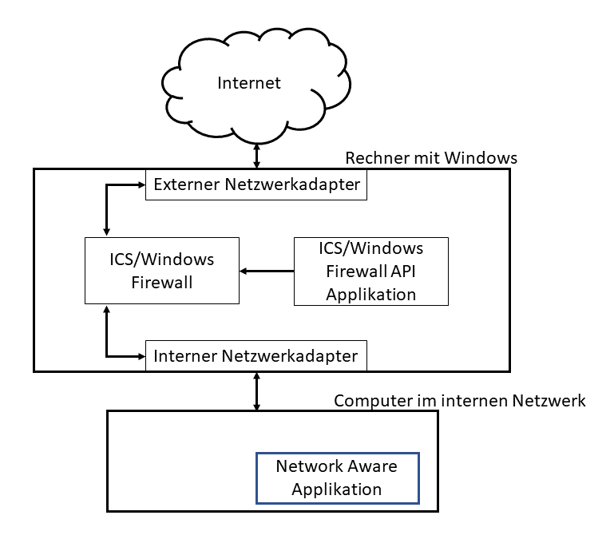
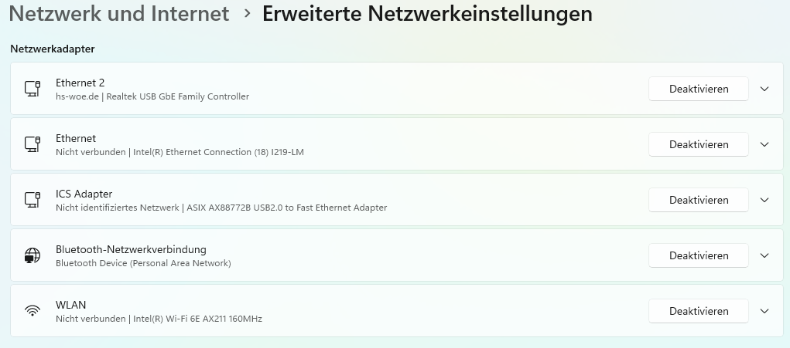

# 00 - Netzwerkkarte USB auf RJ45 einrichten


## 1. Fragestellung & Hypothese 

 Ist eine Internet Konnektivität mit den Netzwerk Adaptern in der Adapterliste aufgeführten Netzwerkadaptern über ICS (Internet Connection Sharing) möglich und wie ist dies um zu setzen?

Eine Internetverbindung ist nach der Netzwerkkonfiguration der beiden Geräte also auf ICS Seite und LAN Gerät vorhanden.

## 2. Aufbau 

### Gerät auf dem das ICS konfiguriert wird

Für das Gerät auf dem das ICS konfiguriert wird ein Notebook mit Windows 11 verwendet (ICS ist ab Windows 8.1 verfügbar).
```text
Systemhersteller:	Dell Inc.
Systemmodell:	Latitude 5550
Prozessor:	Intel Core Ultra 5 125U, 1300 MHz, 12 Kerne, 14 logische Prozessoren
Betriebsystemname:	Microsoft Windows 11 Pro
Version:	10.0.26100 Build 26100
```
### Gerät das die ICS nutzt

Hierfür wird eine Raspberry Pi verwendet um den ersten Netzwerktest machen zu können. 
```text
Systemhersteller: Raspberry
Systemmodell: PI500
Prozessor: 2,4 GHz Quad-Core 64-Bit Arm Cortex-A76 CPU
Betriebssystemname: Raspberry PIOS 64bit/ Debian Bookworm
```
Hat man keinen Zweitrechner zur Hand, können die Netzwerktests später durchgeführt werden.

### Adapterliste (gestestete Adapter)
1. Startech.com USB2.0 Asix AX88772B
2. Logilink USB3.0 Asix AX88179
3. MAXTRACK USB-C Realtec GBe Family

---
## 3. ICS-Verbindung einrichten

Wie ICS arbeitet sehen Sie auf der folgenden Grafik.



Dementsprechend wird das interne Netzwerk durch die Windows-Firewall bzw. Antiviren-Programme geschützt. 
Das interne Netzwerk ist daruch abgeschottet und kein Bestandteil des geschützten Netzwerkes.

-----

USB Netzwerkadapter an Rechner mit aktiver Internetverbindung einstecken.
Netzwerkstecker an PDAL einstecken.
Jetzt am Internetrechner die Einstellungen öffnen

Nun wählt man auf der linken Seite **Netzwerk und Internet** aus.


Anschließend wählen Sie **erweiterte Einstellungen aus**


Wählen Sie nun den Ethernet Adapter aus der eine aktive Internetverbindung hat aus.


Jetzt klicken Sie bei **Weitere Adapteroptionen** auf **Bearbeiten**
Es erscheint das Eigenschaften Fenster des Netzwerkadapters
Setzen Sie den Haken bei Gemeinsame Nutzung der Internetverbindung.
Anschließend wählen Sie den Adapter für die Heimnetzwerkverbindung aus.
Idealerweise haben Sie zuvor den Heimnetzwerkadapter bereits umbenannt.


Nach dem klick auf **OK** führt Windows selbstständig eine IP Konfiguration durch und vergibt die `IP 192.168.137.1` an den Heimnetzwerkadapter, mit **OK** bestätigen Sie den Vorgang.

## 4.Beobachtung 

Nach der Einrichtung der ICS und der physischen Verbindung des Gerätes im LAN und dem Internet Rechner gab es eine Verbindung zum Internet.
Man konnte beobachten das die Namensauflösung über DNS funktionierte. Zur Überprüfung auf Connectivität mittels Console und Ping Befehle zunächst auf den Rechner der die ICS bereit stellt, anschließend nach außen wie z.B. Google DNS IP `8.8.8.8` zur Namensauflösung haben wir ein Ping an `heise.de` gesendet und auch hier bestand eine Verbindung.

Als nächstes sollte überprüft werden, ob aktuelle Updates für das System zur Verfügung stehen. Dabei stellten wir fest das hier Fehlermeldungen aufkamen, die auf Zeit Synchronisierung zurück zu führen waren. Ein kurzer Blick auf die Uhrzeit des Geräts im Heimnetzwerk zeigte uns das sie nicht synchron zur Uhrzeit des ICS Rechner lief.
Da wir uns im Hochschulnetzwerk befinden, wissen wir das der Port UDP 123 nach außen gesperrt ist.
Um dieses Problem zu lösen mussten wir in die `timesyncd.conf` und einen anderen Zeitserver angeben. In diesem Fall war es der `time.jade-hs.de`.
Nachdem der Zeitserver der Hochschule angegeben wurde und die Konfigurationsdatei gespeichert wurde, konnten auch für das Raspberry OS Updates/ Upgrades heruntergeladen werden und installiert werden mittels `apt update` und `apt upgrade`.

Es konnten auch Verbindungen zu Webseiten aufgebaut werden, die ohne die Anpassung der `timesyncd.conf` nicht möglich waren.
DNS und Gateway Einstellungen werden am Netzwerkadapter der vom ICS System zum LAN Gerät führt, nicht vorgenommen, da diese Einstellung automatisch vom ICS übernommen werden. Man darf keinerlei Einträge für DNS und Gateway vornehmen, da sonst keine Verbindung mit dem Internet zustande kommt.

Die Netzwerkkonfiguration auf dem Zielsystem kann sowohl über DHCP als auch manuell erfolgen.
Über DHCP brauche ich keinerlei Einstellungen vornehmen, während bei der manuellen Einstellung IP, Subnet Mask, DNS als auch Gateway eingetragen werden müssen.

## 5. Deutung 

Die Konfiguration ist sehr einfach, schränkt jedoch die Wahl der IP-Adresse für das lokale Netzwerk ein. Windows 11 vergibt immer die IP-Adresse `192.168.137.1` für das Internet Connection Sharing.

Man kann diese zwar manuell vergeben ist aber mit Umwegen verbunden.
## 6. Quellen

- [Erstellen und Konfigurieren von Internetfreigabefunktionen (Microsoft)](https://learn.microsoft.com/de-de/windows-hardware/drivers/mobilebroadband/creating-and-configuring-internet-sharing-experiences)


---

### Lizenz
Dieses Werk ist lizenziert unter der **Creative Commons - Namensnennung - Weitergabe unter gleichen Bedingungen 4.0 International Lizenz**.
 
[Zum Lizenztext auf der Creative Commons Webseite](https://creativecommons.org/licenses/by-sa/4.0/legalcode.de)

