# Installation von Proxmox VE auf einem Tiny PC

**Aufgabe**:  
Der Tiny-PC soll als Virtualisierungshost mit **Proxmox Virtual Environment (VE)** eingerichtet werden. Ziel ist es, eine funktionierende Installation von Proxmox zu erstellen, die über ein Webinterface administriert werden kann.

**Erwartetes Ergebnis**:  
Ein einsatzbereiter Proxmox VE-Host, der VMs und Container unterstützt und über das Netzwerk erreichbar ist.

---

## b. Vorbereitung

**Hardware**:

**Tiny-PC**:

- Prozessor: Unterstützt Virtualisierung (z. B. Intel VT-x, AMD-V)
- RAM: Mindestens 4 GB (empfohlen: 8 GB)
- Festplatte: Mindestens 32 GB (empfohlen: 128 GB oder mehr)
- Netzwerkkarte: Gigabit-Ethernet

**Peripherie**:

- Monitor, Tastatur, Maus für die Installation (nach Installation nicht mehr notwendig)
- Bootfähiger USB-Stick (8 GB oder größer)

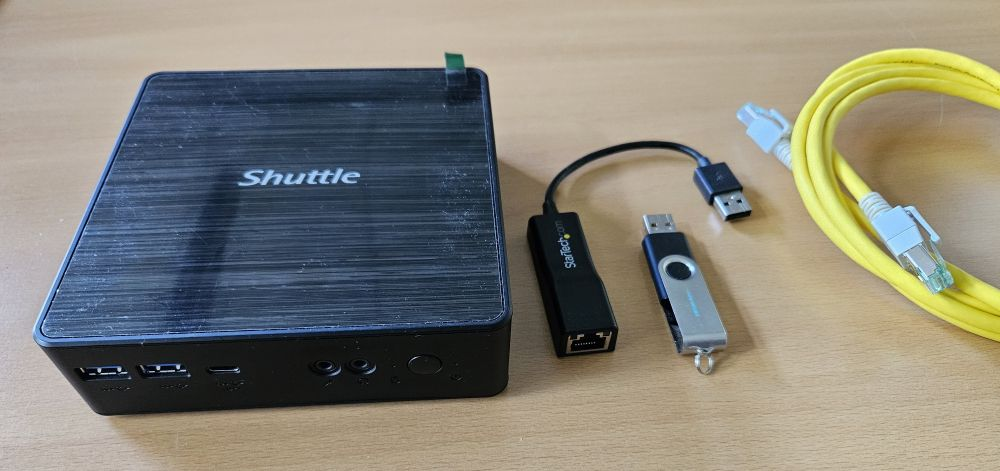

**Software**:

- **Proxmox VE ISO-Image**: [Proxmox](https://www.proxmox.com/de/downloads/proxmox-virtual-environment/iso) (Version: z. B. 8.0)
- **Bootloader-Tool**: [Rufus](https://rufus.ie/de/) (Windows) oder [Balena Etcher](https://etcher.balena.io/) (Linux/MacOS)

**Set-Up**:

1. **BIOS/UEFI konfigurieren**:

- Virtualisierung aktivieren (z. B. Intel VT-x oder AMD-V).
- Secure Boot deaktivieren.
- Bootreihenfolge so einstellen, dass der USB-Stick zuerst gestartet wird.

2. **Bootfähigen USB-Stick erstellen**:

- ISO-Image mit Rufus oder Balena Etcher auf den USB-Stick schreiben.

---

## c. Durchführung

### Schritt 1: BIOS/UEFI konfigurieren

1. **BIOS/UEFI konfigurieren**:
    Nach dem Starten des Rechners die `entf` Taste drücken um in das Bios/ Uefi zu gelangen.
    im Bereich Advanced in die CPU Configuration gehen um dort die Virtualisierung zu aktivieren.

    

- Virtualisierung aktivieren (z. B. `Intel VT-x` oder `AMD-V`).
    Im Bereich Security das Secure Boot deaktivieren.
    
    

- Secure Boot deaktivieren.
- Bootreihenfolge so einstellen, dass der USB-Stick zuerst gestartet wird.

**Um die Bootreihenfolge anzupassen gibt es 2 Möglichkeiten.**

a) Bootreihenfolge im Bios/UEFI ändern. Das kann man im Abschnitt Boot im Bios/ UEFI unter Boot Option durchführen.

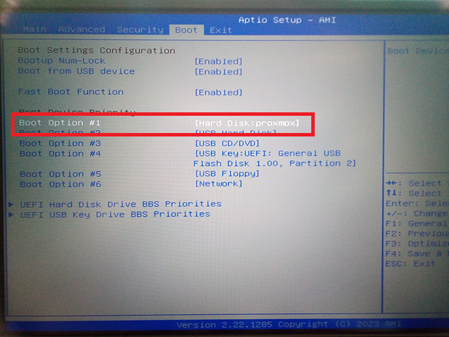


Danach auf EXIT gehen und `Save Changes and Exit` auswählen und bestätigen.


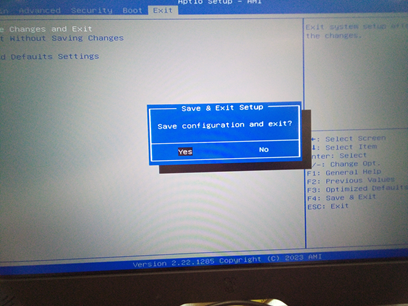

b) Um ein spezifisches Bootmedium auszuwählen, reicht es aus das BBS Menü aufzurufen. Die Taste hierfür variiert je nach Hersteller von `F2` bis `F7`


---

### Schritt 2: Proxmox ISO herunterladen und bootfähigen USB-Stick erstellen

1. Rufe die [Proxmox-Downloadseite](https://www.proxmox/downloads) auf.
2. Lade das aktuellste Proxmox VE ISO-Image herunter (z. B. `proxmox-ve_8.x.iso`).

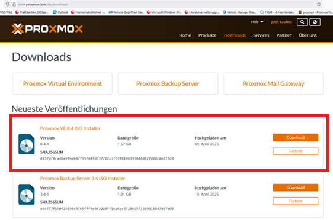

3. Erstelle mit Rufus (Windows) oder Balena Etcher (Linux/MacOS) einen bootfähigen USB-Stick.

- Wähle das ISO-Image und den USB-Stick aus.
- Klicke auf "Start", um den Stick zu erstellen.
Erstellung bootfähiger USB-Stick mit Rufus:

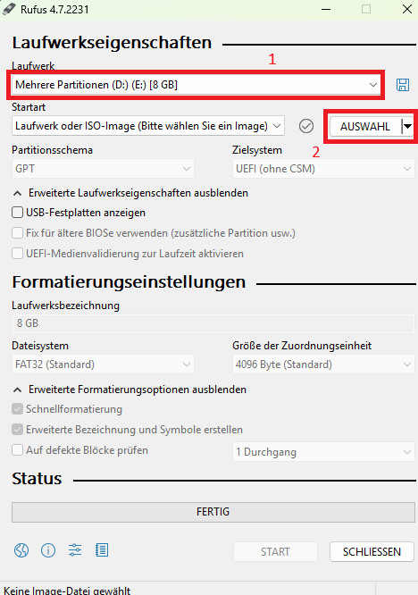

1. Auswahl des Laufwerks auf das das Image geschrieben werden soll.
2. Auswahl des Images, das auf dem USB-Stick geschrieben wird.

---


Sollte der USB-Stick bereits Daten enthalten, bestätigen Sie bitte die Warnung, sofern die Daten gelöscht werden dürfen.

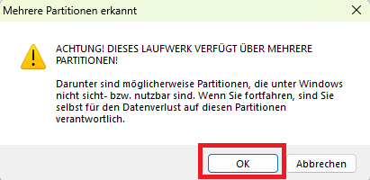

Warnung einfach mit OK bestätigen


nach der Auswahl erscheint das Iso File in dem oberen rot markierten Bereich.
Jetzt einfach auf START klicken.


warten bis Status auf Fertig steht.

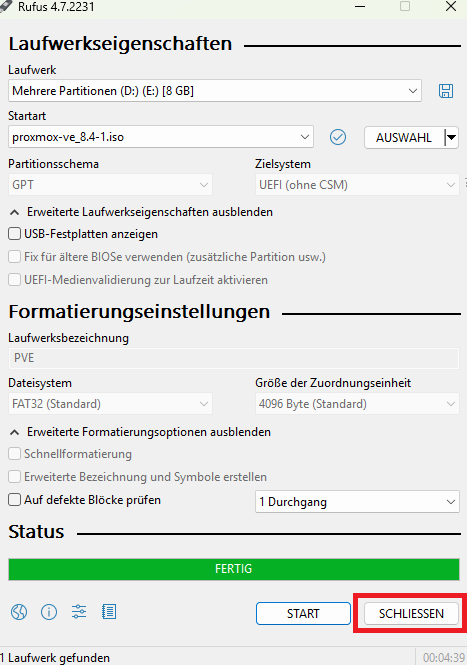

Nachdem der Schreibvorgang abgeschlossen ist einfach auf `SCHLIESSEN` klicken.

### Schritt 3: Proxmox Installation starten

1. Stecke den USB-Stick in den Tiny-PC und starte den Tiny-PC.
2. Wähle im Boot-Menü (meistens über `F2` bis `F8` je nach Hersteller des Mainboards) den USB-Stick aus.


3. Im Boot-Menü von Proxmox wähle `Install Proxmox VE Terminal UI` oder `Install Proxmox VE Graphic`.
Der Installationsprozess ist der selbe.

Nachstehend wird die Installation von Proxmox mit der grafischen Oberfläche beschrieben:

### Schritt 4: Proxmox installieren

1. **Lizenzbedingungen akzeptieren**:

- Lese die Lizenzbedingungen und stimme zu.

    

2. **Festplatte auswählen**:

- Wähle die Festplatte für die Installation aus (alle Daten auf der Festplatte werden gelöscht).

    

3. **Zeitzone und Sprache einstellen**:

- Wähle die gewünschte Zeitzone und das Tastaturlayout.

    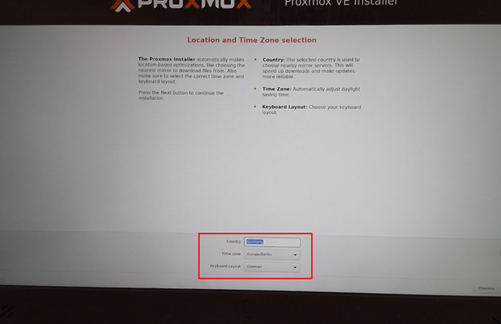

4. **Passwort und E-Mail**:

- Lege ein starkes Root-Passwort fest.
- Gib eine E-Mail-Adresse für Systembenachrichtigungen an.

    

---

`>Hinweis:
Im Hochschul- Netzwerk dürfen keine Server betrieben werden.
Deshalb nutzen wir im Hochschul- Netzwerk eine Netzwerk Konfiguration die mit ICS realisiert wird.`

---

5. **Netzwerkeinstellungen konfigurieren**:

- Wähle Netzwerkadapter aus `eno1`.
- gib den Hostnamen an z.B. `proxmox.local`
- Gib bei statischer IP die IP-Adresse in folgender schreibweise an `192.168.137.***/24`, Gateway `192.168.137.1`und DNS-Server `192.168.137.1`an.
  


> [!info] Warum eine statische IP-Adresse?
> Eine statische IP-Adresse sorgt dafür, dass die VM immer dieselbe Netzwerkadresse (z. B. `192.168.1.100`) verwendet, unabhängig davon, wie oft sie gestartet oder neu verbunden wird. Dadurch ist sie für andere Geräte oder VMs immer unter derselben Adresse zu erreichen. Das ist wichtig, wenn die VM als Server (z. B. Datenbank oder Webserver) dient.
>
> Weitere Infos: [[04 Durchführung Statische IP für eine Ubuntu LTS VM]]

>Hinweis: Mit `*.local` legen wir die Domain unserer virtuellen Umgebung fest. Diese wird im weiteren durchgängig bei der Bennenung der weiteren Server/LXC verwendet.Diese Domain ist für unterschiedliche Anforderungen wichtig; z. B. eindeutiger FQDN (Fully Qualified Domainname), SSL-Zertifikate, DNS-Auflösung, usw..

### Schritt 5: Installation abschließen

1. Überprüfe die Einstellungen und klicke auf `Install`.


2. Warte, bis die Installation abgeschlossen ist (ca. 10–20 Minuten).
3. Entferne den USB-Stick und starte den Tiny-PC neu.

### Schritt 6: Netzwerk Konnektivität prüfen

Um die Netzwerk Konnektivität zu überprüfen nutzen wir die CLI (Command Line) vom eben installiertem Proxmox Systems.
Proxmox zeigt hier bereits die Adresse an, die später im Webinterface benötigt wird
Hierzu müssen wir uns zunächst im System anmelden. Dies geschieht mit dem Benutzer `root` und dem bei der Installation festgelegtem Passwort.
Bitte wundert Euch bei der Eingabe des Passworts nicht, daß Euch keine Platzhalter für die eingegebenen Zeichen angezeigt werden.
In der CLI auf Linux basierten Systemen verbleibt der Cursor an Ort und Stelle bei der Eingabe des Passworts.

Die Ausgabe sieht wie folgt aus:


nach eingabe des users `root`

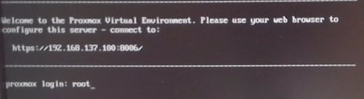

jetzt `Enter` drücken


Nun das Passwort eingeben:


1. Zunächst versuchen wir den Rechner zu pingen der mit unserem virtuellem Netzwerk die Internetverbindung teilt.
Da wir hier die ICS Funktion von Windows verwenden, pingen wir hier die Adresse `192.168.137.1` an.

   Den Ping beenden wir mit `STRG + C`

   >Weitere Infos: [00 - Netzwerkkarte Experiment](../Netzwerkverbindung/00%20-%20Netzwerkkarte%20Experiment.md)
   >
   >Hier wird erklärt wie man einen USB Netzwerkadapter über ICS konfiguriert.
   >
   Der Befehl lautet: `ping 192.168.137.1`
Wenn wir alles richtig bei der Installation konfiguriert haben, sollten wir diese Ausgabe bekommen:

   

2. Nachdem wir festgestellt haben das eine Netzwerkverbindung zu unserem ICS Rechner besteht, prüfen wir, ob eine Verbindung mit dem Internet besteht.
Dazu nutzen wir auch hier den Befehl `ping` und geben als IP Adresse die vom Google DNS(Domain Name Server)an.`ping 8.8.8.8`
Auch hier gilt, sollte alles richtig konfiguriert sein, müssten wir diese Ausgabe bekommen.

   

3. Zuletzt testen wir die Namensauflösung ins Internet.
Hierzu verwenden wir auch den Befehl `ping` und als Ziel geben wir jetzt eine Webadresse an. In dem Beispiel verwenden hier die Adresse von Heise.
`ping heise.de`
Wenn alles richtig konfiguriert ist, dann sollte es in etwa so aussehen.

   

   damit wir updates und upgrades von den Debian Repositories herunterladen und installieren können, da die Quellserver als Web Adressen in der Source List eingetragen sind.

### Schritt 7: Proxmox Webinterface aufrufen

1. Öffne auf einem anderen Gerät einen Browser und gib die Proxmox-URL ein:

   - `https://<Proxmox-IP-Adresse>:8006`
  
   

2. Durch fehlendes Zertifikat wird uns eine Warnung ausgegeben, die die Seite als unsicher anzeigt.
Klicke hier auf Erweitert (siehe unteres Bild) und wähle Ausnahme zulassen.

   

3. Melde dich mit `root` und dem während der Installation festgelegten Passwort an. Hier kannst du auch die Sprache des Webinterfaces festlegen.

   

### Schritt 8: Proxmox CA Zertifikat in Client einpflegen

1. Proxmox erstellt automatisch während der Installation ein Root-CA Zertifikat mit dazugehörigem RSA Schlüssel.
Damit wir keine Zertifikatsfehlermeldung mehr erhalten, müssen wir das von Proxmox erstellte Zertifikat in unseren Client als Vertrauenswürdiges Zertifikat einpflegen.
2. Wir nutzen hier um das Zertifikat von Proxmox zu unserem Client zu kopieren ein SFTP fähiges Programm wie WinSCP.
Hier der Downloadlink zu WinSCP: [WinSCP](https://winscp.net/download/WinSCP-6.5.3-Setup.exe/download)
Wir öffnen in WinSCP eine `SFTP` Session zu unserem Proxmox Host mit der IP `192.168.137.100` mit dem Port 22 und dem user:`root`

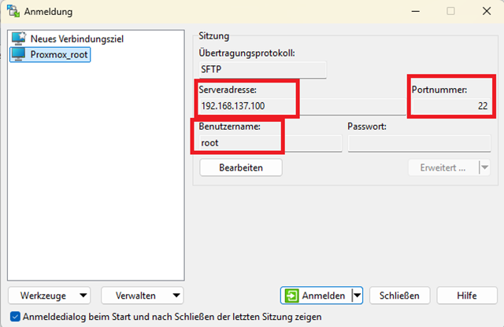


3. Wir wechseln jetzt in das Verzeichnis
`/etc/pve/` und laden die Datei `pve-root-ca.pem` in unser tmp Verzeichnis auf Datenträger `C:\tmp\` herunter.


4. Nun wird in der Suchleiste von Windows auf unserem ICS Client `Benutzerzertifikate verwalten` eingegeben und wählen in der Ergebnisliste das oberste Ergebnis aus.


5. Wir navigieren im CertMngr zu dem Verzeichnis `vertrauenswürdige Stammzertifizierungsstelle` und klicken links auf den Pfeil damit uns die Verzeichnisstruktur angezeigt wird.


   Nun ein Rechtsklick auf das Unterverzeichnis Zertifikate machen und klicken dann auf alle Aufgaben und auf Importieren.


6. Nun öffnet sich der Assistent für das Importieren von Zertifikaten.


Auf `weiter` klicken.


Jetzt klicken wir auf Durchsuchen und wählen das Verzeichnis aus, wo wir zuvor das Proxmox Zertifikat heruntergeladen haben.

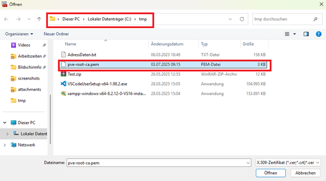

Wir wählen das zuvor heruntergeladene Proxmox Zertifikat aus und klicken auf Öffnen.


Nun klicken wir auf weiter.
Wir erhalten nun eine Sicherheitswarnung.
Diese einfach bestätigen und somit ist das Zertifikat von Proxmox im Client eingepflegt worden.


Dieses vorgehen werden wir später mit anderen Zertifikaten wiederholen müssen, um auch für unseren apache2, mariadb und andere Anwendungen eine sichere Verbindung über TLS/SSL realisieren zu können.

>!Hinweis! In produktiv Systemen nutzt man allerdings hierfür öffentlich vertrauenswürdige Zertifizierungsstellen, oder eine interne Zertifizierungsstelle, die zentral in einem Unternehmen verwaltet wird.

### Schritt 9: Zeitserver Konfiguration mit Chrony für das Hochschulnetz anpassen

Hier wird beschrieben, wie man den Zeitserver `time.jade-hs.de` in **Proxmox VE** unter Verwendung des **Chrony-Dienstes** konfiguriert.

Wir müssen den Zeitserver anpassen, da die Jade Hochschule den NTP port 123 blockiert und somit keine Zeit Synchronisation stattfinden kann.

>Weitere Infos: im Dokument [Erklärung warum Zeitsynchronisation wichtig ist] wird dieses Thema näher behandelt

---

1. Chrony-Konfiguration anpassen

   Öffne die Konfigurationsdatei von Chrony mit einem Editor:

   ```bash
   nano /etc/chrony/chrony.conf
   ```

   

   Suche nach den Zeilen, die mit pool oder server beginnen (z. B. pool ntp.ubuntu.com iburst) und kommentiere diese aus oder lösche sie.

   Füge stattdessen den folgenden Zeitserver hinzu:

   ```bash
   server time.jade-hs.de iburst
   ```

   

   Info: `iburst` sorgt für schnellere Synchronisierung beim Start.

2. Konfigurationsdatei speichern und schließen

   Bei nano: Drücke `Strg + O` zum Speichern und `Strg + X` zum Beenden.

3. Chrony neu starten

   ```bash
   systemctl restart chrony
   ```

4. Status und Synchronisation prüfen
Chrony-Status anzeigen:

   ```bash
   systemctl status chrony
   ```

   

   NTP-Synchronisation prüfen:

   ```bash
   chronyc sources
   ```

   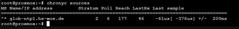

   Oder für genauere Informationen:

   ```bash
   chronyc tracking
   ```

   

   Hinweise

   >Die Datei `/etc/chrony/chrony.conf` wird beim Start von Chrony automatisch geladen.
   >
   >Wenn Proxmox in einem isolierten Netzwerk läuft, stelle sicher, dass der Zeitserver erreichbar ist.
  
### Schritt 10: Proxmox Update und Upgrade durchführen

1. wähle im Webinterface von Proxmox auf der linken Seite Proxmox aus und wähle dann Updates aus.
2. klicke nun auf Refresh. Es öffnet sich nun ein Popup Fenster und Proxmox versucht Informationen über Updates herunter zu laden. Hier erscheint eine Fehlermeldung.
Diese Fehler beziehen sich auf die Proxmox Enterprise Version, die kostenpflichtig ist.

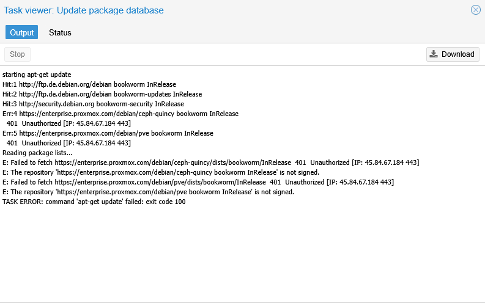

3. Um diesen Fehler zu beheben, müssen wir das Proxmox Repository ändern.
Aktuell ist hier das Enterprise Repository eingetragen, wie auf dem Bild zu erkennen ist.

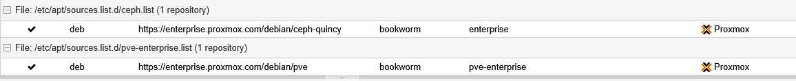

Diese können wir oben im Webinterface deaktivieren.

4. Jetzt müssen wir ein neues Repository hinzufügen, um Updates bzw Upgrades durchführen zu können.


Dort wählen wir Add aus und wählen im anschließenden Menü das `No Subscription` aus.
Jetzt können wir Proxmox updaten und upgraden.

---

### d. Quellen

- „balenaEtcher - Flash OS Images to SD Cards & USB Drives“. Zugegriffen 11. Juni 2025. [Etcher](https://www.balena.io/etcher).
- „Network Configuration - Proxmox VE“. Zugegriffen 6. Juni 2025. [Proxmox Wiki](https://pve.proxmox.com/wiki/Network_Configuration#sysadmin_network_vlan).
- „Proxmox VE Documentation Index“. Zugegriffen 4. Juni 2025. [Proxmox Docs](https://pve.proxmox.com/pve-docs/).
- „Rufus - Erstellen Sie bootfähige USB-Laufwerke auf einfache Art und Weise“. Zugegriffen 11. Juni 2025. [Rufus](https://rufus.ie/de/).
- „chrony – Documentation“. Zugegriffen 18. Juni 2025. [Chrony Doc](https://chrony-project.org/documentation.html).
- „Time Synchronization - Proxmox VE“. Zugegriffen 18. Juni 2025. [Proxmox Wiki Time_Synchronization](https://pve.proxmox.com/wiki/Time_Synchronization).
- „Table of Contents :: WinSCP“. Zugegriffen: 19. August 2025. [Online]. Verfügbar unter: [WinSCP Docs](https://winscp.net/eng/docs/start)

- **Tiny-PC BIOS Dokumentation**: Dokumentation des Herstellers für BIOS/UEFI-Optionen.

**Verwandte Dokumentationen**:

- Anleitung zur Einrichtung einer Ubuntu VM mit Proxmox

---

**Hinweis**: Stelle sicher, dass der Tiny-PC nach der Installation immer eine konstante Stromversorgung und Netzwerkverbindung hat, um eine stabile Virtualisierungsumgebung zu gewährleisten.

---

### Lizenz
Dieses Werk ist lizenziert unter der **Creative Commons - Namensnennung - Weitergabe unter gleichen Bedingungen 4.0 International Lizenz**.
 
[Zum Lizenztext auf der Creative Commons Webseite](https://creativecommons.org/licenses/by-sa/4.0/legalcode.de)

