# Erstellung eines LXC-Containers

In diesem Dokument wird das Erstellen und Konfigurieren eines LXC-Standard-Containers beschrieben. 

In den folgenden Dokumenten wird immer nur die Installation bzw. Konfiguration von Anwendungen in einen funktionierenden LXC-Container beschrieben. 

## 🎯 Ziel

Erstellung eines LXC-Containers mit folgenden Angaben:

- **CTID:** 110  
- **Hostname:** apache110  
- **IP:** 192.168.137.110/24  
- **Gateway:** 192.168.137.1  
- **DNS:** vom Host übernommen  
- **RAM:** 512 MB  
- **Festplatte:** 8 GB  
- **Template:** `/var/lib/vz/template/cache/ubuntu-24.04-standard_24.04-2_amd64.tar.zst`

### Zusätzliche Schritte

1. Benutzer `pdal` (sudoer), Passwort: `meinPasswort` anlegen,
2. System-Update (`apt update/upgrade`) durchführen,
3. timedatectl Zeitzone `Europe/Berlin` einstellen
4. Netzwerkprüfung (Gateway & DNS-Auflösung).

>Hinweis: Im PDAL-Projekt können Sie ausnahmsweise immer den gleichen User und das gleiche Passwort nutzen. 
Das sollte in Produktiv-System natürlich niemals gemacht werden.
---

## 🧭 1. Template prüfen & hochladen

- Prüfe unter `Datacenter → <local> → Templates`, ob dein Template vorhanden ist.

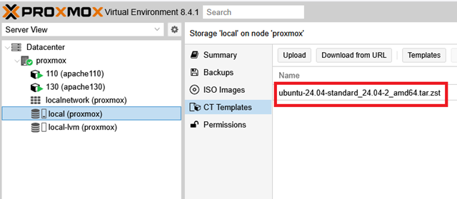
- Falls nicht: **Upload** oder Download via Web‑UI.
  
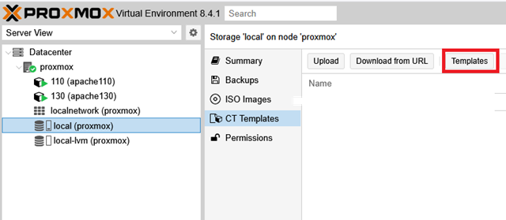
- Navigiere zu "Templates":
  
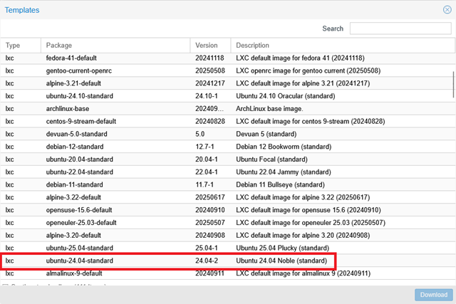
- Entsprechndes Template auswählen und auf "Download" klicken.

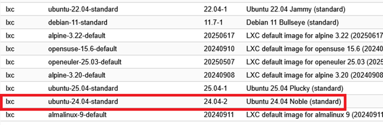

Nach dem Download sollte das Template jetzt angezeigt werden.

---

## 🛠️ 2. Container erstellen

1. Rechtsklick auf den Knoten → **Create CT**
2. **General**:
   - CT ID: `110`
   - Hostname: `apache110`
   - Password: (root PW setzen)
   - Unprivileged: ✅
   

>Hinweis: Proxmox nutzt dreistellige Zahlen für die CT ID. Wir nutzen als Kennung das letzte Oktet der IP-Adresse. Dazu wählen Sie einen aussagekräftigen Namen; z. B. "apache110".

3. **Template**:
   - Storage: z. B. `local`
   - Template wählen
  
   

4. **Root Disk**:
   - Storage: `local-lvm`
   - Size: `8 GiB`

   

5. **CPU & Memory**:
   - Cores: `1`
   - Memory: `512 MiB`, Swap optional `512 MiB`
   
   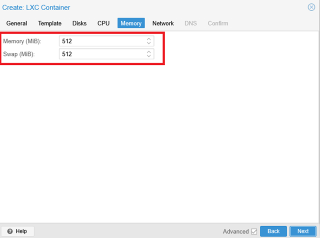

6. **Network**:
   - Bridge: `vmbr0`
   - IPv4: Static `192.168.137.110/24`
   - Gateway: `192.168.137.1`

   

7. **DNS**:
   - "Use DNS from host" (Standard)
   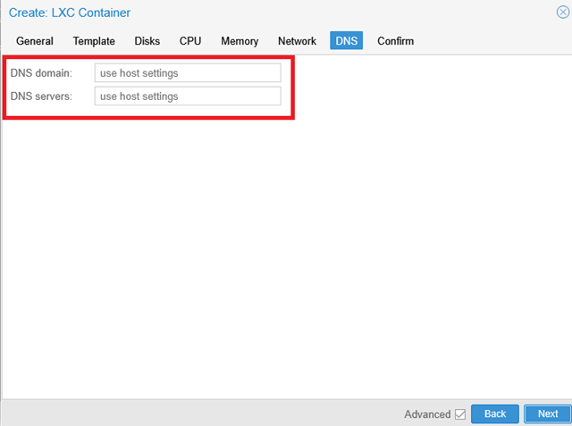

8. **Confirm**:
   - "Start after created": ✅
   - Auf **Finish** klicken
   

---

## ▶️ 3. Container starten & erste Schritte

- Container wird automatisch gestartet oder manuell über Web‑UI starten.
- Console öffnen → mit `root` + gesetztem Passwort einloggen.


---

## 👤 4. Benutzer `pdal` anlegen & als sudo setzen

```bash
adduser pdal
# Passwort: meinPasswort
usermod -aG sudo pdal
```


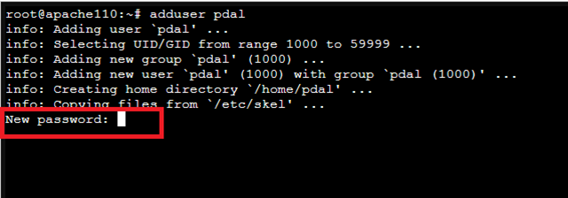
Passwort für User `pdal` setzen und bestättigen.

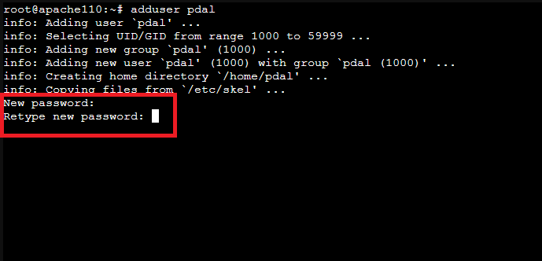

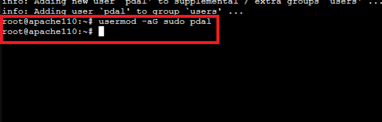

## 🌐 5. Netzwerkprüfung

In diesem Schritt stellen wir sicher, dass der neue Container eine Netzwerkverbindung hat. 

```bash
ping -c3 192.168.137.1
```
>Hinweis: Die Option `-c3` führt nur drei Pings aus.

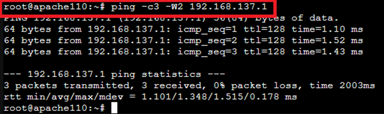

Dieser Schritt stellt sicher, dass eine Netzwerkverbindung besteht. Falls hier Probleme auftreten bitte die Netzwerkeinstellungen des Containers prüfen - `ContainerID → Network → Netzwerkeinstellungen`.

```bash
ping -c3 8.8.8.8
```

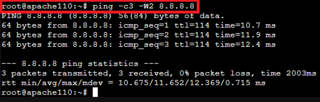

Dieser Schritt stellt sicher, dass externe IP-Adressen angesprochen werden können. 

```bash
ping -c3 heise.de
```


Dieser Schritt stellt sicher, dass die DNS-Auflösung korrekt funktioniert. 

## 🔄 6. System aktualisieren

Mit korrekt funktionierendem Netzwerk können Sie das System jetzt aktualisieren:

```bash
apt update && apt upgrade -y
```

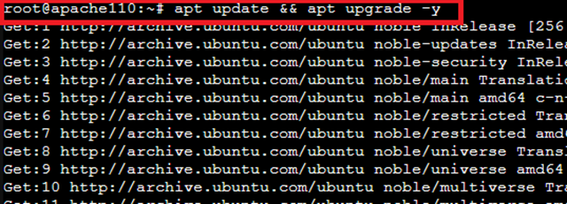


## 🕒 7. Zeitzone nur für die Darstellung konfigurieren und Status abfragen

```bash
timedatectl set-timezone Europe/Berlin
```


```bash
timedatectl status
```


>Hinweis: Der Container bezieht die Systemzeit von dem Host-System (Proxmox). Stimmt hier die Systemzeit nicht prüfen Sie die Einstellungen in Proxmox. 

✅ 🚀 Ergebnis

Der Container apache110 ist jetzt:

- mit Benutzer pdal (sudo) konfiguriert

- Netzwerk geprüft (Gateway, DNS)

- vollständig aktualisiert (apt update/upgrade)

- Zeitzone Europe/Berlin gesetzt

Sie können den Container nun für Ihre Zwecke verwenden und entsprechende Anwendungen installieren bzw. konfigurieren. 

---

## 8. Einstellung des Zeichensatzes UTF-8

Die Wahl des richtigen Zeichensatzes kann die Arbeit häufig erleichtern. 
Prüfen Sie zunächst welcher Zeichensatz eingestellt ist:

```bash
locale
```
Erscheint die Ausgabe:
```text
LANG=C
LANGUAGE=
LC_CTYPE="C"
LC_NUMERIC="C"
LC_TIME="C"
LC_COLLATE="C"
LC_MONETARY="C"
LC_MESSAGES="C"
LC_PAPER="C"
LC_NAME="C"
LC_ADDRESS="C"
LC_TELEPHONE="C"
LC_MEASUREMENT="C"
LC_IDENTIFICATION="C"
LC_ALL=
```
ist der ASCII-Zeichensatz aktiviert. Dieser unterstütz keine landesspezifischen Sonderzeichen - z. B. **ü, Ü, €, usw.**.

Daher ist es sinnvoll auf einen UTF-8-Zeichensatz umzustellen. 

### 💡 Was ist UTF-8?

**UTF-8** (**U**nicode **T**ransformation **F**ormat - 8-bit) ist die heute **weltweit vorherrschende Zeichenkodierung**. Im Gegensatz zu älteren Kodierungen (wie ASCII oder ISO-8859-1) kann UTF-8 **alle Zeichen** und Symbole aller Sprachen (inklusive Umlaute, Akzente, Chinesisch, Emojis) in einem einheitlichen Format darstellen. Die Verwendung von UTF-8 stellt sicher, dass Texte in Log-Dateien, Konsolen-Ausgaben und Konfigurationsdateien **korrekt und konsistent** angezeigt werden.

---

### 🌐 Nationale vs. Neutrale UTF-8 Locales

UTF-8-Zeichensätze gibt es in neutraler und länderspezifischer Form. Diese werden in **Locale** (die Regionaleinstellung) definiert. 

Die Locale bestimmt nicht nur die Kodierung, sondern auch länderspezifische Regeln für:

  * **Datum und Zeit**
  * **Währungs- und Zahlenformat** (z. B. Komma vs. Punkt als Dezimaltrennzeichen)
  * **Sortierreihenfolge** (`LC_COLLATE`)

Für Server und Container, die international oder für Skripte genutzt werden, ist die **neutrale C.UTF8-Locale** oft der beste Standard.

| Locale | Bedeutung | Anwendung |
| :--- | :--- | :--- |
| **`de_DE.UTF-8`** | **Nationale Locale** (Deutsch, Deutschland) | Richtet Formate (Zahlen, Sortierung) nach deutschen Regeln aus. Gut für Desktop-Benutzer. |
| **`C.UTF-8`** | **Neutrale Locale** (C-Standard mit UTF-8) | Verwendet standardisierte, binäre Sortierregeln und Punkt als Dezimaltrennzeichen. **Optimal für Server und Skripte**, da sie konsistente und vorhersagbare Ausgaben liefert. |

Wünschen sie lieber eine lokale Einstellung, schauen sie in der Liste unter `nano /etc/locale.gen` nach der korrekten Bezeichung und ersetzen `C.UTF-8` durch die gewünschte Bezeichnung. 

-----

### 🛠️ Einrichtung der neutralen C.UTF8-Locale

Standardmäßig wird im Container oft die veraltete `LANG=C` (ASCII) verwendet. Um dies auf den modernen Standard `C.UTF-8` umzustellen, führen Sie folgende Schritte aus:

1.  **Locale generieren (falls nötig):** Stellen Sie sicher, dass die Locale verfügbar ist.

    ```bash
    sudo locale-gen C.UTF-8
    ```

2.  **Standard-Locale permanent festlegen:** Überschreiben Sie die alten `C`-Einstellungen durch `C.UTF-8` in den Konfigurationsdateien des Systems.

    ```bash
    sudo update-locale LANG=C.UTF-8 LC_ALL=C.UTF-8
    ```

3.  **Änderungen aktivieren:** Melden Sie sich von der Shell ab und wieder an, oder starten Sie den Container neu.

    ```bash
    exit # und loggen sie sich neu ein
    ```

4.  **Erfolgskontrolle:** Überprüfen Sie die neuen Einstellungen.

    ```bash
    locale
    ```

    > **Ergebnis:** Die Ausgabe sollte nun `LANG=C.UTF-8` und `LC_ALL=C.UTF-8` zeigen.

---

## Quellen

- „Proxmox VE Documentation Index“. Zugegriffen: 4. Juni 2025. [Online]. Verfügbar unter: [Proxmox PVE-Docs](https://pve.proxmox.com/pve-docs/)
- canonical, „Ubuntu Server how-to guides“. [Online]. Verfügbar unter: [Ubuntu Server How-To](https://documentation.ubuntu.com/_/downloads/server/en/latest/pdf/)

---

### Lizenz
Dieses Werk ist lizenziert unter der **Creative Commons - Namensnennung - Weitergabe unter gleichen Bedingungen 4.0 International Lizenz**.
 
[Zum Lizenztext auf der Creative Commons Webseite](https://creativecommons.org/licenses/by-sa/4.0/legalcode.de)
