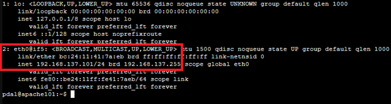

# Netzwerkkonfiguration und -diagnose im LXC-Container

## 1. Einführung

In dieser Dokumentation wird die **Netzwerkkonfiguration in LXC-Containern** behandelt, insbesondere das Setzen einer **statischen IP-Adresse**. Außerdem werden wichtige **Netzwerkdiagnose-Tools** vorgestellt, mit denen Netzwerkprobleme innerhalb eines LXC-Containers identifiziert und behoben werden können.

Die Bearbeitungszeit für dieses Thema beträgt etwa **2–4 Stunden** und eignet sich sowohl für Lernende im Bereich Linux-Netzwerke als auch für die Praxis im Server- oder Containerbetrieb.

>Tip: Erstellen Sie sich einen eigenen LXC-Container zum testen der Konfigurationen. Geht etwas schief, löschen Sie den LXC-Container, erstellen einen neuen und wiederholen Sie den Test. 

---

## 2. Grundlagen der Netzwerkkonfiguration in LXC-Containern

Ein LXC-Container bezieht standardmäßig seine IP-Adresse über **DHCP** vom Host oder einer Bridge (z. B. `vmbr0`). In verteilten Container-Umgebungen, in denen beispielsweise Datenbanken oder Webserver miteinander kommunizieren müssen, ist entweder eine DNS-Namensauflösung oder die Vergabe **statischer IP-Adressen** erforderlich, um eine zuverlässige Erreichbarkeit sicherzustellen. 

Da wir aber keinen DNS Server nutzen, ist es unabdingbar das hier eine Vergabe statischer IP-Adressen erfolgt.

### 2.1 Netzwerkdateien

Je nach verwendeter Server/ LXC Version gibt es zwei Varianten:

1. **Neuere Ubuntu-Versionen (>= 18.04):**
   - Konfiguration über **Netplan** in `/etc/netplan/*.yaml`.
2. **Ältere Ubuntu-Versionen (< 18.04) oder Debian-Container:**
   - Konfiguration über **/etc/network/interfaces**.

---

## 3. Statische IP-Adresse konfigurieren

### 3.1 Konfiguration mit Netplan

1. Öffne die Netplan-Konfigurationsdatei (z. B. `01-netcfg.yaml`):

   ```bash
   sudo nano /etc/netplan/01-netcfg.yaml
   ```

2. Beispielkonfiguration für eine statische IP:

   ```yaml
   network:
     version: 2
     ethernets:
       eth0:
         dhcp4: no
         addresses:
           - 192.168.137.110/24
         gateway4: 192.168.137.1
         nameservers:
           addresses:
             - 192.168.137.1
             - 8.8.8.8
   ```

   **Erklärung:**

   - `eth0` → Netzwerkinterface des LXC-Containers
   - `dhcp4: no` → DHCP deaktivieren
   - `addresses` → statische IP-Adresse mit Subnetz
   - `gateway4` → Standard-Gateway
   - `nameservers` → DNS-Server

   >Hinweis: ⚠️ **Achtung bei Netplan/YAML:**
   > Die Netplan-Konfigurationsdatei verwendet das **YAML-Format**, das sehr empfindlich auf **Schreibweise und Einrückungen** reagiert.
   > YAML arbeitet ausschließlich mit **Leerzeichen** zur Einrückung – **Tabs sind nicht erlaubt**.
   > Eine falsche Einrückung oder Syntaxfehler führen dazu, dass Netplan die Konfiguration **nicht übernehmen kann**.
   > In diesem Fall bleibt entweder die alte Netzwerkkonfiguration bestehen oder es kommt zu einem Fehler, sodass das Netzwerk nicht verfügbar ist.

3. Konfiguration testen (sichere Variante):

   ```bash
   sudo netplan try
   ```

   - Hierbei wird die neue Netzwerkkonfiguration testweise übernommen.
   - man hat **120 Sekunden Zeit**, die Änderungen mit `ENTER` zu bestätigen.
   - Wenn man sich verschrieben hat und das Netzwerk nicht erreichbar ist, wird nach Ablauf der Zeit automatisch zur alten funktionierenden Konfiguration zurückgekehrt.

4. Änderungen endgültig anwenden:

   ```bash
   sudo netplan apply
   ```

   - Die neue Konfiguration wird **dauerhaft übernommen**.
   - Ab diesem Zeitpunkt bleibt die Konfiguration aktiv, bis sie erneut geändert wird.

5. Überprüfung der Netzwerkeinstellungen:

   ```bash
   ip a
   ```



---

### 3.2 Konfiguration mit /etc/network/interfaces

1. Datei öffnen:

   ```bash
   sudo nano /etc/network/interfaces
   ```

2. Beispielkonfiguration:

   ```bash
   auto eth0
   iface eth0 inet static
       address 192.168.137.110
       netmask 255.255.255.0
       gateway 192.168.137.1
       dns-nameservers 192.168.137.1 8.8.8.8
   ```

3. Netzwerkdienst neu starten:

   ```bash
   sudo systemctl restart networking
   ```

4. Überprüfung:

   ```bash
   ip a
   ```

---

## 4. Netzwerkdiagnose-Tools im LXC-Container

Für die Diagnose von Netzwerkproblemen stehen verschiedene Befehle zur Verfügung. Nachfolgend eine Übersicht der wichtigsten Tools mit Anwendungsbeispielen.

---

### 4.1 `ping` – Erreichbarkeit prüfen

```bash
ping 192.168.137.1
```

überprüft die Erreichbarkeit des internen Netzwerkes. Wenn Test erfolgreich ist ...

```bash
ping 8.8.8.8
```

überprüft die Erreichbarkeit des Google DNS, und somit auch die Verbindung ins Internet. Wenn Test erfolgreich ist ...

```bash
ping google.com
```

überprüft die Namensauflösung im Internet.

- Erkennt grundlegende Probleme wie fehlende Internetverbindung oder DNS-Auflösung.

---

### 4.2 `ip a` – Netzwerkinterfaces anzeigen

```bash
ip a
```

- Listet alle Interfaces, IP-Adressen und Status auf.
- Wichtig zur Überprüfung, ob die statische IP korrekt gesetzt wurde.

---

### 4.3 `ip r` – Routing-Tabelle anzeigen

```bash
ip r
```

- Zeigt das Standard-Gateway und Routing-Regeln.
- Fehlerquelle: Wenn das Gateway fehlt, ist keine Verbindung ins Internet möglich.

---

### 4.4 `netstat -tulnp` – Offene Ports anzeigen

```bash
sudo netstat -tulnp
```

- `-t` → TCP-Verbindungen
- `-u` → UDP-Verbindungen
- `-l` → nur lauschen (Listening Ports)
- `-n` → numerische Ausgabe (IP statt Name)
- `-p` → Prozessinformationen

Beispielausgabe:

| Proto | Recv-Q | Send-Q | Local Address | Foreign Address | State  | PID/Program name |
|-------|--------|--------|---------------|-----------------|--------|------------------|
| tcp   | 0      | 0      | 0.0.0.0:22    | 0.0.0.0:*       | LISTEN | 450/sshd         |

---

### 4.5 `curl` – HTTP-Anfragen testen

```bash
curl http://google.com
curl -I http://google.com
```

- `-I` zeigt nur die Header.
- Praktisch zum Testen, ob ein Webserver erreichbar ist.

---

### 4.6 `wget` – Dateien aus dem Netz herunterladen

```bash
wget https://dlcdn.apache.org/tomcat/tomcat-10/v10.1.43/bin/apache-tomcat-10.1.43.tar.gz
```

- Nützlich, um Konnektivität und Downloadfähigkeit zu prüfen.
- Kann auch für automatisierte Installationen genutzt werden.

---

## 5. Netzwerkfluss: Host ↔ LXC-Container ↔ Internet

Um die Netzwerkkonfiguration besser zu verstehen, zeigt folgendes Diagramm den typischen Datenfluss:

```text
           +-------------------------+
           |     Internet            |
           +-------------------------+
                    |
               (Gateway/Router)
                   oder
            (Windows Host mit ICS)
                    |
           +-------------------------+
           |   Proxmox-Host          |
           |   Bridge: vmbr0         |
           +-------------------------+
                    |
           +-------------------------+
           |   LXC-Container         |
           |   eth0: 192.168.137.110 |
           +-------------------------+
```

- **Internet ↔ Gateway/Router oder ICS- Rechner:** Verbindung zum externen Netz
- **Proxmox-Host (Bridge vmbr0):** vermittelt zwischen physischem Netzwerk und LXC-Container
- **LXC-Container (eth0):** erhält statische IP (z. B. `192.168.137.110`)

---

## 6. Typische Fehlerquellen – grafische Übersicht

Die folgenden Szenarien helfen bei der Diagnose:

### 6.1 Gateway-Problem

```text
[LXC-Container] ---X---> [Gateway/Router] ---> [Internet]
   eth0: 192.168.137.110
   ping 192.168.137.1  --> FEHLER
   ping 8.8.8.8        --> FEHLER
```

- **Symptome:** Keine Verbindung ins Internet, Gateway nicht erreichbar.
- **Lösung:** Gateway-Eintrag in `netplan` oder `interfaces` prüfen.

Falls die Konnektivität vom LXC-Container zum Gateway oder Internet nicht funktioniert, kannst du die Netzwerkparameter auch direkt in der **Proxmox Weboberfläche** überprüfen und ändern:

1. **Anmelden am Proxmox Webinterface:**  

    ```bash
    https://<Proxmox-IP>:8006
    ```

2. **LXC-Container auswählen:**  

    - Links den entsprechenden LXC-Container auswählen.  

3. **Netzwerk prüfen:**

    - Reiter **„Network“** öffnen.  
    - Hier siehst du die Konfiguration von `eth0` oder anderen Interfaces:  
      - **IP-Adresse**  
      - **Netzmaske**  
      - **Gateway**  

4. **Einstellungen anpassen (falls nötig):**
  
    - IP-Adresse auf das richtige Subnetz setzen.  
    - Gateway korrekt eintragen (z. B. 192.168.137.1).  
    - Änderungen speichern.  

5. **LXC-Container neu starten**
oder die Netzwerkkonfiguration anwenden:  

    ```bash
    sudo ip a    # prüfen
    sudo ping 192.168.137.1
    ```

    Hinweis: Änderungen über die Weboberfläche werden automatisch in die LXC-Container-Konfigurationsdatei `/etc/pve/lxc/<CTID>`.conf übernommen.

### 6.2 DNS-Problem

```text
[LXC-Container] ---> [Gateway/Router] ---> [Internet]
   eth0: 192.168.137.110
   ping 8.8.8.8   --> OK
   ping google.com --> FEHLER
```

- **Symptome:** IPs erreichbar, aber keine Domains.
- **Lösung:** Nameserver in `netplan` oder `interfaces` prüfen.

Alternative: DNS-Einstellungen über die Proxmox Weboberfläche prüfen

1. Anmelden am Proxmox Webinterface:

    ```bash
    https://<Proxmox-IP>:8006
    ```

2. LXC-Container auswählen:

   - Links den entsprechenden LXC-Container auswählen.

3. Netzwerk prüfen:

   - Reiter „Network“ öffnen.

   - Hier siehst du die Konfiguration von eth0 oder anderen Interfaces:

     - IP-Adresse

     - Netzmaske

     - Gateway

     - DNS-Server

4. DNS-Server anpassen:

   - Füge z. B. 8.8.8.8 oder einen anderen funktionierenden Nameserver ein.

   - Änderungen speichern.

5. LXC-Container neu starten oder Netzwerkkonfiguration anwenden:

   ```bash
   sudo netplan apply # falls netplan verwendet wird
   sudo ping google.com # prüfen
   ```

---

### 6.3 ICS-Adapter nach Windows-Update ausgefallen

Es kommt vor, dass (nach Windows-Updates) der **ICS-Adapter (Internet Connection Sharing)** nicht mehr funktioniert.
Dies führt dazu, dass **keine Verbindung vom internen Netzwerk ins Internet und umgekehrt** besteht.

**Vorgehensweise zur Behebung:**

1. Öffne die **Netzwerkeinstellungen** in Windows.
2. Wähle **Erweiterte Netzwerkeinstellungen** → **Weitere Adapteroptionen**.
3. Im neuen Fenster wähle die verwendete Netzwerkverbindung aus, öffne mit Rechtsklick **Eigenschaften**.
4. Gehe auf den Reiter **Freigabe** und **deaktiviere** die Internetverbindungsfreigabe (Checkbox abwählen).

   - Mit **OK** bestätigen.
5. Öffne die Adapteroptionen erneut, gehe wieder auf **Freigabe**.
6. **Aktiviere** die Checkbox für die Internetverbindungsfreigabe erneut, wähle im unteren Feld den **ICS-Adapter** aus und bestätige mit **OK**.

➡️ Danach sollte die ICS-Verbindung wieder wie gewohnt funktionieren.

## 7. Beispiel-Workflows

In diesem Abschnitt werden **praktische Arbeitsabläufe zur Netzwerkkonfiguration und Diagnose in LXC-Containern** gezeigt.  
Ziel ist es, anhand von konkreten Beispielen zu demonstrieren, wie man:

- Eine **statische IP-Adresse** korrekt einrichtet und die Netzwerkverbindung testet.  
- Die **Konnektivität zum lokalen Netzwerk, Internet und DNS** überprüft.  
- Häufige **Fehlerursachen bei fehlender Internetverbindung** erkennt und systematisch diagnostiziert.  
- Netzwerkdienste und offene Ports überprüft, um mögliche Probleme bei Serveranwendungen zu identifizieren.

Die Workflows sollen als praxisnahe Schritt-für-Schritt-Anleitungen dienen, die in realen Container-Umgebungen direkt anwendbar sind.

### 7.1 Statische IP einrichten und testen

1. Netplan anpassen → `sudo netplan apply`.
2. `ping 192.168.137.1` → Überprüfung der Konnektivität zum Gateway in diesem Fall das ICS Netzwerkinterface.
3. `ping 8.8.8.8` → Überprüfung der Konnektivität zum Google DNS
4. `ping google.com` → Überprüfung ob Namensauflösung funktioniert
5. `curl http://google.com` → Test HTTP-Verbindung.

---

### 7.2 Fehlerdiagnose bei fehlender Internetverbindung

1. **IP prüfen:**

   ```bash
   ip a
   ```

2. **Gateway prüfen:**

   ```bash
   ip r
   ```

3. **DNS prüfen:**

   ```bash
   ping 8.8.8.8
   ping google.com
   ```

   - Wenn `8.8.8.8` geht, aber `google.com` nicht → DNS-Problem.
4. **Ports prüfen (z. B. Webserver im LXC-Container):**

   ```bash
   netstat -tulnp
   ```

---

## 8. Zusammenfassung

- **Statische IPs** werden über `/etc/netplan/*.yaml` (neuere Systeme) oder `/etc/network/interfaces` (ältere Systeme) konfiguriert.
- Diagnose-Tools wie `ping`, `ip a`, `ip r`, `netstat`, `curl` und `wget` helfen, Netzwerkprobleme schnell zu identifizieren.
- **Grafische Übersichten** erleichtern das Verständnis von Netzwerkfluss und Fehlerdiagnose.

---

## 9. Weiterführende Übungen

- Einrichtung mehrerer statischer IPs (z. B. für verschiedene Services im Container).
- Nutzung von `ss` als moderner Ersatz für `netstat`.
- Kombination von `curl` mit REST-APIs zur Funktionsprüfung von Webdiensten.
- Im späteren Modul folgt die allgemeine Fehleranalyse und Fehlerbehebung.

---

## Quellen

- „Befehlsübersicht › Shell › Wiki › ubuntuusers.de“. Zugegriffen: 20. August 2025. [Online]. Verfügbar unter: [Ubuntuuser Befehlsübersicht](https://wiki.ubuntuusers.de/Shell/Befehls%C3%BCbersicht/)
- H. Lasch, „Linux-Kommandos Kurzreferenz | Linux | Nutzungshinweise | FRIZ | Fakultät für Informatik | TU Chemnitz“. Zugegriffen: 20. August 2025. [Online]. Verfügbar unter: [Linux Referenz](https://www.tu-chemnitz.de/informatik/friz/linux/referenz.php)

---

### Lizenz
Dieses Werk ist lizenziert unter der **Creative Commons - Namensnennung - Weitergabe unter gleichen Bedingungen 4.0 International Lizenz**.
 
[Zum Lizenztext auf der Creative Commons Webseite](https://creativecommons.org/licenses/by-sa/4.0/legalcode.de)

