# Erstellung einer eigenen CA (Certificate Authority) und manuelle Verteilung der Zertifikate

## Worum geht es?

Wofür benötigen wir Zertifikate in der IT?

In der IT werden Zertifikate verwendet, um die Identität von Geräten, Diensten oder Personen eindeutig und vertrauenswürdig nachzuweisen. Sie ermöglichen außerdem die verschlüsselte und sichere Kommunikation über Netzwerke, z. B. per HTTPS oder VPN.
Auch in einem geschlossenen Netzwerk sollte man eigene Zertifikate verwenden. Da öffentliche Zertifizierungsstellen (CAs) keinen Zugriff auf interne Systeme haben benötigen wir eine eigene CA. 

Eigene Zertifikate ermöglichen die verschlüsselte und authentifizierte Kommunikation über Protokolle wie HTTPS, SMTPS, LDAPS, FTPS, sowie bei Datenbanken wie MariaDB, PostgreSQL und Message Brokern wie MQTT oder Kafka. Dadurch behält man die volle Kontrolle über Sicherheit, Gültigkeit und Verteilung der Zertifikate innerhalb des Netzwerks.
**Lokal im Anwendungscontainer erstellte Zertifikate vs. eigener CA (Certificate Authority)**.
Es ist möglich in jedem Anwendungscontainer (LXC) eigene Zertifikate zu erstellen - Wir haben uns aber dagegen entschieden. Hierfür bauen wir eine eigene CA auf, um die Komplexität des Verteilens der einzelnen Zertifikate zu minimieren. Wir haben durch eine eigene CA einheitliche zentral verwaltete Zertifikate.

Diese Anleitung zeigt dir, wie du mit **OpenSSL** auf deinem Server `ssl-ca140` (IP: 192.168.137.140) eine eigene **Zertifizierungsstelle (CA)** und ein **einzelnes Zertifikat für alle Dienste** erstellst. Anschließend verteilt man die Zertifikate manuell an die verschiedenen Dienste und Client-Rechner (Windows, Mac, Linux).

---

## Warum ein einzelnes Zertifikat — und warum mehrere?

- **Ein einziges Zertifikat (SAN-Zertifikat)** ist praktisch:  
  Man braucht nur eine Datei, die für alle deine Dienste gültig ist.  
  Das spart Aufwand und ist für kleine oder Test-Umgebungen oft ausreichend.

- **Mehrere Zertifikate (empfohlen für Produktion):**  
  Jeder Dienst bekommt ein eigenes Zertifikat, was die Sicherheit verbessert, da bei Kompromittierung nur dieser Dienst betroffen ist.  
  Auch die Verwaltung (Erneuerung, Widerruf) wird so flexibler, ist aber deutlich aufwändiger oder muss automatisiert werden.

---

### Voraussetzungen

- Ein LXC Container `ssl-ca140` mit OpenSSL installiert  
- Grundlegende Linux-Kommandos sind dir vertraut  
- SSH-Zugang zum Server  

```bash
sudo apt install openssl
```

---
Erstelle einen neuen Benutzer `pdal` mit sudo-Rechten. 
Wechsel den Benutzer zu `pdal` mit `su pdal`.

### 1. Ordnerstruktur anlegen

```bash
sudo mkdir -p ~/myCA/{certs,crl,newcerts,private}
sudo chmod 700 ~/myCA/private
sudo touch ~/myCA/index.txt
echo 1000 | sudo tee ~/myCA/serial
```

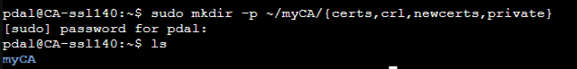

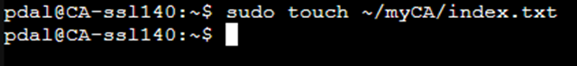


## 2. CA (Zertifizierungsstelle) erstellen

### 2.1 OpenSSL-Konfigurationsdatei erstellen openssl.cnf

Erstelle im Ordner ~/myCA die Datei openssl.cnf mit folgendem Inhalt (vereinfachtes Beispiel):

```bash
sudo nano ~/myCA/openssl.cnf
```

```bash
[ ca ]
default_ca = CA_default

[ CA_default ]
dir               = /home/pdal/myCA
certs             = $dir/certs
crl_dir           = $dir/crl
new_certs_dir     = $dir/newcerts
database          = $dir/index.txt
serial            = $dir/serial
RANDFILE          = $dir/private/.rand

private_key       = $dir/private/ca.key.pem
certificate       = $dir/certs/ca.cert.pem

default_days      = 3650
default_crl_days  = 30
default_md        = sha256

policy            = policy_loose

[ policy_loose ]
countryName             = optional
stateOrProvinceName     = optional
localityName            = optional
organizationName        = optional
organizationalUnitName  = optional
commonName              = supplied
emailAddress            = optional

[ req ]
default_bits       = 4096
distinguished_name = req_distinguished_name
string_mask        = utf8only

[ req_distinguished_name ]
countryName                     = Country Name (2 letter code)
stateOrProvinceName             = State or Province Name
localityName                    = Locality Name
organizationName                = Organization Name
organizationalUnitName          = Organizational Unit Name
commonName                      = Common Name
emailAddress                    = Email Address

[ v3_ca ]
subjectKeyIdentifier=hash
authorityKeyIdentifier=keyid:always,issuer
basicConstraints = critical, CA:true
keyUsage = critical, digitalSignature, cRLSign, keyCertSign

[ v3_server ]
basicConstraints = CA:FALSE
keyUsage = digitalSignature, keyEncipherment
extendedKeyUsage = serverAuth
subjectAltName = @alt_names

[ alt_names ]
DNS.1 = apache.local
IP.1 = 192.168.137.110
DNS.2 = mariadb.local
IP.2 = 192.168.137.120
DNS.3 = pgadmin4.local
IP.3 = 192.168.137.130
DNS.4 = CA-ssl.local
IP.4 = 192.168.137.140
DNS.5 = kafka.local
IP.5 = 192.168.137.150
DNS.6 = postgresql.local
IP.6 = 192.168.137.160
DNS.7 = mqtt.local
IP.7 =192.168.137.170
DNS.8 = grafana.local
IP.8 = 192.168.137.190
```


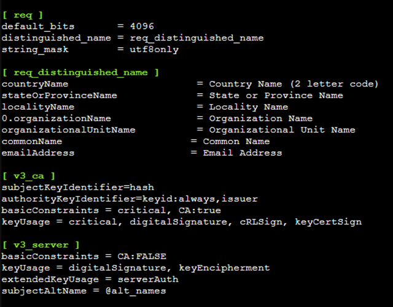
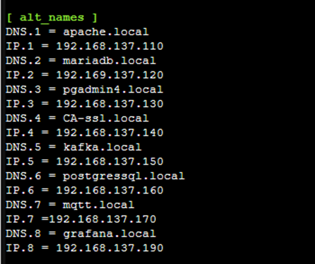

>Hinweis: Passe Pfade und Namen bei Bedarf an. Ersetze `/home/username` mit deinem tatsächlichen Pfad.

**Erklärung zur Konfigurationsdatei:**

#### [ ca ]

```bash
default_ca = CA_default
```

Legt fest, welche CA-Konfiguration verwendet wird.

**CA_default** verweist auf die folgende Sektion [ CA_default ].

#### [ CA_default ]

```bash
dir               = /home/pdal/myCA
```

'$dir' ist das Stammverzeichnis deiner CA-Dateien (Passe 'username' an deinen Benutzernamen an).

Alle folgenden Pfade bauen darauf auf.

```bash
certs             = $dir/certs
crl_dir           = $dir/crl
new_certs_dir     = $dir/newcerts
database          = $dir/index.txt
serial            = $dir/serial
RANDFILE          = $dir/private/.rand
```

**certs**: Speichert ausgestellte Zertifikate

**crl_dir**: Für gesperrte Zertifikate (Certificate Revocation Lists)

**new_certs_dir**: Interner Ordner für neue Zertifikate

**database**: Datei, in der OpenSSL die ausgestellten Zertifikate dokumentiert

**serial**: Datei mit der aktuellen Seriennummer

**RANDFILE**: Hilfsdatei für zufällige Daten (z. B. bei Schlüsselerzeugung)

```bash
private_key       = $dir/private/ca.key.pem
certificate       = $dir/certs/ca.cert.pem
```

Speicherorte des CA-Schlüssels und CA-Zertifikats

```bash
default_days      = 3650
default_crl_days  = 30
default_md        = sha256
```

**default_days**: Gültigkeitsdauer eines neuen Zertifikats (hier: 10 Jahre)

**default_crl_days**: Wie lange eine Sperrliste gültig ist

**default_md**: Hash-Algorithmus (hier: sha256, sicherer als z. B. md5)

```bash
policy            = policy_loose
```

Legt fest, wie streng OpenSSL die eingegebenen Felder prüft (z. B. ob Land oder Organisation zwingend notwendig ist)

#### [ policy_loose ]

```bash
countryName             = optional
stateOrProvinceName     = optional
localityName            = optional
organizationName        = optional
organizationalUnitName  = optional
commonName              = supplied
emailAddress            = optional
```

Das ist eine lockere Richtlinie: Die meisten Felder sind optional, nur 'commonName' (der Servername wie 'apache.local') muss angegeben werden.

#### [ req ]

```bash
default_bits       = 4096
distinguished_name = req_distinguished_name
string_mask        = utf8only
```

Konfiguration für neue Certificate Signing Requests (CSRs).

**default_bits**: Schlüssellänge in Bit (je mehr, desto sicherer – 4096 ist stark).

**distinguished_name**: Welche Felder beim CSR abgefragt werden.

**string_mask = utf8only**: Nur UTF-8-Zeichen erlaubt.

#### [ req_distinguished_name ]

```bash
countryName            = Country Name (2 letter code)
stateOrProvinceName    = State or Province Name
...
```

Hier wird definiert, welche Felder bei der Erstellung eines Zertifikats abgefragt werden (z. B. Land, Organisation, Common Name).

#### [ v3_ca ]

```bash
subjectKeyIdentifier=hash
authorityKeyIdentifier=keyid:always,issuer
basicConstraints = critical, CA:true
keyUsage = critical, digitalSignature, cRLSign, keyCertSign
```

Erweiterungen für CA-Zertifikate

**basicConstraints = CA:true**: Macht klar, dass dieses Zertifikat Zertifikate ausstellen darf.

**keyUsage**: Welche Aktionen mit dem Schlüssel erlaubt sind.

#### [ v3_server ]

```bash
basicConstraints = CA:FALSE
keyUsage = digitalSignature, keyEncipherment
extendedKeyUsage = serverAuth
subjectAltName = @alt_names
```

Erweiterungen für Server-Zertifikate:

* **CA:FALSE**: Dieses Zertifikat ist kein CA-Zertifikat,

* **keyUsage**: Für digitale Signatur und Verschlüsselung,

* **extendedKeyUsage**: Darf als TLS-Serverzertifikat verwendet werden.

* **subjectAltName**: Verweist auf die untenstehende Liste mit alternativen Namen.


#### [ alt_names ]

```bash
DNS.1 = apache.local
IP.1 = 192.168.137.110
DNS.2 = mariadb.local
IP.2 = 192.168.137.120
DNS.3 = pgadmin4.local
IP.3 = 192.168.137.130
DNS.4 = CA-ssl.local
IP.4 = 192.168.137.140
DNS.5 = kafka.local
IP.5 = 192.168.137.150
DNS.6 = postgresql.local
IP.6 = 192.168.137.160
DNS.7 = mqtt.local
IP.7 =192.168.137.170
DNS.8 = grafana.local
IP.8 = 192.168.137.190
```

Dies ist die SAN-Liste (Subject Alternative Name).

Sie erlaubt dem Zertifikat, mehrere Namen und IP-Adressen abzusichern,
z. B. `apache.local` für Apache, `mariadb.local` für MariaDB usw.

Dadurch braucht man nur ein einziges Zertifikat für alle Dienste – das ist das sogenannte pdal-Zertifikat.

### Fazit

Diese Konfiguration definiert eine eigene CA mit:

>lockeren Anforderungen an Eingaben,
>
>starkem Schlüssel (4096 Bit),
>
>SAN-Unterstützung für viele Dienste,
>
>1 Zertifikat für alle Server (pdal-Zertifikat).

### 2.2 CA-Schlüssel und CA-Zertifikat erstellen
Gehe in den Ordner `~/myCA` mit dem Befehl `cd ~/myCA/`.

```bash
sudo openssl genrsa -aes256 -out private/ca.key.pem 4096
```


zur Bestätigung gibt man ein Passwort ein. Wir wählen in unserem Beispiel`JadeHS20`, nach der Eingabe muss man das Passwort noch einmal bestätigen.

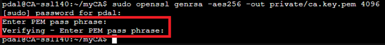

```bash
sudo chmod 400 private/ca.key.pem
```


```bash
sudo openssl req -config openssl.cnf \
      -key private/ca.key.pem \
      -new -x509 -days 3650 -sha256 -extensions v3_ca \
      -out certs/ca.cert.pem
```

Dabei wird man nach Angaben wie Land, Organisation etc. gefragt. Diese **muss** man passend ausfüllen.


## 3. Server-Zertifikat mit SAN (für alle Dienste) erstellen

### 3.1 Privaten Schlüssel für Server erstellen

```bash
sudo openssl genrsa -out private/server.key.pem 2048
sudo chmod 400 private/server.key.pem
```


### 3.2 Zertifikatsantrag (CSR) mit SAN erstellen


**Erstelle den CSR(Certificate Signing Request):**

Was ist ein CSR?

Ein CSR ist eine Datei, die:

- einen öffentlichen Schlüssel enthält,
- zusammen mit Angaben zur Identität (z. B. Common Name, Organisation, Ort, SANs) erstellt wurde,
- von einer Zertifizierungsstelle (CA) signiert werden soll, um daraus ein gültiges Zertifikat zu erzeugen.

```bash
sudo openssl req \
  -new \
  -key private/server.key.pem \
  -out server.csr.pem \
  -config ~/myCA/openssl.cnf \
  -subj "/C=DE/ST=Niedersachsen/L=Wilhelmshaven/O=Jade-Hochschule/OU=FB-MIT/CN=all-services.local"
```

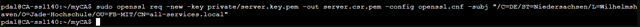

Im Anschluss kann man noch überprüfen ob der key auch wirklich erstellt wurde - mit folgendem Befehl:

```bash
ls -l server.csr.pem
openssl req -in server.csr.pem -noout -text
```

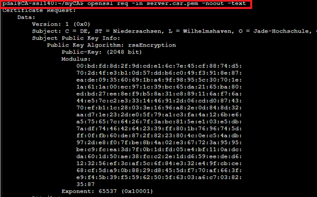
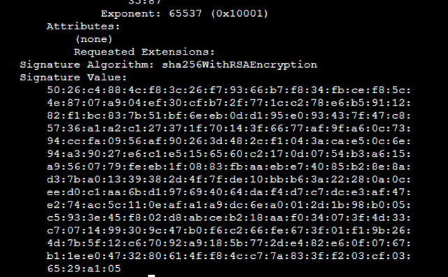

### 3.3 Zertifikat mit SAN signieren

```bash
sudo openssl ca -config openssl.cnf -extensions v3_server -days 825 -notext -md sha256 -in server.csr.pem -out certs/server.cert.pem
```

Man wird gefragt, ob man das Zertifikat signieren möchtest – mit y bestätigen.
Anschließend muss man nocheinmal mit y bestätigen, damit das Zertifikat erstellt und in die Datenbank geschrieben wird.

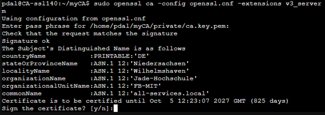

Anschliessend muss man noch die Berechtigungen auf das Zertifikat setzen.

```bash
sudo chmod 444 certs/server.cert.pem
```

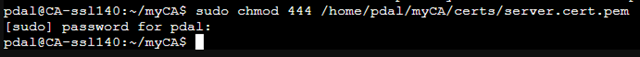

## 4. Zertifikate an Dienste verteilen und konfigurieren

Das Zertifikat `server.cert.pem`, den Schlüssel `server.key.pem` und das CA-Zertifikat `ca.cert.pem` braucht man auf allen Servern/Diensten.

### 🔐 Ziel

Wir möchten:

- Die Dateien ca.cert.pem, server.cert.pem und server.key.pem im CA-Container nach /home/pdal/download kopieren.
- Diese Dateien mit WinSCP per SFTP auf deinen lokalen Rechner in C:\tmp herunterladen.
- Die Dateien mit WinSCP per SFTP später auf den Apache2-Container hochladen nach /home/pdal/download. (Dies wird in einem gesonderten Dokument erklärt.)
- Die Dateien von dort aus in die entsprechenden Verzeichnisse, z. B. in den Apache2-Container, verschieben.

### 📁 Voraussetzungen

- LXC-Container für CA (ca-container) ist aktiv.
- Benutzer pdal ist vorhanden.
- SFTP-Zugriff über IP oder Hostname ist möglich.
- SFTP Client wie z.B. WinSCP ist auf deinem Windows-Rechner installiert(funktioniert aber auch ohne seperatem Client über die Commando Zeile).

🔹 1. Dateien im CA-Container vorbereiten

### Download Verzeichnis erstellen

Wir erstellen zunächst im CA Container ein Verzeichnis mit der Bezeichnung download im home Verzeichnis von dem User pdal.

```bash
sudo mkdir -p /home/pdal/download
```


### Pfade anpassen, wenn nötig

Jetzt kopieren wir die einzelnen Zertifikate und den Server Schlüssel in das Download-Verzeichnis.
Da das Verzeichnis `/home/pdal/myca/private` root gehört und nur root auf dieses Verzeichnis zugreifen darf, müssen wir uns später im container als `root` anmelden.
Dies machen wir wie folgt. Wir sind derzeit als pdal angemeldet und müssen um Zugriff auf das private Verzeichnis zu erlangen, `sudo -i` eingeben um zum Benutzer `root` zu wechseln.

```bash
sudo cp /home/pdal/myCA/certs/ca.cert.pem /home/pdal/download/
sudo cp /home/pdal/myCA/certs/server.cert.pem /home/pdal/download/
sudo -i
cp /home/pdal/myCA/private/server.key.pem /home/pdal/download/
```
Dies folgt der Syntax `sudo cp dieZuKopierendeDateiMitPfad dasZielVerzeichnis`.


### Rechte anpassen (optional, damit der Nutzer pdal Zugriff hat)

Wir befinden uns nach wie vor als root in dem Container. Falls nicht bitte auf die root Ebene mit `sudo -i` wechseln.

Die eben kopierten Dateien gehören alle dem User Root und haben sehr strikte Berechtigungen. Um diese Dateien über einen SFTP Client herunter laden zu können, müssen wir die Berechtigungen und auch den Owner der Dateien ändern. Das machen wir mit dem Befehl `chown` und mit dem Befehl `chmod`. 


```bash
chown pdal:pdal /home/pdal/download/*.pem
chmod 600 /home/pdal/download/*.pem
```

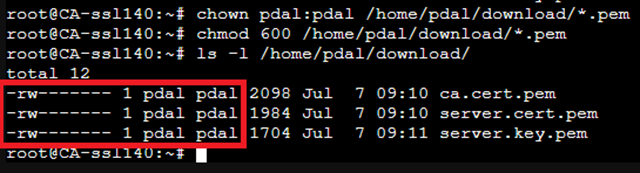

🔹 2. Dateien mit WinSCP per SFTP vom CA-Container herunterladen.
Schritte:

- Starte WinSCP.
- Öffne eine neue SFTP-Sitzung:
- Host: IP deines CA-Containers
- Benutzer: pdal
- Passwort: Passwort
- Navigiere im rechten Fenster (Remote-Browser) zu:

```bash
/home/pdal/download/
```

Markiere die Dateien `ca.cert.pem`, `server.cert.pem`, `server.key.pem`.

Ziehe sie in das lokale Verzeichnis auf deinem PC:

`C:\tmp`


Es geht aber auch komplett ohne extra Apps wie WinSCP. Ab Windows 10/11 habe ich die Möglichkeit über die Eingabeaufforderung über den Befehl `scp` die Dateien herunter zu laden. Hierzu die einzelnen Schritte wie das funktioniert.
Wir öffnen auf unserem Windows Client die Eingabeaufforderung als Administrator.

```bash
scp pdal@192.168.137.140:/home/pdal/download/*.pem C:\tmp\
```

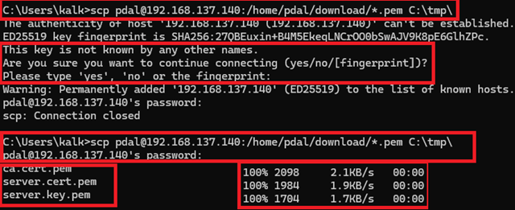

Hier werden wir gefragt ob wir die Verbindung fortsetzen möchten, da der Host nicht erkannt wird.
Wir müssen hier mit `yes` bestätigen. Es ist durchaus möglich das wir hier `zes` eingeben müssen und **!Achtung!** uns wird nicht angezeigt was wir schreiben.
Die 3 Dateien befinden sich nun im `tmp` Verzeichnis unter `C:`

🔹 3. Dateien per SFTP auf den Apache2-Container hochladen.

In WinSCP, öffne eine neue SFTP-Sitzung zum Apache2-Container:

- Host: `192.168.137.110`
- Benutzer: `pdal`
- Passwort: `JadeHS20`

Navigiere im Remote-Browser zum Ziel:

```bash
/home/pdal/download/
```

Ziehe im lokalen Fenster (C:\tmp) die drei .pem-Dateien hinein.

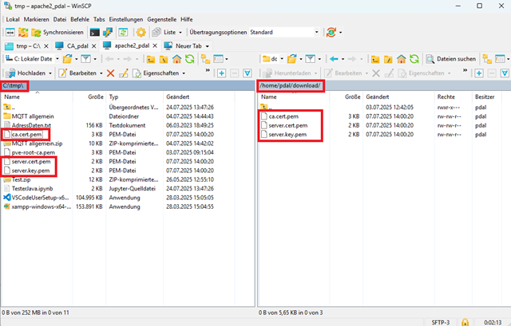


## 5. Zertifikat auf Windows, Mac, Linux installieren

Importiere das CA-Zertifikat (ca.cert.pem) als vertrauenswürdige Zertifizierungsstelle in den jeweiligen Betriebssystemen. Diesen Schritt machen wir, damit Browser oder andere Tools ein sichere Verbindung ohne Zertifikatsfehler aufbauen können. 

So erkennen deine Clients alle Zertifikate, die von deiner CA stammen, als vertrauenswürdig.

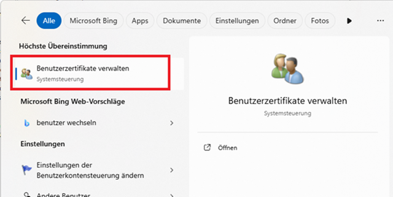


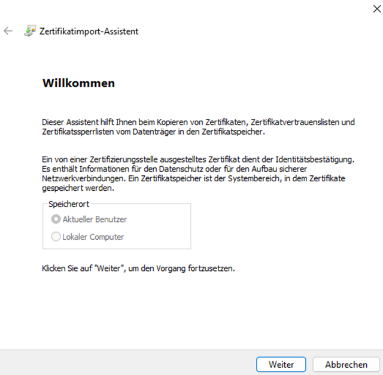


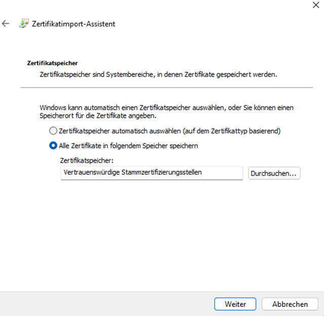


## 6. Zusammenfassung und Empfehlungen

Ein SAN-Zertifikat für alle Dienste ist für kleine Umgebungen schnell und einfach.

Für Produktion und mehr Sicherheit: Erstelle für jeden Dienst ein eigenes Zertifikat (mit eigenem CSR und Signierung).

Private Schlüssel immer sicher aufbewahren!

Verteile CA-Zertifikat an alle Clients, damit die TLS-Verbindungen als sicher erkannt werden.

## Quellen

- „Eigene Zertifikate mit openssl — Linux und Open Source“. Zugegriffen: 26. August 2025. [Online]. Verfügbar unter: [OpenSSL Grundwissen](https://www.grund-wissen.de/linux/server/openssl.html)
- „CA › Wiki › ubuntuusers.de“. Zugegriffen: 26. August 2025. [Online]. Verfügbar unter: [CA Wiki Ubuntuusers](https://wiki.ubuntuusers.de/CA/)

---

### Lizenz
Dieses Werk ist lizenziert unter der **Creative Commons - Namensnennung - Weitergabe unter gleichen Bedingungen 4.0 International Lizenz**.
 
[Zum Lizenztext auf der Creative Commons Webseite](https://creativecommons.org/licenses/by-sa/4.0/legalcode.de)

