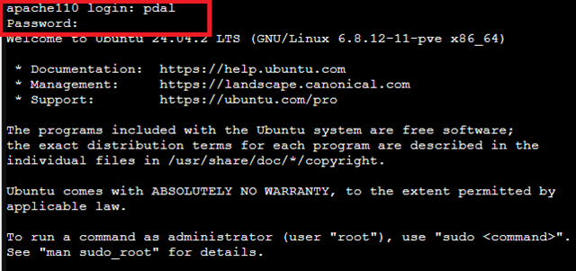
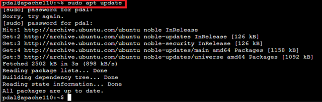
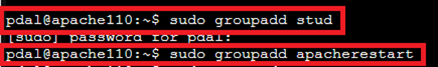
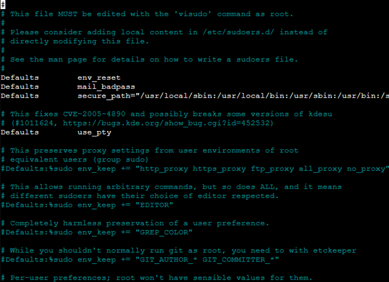
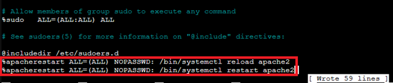
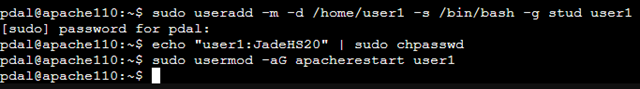
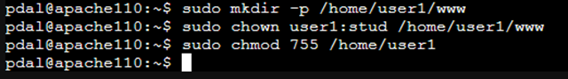
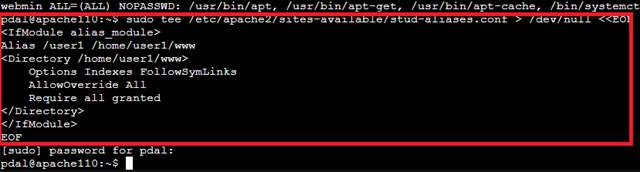

# 🧑‍💻 Apache2-Webserver & Benutzerverwaltung im LXC-Container

Diese Anleitung zeigt dir Schritt für Schritt, wie du in einem bereits eingerichteten Ubuntu-LXC-Container (`apache110`) den Apache2-Webserver installierst, Web-Content erstellst, PHP installierst und gebrauchst, Benutzer mit verschiedenen Rechten erstellst und Apache-Aliase konfigurierst.

---

Bevor wir beginnen loggen wir uns über das Webinterface auf den Proxmox Server und gehen über Proxmox auf die Console vom Container 110.
Jetzt loggen wir uns als pdal mit dem vorher festgelegtem Passwort ein.


## 🌐 1. Apache2 installieren

### Einführung zu Apache2

**Apache2** ist ein weit verbreiteter **Webserver**, der HTTP-Anfragen von Clients (z. B. Webbrowsern) entgegennimmt und darauf basierend Inhalte ausliefert. Er gehört zur **Open-Source-Software-Familie** und wird auf vielen Betriebssystemen, insbesondere Linux, eingesetzt.

### Hauptfunktionen von Apache2

- **Bereitstellung von Webseiten:** Stellt HTML-, PHP- oder andere Webinhalte über HTTP/HTTPS bereit.
- **Verwaltung von Webanwendungen:** Ermöglicht das Hosten dynamischer Webanwendungen, oft in Verbindung mit PHP, Python oder anderen serverseitigen Sprachen.
- **Virtuelle Hosts:** Unterstützt mehrere Webseiten auf einem Server, jede mit eigenem Domainnamen und Webverzeichnis.
- **Sicherheit und Konfiguration:** Bietet Module für Authentifizierung, Zugriffskontrolle, Verschlüsselung (SSL/TLS) und Logging.

Apache2 wird eingesetzt, um **Webseiten und Webanwendungen für Benutzer zugänglich** zu machen. Er verarbeitet Anfragen, liefert die entsprechenden Dateien aus und kann Inhalte dynamisch generieren, z. B. durch Integration mit PHP.

### Kurzer Vergleich zu Nginx

- **Architektur:** Apache2 verwendet in der Standardkonfiguration einen **prozessbasierten oder Thread-basierten Ansatz**, während Nginx ein **ereignisgesteuertes, asynchrones Modell** nutzt.
- **Leistung:** Nginx ist bei hohem Traffic oft **ressourcenschonender und schneller** bei statischen Inhalten, Apache2 bietet mehr Flexibilität bei dynamischen Inhalten.
- **Konfiguration:** Apache2 setzt stark auf modulare Konfiguration pro Verzeichnis (.htaccess), Nginx verwendet zentralisierte Konfigurationsdateien.
- **Einsatzbereiche:** Apache2 eignet sich gut für klassische PHP-Webanwendungen, Nginx oft als **Reverse Proxy** oder für stark skalierte Webdienste.

### Paketlisten aktualisieren

```bash
sudo apt update
```

Aktualisiert die Paketinformationen auf dem System.



---

### Apache2 installieren

```bash
sudo apt install apache2 -y
```


Installiert den Apache2-Webserver und startet ihn automatisch.
Status prüfen:

```bash
systemctl status apache2
```

---

### Standard-Webverzeichnis

Nach der Installation befindet sich das **Standard-Webverzeichnis** (Document Root) hier:

```bash
/var/www/html
```

Dieses Verzeichnis enthält die Standard-Webseite (`index.html`).
Aufrufbar unter `http://<server-ip>`.

---

### Bedeutung des Webverzeichnisses

Das Webverzeichnis ist der Speicherort für Dateien, die `Apache2` über `HTTP` ausliefert.

Beispiel:

- Datei: `/var/www/html/test.html`
- Aufrufbar im Browser: `http://<server-ip>/test.html`

---

### HTML-Dokumente auf dem Apache-Server verwalten

#### Direkt im Document Root erstellen

Kleine HTML-Dokumente oder einfache Testseiten können direkt auf dem Server erstellt werden:

- Datei in der Konsole schreiben, speichern und schließen. (z.B. Proxmox->LXC->Console oder mit SSH)
- Die Seite ist anschließend im Browser unter `http://<server-ip>/meineseite.html` erreichbar.

```bash
sudo nano /var/www/html/meineseite.html
```

#### Für größere Projekte oder mehrere Dateien

Bei umfangreicheren Webseiten oder Projekten ist es effizienter, die Dateien lokal zu entwickeln und per **FTP/SFTP** auf den Server hochzuladen:

1. FTP-Client installieren (z. B. FileZilla, WinSCP).
2. Verbindung zum Server herstellen:

   - Host: `<Server-IP>`
   - Benutzername und Passwort des Server-Accounts
   - Port: 22 für SFTP (sicher)
3. Lokales Projektverzeichnis auswählen.
4. Dateien in das Server-Verzeichnis `/var/www/html/` hochladen.
5. Berechtigungen prüfen und ggf. anpassen:

```bash
sudo chown -R www-data:www-data /var/www/html/mein_projekt
sudo chmod -R 755 /var/www/html/mein_projekt
```

Die Webseite ist nach dem Hochladen und Setzen der Rechte im Browser verfügbar.

   Beispielinhalt:

   ```html
   <!DOCTYPE html>
   <html lang="de">
   <head>
     <meta charset="utf-8">
      content="width=device-width, initial-scale=1">
     <title>Apache Testseite</title>
     <meta name="description" content="Ein W3C-konformes Beispiel-Dokument zur Überprüfung der Apache-Konfiguration">
   </head>
   <body>
     <header>
       <h1>Apache Testseite funktioniert!</h1>
     </header>
     <div>
       <p>Diese Seite dient als einfacher Funktionstest des Webservers.</p>
         <h2>Serverinformationen</h2>
         <ul>
           <li>Document Root: <code>/var/www/html</code></li>
           <li>HTTP-Status: OK</li>
         </ul>
     </div>
   </body>
   </html>
   ```

   Datei speichern und Editor schließen.

**Testen**
Im Browser aufrufen:

```text
http://<server-ip/meineseite.html>
```

Die Meldung **"Apache Testseite funktioniert!"** sollte erscheinen und bestätigt, dass das Webverzeichnis korrekt eingebunden ist.

## 2. PHP installieren und testen

**Einführung**
PHP (Hypertext Preprocessor) ist eine serverseitige Skriptsprache, die speziell für die Webentwicklung entwickelt wurde. Sie ermöglicht es, dynamische Webseiten zu erstellen, die Inhalte abhängig von Benutzereingaben, Datenbanken oder externen Systemen generieren können.

**Vorteile gegenüber statischen HTML-Seiten**:

- Inhalte können automatisch aktualisiert werden (z. B. aktuelle Nachrichten, Benutzerprofile, Statistiken).

- Ermöglicht Interaktion mit Datenbanken (z. B. MySQL, PostgreSQL).

- Unterstützt Sessions und Formulare, um Benutzeranmeldungen und personalisierte Inhalte bereitzustellen.

- Reduziert den Wartungsaufwand, da Inhalte zentral verwaltet und dynamisch ausgeliefert werden können.

### PHP und benötigte Module installieren

```bash
sudo apt update
sudo apt install php libapache2-mod-php php-cli -y
```

Installiert PHP, das Apache2-PHP-Modul und die PHP-CLI.

---

#### Apache neu laden

```bash
sudo systemctl reload apache2
```

---

### PHP-Dokumente auf dem Apache-Server verwalten

#### PHP-Dokument direkt im Document Root erstellen

Kleine PHP-Dateien oder einfache Testskripte können direkt auf dem Server erstellt werden:

```bash
sudo nano /var/www/html/phpinfo.php
```

Beispielinhalt:

```php
<?php
phpinfo();
?>
```

- Datei speichern und schließen.
- Die PHP-Seite ist anschließend im Browser unter `http://<server-ip>/phpinfo.php` erreichbar.

**Testen**
Im Browser aufrufen:

```bash
http://<server-ip>/phpinfo.php
```

Die PHP-Info-Seite sollte erscheinen und Informationen zur PHP-Installation anzeigen.

#### Für größere PHP-Projekte oder mehrere Dateien

Bei umfangreicheren PHP-Projekten ist es effizienter, die Dateien lokal zu entwickeln und per **FTP/SFTP** auf den Server hochzuladen:

1. FTP-Client installieren (z. B. FileZilla, WinSCP).
2. Verbindung zum Server herstellen:

   - Host: `<Server-IP>`
   - Benutzername und Passwort des Server-Accounts
   - Port: 22 für SFTP (sicher)
3. Lokales Projektverzeichnis auswählen.
4. Dateien in das Server-Verzeichnis `/var/www/html/` hochladen.
5. Berechtigungen prüfen und ggf. anpassen:

```bash
sudo chown -R www-data:www-data /var/www/html/mein_projekt
sudo chmod -R 755 /var/www/html/mein_projekt
```

Die PHP-Webanwendung ist nach dem Hochladen und Setzen der Rechte im Browser verfügbar.

---

## 📦 3. Gruppen anlegen (optional)

Auf einem Linux-Server werden Benutzergruppen verwendet, um Berechtigungen für mehrere Benutzer zentral zu verwalten. Gruppen erleichtern die Verwaltung von Datei- und Verzeichniszugriffen und bestimmen, welche Benutzer bestimmte Aktionen ausführen dürfen, ohne jedem Benutzer einzeln Rechte zu vergeben.

Warum Gruppen auf einem Apache2-Server anlegen?

1. **Gruppe `stud`**

   - Diese Gruppe kann für Studenten oder Entwickler angelegt werden, die auf bestimmte Webverzeichnisse oder Dateien zugreifen sollen; insbesondere bei Zugriff von mehreren Benutzern.

   - Mitglieder dieser Gruppe können dann Lese- oder Schreibrechte auf Webinhalte erhalten, ohne dass jeder Benutzer individuell angepasst werden muss.

   - Beispiel: Wenn `/var/www/html/meine_webseite` der Gruppe `stud` gehört, können alle Gruppenmitglieder Änderungen an den Dateien vornehmen, während andere Benutzer nur Leserechte haben oder keinen Zugriff.

2. **Gruppe apacherestart**

   - Diese Gruppe wird verwendet, um die Berechtigung zum Neustarten oder Neuladen von Apache zu steuern.

   - Nicht jeder Benutzer sollte den Webserver neu starten oder reloaden können, da dies den laufenden Betrieb beeinflusst.

   - Durch das Anlegen der Gruppe und das Hinzufügen autorisierter Benutzer zu dieser Gruppe kann die Verwaltung sicher und kontrolliert erfolgen.

   - Beispiel: Mitglieder der Gruppe apacherestart können über sudo systemctl reload apache2 oder sudo systemctl restart apache2 den Server neu starten, ohne dass alle Benutzer Root-Rechte benötigen.

### Vorteile der Gruppenverwaltung

- **Zentralisierte Rechteverwaltung**: Änderungen an Berechtigungen müssen nur einmal für die Gruppe vorgenommen werden.

- **Sicherheit**: Nur bestimmte Benutzer erhalten privilegierte Rechte (z. B. Neustart des Webservers).

- **Flexibilität**: Neue Benutzer können einfach der entsprechenden Gruppe hinzugefügt werden, ohne dass manuell Dateirechte angepasst werden müssen.

> Hinweis: Die Befehle

  ```bash
  sudo groupadd stud
  sudo groupadd apacherestart
  ```

> erstellen die Gruppen. Fehlermeldungen können ignoriert werden, wenn die Gruppen bereits existieren.



## 🔐 4. Sudo-Rechte für Apache-Dienste

**Warum sudo-Rechte für Apache-Dienste einrichten?**

Der Apache-Webserver wird in der Regel unter einem **nicht privilegierten Benutzer** (`www-data`) ausgeführt, um die Sicherheit zu erhöhen. Aktionen wie **Neustart oder Reload** des Apache-Dienstes erfordern jedoch **Root-Rechte**, da sie direkt Systemdienste beeinflussen.

Um nicht jedem Benutzer Root-Rechte zu geben, wird in diesem Fall die Gruppe `apacherestart` verwendet:

- Nur Mitglieder dieser Gruppe dürfen **Apache-Dienste neu starten oder reloaden**.

- Die Rechte werden über `sudo` gesteuert, sodass autorisierte Benutzer **temporär erhöhte Berechtigungen** für diese spezifischen Befehle erhalten.

- Dies erhöht die Sicherheit, da nur berechtigte Benutzer kritische Aktionen ausführen können, während andere Benutzer weiterhin eingeschränkten Zugriff haben.

>Vorteil: Keine generellen Root-Rechte nötig, Verwaltung von Berechtigungen erfolgt zentral über die Gruppe `apacherestart`.

Wir verwenden `visudo` um sudo-Rechte für bestimmte Benutzer oder Benutzergruppen ein zu richten.

**Warum visudo für sudo-Rechte verwendet wird**
`visudo` ist ein **sicheres Werkzeug zum Bearbeiten der sudo-Konfigurationsdatei** `/etc/sudoers`.

**Funktionen und Vorteile von** `visudo`:

- **Syntaxprüfung**: `visudo` prüft beim Speichern, ob die Datei korrekt formatiert ist. Fehler in `/etc/sudoers` können sonst dazu führen, dass keine sudo-Befehle mehr ausgeführt werden können.

- **Sperrmechanismus**: Nur ein Benutzer kann die Datei gleichzeitig bearbeiten, um Konflikte zu vermeiden.

- **Sichere Konfiguration**: Änderungen an Benutzer- oder Gruppenrechten werden zuverlässig übernommen, ohne das System zu gefährden.

**Zusammenhang mit der Gruppe** `apacherestart`:

- Wenn sudo-Rechte für die Gruppe `apacherestart` eingerichtet werden, wird die Datei `/etc/sudoers` angepasst.

- `visudo` stellt sicher, dass die neue Regel korrekt implementiert wird, sodass Gruppenmitglieder Apache-Dienste mit `sudo systemctl restart apache2` oder `sudo systemctl reload apache2` ausführen können, ohne Root-Rechte für das gesamte System zu erhalten.

```bash
sudo visudo
```



am Ende der Datei folgende Zeilen hinzufügen

```bash
%apacherestart ALL=(ALL) NOPASSWD: /bin/systemctl reload apache2
%apacherestart ALL=(ALL) NOPASSWD: /bin/systemctl restart apache2
```



abspeichern mit `Strg + O` gefolgt von `Enter`
Jetzt den Editor mit `Strg + X` schließen.

## 👤 5. Benutzer user1 anlegen

In diesem Schritt wird ein neuer Benutzer `user1` erstellt, ihm ein Home-Verzeichnis und die Bash-Shell zugewiesen, das Passwort gesetzt und er wird sowohl der Gruppe `stud` für Zugriff auf Webinhalte als auch der Gruppe `apacherestart` für das Neustarten oder Reloaden von Apache-Diensten hinzugefügt.

```bash
sudo useradd -m -d /home/user1 -s /bin/bash -g stud user1
echo "user1:meinpasswort" | sudo chpasswd
sudo usermod -aG apacherestart user1
```



## 📁 6. Web-Verzeichnis für user1 einrichten

In diesem Schritt wird ein persönliches Web-Verzeichnis für den Benutzer `user1` erstellt, die Besitzrechte auf `user1` und die Gruppe `stud` gesetzt und die Zugriffsrechte des Home-Verzeichnisses so angepasst, dass der Benutzer auf seine Webinhalte zugreifen kann. Der Standard-User hat keine Schreibrechte auf das Standard-Apache2-Webverzeichnis `/var/www/html/`.
Aus diesem Grund erstellt man im `/home`-Verzeichnis des Users, ein Webverzeichnis, das in die Apache-Konfiguration eingebunden wird.

```bash
sudo mkdir -p /home/user1/www
sudo chown user1:stud /home/user1/www
sudo chmod 755 /home/user1
```



## 🧩 7. Apache Alias-Konfiguration für user1

### Ziel

Einrichtung eines Alias-Verzeichnisses für einen bestimmten Benutzer (`user1`), damit der Inhalt des Verzeichnisses `/home/user1/www` über den Webbrowser erreichbar ist.

### Neue Apache-Konfigurationsdatei erstellen

Man öffnet einen Editor seiner Wahl (z. B. `nano`) und erstellt die Datei:

```bash
sudo nano /etc/apache2/sites-available/stud-aliases.conf
```

Jetzt fügt man den nachfolgenden Inhalt in die Datei ein.

```properties
<IfModule alias_module>
    Alias /user1 /home/user1/www
    <Directory /home/user1/www>
        Options Indexes FollowSymLinks
        AllowOverride All
        Require all granted
    </Directory>
</IfModule>
```

Speichern mit `STRG+O`, bestätigen mit Enter, und Editor schließen mit `STRG+X`.



## 🌀 8. Apache-Site aktivieren & reload

```bash
sudo a2ensite stud-aliases.conf
sudo systemctl reload apache2
```


## ✅ Ergebnis

- Apache2 ist installiert
- Benutzer user1 hat ein Webverzeichnis unter /home/user1/www erreichbar über:

```bash
http://<IP-des-Containers>/user1
```

user1 kann Apache reloaden, z. B. mit:

```bash
sudo systemctl reload apache2
```

🧪 Tipps zur Prüfung
Webzugriff testen:

```bash
curl http://localhost/user1
```

Apache-Status:

```bash
systemctl status apache2
```

## Quellen

- „Dokumentation zum Apache HTTP Server Version 2.4 - Apache HTTP Server Version 2.4“. Zugegriffen: 22. September 2025. [Online]. Verfügbar unter: [apache doc](https://httpd.apache.org/docs/2.4/de/)
- „Access Control - Apache HTTP Server Version 2.4“. Zugegriffen: 24. September 2025. [Online]. Verfügbar unter: [Apache2 Access Control](https://httpd.apache.org/docs/2.4/de/howto/access.html)
- „Apache HTTP Server Tutorial: .htaccess files - Apache HTTP Server Version 2.4“. Zugegriffen: 24. September 2025. [Online]. Verfügbar unter: [Apache2 htaccess](https://httpd.apache.org/docs/2.4/de/howto/htaccess.html)
- „Apache httpd Tutorial: Introduction to Server Side Includes - Apache HTTP Server Version 2.4“. Zugegriffen: 24. September 2025. [Online]. Verfügbar unter: [Apache2 SSI](https://httpd.apache.org/docs/2.4/de/howto/ssi.html)
- „Apache SSL/TLS Encryption - Apache HTTP Server Version 2.4“. Zugegriffen: 24. September 2025. [Online]. Verfügbar unter: [Apache2 SSL/TLS](https://httpd.apache.org/docs/2.4/de/ssl/)
- „Apache starten - Apache HTTP Server Version 2.4“. Zugegriffen: 24. September 2025. [Online]. Verfügbar unter: [Apache2 starten](https://httpd.apache.org/docs/2.4/de/invoking.html)
- „Apache Tutorial: Dynamic Content with CGI - Apache HTTP Server Version 2.4“. Zugegriffen: 24. September 2025. [Online]. Verfügbar unter: [Apache2 CGI](https://httpd.apache.org/docs/2.4/de/howto/cgi.html)
- „Authentication and Authorization - Apache HTTP Server Version 2.4“. Zugegriffen: 24. September 2025. [Online]. Verfügbar unter: [Apache2 Authentication](https://httpd.apache.org/docs/2.4/de/howto/auth.html)
- „Server-Wide Configuration - Apache HTTP Server Version 2.4“. Zugegriffen: 24. September 2025. [Online]. Verfügbar unter: [Apache2 Server Konfiguration](https://httpd.apache.org/docs/2.4/de/server-wide.html)
- „Konfigurationsdateien - Apache HTTP Server Version 2.4“. Zugegriffen: 24. September 2025. [Online]. Verfügbar unter: [Apache2 Konfigurationsdateien](https://httpd.apache.org/docs/2.4/de/configuring.html)
- „Getting Started - Apache HTTP Server Version 2.4“. Zugegriffen: 24. September 2025. [Online]. Verfügbar unter: [Apache2 getting started](https://httpd.apache.org/docs/2.4/de/getting-started.html)
- „Befehlsübersicht › Shell › Wiki › ubuntuusers.de“. Zugegriffen: 20. August 2025. [Online]. Verfügbar unter: [Shell Befehle](https://wiki.ubuntuusers.de/Shell/Befehls%C3%BCbersicht/)

---

### Lizenz
Dieses Werk ist lizenziert unter der **Creative Commons - Namensnennung - Weitergabe unter gleichen Bedingungen 4.0 International Lizenz**.
 
[Zum Lizenztext auf der Creative Commons Webseite](https://creativecommons.org/licenses/by-sa/4.0/legalcode.de)

