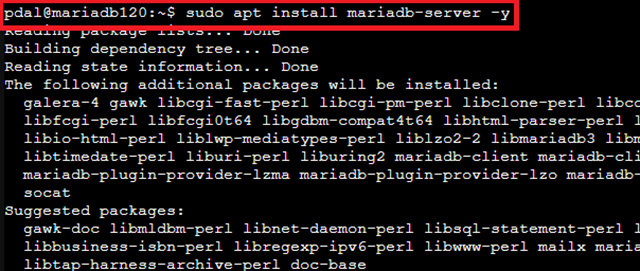
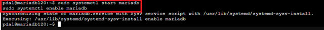
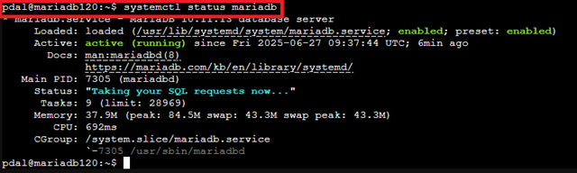
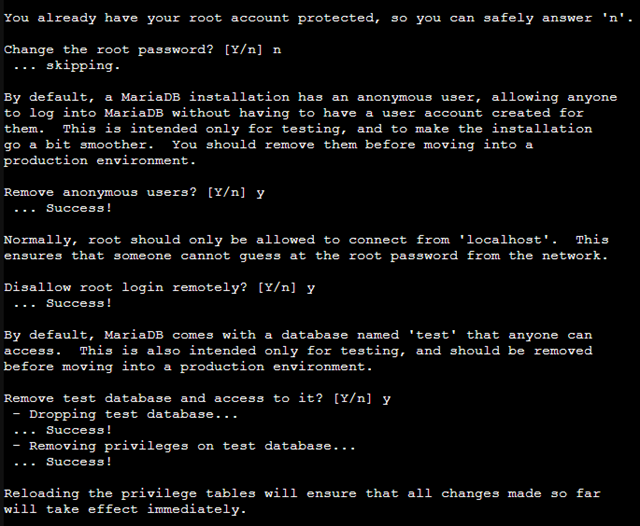
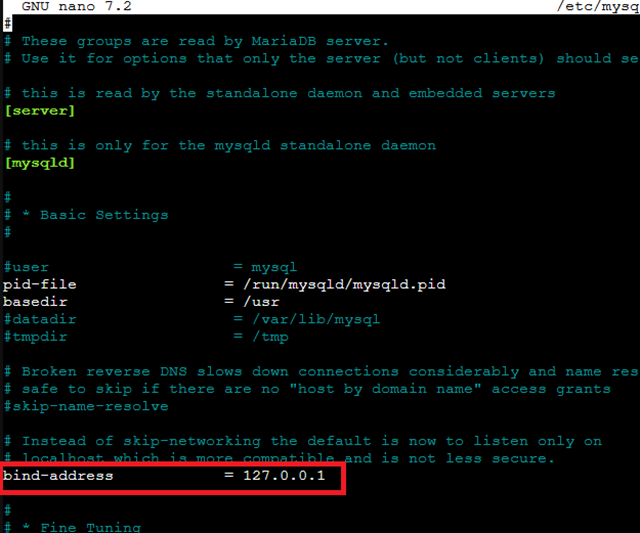
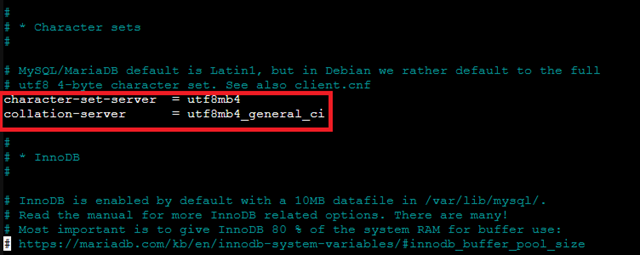
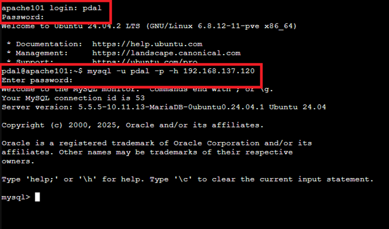

# 📄 Installation und Konfiguration von MariaDB im LXC-Container

## Einleitung

MariaDB ist ein leistungsfähiges, relationales Open-Source-Datenbankmanagementsystem (RDBMS), das als freier Fork von MySQL entwickelt wurde. Es entstand, nachdem Oracle MySQL übernommen hatte, um die Offenheit und Community-Entwicklung sicherzustellen.

MariaDB wird überall dort eingesetzt, wo strukturierte Daten gespeichert, verarbeitet und abgefragt werden müssen – von kleinen Webanwendungen bis hin zu großen Unternehmenssystemen. Typische Einsatzbereiche sind:

- **Webanwendungen**: Speicherung von Benutzerdaten, Inhalten und Konfigurationsdaten.
- **Business-Anwendungen**: Verwaltung von Bestellungen, Kundendaten oder Lagerbeständen.
- **Datenanalyse & Reporting**: Grundlage für Business-Intelligence-Tools.
- **Cloud- und Container-Umgebungen**: als skalierbare, hochverfügbare Datenbanklösung.

Durch ihre hohe Kompatibilität zu MySQL, gute Performance, Replikations- und Clustering-Funktionen ist MariaDB eine der beliebtesten Datenbanken in der Open-Source-Welt.

> **ℹ️ Hinweis zu Begrifflichkeiten:**  
> Obwohl MariaDB ein eigenständiges Datenbankmanagementsystem ist, werden in der Befehlszeile und in Tools häufig weiterhin Begriffe wie `mysql` verwendet – zum Beispiel bei Befehlen wie `mysql_secure_installation` oder beim Datenbank-Client `mysql`.  
> Der Grund dafür ist die vollständige Kompatibilität zu MySQL: MariaDB nutzt bewusst die gleichen Befehlsnamen und Schnittstellen, damit bestehende Anwendungen, Skripte und Dokumentationen ohne Änderungen weiterverwendet werden können.  
> Das Auftreten des Begriffs „mysql“ bedeutet also nicht, dass MySQL installiert ist – es handelt sich lediglich um beibehaltene Namen zur Sicherstellung der Kompatibilität.

## 🧾 Voraussetzungen

- LXC-Container mit Ubuntu 20.04/22.04/24.04 (getestet mit Ubuntu 24.04)
- Netzwerkzugriff auf den Container
- Root- oder `sudo`-Berechtigungen
- User `pdal` mit sudo-Rechten eingerichtet

---

## 🧱 1. Paketliste aktualisieren

```bash
sudo apt update
```

## 📦 2. MariaDB installieren

```bash
sudo apt install mariadb-server -y
```


Überprüfen der Installation:

```bash
mariadb --version
```


## 🚀 3. MariaDB-Dienst starten und aktivieren

```bash
sudo systemctl start mariadb
sudo systemctl enable mariadb
```



Status prüfen:

```bash
sudo systemctl status mariadb
```



Nach dem Starten und Aktivieren des MariaDB-Dienstes läuft der Datenbankserver nun im Hintergrund und ist standardmäßig über localhost erreichbar. Das bedeutet, dass lokale Anwendungen oder Befehle wie `mysql -u root -p` sofort eine Verbindung zur Datenbank herstellen können.

In den nächsten Schritten wird die Datenbank zunächst abgesichert, um unbefugten Zugriff zu verhindern. Dazu wird das integrierte Sicherheits-Skript ausgeführt: `sudo mysql_secure_installation`

Dieses Skript hilft dabei, ein Root-Passwort zu setzen, anonyme Benutzer zu entfernen, den entfernten Root-Zugriff zu deaktivieren und die Testdatenbank zu löschen. Erst danach werden die notwendigen Anpassungen vorgenommen, um einen sicheren Remote-Zugriff auf die Datenbank zu ermöglichen.

## 🔐 4. MariaDB absichern

```bash
sudo mysql_secure_installation
```

**Antwortempfehlungen**:

>switch to unix socket authentication? N
>
>change root password? Y
>
>Remove anonymous users? Y
>
>Disallow root login remotely? Y (für Produktivsysteme)
>
>Remove test database and access to it? Y
>
>Reload privilege tables? Y




## 🌐 5. Remote-Zugriff erlauben (optional)

>externe Verbindungen z. B. von einem Webserver-Container erlauben. Hierfür wird die Listen-Address geändert.

Konfigurationsdatei anpassen:

```bash
sudo nano /etc/mysql/mariadb.conf.d/50-server.cnf
```

Suche folgende Zeile:

`bind-address = 127.0.0.1`



Ändere sie zu:

`bind-address = 192.168.137.120` (IP-Adresse des eigenen LXC-Containers)


>🔎 Erklärung:
Mit dieser Änderung lauscht der MariaDB-Server nicht mehr nur auf localhost, sondern zusätzlich auf der angegebenen Container-IP-Adresse (192.168.137.120).
Dadurch ist die Datenbank nun auch aus dem lokalen Netzwerk erreichbar, z. B. von einem anderen LXC-Container oder einem externen Server.
Ein Client kann sich nun mit folgendem Befehl verbinden: `mysql -h 192.168.137.120 -u BENUTZERNAME -p`
⚠️ Wichtig: Für die Verbindung von externen Clients muss auch die Firewall (falls aktiv) den Zugriff auf Port 3306/tcp erlauben. Außerdem muss sichergestellt sein, dass der verwendete Datenbankbenutzer entsprechende Rechte für % (alle Hosts) oder die spezifische IP des Clients hat.

> Alternaiv kann man die IP-Adresse `0.0.0.0` verwenden. Damit lauscht MariaDB auf allen Ports. Diese Option ist dann zu empfehlen, wenn man einen DHCP-/DNS-Server verwendet und man nicht sicher stellen kann, dass der Container/Server immer die gleiche IP-Adresse zugewiesen bekommt. 

## 🔤 6. Standard-Zeichensatz und Kollation festlegen

> **ℹ️ Einführung:**
> In einer Datenbank legen der **Standard-Zeichensatz** (`character set`) und die **Kollation** (`collation`) fest, wie Textdaten gespeichert, verglichen und sortiert werden.
>
> - Der Zeichensatz definiert, welche Zeichen überhaupt gespeichert werden können (z. B. Buchstaben, Zahlen, Sonderzeichen, Emojis).
> - Die Kollation bestimmt, wie diese Zeichen miteinander verglichen werden, z. B. ob Groß- und Kleinschreibung berücksichtigt wird oder welche Sortierreihenfolge verwendet wird.
>
> Eine konsistente Einstellung von Zeichensatz und Kollation ist wichtig, um Probleme bei Abfragen, Vergleichen und Datenmigrationen zu vermeiden und sicherzustellen, dass alle Anwendungen die Daten korrekt interpretieren.

Füge in der gleichen Konfigurationsdatei (Abschnitt [mysqld]) sicherheitshalber die Zeichensatz- und Kollationsparameter hinzu oder passe sie an:

Vorher:

```bash
character-set-server = utf8mb4
collation-server = utf8mb4_general_cs
```

Ändern zu:

```bash
character-set-server = utf8mb4
collation-server = utf8mb4_general_ci
```


> **🔎 Erklärung:**
> Mit `character-set-server = utf8mb4` wird sichergestellt, dass die Datenbank standardmäßig den modernen UTF-8-Zeichensatz verwendet, der alle Unicode-Zeichen unterstützt (z. B. Emojis oder Sonderzeichen).
> Bei der Kollation gibt es zwei Varianten:
>
> - `utf8mb4_general_cs` → **case-sensitive**, Groß- und Kleinschreibung wird beim Vergleich berücksichtigt (z. B. „Test“ ≠ „test“).
> - `utf8mb4_general_ci` → **case-insensitive**, Groß- und Kleinschreibung wird nicht berücksichtigt (z. B. „Test“ = „test“).
>   Die Einstellung `utf8mb4_general_ci` wird häufig verwendet, da sie in den meisten Anwendungsfällen für Benutzernamen, Logins oder Suchfunktionen praktischer ist.



Dann MariaDB neu starten:

```bash
sudo systemctl restart mariadb
```

## 👤 7. MariaDB-Nutzer für externen Zugriff erstellen

> **ℹ️ Einführung:**
> In diesem Schritt wird ein Datenbank-Benutzer erstellt, der auf MariaDB von einem externen Rechner oder Container zugreifen kann. Es handelt sich dabei um einen **reinen Datenbank-User**, der nicht zwingend als Systembenutzer (`pdal`) auf dem Server existieren muss. Der Name und das Passwort können frei gewählt werden.
> Mit den gesetzten Berechtigungen (`GRANT ALL PRIVILEGES`) erhält der Benutzer Zugriff auf alle Datenbanken und Tabellen und kann Berechtigungen an andere Benutzer vergeben.

In die Datenbank einloggen:

```bash
sudo mariadb
```


Benutzer erstellen und Berechtigungen setzen:

```sql
CREATE USER 'pdal'@'192.168.137.%' IDENTIFIED BY 'JadeHS20';
GRANT ALL PRIVILEGES ON *.* TO 'pdal'@'192.168.137.%' WITH GRANT OPTION;
FLUSH PRIVILEGES;
EXIT;
```

**🔎 Erklärung der Befehle:**

- `CREATE USER 'pdal'@'192.168.137.%' IDENTIFIED BY 'JadeHS20';`
   Erstellt einen neuen Datenbankbenutzer namens `pdal`, der sich von allen IP-Adressen im Netzwerkbereich `192.168.137.*` verbinden kann, mit dem Passwort `JadeHS20`.
- `GRANT ALL PRIVILEGES ON *.* TO 'pdal'@'192.168.137.%' WITH GRANT OPTION;`
   Vergibt alle Rechte auf alle Datenbanken und Tabellen an diesen Benutzer. Mit `WITH GRANT OPTION` kann der Benutzer auch Berechtigungen an andere Benutzer weitergeben.
- `FLUSH PRIVILEGES;`
   Aktualisiert die Berechtigungen, damit die Änderungen sofort wirksam werden.
- `EXIT;`
   Trennt die Verbindung zur MariaDB-Datenbank und kehrt zur Shell zurück.


>Hinweis: Soll ein Zugriff von außerhalb des lokalen Netzwerkes erfolgen (z. B. vom Client-PC), müsste 'pdal'@'%' verwendet werden. Damit ist jede IP-Adresse erlaubt.

## 🔍 8. Port-Freigabe prüfen (optional)

Standardport für MariaDB ist 3306. Teste mit:

```bash
ss -tulpen | grep 3306
```

Die Ausgabe des Befehls `ss -tulpen | grep 3306` zeigt die Netzwerkverbindungen (oder Sockets), die auf Port 3306 (Standard-Port für MySQL/MariaDB) aktiv sind. Du hast zusätzlich die Optionen -tulpen verwendet:

>-t: TCP
>
>-u: UDP
>
>-l: nur lauschende (listening) Sockets
>
>-p: Prozessinformationen anzeigen
>
>-e: erweiterte Informationen (z. B. inode, sk)
>
>-n: keine DNS-Namen, sondern IPs/Ports anzeigen

Erklärung deiner Zeile (aufgeschlüsselt):

```bash
tcp   LISTEN 0      80     192.168.137.120:3306      0.0.0.0:*    uid:108 ino:27953 sk:2005 cgroup:/system.slice/mariadb.service <->
```

| Spalte / Feld                         | Bedeutung                                                                 |
|--------------------------------------|---------------------------------------------------------------------------|
| `tcp`                                | Protokoll: TCP                                                            |
| `LISTEN`                             | Socket-Zustand: horcht auf eingehende Verbindungen                        |
| `0`                                  | `Recv-Q`: Empfangs-Queue (0 = nichts wartet auf Verarbeitung)            |
| `80`                                 | `Send-Q`: Sende-Queue (z. B. wartende Pakete; bei LISTEN fast immer >0)   |
| `192.168.137.120:3306`               | IP-Adresse und Port (MariaDB horcht hier auf diesem Interface/Port)  |
| `0.0.0.0:*`                          | Remote-Adresse/Port: akzeptiert Verbindungen von allen IPs (alle Clients)|
| `uid:108`                            | UID des Prozesses (Benutzer, z. B. `mysql` oder `mariadb`)                |
| `ino:27953`                          | Inode-Nummer des Sockets (für interne Verwaltung im Kernel)              |
| `sk:2005`                            | Socket-ID (Referenz auf Kernel-Socket, nützlich für Debugging)           |
| `cgroup:/system.slice/mariadb.service` | CGroup (Systemd-Dienst `mariadb.service`)                               |
| `<->`                                | Platzhalter (bei LISTEN irrelevant, da keine Gegenstelle existiert)      |

Zusammenfassung:

✅ Was das konkret bedeutet:

- MariaDB ist erfolgreich gestartet

- hört auf Port 3306

- auf allen Netzwerkinterfaces, also:

  - 127.0.0.1 (localhost)

  - 192.168.137.120 (deine Container-IP)

  - ggf. auch andere lokale IPs

  - Verbindungen aus dem Netzwerk (z. B. 192.168.137.0/24) sind möglich – vorausgesetzt:

  - der User ist korrekt eingerichtet in unserem Fall(pdal@192.168.137.%)

  - es gibt keine Firewallregel, die den Zugriff blockiert
  
🔐 Tipp: Zugriff testen

Von einem anderen Host im selben Netz:

```bash
mysql -u pdal -p -h 192.168.137.120
```



Hierfür benötigt man zumindest einen minimalistischen Mariadb Client. Man kann dafür den `mariadb core client` nutzen.
Dazu in einem anderen Container einfach

```bash
sudo apt install mariadb-client-core
```

eingeben und mit `y` bestätigen

Wenn das klappt: ✅ Netzwerkzugriff funktioniert.

Wenn nicht: Prüfen, ob eine Firewall (z. B. ufw oder iptables) den Port auf dem Client blockiert:

```bash
sudo ufw status
```

Unsere Anwendungen können so automatisiert die MariaDB direkt erreichen(z.B. direkter Zugriff von unseren Programmen).
Für manuellen Zugriff, setzen wir im nächsten Dokument phpMyAdmin zur Administrierung der MariaDB auf.

## Quellen

- „MariaDB Documentation | MariaDB Documentation“. Zugegriffen: 25. September 2025. [Online]. Verfügbar unter: [MariaDB Dokumentation](https://mariadb.com/docs)
- „Installing MariaDB Server Guide | MariaDB Documentation“. Zugegriffen: 25. September 2025. [Online]. Verfügbar unter: [MariaDB Server Installation](https://mariadb.com/docs/server/mariadb-quickstart-guides/installing-mariadb-server-guide)
- „Connecting to MariaDB Server | MariaDB Documentation“. Zugegriffen: 25. September 2025. [Online]. Verfügbar unter: [Connecting MariaDB Server](https://mariadb.com/docs/server/server-usage/connecting/mariadb-connecting-guide-1)
- „Essential Queries Guide | MariaDB Documentation“. Zugegriffen: 25. September 2025. [Online]. Verfügbar unter: [Essential Querries Guide](https://mariadb.com/docs/server/mariadb-quickstart-guides/mariadb-advanced-sql-guide)
- „Server Management | MariaDB Documentation“. Zugegriffen: 25. September 2025. [Online]. Verfügbar unter: [Server Management](https://mariadb.com/docs/server/server-management)
- „Security | MariaDB Documentation“. Zugegriffen: 25. September 2025. [Online]. Verfügbar unter: [Security](https://mariadb.com/docs/server/security)

---

### Lizenz
Dieses Werk ist lizenziert unter der **Creative Commons - Namensnennung - Weitergabe unter gleichen Bedingungen 4.0 International Lizenz**.
 
[Zum Lizenztext auf der Creative Commons Webseite](https://creativecommons.org/licenses/by-sa/4.0/legalcode.de)
