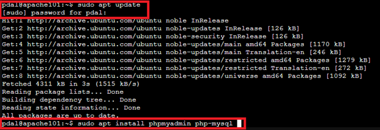
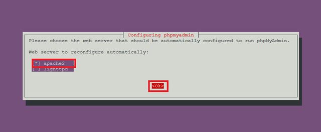
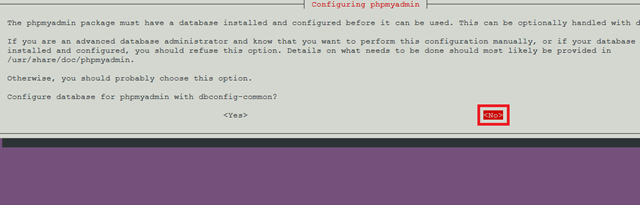
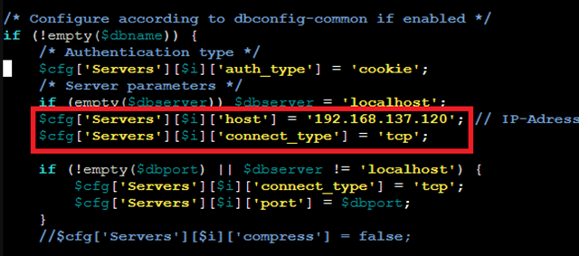
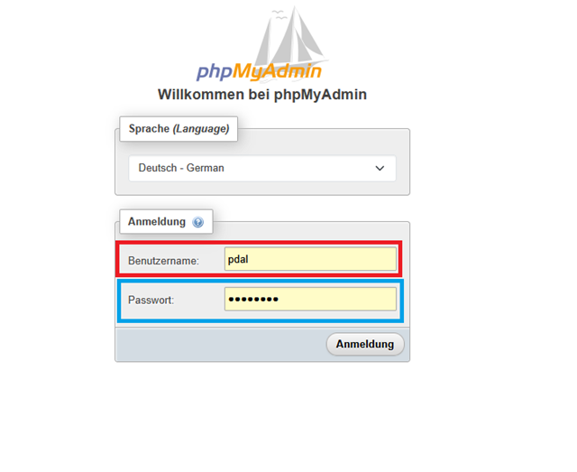
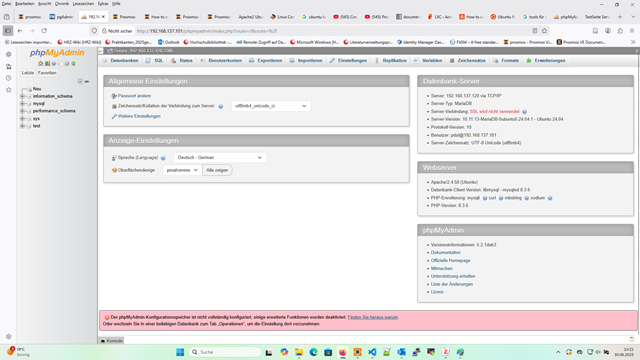
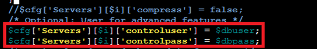
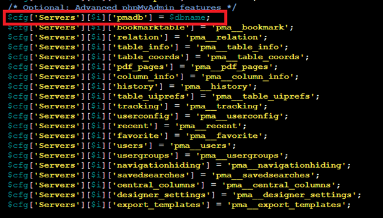

# 📘 Installation und Konfiguration von phpMyAdmin im Apache2 LXC(MariaDB in separatem Container)

## Einleitung zu phpMyAdmin

phpMyAdmin ist eine webbasierte Verwaltungsoberfläche für MySQL- und MariaDB-Datenbanken. Es ermöglicht Benutzern, Datenbanken einfach über den Browser zu erstellen, zu verwalten und zu bearbeiten, ohne direkt die Kommandozeile nutzen zu müssen.  

Typische Einsatzbereiche von phpMyAdmin sind:

- **Datenbank-Administration:** Erstellen, Löschen und Bearbeiten von Datenbanken und Tabellen.  
- **Datenverwaltung:** Einfügen, Bearbeiten oder Löschen von Datensätzen.  
- **SQL-Abfragen:** Ausführen von SQL-Befehlen und Abfragen direkt über die Benutzeroberfläche.  
- **Sicherung und Wiederherstellung:** Exportieren und Importieren von Datenbanken für Backups oder Migrationen.  
- **Benutzer- und Rechteverwaltung:** Anlegen von Datenbankbenutzern und Vergabe von Berechtigungen.  

phpMyAdmin wird vor allem genutzt, um die Verwaltung von Datenbanken für Administratoren und Entwickler zu vereinfachen und ist besonders in Webserver-Umgebungen verbreitet.

## 🔧 Voraussetzungen

- Apache2 ist im Container installiert und läuft.
- MariaDB läuft in einem separaten LXC-Container (`mariadb`) und ist so konfiguriert, dass sie externe Verbindungen akzeptiert (z. B. `bind-address = 192.168.137.120`) und einen Admin user.
- Die Container befinden sich im selben Netzwerk.

## 📦 1. phpMyAdmin im Webserver-Container installieren

💡 Hinweis: "phpMyAdmin" ist eine PHP-Webanwendung, die auf einem bestehenden Webserver (z. B. Apache oder Nginx) läuft. Deshalb kann phpMyAdmin nicht „alleine“ in einem Container gestartet werden – es benötigt immer einen Webserver und eine bestehende Datenbankverbindung, um zu funktionieren.

```bash
apt update
apt install -y phpmyadmin php-mysql
```



💡 Während der Installation:

Webserver-Auswahl: Bei Nachfrage apache2 auswählen (Leertaste → Tab → OK).


Datenbankkonfiguration mit dbconfig-common: → Nein, da MariaDB extern läuft.


Falls die Webserver-Auswahl nicht kommt, phpMyAdmin manuell verlinken:

```bash
ln -s /usr/share/phpmyadmin /var/www/html/phpmyadmin
```

Anschließend Apache neu starten:

```bash
systemctl restart apache2
```

## ⚙️ 2. Remote-MariaDB-Verbindung in phpMyAdmin konfigurieren

Bearbeite die Konfigurationsdatei:

```bash
sudo nano /etc/phpmyadmin/config.inc.php
```


Füge unterhalb der Zeile:

```bash
if (empty($dbserver)) $dbserver = 'localhost';
```

folgendes hinzu:

```bash
$cfg['Servers'][$i]['host'] = '192.168.137.120'; // IP-Adresse des MariaDB-Containers
$cfg['Servers'][$i]['connect_type'] = 'tcp';
```



>📌 Passe die IP-Adresse entsprechend der tatsächlichen Adresse des MariaDB-Containers an.

Speichern und schließen `Strg + O` ->`Enter` -> `Strg + X`.

## 🔄 3. Apache neu starten

```bash
systemctl restart apache2
```

## 🌐 4. phpMyAdmin im Browser aufrufen

Öffne im Browser:

`http://IP-des-phpMyAdmin-Containers/phpmyadmin`

Beispiel:

`http://192.168.137.101/phpmyadmin`

Melde dich mit dem MySQL-/MariaDB-Benutzer an, der Zugriff vom phpMyAdmin-Container aus hat.


## 🧪 5. Fehlerbehebung

>Hinweis: dieser Fehler sollte nur auftreten, wenn sie das Script "Installation und Konfiguration von MariaDB im LXC-Container" nicht komplett ausgeführt haben. 
Haben Sie den User korrekt angelegt prüfen Sie die Konnektivität zum Datenbank-LXC.

❌ Zugriff verweigert (Access denied)

>Wechsel zum MariaDB-Container und stelle sicher, dass der Benutzer in MariaDB korrekt für unser lokales Netzwerk freigegeben ist:

```sql
CREATE USER 'pdal'@'192.168.137.120' IDENTIFIED BY 'JadeHS20';
GRANT ALL PRIVILEGES ON *.* TO 'pdal'@'192.168.137.120' WITH GRANT OPTION;
FLUSH PRIVILEGES;
```

✅ Abschluss

phpMyAdmin ist nun bereit und verbindet sich mit der externen MariaDB-Datenbank. Du kannst über die Weboberfläche Datenbanken verwalten, Benutzer anlegen, Backups machen usw.

---
Aktuell bekommen wir in der WebGUI von phpmyadmin einen Hinweistext angezeigt das der Konfigurationsspeicher nicht vollständig konfiguriert ist.
Dies wird in den nachfolgenden Schritten erklärt.




## 6. Einrichtung des phpMyAdmin-Konfigurationsspeichers (Advanced Features)

### Ziel

Einrichten des internen phpMyAdmin-Konfigurationsspeichers, um erweiterte Funktionen wie z. B. Designer, Bookmarks und Relation-Darstellung nutzen zu können.

---

### Voraussetzungen

- **Apache-Container (phpMyAdmin läuft dort)**: CTID `101`, Hostname: `apache101`
- **MariaDB-Container (MySQL-Datenbank läuft dort)**: z. B. CTID `120`
- **Benutzer für Datenbankzugriff vorhanden** mit allen Rechten
- Zugangsdaten für phpMyAdmin-Konfigurationsspeicher:
  - Benutzername: `pdal`
  - Passwort: `JadeHS20`

---

### Schritt 6.1: SQL-Datei aus Apache-Container auf Host kopieren

💡 **Erläuterung:**

phpMyAdmin benötigt bestimmte eigene Tabellen in der Datenbank, um Funktionen wie Bookmarks, Relations oder PDF-Export zu unterstützen. Diese Tabellen werden durch die Datei `create_tables.sql` definiert. Da in unserer Umgebung **phpMyAdmin im Apache-Container** läuft, die **MariaDB jedoch in einem separaten Container**, kann phpMyAdmin die Tabellen **nicht direkt selbst anlegen**.

Wir gehen deshalb den sicheren und einfachen Weg über den Host(Proxmox):

```bash
pct pull 101 /usr/share/phpmyadmin/sql/create_tables.sql /tmp/create_tables.sql
```


- Die Datei wird aus CT 101 auf den Host unter `/tmp/create_tables.sql` geholt.
- Auf dem Host liegt sie jetzt außerhalb der Container und kann beliebig weiterverwendet werden.

### Schritt 6.2: SQL-Datei in den MariaDB-Container kopieren

```bash
pct push 120 /tmp/create_tables.sql /tmp/create_tables.sql
```


- Schiebt die Datei in CT 120, sodass MariaDB sie ausführen kann.
- Anschließend können die Tabellen mit MySQL-Befehlen angelegt werden.

💡 **Alternative Wege:**

- Direktübertragung von Container zu Container über das Netzwerk (z. B. via `scp`)
- Nutzung eines gemeinsamen Verzeichnisses, das beide Container mounten
- Direkter Download der SQL-Datei innerhalb des MariaDB-Containers

Diese Methoden sind möglich, erfordern aber mehr Netzwerk- oder Konfigurationsaufwand. Der **Host-Zwischenschritt** ist daher **einfach, sicher und reproduzierbar**.

### Schritt 6.3: Konfigurationsdatenbank in MariaDB erstellen

💡 **Erläuterung:**

Obwohl die MariaDB-Datenbank in einem separaten Container (CT 120) läuft, greifen wir **über den Proxmox-Host** auf die Datenbank zu, anstatt direkt in den Container zu gehen:

- **Zentraler Zugriff:** Vom Host aus können wir jeden Container direkt erreichen, ohne uns zuerst einloggen zu müssen.
- **Kein unnötiges Login in den Container:** Die MariaDB akzeptiert Netzwerkverbindungen, daher reicht der MySQL-Client.
- **Flexibilität:** Vom Host aus lassen sich mehrere Container und Datenbanken gleichzeitig erreichen.

💡 **Alternative Methode:**

- Direkter Zugriff im Container via `pct exec 120 -- mysql ...` oder `pct enter 120`.
- Vorteil: direkt im Container.
- Nachteil: zusätzliche Schritte, weniger zentralisiert.

In den MariaDB-Container einloggen:

```bash
mysql -u pdal -p -h 192.168.137.120
```


Voraussetzung: wir haben den mariadb-client-core installiert


Im MySQL-Prompt:

```sql
CREATE DATABASE phpmyadmin;
EXIT;
```


### Schritt 6.4: SQL-Datei ausführen und Tabellen erstellen

💡 **Erläuterung:**

In diesem Schritt führen wir die zuvor kopierte SQL-Datei `create_tables.sql` im MariaDB-Container aus. Dadurch werden die notwendigen Tabellen für phpMyAdmin erstellt.

1. **Verbindung zur MariaDB herstellen:**

  ```bash
  mysql -h 192.168.137.120 -u pdal -p phpmyadmin < /tmp/create_tables.sql
  ```

- `-h 192.168.137.120` → Adresse des MariaDB-Containers
- `-u pdal` → Benutzer mit Rechten, die phpMyAdmin-Tabellen anzulegen
- `-p` → Passwortabfrage für den Benutzer
- `phpmyadmin` → Datenbank, in der die Tabellen erstellt werden

2. **Ausführen der SQL-Datei:**

- Alle in `create_tables.sql` definierten Tabellen und Strukturen werden automatisch in der `phpmyadmin`-Datenbank angelegt.
- Dies aktiviert die erweiterten Funktionen von phpMyAdmin wie Bookmarks, PDF-Export und Relation-Features.

3. **Keine manuelle Eingabe notwendig:**

- Die Datei enthält alle `CREATE TABLE`-Befehle, sodass keine SQL-Befehle einzeln eingegeben werden müssen.

💡 **Zusammengefasst:**

- Mit diesem Schritt initialisieren wir die phpMyAdmin-spezifischen Tabellen in der Datenbank, damit die Weboberfläche korrekt und vollständig genutzt werden kann.


### Schritt 6.5: Benutzer Pdal für Konfigurationsspeicher berechtigen

>Hinweis: Der Benutzer `pdal` existiert bereits und hat volle Privilegien, daher entfällt das Anlegen eines neuen Users.

### Schritt 6.6: phpMyAdmin-Konfiguration anpassen

Datei auf dem Apache-Container öffnen:

```bash
sudo nano /etc/phpmyadmin/config.inc.php
```

Folgende Zeilen ergänzen (vorhandene Zeilen gegen die hier nachfolgenden Zeilen wenn abweichend austauschen):

```bash
$cfg['Servers'][$i]['controluser'] = 'pdal';
$cfg['Servers'][$i]['controlpass'] = 'JadeHS20';
$cfg['Servers'][$i]['pmadb'] = 'phpmyadmin';
$cfg['Servers'][$i]['bookmarktable'] = 'pma__bookmark';
$cfg['Servers'][$i]['relation'] = 'pma__relation';
$cfg['Servers'][$i]['table_info'] = 'pma__table_info';
$cfg['Servers'][$i]['table_coords'] = 'pma__table_coords';
$cfg['Servers'][$i]['pdf_pages'] = 'pma__pdf_pages';
$cfg['Servers'][$i]['column_info'] = 'pma__column_info';
$cfg['Servers'][$i]['history'] = 'pma__history';
$cfg['Servers'][$i]['designer_coords'] = 'pma__designer_coords';
$cfg['Servers'][$i]['tracking'] = 'pma__tracking';
$cfg['Servers'][$i]['userconfig'] = 'pma__userconfig';
$cfg['Servers'][$i]['recent'] = 'pma__recent';
$cfg['Servers'][$i]['favorite'] = 'pma__favorite';
$cfg['Servers'][$i]['users'] = 'pma__users';
$cfg['Servers'][$i]['usergroups'] = 'pma__usergroups';
$cfg['Servers'][$i]['navigationhiding'] = 'pma__navigationhiding';
$cfg['Servers'][$i]['savedsearches'] = 'pma__savedsearches';
$cfg['Servers'][$i]['central_columns'] = 'pma__central_columns';
$cfg['Servers'][$i]['designer_settings'] = 'pma__designer_settings';
$cfg['Servers'][$i]['export_templates'] = 'pma__export_templates';
```






### Schritt 6.7: Apache im Container neu starten

```bash
systemctl restart apache2
```


Ergebnis

Nach der Einrichtung sollte die Warnmeldung in phpMyAdmin verschwunden sein:

>„Der phpMyAdmin-Konfigurationsspeicher ist nicht vollständig konfiguriert, einige erweiterte Funktionen wurden deaktiviert.“

Zusätzliche Features wie Designer und Relationen stehen jetzt zur Verfügung.


## Aufgabe (optional): Richten Sie ein Alias für PhpMyAdmin ein

Im Dokument "Apache2-Webserver & Benutzerverwaltung im LXC-Container" wird erklärt wie ein Alias eingerichtet wird. 

Verschieben Sie das PhpMyAdmin-Verzeichnis von `/var/www/html/phpmyadmin` nach `/var/www/phpmyadmin` und richten sie ein Alias für PhpMyAdmin ein. 
So bleibt das HTML-Verzeichnis frei für Ihre Anwendungen.  

## Quellen

- „Einführung — phpMyAdmin 6.0.0-dev Dokumentation“. Zugegriffen: 25. September 2025. [Online]. Verfügbar unter: [Einführung](https://docs.phpmyadmin.net/de/latest/intro.html)
- „Anforderungen — phpMyAdmin 6.0.0-dev Dokumentation“. Zugegriffen: 25. September 2025. [Online]. Verfügbar unter: [Anforderungen](https://docs.phpmyadmin.net/de/latest/require.html)
- „Installation — phpMyAdmin 6.0.0-dev Dokumentation“. Zugegriffen: 25. September 2025. [Online]. Verfügbar unter: [Installation](https://docs.phpmyadmin.net/de/latest/setup.html)
- „Konfiguration — phpMyAdmin 6.0.0-dev Dokumentation“. Zugegriffen: 25. September 2025. [Online]. Verfügbar unter: [Konfiguration](https://docs.phpmyadmin.net/de/latest/config.html)
- „Benutzerhandbuch — phpMyAdmin 6.0.0-dev Dokumentation“. Zugegriffen: 25. September 2025. [Online]. Verfügbar unter: [Benutzerhandfbuch](https://docs.phpmyadmin.net/de/latest/user.html)
- „FAQ - Häufig gestellte Fragen — phpMyAdmin 6.0.0-dev Dokumentation“. Zugegriffen: 25. September 2025. [Online]. Verfügbar unter: [FAQ](https://docs.phpmyadmin.net/de/latest/faq.html)

---

### Lizenz
Dieses Werk ist lizenziert unter der **Creative Commons - Namensnennung - Weitergabe unter gleichen Bedingungen 4.0 International Lizenz**.
 
[Zum Lizenztext auf der Creative Commons Webseite](https://creativecommons.org/licenses/by-sa/4.0/legalcode.de)
