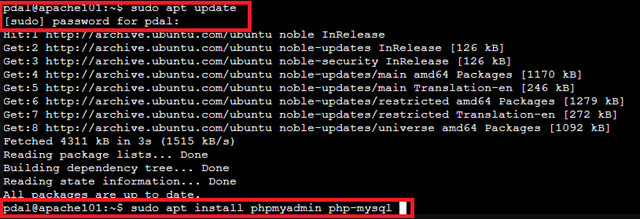
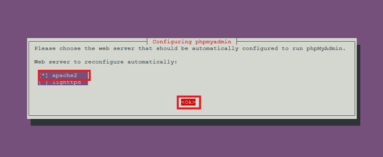
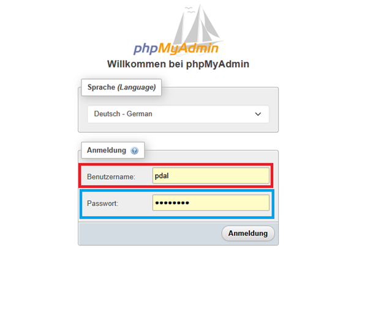
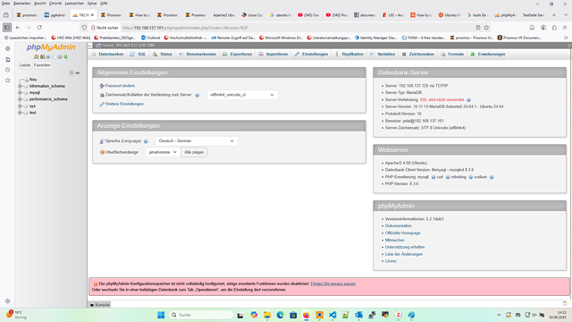

# 📘 Installation und Konfiguration von phpMyAdmin im Apache2 LXC(MariaDB in separatem Container)

## Einleitung zu phpMyAdmin

phpMyAdmin ist eine webbasierte Verwaltungsoberfläche für MySQL- und MariaDB-Datenbanken. Es ermöglicht Benutzern, Datenbanken einfach über den Browser zu erstellen, zu verwalten und zu bearbeiten, ohne direkt die Kommandozeile nutzen zu müssen.  

Typische Einsatzbereiche von phpMyAdmin sind:

- **Datenbank-Administration:** Erstellen, Löschen und Bearbeiten von Datenbanken und Tabellen.  
- **Datenverwaltung:** Einfügen, Bearbeiten oder Löschen von Datensätzen.  
- **SQL-Abfragen:** Ausführen von SQL-Befehlen und Abfragen direkt über die Benutzeroberfläche.  
- **Sicherung und Wiederherstellung:** Exportieren und Importieren von Datenbanken für Backups oder Migrationen.  
- **Benutzer- und Rechteverwaltung:** Anlegen von Datenbankbenutzern und Vergabe von Berechtigungen.  

phpMyAdmin wird vor allem genutzt, um die Verwaltung von Datenbanken für Administratoren und Entwickler zu vereinfachen und ist besonders in Webserver-Umgebungen verbreitet.

---

## 🔧 Voraussetzungen

- Apache2 ist im Container installiert und läuft.
- MariaDB läuft in einem separaten LXC-Container (`mariadb`) und ist so konfiguriert, dass sie externe Verbindungen akzeptiert (z. B. `bind-address = 192.168.137.120`) und einen Admin user.
- Die Container befinden sich im selben Netzwerk.

---

## 📦 1. phpMyAdmin im Webserver-Container installieren

💡 Hinweis: "phpMyAdmin" ist eine PHP-Webanwendung, die auf einem bestehenden Webserver (z. B. Apache oder Nginx) läuft. Deshalb kann phpMyAdmin nicht „alleine“ in einem Container gestartet werden – es benötigt immer einen Webserver und eine bestehende Datenbankverbindung, um zu funktionieren.

```bash
apt update
apt install -y phpmyadmin php-mysql
```



💡 Während der Installation:

Webserver-Auswahl: Bei Nachfrage apache2 auswählen (Leertaste → Tab → OK).



Datenbankkonfiguration mit dbconfig-common: → Nein, da MariaDB extern läuft.


Falls die Webserver-Auswahl nicht kommt, phpMyAdmin manuell verlinken:

```bash
ln -s /usr/share/phpmyadmin /var/www/html/phpmyadmin
```

Anschließend Apache neu starten:

```bash
systemctl restart apache2
```

---

## ⚙️ 2. Remote-MariaDB-Verbindung in phpMyAdmin konfigurieren

Da wir die MariaDB in einem separaten Container betreiben, muss phpMyAdmin wissen, dass der Datenbank-Server nicht **`localhost`** ist, sondern die **externe IP** des MariaDB-Containers.

Bearbeiten Sie die Konfigurationsdatei **`config-db.php`**, da diese die primären Server-Variablen enthält, die von `config.inc.php` verwendet werden:

```bash
sudo nano /etc/phpmyadmin/conf.d/config-db.php
```

In dieser Datei suchen Sie die Zeile, die den Server definiert, und tragen die IP-Adresse des MariaDB-Containers (z.B. `192.168.137.120`) ein.

**Achtung:** Der Inhalt dieser Datei kann variieren. Typischerweise sieht der relevante Teil zur Definition des Datenbank-Hosts so aus:

```php
// Fügen Sie diese Zeile in der Datei hinzu oder ändern Sie die vorhandene Host-Definition:
$dbserver = '192.168.137.120'; // IP-Adresse des MariaDB-Containers
```

> **📌 Wichtige Änderung:** Der phpMyAdmin-Webserver verbindet sich nun über TCP mit der angegebenen IP. Da `$dbserver` nicht mehr `'localhost'` ist, wird automatisch `connect_type = 'tcp'` in der `config.inc.php` gesetzt.

Speichern und schließen (`Strg + O` -\>`Enter` -\> `Strg + X`).

---

## 🔄 3. Apache neu starten

```bash
systemctl restart apache2
```

---

## 🌐 4. phpMyAdmin im Browser aufrufen

Öffne im Browser:

`http://IP-des-phpMyAdmin-Containers/phpmyadmin`

Beispiel:

`http://192.168.137.101/phpmyadmin`

Melde dich mit dem MySQL-/MariaDB-Benutzer an, der Zugriff vom phpMyAdmin-Container aus hat.



---

## 🧪 5. Fehlerbehebung

>Hinweis: dieser Fehler sollte nur auftreten, wenn sie das Script "Installation und Konfiguration von MariaDB im LXC-Container" nicht komplett ausgeführt haben. 
Haben Sie den User korrekt angelegt prüfen Sie die Konnektivität zum Datenbank-LXC.

❌ Zugriff verweigert (Access denied)

>Wechsel zum MariaDB-Container und stelle sicher, dass der Benutzer in MariaDB korrekt für unser lokales Netzwerk freigegeben ist:

```sql
CREATE USER 'pdal'@'192.168.137.%' IDENTIFIED BY 'JadeHS20';
GRANT ALL PRIVILEGES ON *.* TO 'pdal'@'192.168.137.%' WITH GRANT OPTION;
FLUSH PRIVILEGES;
```
>Hinweis: Will man den Zugriff nur von einem LXC-Container erlauben, dann ändert man das letzte Oktett der IP-Adresse von 'pdal'@'192.168.137.%' zu 'pdal'@'192.168.137.123' (IP des Container von aus zugegriffen werden soll). Das würde die Sicherheit deutlich erhöhen.

✅ Abschluss

phpMyAdmin ist nun bereit und verbindet sich mit der externen MariaDB-Datenbank. Du kannst über die Weboberfläche Datenbanken verwalten, Benutzer anlegen, Backups machen usw.

---

Aktuell bekommen wir in der WebGUI von phpmyadmin einen Hinweistext angezeigt das der Konfigurationsspeicher nicht vollständig konfiguriert ist.
Dies wird in den nachfolgenden Schritten erklärt.




## 6. Einrichtung des phpMyAdmin-Konfigurationsspeichers (Advanced Features)

Einrichten des internen phpMyAdmin-Konfigurationsspeichers, um erweiterte Funktionen wie z. B. Designer, Bookmarks und Relation-Darstellung nutzen zu können.

💡 **Erläuterung:**

phpMyAdmin benötigt bestimmte eigene Tabellen in der Datenbank, um Funktionen wie Bookmarks, Relations oder PDF-Export zu unterstützen. Diese Tabellen werden durch die Datei `create_tables.sql` definiert. Da in unserer Umgebung **phpMyAdmin im Apache-Container** läuft, die **MariaDB jedoch in einem separaten Container**, kann phpMyAdmin die Tabellen **nicht direkt selbst anlegen**.

Wir gehen deshalb den sicheren und einfachen Weg über die Web-Oberfläche:
- Gehe auf den Reiter "Datenbanken".
- Unter "Neue Datenbank anlegen" gib den Namen der Datenbank ein **phpmyadmin**. Drücke auf "Anlegen".
- Man springt automatisch in die neu angelegte Datenbank; sonst wähle die Datenbank "phpmyadmin" aus.
- Gehe auf den Reiter "Optionen".
- Oben steht "Der phpMyAdmin Konfigurations-Speicher wurde deaktiviert. Finden Sie heraus warum.". Klicke auf "Finden Sie heraus warum."
- Nun auf "Erzeugen" klicken und die Tabellen werden automatisch erzeugt. 

Die Konfiguration ist abgeschlossen.

💡 **Zusammengefasst:**

- Mit diesem Schritt initialisieren wir die phpMyAdmin-spezifischen Tabellen in der Datenbank, damit die Weboberfläche korrekt und vollständig genutzt werden kann.

## Aufgabe (optional): Richten Sie ein Alias für PhpMyAdmin ein

Im Dokument "Apache2-Webserver & Benutzerverwaltung im LXC-Container" wird erklärt wie ein Alias eingerichtet wird. 

Verschieben Sie das PhpMyAdmin-Verzeichnis von `/var/www/html/phpmyadmin` nach `/var/www/phpmyadmin` und richten sie ein Alias für PhpMyAdmin ein. 
So bleibt das HTML-Verzeichnis frei für Ihre Anwendungen.  

---

## Quellen

- „Einführung — phpMyAdmin 6.0.0-dev Dokumentation“. Zugegriffen: 25. September 2025. [Online]. Verfügbar unter: [Einführung](https://docs.phpmyadmin.net/de/latest/intro.html)
- „Anforderungen — phpMyAdmin 6.0.0-dev Dokumentation“. Zugegriffen: 25. September 2025. [Online]. Verfügbar unter: [Anforderungen](https://docs.phpmyadmin.net/de/latest/require.html)
- „Installation — phpMyAdmin 6.0.0-dev Dokumentation“. Zugegriffen: 25. September 2025. [Online]. Verfügbar unter: [Installation](https://docs.phpmyadmin.net/de/latest/setup.html)
- „Konfiguration — phpMyAdmin 6.0.0-dev Dokumentation“. Zugegriffen: 25. September 2025. [Online]. Verfügbar unter: [Konfiguration](https://docs.phpmyadmin.net/de/latest/config.html)
- „Benutzerhandbuch — phpMyAdmin 6.0.0-dev Dokumentation“. Zugegriffen: 25. September 2025. [Online]. Verfügbar unter: [Benutzerhandfbuch](https://docs.phpmyadmin.net/de/latest/user.html)
- „FAQ - Häufig gestellte Fragen — phpMyAdmin 6.0.0-dev Dokumentation“. Zugegriffen: 25. September 2025. [Online]. Verfügbar unter: [FAQ](https://docs.phpmyadmin.net/de/latest/faq.html)

---

### Lizenz
Dieses Werk ist lizenziert unter der **Creative Commons - Namensnennung - Weitergabe unter gleichen Bedingungen 4.0 International Lizenz**.
 
[Zum Lizenztext auf der Creative Commons Webseite](https://creativecommons.org/licenses/by-sa/4.0/legalcode.de)
