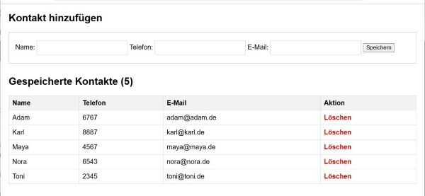

# Eigene Webanwendung (HTML/PHP) mit Datenbankanbindung

Nachdem wir einen Web-Server mit PHP und phpMyAdmin aufgesetzt haben und einen eigenständigen Datenbank-Server eingerichtet haben können wir die erste Server-Anwendung schreiben - eine einfache **Kontaktliste**.

Eine Kontaktliste/Telefonbuch-Anwendung ist ein klassisches und einfaches Beispiel, da sie alle grundlegenden Datenbankoperationen (CRUD: Create, Read, Update, Delete) abdeckt und sich perfekt für eine schnelle PHP-Implementierung eignet.

##💡 Beispielanwendung: Einfache Kontaktliste (CRUD)
Diese Anwendung besteht aus einer einzigen PHP-Seite und einer Datenbanktabelle.

🎯 Die Anwendung kann:
 - **READ:** Alle gespeicherten Kontakte in einer Tabelle anzeigen.
 - **CREATE:** Neue Kontakte hinzufügen (Name, Telefonnummer, E-Mail).
 - **UPDATE:** Bestehende Kontakte bearbeiten.
 - **DELETE:** Kontakte löschen.

Dieses Dokument beschreibt das grundsätzliche Vorgehen.

---

## Datenbank und Tabellen anlegen

Zunächst wird die Datenbank angelegt. 

```SQL
CREATE DATABASE contacts_db;

USE contacts_db;

CREATE TABLE contacts (
    id INT AUTO_INCREMENT PRIMARY KEY,
    name VARCHAR(100) NOT NULL,
    phone VARCHAR(20),
    email VARCHAR(100)
);
```
Die drei SQL-Befehle können in der MariaDB-Konsole direkt angelegt werden oder man nutzt phpMyAdmin dafür.
Dazu in phpMyAdmin den Bereich "SQL" aufrufen und die drei Befehle hinein kopieren und mit "OK" bestätigen.

Damit sollte die Datenbank und die Tabellen angelegt sein. 

---

## PHP-Anwendung erstellen (Apache/PHP-Container)

Legen Sie im HTML-Verzeichnis von Apache einen neuen Ordner "Kontaktliste" an - `mkdir /var/www/html/Kontaktliste`.

Erstellen Sie eine einzige Datei, z. B. index.php, im Document Root Ihres Apache-Containers (/var/www/html/Kontaktliste/).

```bash
sudo nano index.php
```

Diese Datei muss die Datenbankverbindung herstellen und die Logik für die Anzeige und Verarbeitung der Formulare enthalten.
In diesem Beispiel nutzen wir für die Datenverbindung die PHP-Klasse PDO (PHP Data Object).

[PHP Documentation PDO](https://www.php.net/manual/de/class.pdo.php)

```php
<?php
// =========================================================
// 1. KONFIGURATION & DATENBANKVERBINDUNG
// =========================================================
$host = '192.168.137.120'; // IP Ihres MariaDB-Containers
$db   = 'contacts_db';
$user = 'pdal';          // Ihr Datenbankbenutzer
$pass = 'JadeHS20';       // Ihr Passwort
$charset = 'utf8mb4';

$dsn = "mysql:host=$host;dbname=$db;charset=$charset";
$options = [
    PDO::ATTR_ERRMODE            => PDO::ERRMODE_EXCEPTION,
    PDO::ATTR_DEFAULT_FETCH_MODE => PDO::FETCH_ASSOC,
    PDO::ATTR_EMULATE_PREPARES   => false,
];

try {
     $pdo = new PDO($dsn, $user, $pass, $options);
} catch (\PDOException $e) {
     throw new \PDOException($e->getMessage(), (int)$e->getCode());
}


// =========================================================
// 2. FORMULARVERARBEITUNG (CRUD Logic)
// =========================================================

// Beispiel für CREATE (Neuer Kontakt)
if ($_SERVER['REQUEST_METHOD'] === 'POST' && isset($_POST['action']) && $_POST['action'] === 'add') {
    $stmt = $pdo->prepare("INSERT INTO contacts (name, phone, email) VALUES (?, ?, ?)");
    $stmt->execute([$_POST['name'], $_POST['phone'], $_POST['email']]);
    header('Location: index.php'); // Umleitungen nach POST verhindern doppelte Einsendungen
    exit;
}

// Beispiel für DELETE
if (isset($_GET['delete_id'])) {
    $stmt = $pdo->prepare("DELETE FROM contacts WHERE id = ?");
    $stmt->execute([$_GET['delete_id']]);
    header('Location: index.php');
    exit;
}


// =========================================================
// 3. DATEN ABFRAGEN (READ)
// =========================================================
$stmt = $pdo->query('SELECT * FROM contacts ORDER BY name');
$contacts = $stmt->fetchAll();

?>
<!DOCTYPE html>
<html lang="de">
<head>
    <meta charset="UTF-8">
    <title>Einfache Kontaktliste</title>
    <style>
        body { font-family: Arial, sans-serif; margin: 20px; }
        table { width: 100%; border-collapse: collapse; margin-top: 20px; }
        th, td { border: 1px solid #ddd; padding: 8px; text-align: left; }
        th { background-color: #f2f2f2; }
        .form-container { margin-bottom: 30px; padding: 15px; border: 1px solid #ccc; }
        input[type="text"], input[type="email"] { padding: 8px; margin: 5px 0; display: inline-block; border: 1px solid #ccc; width: 200px; }
        .delete-btn { color: red; text-decoration: none; font-weight: bold; }
    </style>
</head>
<body>

    <h2>Kontakt hinzufügen</h2>
    <div class="form-container">
        <form method="POST">
            <input type="hidden" name="action" value="add">
            <label for="name">Name:</label>
            <input type="text" id="name" name="name" required>
            <label for="phone">Telefon:</label>
            <input type="text" id="phone" name="phone">
            <label for="email">E-Mail:</label>
            <input type="email" id="email" name="email">
            <button type="submit">Speichern</button>
        </form>
    </div>

    <h2>Gespeicherte Kontakte (<?= count($contacts) ?>)</h2>
    <?php if (count($contacts) > 0): ?>
        <table>
            <thead>
                <tr>
                    <th>Name</th>
                    <th>Telefon</th>
                    <th>E-Mail</th>
                    <th>Aktion</th>
                </tr>
            </thead>
            <tbody>
                <?php foreach ($contacts as $contact): ?>
                    <tr>
                        <td><?= htmlspecialchars($contact['name']) ?></td>
                        <td><?= htmlspecialchars($contact['phone']) ?></td>
                        <td><?= htmlspecialchars($contact['email']) ?></td>
                        <td>
                            <a class="delete-btn" href="?delete_id=<?= $contact['id'] ?>" 
                               onclick="return confirm('Sicher diesen Kontakt löschen?');">Löschen</a>
                            </td>
                    </tr>
                <?php endforeach; ?>
            </tbody>
        </table>
    <?php else: ?>
        <p>Noch keine Kontakte gespeichert.</p>
    <?php endif; ?>

</body>
</html>
```

Sie können das Script mit `nano` direkt einfügen oder die Index-Datei auf dem Client-Rechner erstellen und dann mit `scp` oder einem FTP-Tool auf den Server hoch laden. 

Nach dem Erstellen des Scriptes testen Sie die Anwendung - `http://<IP-Apache-Server>/Kontaktliste/`.



## Weiterentwicklung

Hat man eine Anwendung mit mehreren Scripten macht es keinen Sinn die Datenbankanbindung jedes mal neu zu definieren. 
Daher separiert man die Datenanbindung und nimmt die Datenanbindung mit der `include`- `require_once`-Anweisung in das Script auf. 

>Hinweis: Der Unterschied zwischen einer `include`- und `require_once`-Anweisung ist das `require_once` das Script abbricht, wenn es zu einem Fehler kommt. Dies macht immer dann Sinn, wenn es sich um einen kritischen Abschnitt handelt - in diesem Fall die Datenbankverbindung.

Hierfür erstellen Sie eine Datei `db_config.php`:
```php
<?php
// =========================================================
// DATENBANK-KONFIGURATION
// =========================================================

$host = '192.168.137.120'; // IP Ihres MariaDB-Containers
$db   = 'contacts_db';
$user = 'pdal';          // Ihr Datenbankbenutzer
$pass = 'JadeHS20';       // Ihr Passwort
$charset = 'utf8mb4';

$dsn = "mysql:host=$host;dbname=$db;charset=$charset";
$options = [
    // Fehler als PDOException ausgeben
    PDO::ATTR_ERRMODE            => PDO::ERRMODE_EXCEPTION,
    // Standard-Fetch-Modus: Assoziatives Array
    PDO::ATTR_DEFAULT_FETCH_MODE => PDO::FETCH_ASSOC,
    // Deaktiviert die Emulation vorbereiteter Anweisungen (bessere Performance und Sicherheit)
    PDO::ATTR_EMULATE_PREPARES   => false,
];

try {
     // Die globale Datenbankverbindung ($pdo) wird hergestellt
     $pdo = new PDO($dsn, $user, $pass, $options);
} catch (\PDOException $e) {
     // Bei Verbindungsfehlern (z.B. falsche IP oder falsches Passwort)
     // Hier sollte in einer Produktionsumgebung nur eine allgemeine Fehlermeldung ausgegeben werden!
     die("Datenbankverbindung fehlgeschlagen: " . $e->getMessage());
}
```

Nun kann die Datenbankverbindung importiert werden:

```php
<?php
// =========================================================
// 1. DATENBANKVERBINDUNG IMPORTIEREN
// =========================================================
require_once 'db_config.php'; 

// =========================================================
// 2. FORMULARVERARBEITUNG (CRUD Logic)
// Die $pdo-Variable steht nun zur Verfügung
// =========================================================

// Beispiel für CREATE (Neuer Kontakt)
if ($_SERVER['REQUEST_METHOD'] === 'POST' && isset($_POST['action']) && $_POST['action'] === 'add') {
    $stmt = $pdo->prepare("INSERT INTO contacts (name, phone, email) VALUES (?, ?, ?)");
    $stmt->execute([$_POST['name'], $_POST['phone'], $_POST['email']]);
    header('Location: index.php');
    exit;
}

// ... Rest des Codes bleibt unverändert ...

// =========================================================
// 3. DATEN ABFRAGEN (READ)
// =========================================================
$stmt = $pdo->query('SELECT * FROM contacts ORDER BY name');
$contacts = $stmt->fetchAll();

// ... HTML-Code ...
```

Auf diese Weise wird die Datenbankverbindung nur einmal definiert und kann beliebig oft importiert werden. 
Sollten Änderungen notwendig sein, werden diese nur an einer Stelle durchgeführt. 

**Passen Sie den Code entsprechend an.**

>Hinweis: PHP stellt mehrere Treiber und Plugins für den Zugriff auf MySQL/MariaDB und dessen Handhabung zur Verfügung. Siehe z. B.: [PHP-Treiber für MySQL](https://www.php.net/manual/de/mysql.php).

>Hinweis 2: In Produktiv-System würde man die Datenbank-Konfiguration und andere wichtige Scripte nicht in das Web-Verzeichnis legen. Dann muss der Import mit voller Pfadangabe erfolgen - z. B. `include /var/config/db_config.php`.

## Quellen

[PHP Documentation PDO](https://www.php.net/manual/de/class.pdo.php)

[PHP-Treiber für MySQL](https://www.php.net/manual/de/mysql.php)


---

### Lizenz
Dieses Werk ist lizenziert unter der **Creative Commons - Namensnennung - Weitergabe unter gleichen Bedingungen 4.0 International Lizenz**.
 
[Zum Lizenztext auf der Creative Commons Webseite](https://creativecommons.org/licenses/by-sa/4.0/legalcode.de)
