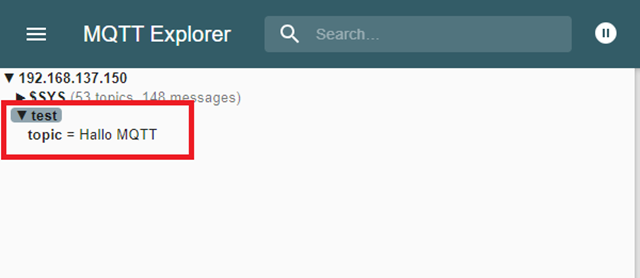
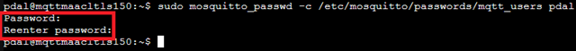
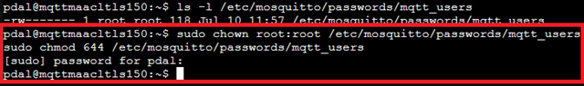
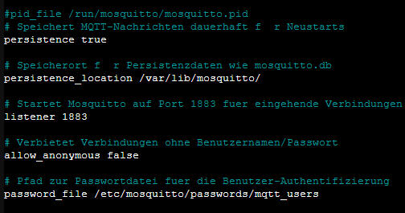

# 📘 MQTT auf vorhandenem LXC installieren und konfigurieren

MQTT steht für "Message Queuing Telemetry Transport" und ist ein leichtgewichtiges, offenes Kommunikationsprotokoll, das für die Übertragung von Nachrichten zwischen Geräten in einem Netzwerk entwickelt wurde. Es wurde speziell für M2M (Machine-to-Machine) und IoT (Internet of Things) Anwendungen entworfen, bei denen eine zuverlässige und effiziente Übertragung von Daten mit begrenzten Ressourcen erforderlich ist.

Hier sind einige grundlegende Konzepte und Eigenschaften von MQTT:

**1. Publisher/Subscriber-Modell:**
 MQTT basiert auf dem Publisher/Subscriber-Messaging-Modell. Es gibt einen zentralen Vermittler, der als **Broker** bezeichnet wird. Geräte, die Daten senden möchten, sind sogenannte **Publisher**, während Geräte, die Daten empfangen möchten, als **Subscriber** bezeichnet werden. Publisher senden Nachrichten an **bestimmte Themen (Topics)**, und Subscriber abonnieren diese Themen, um Nachrichten zu empfangen, die an sie gerichtet sind.

**2. Topics:**
 Topics sind hierarchische Namen oder Kanäle, die verwendet werden, um Nachrichten zu organisieren und zu filtern. Sie können nach Belieben benannt werden und ermöglichen eine flexible Kategorisierung von Nachrichten. Beispielsweise kann ein Thema wie "Sensordaten/Temperatur" verwendet werden, um alle Nachrichten zu abonnieren, die mit der Temperaturmessung von Sensoren zusammenhängen.

**3. Quality of Service (QoS):**
 MQTT unterstützt verschiedene QoS-Level für die Nachrichtenübertragung. Es gibt drei Ebenen:
   - ***QoS 0:*** "At most once" - Die Nachricht wird einmal gesendet, ohne eine Bestätigung oder Überprüfung der Zustellung. Es besteht die Möglichkeit, dass Nachrichten verloren gehen.
   - ***QoS 1:*** "At least once" - Die Nachricht wird mindestens einmal zugestellt. Es kann jedoch zu Duplikaten kommen.
   - ***QoS 2:*** "Exactly once" - Die Nachricht wird genau einmal zugestellt und Duplikate werden vermieden. Dieses Level erfordert die umfangreichsten Kommunikationsmechanismen.

**4. Lightweight:**
 MQTT ist darauf ausgelegt, ressourcenschonend zu sein, sowohl in Bezug auf die Netzwerkbandbreite als auch auf die Systemressourcen der Geräte. Die Nachrichtenheader sind klein, was die Effizienz bei der Übertragung verbessert. Daher eignet sich MQTT gut für Umgebungen mit begrenzten Ressourcen, wie z.B. eingebettete Systeme oder IoT-Geräte.

**5. Zuverlässigkeit:**
 MQTT unterstützt eine zuverlässige Übertragung von Nachrichten, indem es Mechanismen wie die Zustellungsbestätigung (Acknowledgement) und Wiederholungsmechanismen bietet. Dies ermöglicht eine robuste Kommunikation in instabilen Netzwerkumgebungen.

MQTT wird häufig in IoT-Anwendungen eingesetzt, bei denen Sensoren, Aktoren und andere Geräte Daten austauschen müssen. Es bietet eine einfache und effiziente Möglichkeit, Nachrichten zwischen den Geräten zu übertragen und ermöglicht die Skalierbarkeit von IoT-Systemen.

---

## 🧾 Voraussetzungen

- LXC-Container mit Ubuntu 20.04/22.04/24.04 (getestet mit Ubuntu 24.04)
- Netzwerkzugriff auf den Container
- Root- oder anderer User mit `sudo`-Berechtigungen

---

Mosquitto wird von der **Eclipse Foundation** entwickelt und unter den freien Lizenzen **EPL/EDL** veröffentlicht.


## 🔧 Vorbereitung: Mosquitto installieren

```bash
sudo apt update
sudo apt install -y mosquitto mosquitto-clients
```
(Mosquitto-Clients werden nur zum testen auf dem System benötigt.)


```bash
sudo systemctl enable mosquitto
sudo systemctl start mosquitto
```


## 🧪  Anonyme, unverschlüsselte MQTT-Kommunikation

**1. Konfigurationsdatei anpassen**

```bash
sudo nano /etc/mosquitto/mosquitto.conf
```
Inhalt:

```bash
# Speichert MQTT-Nachrichten dauerhaft für Neustarts
persistence true

persistence_location /var/lib/mosquitto/

listener 1883
allow_anonymous true
```


Diese Konfiguration erlaubt allen Clients den unverschlüsselten Zugang ohne Authentifizierung.
 
**2. Dienst neu starten**

```bash
sudo systemctl restart mosquitto
```


Überprüfung ob der Dienst `enabled` ist. (sorgt für automatisches starten des Dienstes beim booten des Containers)
 ```bash
 sudo systemctl status mosquitto
 ```


**3. Test auf dem MQTT-Host**

Zum testen nutzen wir den MQTT-Explorer.(CC-BY-ND-4.0)
Man kann ihn [MQTT-Explorer](https://mqtt-explorer.com) hier herunterladen.
MQTT Explorer ist ein grafisches Desktop-Tool zur Visualisierung, Analyse und Verwaltung von MQTT-Datenströmen. Es dient hauptsächlich dazu, eine Verbindung zu einem MQTT-Broker herzustellen und die gesendeten und empfangenen Nachrichten in einer übersichtlichen Baumstruktur darzustellen. Dabei zeigt es alle Topics, deren Hierarchie sowie die zugehörigen Nachrichteninhalte (Payloads), inklusive Informationen wie QoS-Level, Retain-Status und Zeitstempel.

Mit MQTT Explorer lassen sich Nachrichten nicht nur beobachten, sondern auch aktiv an beliebige Topics senden (Publish-Funktion). Das Tool eignet sich ideal zum Testen, Debuggen und Überwachen von IoT-Geräten, Smart-Home-Systemen oder anderen MQTT-basierten Anwendungen. Es unterstützt dabei auch Sicherheitsfunktionen wie die Verbindung über TLS, die Verwendung von Benutzernamen und Passwörtern sowie die Authentifizierung per Zertifikat.

Durch seine benutzerfreundliche Oberfläche und die Echtzeit-Darstellung ist MQTT Explorer besonders hilfreich, wenn man schnell einen Überblick über den Zustand eines MQTT-Systems erhalten oder Fehlerquellen identifizieren möchte. Es ist plattformübergreifend verfügbar für Windows, macOS und Linux.


---
**Publisher**
Testen mit Mqtt-Client:

```bash
mosquitto_pub -h 192.168.137.150 -t test/topic -m "Hallo MQTT"
```




Das Ergebnis ist im MqttExplorer sofort zu sehen.

**Subscriber**

Test mit Mqtt-Client:

```bash
mosquitto_sub -h 192.168.137.150 -t test/topic
```
Senden einer Nachricht über MqttExplorer.


---

Für einen Langzeittest können Sie zwei weitere LXC-Container erstellt.
Einen Container nutzen wir als Publisher, und den anderen nutzen wir als Subscriber.
Eine genaue Anleitung hierzu findest du in dieser Dokumentation.
[[0755 MqttClients]]

---

## 🔐 MQTT mit Benutzeranmeldung, unverschlüsselt

Zur besseren Zugriffskontrolle werden noch User mit Passwort eingerichtet.

**1. Passwortdatei erstellen**
```bash

sudo mkdir -p /etc/mosquitto/passwords
sudo mosquitto_passwd -c /etc/mosquitto/passwords/mqtt_users pdal
```



Jetzt wird nach einem Passwort gefragt, welches für den User `pdal` gesetzt werden muss. 
Für dieses Beispiel wurde das Passwort `JadeHS20` gewählt.

Nach dem Erstellen der Datei `mqtt_users`, müssen hierfür ggf.  die Berechtigungen angepasst werden. 

```bash
ls -l /etc/mosquitto/passwords/mqtt_users
```
Die Berechtigungen müssen wie folgt gesetzt sein damit der Mosquitto Dienst einwandfrei funktioniert.

```bash
sudo chown root:root /etc/mosquitto/passwords/mqtt_users
sudo chmod 644 /etc/mosquitto/passwords/mqtt_users
```


**1.** `sudo chown root:root /etc/mosquitto/passwords/mqtt_users`

Der Befehl setzt den Besitzer und die Gruppe der Datei `mqtt_users` auf `root`, sodass nur der Systemadministrator (root) vollen Zugriff darauf hat.

**2.** `sudo chmod 644 /etc/mosquitto/passwords/mqtt_users`

Der Befehl erlaubt dem Besitzer der Datei, sie zu lesen und zu schreiben, während Gruppe und andere Benutzer die Datei nur lesen dürfen.
Nachdem die Berechtigungen und Owner geändert wurden, überprüfen Sie mit dem nachfolgenden Befehl, ob diese auch wirklich angepasst wurden.

```bash
ls -l /etc/mosquitto/passwords/mqtt_users
```


Weitere User können so erstellt werden.

```bash
sudo mosquitto_passwd /etc/mosquitto/passwords/mqtt_users Kai
```
Jetzt wird nach einem Passwort gefragt, welches für den User `Kai` gesetzt werden muss.
Für dieses Beispiel wurde das Passwort `1234` gewählt.


Es ist möglich, dass an dieser Stelle eine Warnung erscheint, weil die Berechtigung für die Datei `mqtt_users` auf `644` gesetzt wurde. Diese Warnung besagt: `Warnung: Die Datei /etc/mosquitto/passwords/mqtt_users ist für alle Benutzer lesbar. Zukünftige Versionen werden das Laden dieser Datei verweigern.`
Hier kann man mit Capabilities(Fähigkeiten) arbeiten, damit der "Dienst_user" `mosquitto` dennoch Leserechte für die Datei `mqtt_users` erhällt, obwohl die Berechtigung auf `root:root` und `600` gesetzt ist.

### 🔗 Nützliche Links zu Linux Capabilities

- [Linux Capabilities – man7.org (offizielle Doku)](https://www.man7.org/linux/man-pages/man7/capabilities.7.html)
- [Einführung in Linux Capabilities – linuxconfig.org](https://linuxconfig.org/introduction-to-linux-capabilities)
- [setcap und getcap erklärt – commandmasters.com](https://www.insecure.ws/2013/12/17/getcap-setcap.html)
- [Capabilities vs Root – insecure.ws](https://www.insecure.ws/2013/12/17/getcap-setcap.html)
- [Linux Capabilities verständlich erklärt – baeldung.com](https://www.baeldung.com/linux/set-modify-capability-permissions)


**2. Konfiguration aktualisieren**
```bash
sudo nano /etc/mosquitto/mosquitto.conf
```


```bash
# Speichert MQTT-Nachrichten dauerhaft für Neustarts
persistence true

# Speicherort für Persistenzdaten wie mosquitto.db
persistence_location /var/lib/mosquitto/

# Startet Mosquitto auf Port 1883 für eingehende Verbindungen
listener 1883

# Verbietet Verbindungen ohne Benutzernamen/Passwort
allow_anonymous false

# Pfad zur Passwortdatei für die Benutzer-Authentifizierung
password_file /etc/mosquitto/passwords/mqtt_users
```



Nun ist es nicht mehr möglich sich als annoymer User anzumelden. 

An dieser Stelle (`listener 1883`) könnten Sie auch den Standard-Port für den MQTT-Broker ändern; z. B. wenn Sie mehrere MQTT-Broker benötigen. 

**3. Dienst neu starten und Status abfragen**
```bash
sudo systemctl restart mosquitto
sudo systemctl status mosquitto
```


Ab jetzt wird kein anonymer User von MQTT akzeptiert. Testen Sie das mit dem "MQTT-Explorer"; versuchen Sie sich zunächst ohne User und Passwort die Verbindung aufzubauen. Nutzen Sie anschließend den User "Kai".


**4. Test**
```bash
mosquitto_pub -h 192.168.137.150 -p 1883 -t topic/ -u pdal -P JadeHS20 -m "Hallo vom Client"
```


Sie haben den Zugriff auf den MQTT Dienst geschützt.

- Die Option `-h` stehen für den **Host** (MQTT-Broker), 
- die Option `-p` steht für den **Port**, 
- die Option `-t` steht für den **Topic**,
- die Option `u` steht für den **User**,
- die Option `-P` steht für das **Passwort** des Users,
- die Option `-m` steht für die **Message** (die Nachricht die wir senden wollen).

Passen Sie den Befehl `mosquitto_sub` entsprechend an und senden Sie eine nachricht mit dem "MQTT-Explorer".

---

## 🧑‍🤝‍🧑 MQTT mit ACLs, benutzerabhängige Topics und Sessions

**Warum der Einsatz mit Access Control Lists, benutzerabhängigen Topics und Sessions.**

Der Einsatz von MQTT mit `Access Control Lists` (ACLs), `benutzerabhängigen Topics` und `Sessions` erhöht die Sicherheit, Kontrolle und Zuverlässigkeit der Kommunikation in MQTT-basierten Systemen weiter.

ACLs ermöglichen eine feingranulare Zugriffskontrolle, indem sie genau festlegen, welcher Benutzer welche Topics lesen oder schreiben darf. Dadurch wird verhindert, dass unauthorisierte Clients auf sensible Daten zugreifen oder andere Geräte stören.

Benutzerabhängige Topics sorgen dafür, dass jeder Client nur mit seinem eigenen Datenbereich interagiert. Das erhöht die Datensicherheit und Trennung zwischen Benutzern oder Geräten – ein entscheidender Faktor in Multi-User- oder IoT-Umgebungen.

Persistente Sessions stellen sicher, dass ein Client keine Nachrichten verliert, auch wenn er kurzzeitig vom Broker getrennt ist. Der Broker speichert Nachrichten und liefert sie nach, sobald der Client wieder verbunden ist – wichtig für Zuverlässigkeit und Datenkonsistenz.

Insgesamt ermöglichen diese Funktionen eine sichere, skalierbare und stabile MQTT-Architektur, besonders in produktiven oder sicherheitskritischen Anwendungen.


**1. ACL-Datei anlegen**

```bash
nano /etc/mosquitto/acl
```


Beispiel:
```bash
# Benutzer: pdal
user pdal

# Lese- und Schreibrechte auf pdal und Untertopics
topic readwrite pdal
topic readwrite pdal/#

# Leserecht auf Kai/inbox
topic read Kai/inbox

# Benutzer: Kai
user Kai

# Schreibrecht auf Kai/inbox
topic write Kai/inbox

# Leserechte auf Kai und Untertopics
topic read Kai
topic read Kai/#
```


**Welche ACL-Berechtigungen gibt es in MQTT**

Bei MQTT in Kombination mit einem Broker wie Mosquitto gibt es folgende Berechtigungen, die über ACLs gesteuert werden:
## ✅ MQTT-Berechtigungen (ACLs)
**1.** `read`

Erlaubt das Abonnieren (Subscribe) von Topics.
```text
topic read sensor/temperatur
```
**🔎 Bedeutet:** Der Client darf Nachrichten vom Topic sensor/temperatur empfangen, aber nicht senden.

**2.** `write`

Erlaubt das Veröffentlichen (Publish) von Nachrichten auf einem Topic.
```text
topic write sensor/temperatur
```
**🛠️ Bedeutet:** Der Client darf auf `sensor/temperatur` Nachrichten senden, aber nicht abonnieren.

**3.** `readwrite` (Standard)

Erlaubt sowohl Lesen (Subscribe) als auch Schreiben (Publish) auf dem Topic.
```text
topic readwrite sensor/temperatur
```
**🔁 Bedeutet:** Der Client darf empfangen und senden.

**4. Wildcards für Topics in ACLs**

Man kann MQTT-typische Wildcards verwenden:

    **+** für eine Ebene

    **#** für mehrere Ebenen

Beispiel:
```text
topic read sensors/+/status
topic write users/+/data/#
```
**5.** ACLs mit Benutzern kombinieren
```text
user Kai
topic readwrite user/Kai/#
```
**➡️ Bedeutet:** Nur Benutzer Kai darf Topics im Pfad `user/Kai/...` nutzen.

**🔐 Zusammenfassung**
| Berechtigung | Beschreibung                          |
|--------------|---------------------------------------|
| read         | Nur abonnieren                        |
| write        | Nur veröffentlichen                   |
| readwrite    | Beides: abonnieren + veröffentlichen |

ACLs erlauben so eine fein abgestufte Zugriffskontrolle auf Topics – ein wichtiger Bestandteil jeder sicheren MQTT-Architektur.

---

**2. Konfiguration erweitern**

Wir wechseln in dieser Konfiguration den Port, um diesen verschärften Sicherheits-Level zu kennzeichnen oder um später Port 1883 für einen anderen Zweck freizuhalten.

```bash
nano /etc/mosquitto/mosquitto.conf
```


```bash
 # Aktiviert das Speichern des Nachrichtenstatus (z. B. retained messages)
persistence true          

# Pfad, wo persistente Daten gespeichert werden
persistence_location /var/lib/mosquitto/  

# Broker hört auf Port 1884 (Standard ist 1883, hier bewusst abweichend)
listener 1884 

# Deaktiviert anonyme Verbindungen – Benutzername & Passwort sind erforderlich
allow_anonymous false          

# Pfad zur Passwortdatei mit gültigen Benutzern
password_file /etc/mosquitto/passwords/mqtt_users  

# Pfad zur ACL-Datei, die Zugriff auf Topics regelt
acl_file /etc/mosquitto/acl          

# Speichert persistente Daten alle 1800 Sekunden (30 Minuten)
autosave_interval 1800               

# Speichert Daten sofort, wenn sich etwas ändert (nicht nur zeitgesteuert)
autosave_on_changes true             
```


**3. Dienst neu starten**
```bash
sudo systemctl restart mosquitto
```
**4. Test**

##### Erlaubt:
```bash
mosquitto_pub -h 192.168.137.150 -p 1884 -t Kai/logs -m "Log-Eintrag" -u Kai -P <passwort>
```
##### Verboten (z. B. Bob auf Kai/#):
```bash
mosquitto_pub -h 192.168.137.150 -p 1884 -t Kai/logs -m "Unzulässig" -u bob -P <passwort>
```
Das Feld `<passwort>` durch das gesetzte Passwort ersetzen.

Nun ist das MQTT System noch sicherer.
***Aber*** alle Topics müssen in der ACL-Liste gepflegt werden.

Es gibt hierzu ein weiteres Dokument, dass erklärt wie ein MQTT-Broker mittels Zertifikaten abgesichert werden kann.

Im **PDAL** kann man zugunsten der Einfachheit auf passwortgestützte Userverwaltung und die **ACL's** verzichten. In öffentlich zugänglichen Systemen sollte man Broker auf keinen Fall **ungeschützt** betreiben.

---

## Quellen

- CommandMasters. „Understanding ‚setcap‘ Command (with Examples)“. Zugegriffen 10. Juli 2025. https://commandmasters.com/commands/setcap-linux/.
- Destuynder (:kang), Guillaume. „Getcap, Setcap and File Capabilities“. kang’s things & stuff, 17. Dezember 2013. https://www.insecure.ws/2013/12/17/getcap-setcap.html.
- Docile, Egidio. „Introduction to Linux Capabilities“. LinuxConfig (blog), 1. November 2023. https://linuxconfig.org/introduction-to-linux-capabilities.
- Inc, EMQ Technologies. „MQTT Guide 2025: Beginner to Advanced“. www.emqx.com. Zugegriffen 9. Juli 2025. https://www.emqx.com/en/mqtt-guide.
- Kerrisk, Michael. The Linux Programming Interface: A Linux Und UNIX System Programming Handbook. Ninth printing. San Francisco, CA: No Starch Press, 2018.
- „Linux Capabilities: Setting and Modifying Permissions | Baeldung on Linux“, 26. Oktober 2023. https://www.baeldung.com/linux/set-modify-capability-permissions.
- Nordquist, Thomas. „MQTT Explorer“. MQTT Explorer. Zugegriffen 8. Juli 2025. http://mqtt-explorer.com/.
- „paho-mqtt: MQTT version 3.1.1 client class“. MacOS :: MacOS X, Microsoft :: Windows, POSIX, Python. Zugegriffen 9. Juli 2025. http://eclipse.org/paho.

---

### Lizenz
Dieses Werk ist lizenziert unter der **Creative Commons - Namensnennung - Weitergabe unter gleichen Bedingungen 4.0 International Lizenz**.
 
[Zum Lizenztext auf der Creative Commons Webseite](https://creativecommons.org/licenses/by-sa/4.0/legalcode.de)
