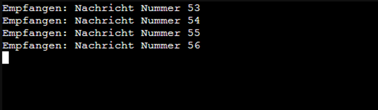

# 🧪 MQTT Clients mit Python auf zwei LXCs


## 💡 Einführung in das MQTT Publisher/Subscriber-Modell

MQTT ("Message Queuing Telemetry Transport") ist ein leichtgewichtiges, offenes Nachrichtenprotokoll, das speziell für **M2M (Machine-to-Machine)**-Kommunikation und das **IoT (Internet of Things)** entwickelt wurde. Anstatt auf einem direkten Dialog zwischen Sender und Empfänger zu basieren (wie z.B. bei HTTP), verwendet MQTT das sogenannte **Publisher/Subscriber-Modell**.

Dieses Modell trennt die sendenden und empfangenden Geräte vollständig voneinander. Ein zentraler Vermittler, der **Broker**, verwaltet und leitet alle Nachrichten weiter.

---

### Der Broker (Vermittler)

Der **Broker** ist das Herzstück eines jeden MQTT-Systems. Er nimmt die Nachrichten der Publisher entgegen, verwaltet alle angemeldeten Subscriber und leitet Nachrichten basierend auf den **Topics** an die korrekten Empfänger weiter.

### 1. Der Publisher (Sender)

Ein **Publisher** (Veröffentlicher) ist jedes Gerät oder jede Anwendung, die **Daten an den Broker sendet**.

* **Rolle:** Ein Publisher ist nur für das Senden von Nachrichten zuständig. Er muss **nicht wissen**, wie viele oder welche Geräte die Daten letztendlich empfangen werden.
* **Aktion:** Der Publisher sendet eine Nachricht an ein **spezifisches Topic** auf dem Broker (z.B. sendet ein Temperatursensor den Wert $20.5^\circ C$ an das Topic `sensor/keller/temperatur`).

### 2. Der Subscriber (Empfänger)

Ein **Subscriber** (Abonnent) ist jedes Gerät oder jede Anwendung, die **Daten vom Broker empfangen möchte**.

* **Rolle:** Ein Subscriber ist nur für den Empfang von Nachrichten zuständig. Er muss **nicht wissen**, wer die Daten ursprünglich gesendet hat.
* **Aktion:** Der Subscriber teilt dem Broker mit, an welchen **Topics** er interessiert ist (er **abonniert** diese Topics). Immer wenn der Broker eine neue Nachricht für dieses Topic erhält, leitet er sie an den Subscriber weiter.

---

### Topics – Die Kommunikationskanäle

**Topics** (Themen) sind einfache, hierarchische Zeichenketten, die als Kanäle zur Organisation der Nachrichten dienen (z.B. `haus/flur/licht`, `auto/motor/temperatur`).

* Der Publisher ordnet jede Nachricht einem Topic zu.
* Der Subscriber filtert Nachrichten, indem er nur die Topics abonniert, die er benötigt.

Dieses System bietet eine hohe Flexibilität und Skalierbarkeit: Wenn Sie ein neues Gerät hinzufügen (einen Publisher oder einen Subscriber), müssen Sie die anderen Geräte **nicht** neu konfigurieren – es muss sich lediglich beim Broker mit dem passenden Topic anmelden.

---

Wir beschreiben hier ein einfaches Beispiel in Python, um Publisher und Subscriber auf separaten LXCs darzustellen. Dazu verwenden wir den MQTT-Broker aus der letzten Übung zunächst in der "Anonymus"-Konfiguration.
Hierfür ändern sie die `/etc/mosquitto/mosquitto.conf` und setzen `allow_anonymous true`. Jetzt die Konfiguration laden - `systemctl reload mosquitto.service` (je nachdem mit welchen User sie angemeldet sind `sudo ` davor setzen).

Um in Python mit MQTT arbeiten zu können benötigen wir eine externe externe Bibliothek - (`paho-mqtt`) - die noch installiert werden muss.

---

## 🖥️ Systemvoraussetzungen

    Proxmox-Umgebung mit Ubuntu LXC-Container

    IPs:

        192.168.137.151 – Publisher

        192.168.137.152 – Subscriber

    Der MQTT-Broker (z. B. Mosquitto) muss erreichbar sein (z. B. 192.168.137.150, falls aus früherem Projekt)

## 📦 Einrichtung beider LXC-Container

Führen Sie in beiden Containern die folgenden Schritte durch:
**1. System aktualisieren und Python installieren**
```bash
sudo apt update && sudo apt upgrade -y
```


```bash
sudo apt install -y python3 python3-venv python3-pip
```


Python lässt das Ausführen externer Bibliotheken, die nicht zum Standard-Repository gehören, nicht direkt in der Laufzeitumgebung zu (Sicherheitsbedenken).
Daher wird eine virtuelle Umgebung (`venv`) als isoliertes Verzeichnis mit eigener Laufzeitumgebung benötigt.

**2. Python-Umgebung (venv) anlegen und aktivieren**

```bash
python3 -m venv mqttenv
source mqttenv/bin/activate
```


Ein Virtual Environment (venv) ist eine isolierte Kopie der Python-Laufzeitumgebung, die es  ermöglicht, abhängige Pakete (Libraries) für ein spezifisches Projekt zu installieren, ohne Konflikte mit anderen Projekten oder dem globalen Python-System zu verursachen.


**3. MQTT-Client-Bibliothek installieren**

Mqtt-Client-Bibliothek in `venv` installieren.

```bash
pip install paho-mqtt
```


## 🧾 Python-Programme

Beide Programme sollen auf dem gleichen MQTT-Broker arbeiten und das Thema `test/topic` verwenden.

**📤 Publisher (auf 192.168.137.151)**

Speichere z. B. als `publisher.py` in `mqttenv`(venv Verzeichnis):
```python
import time  # Zum Pausieren zwischen Nachrichten
import paho.mqtt.client as mqtt  # MQTT-Client von Paho importieren

broker_address = "192.168.137.150"  # IP-Adresse des Brokers
topic = "test/topic"  # MQTT-Thema (Topic), auf das veröffentlicht wird

# MQTT-Client erstellen, mit client_id und callback_api_version=2
client = mqtt.Client(mqtt.CallbackAPIVersion.VERSION2, client_id="publisher-client")

client.connect(broker_address)  # Mit dem Broker verbinden

try:
    counter = 1  # Nachrichten-Zähler starten
    while True:
        message = f"Nachricht Nummer {counter}"  # Nachricht zusammenbauen
        client.publish(topic, message)  # Nachricht auf dem Topic senden
        print(f"Gesendet: {message}")  # Ausgabe in der Konsole
        counter += 1  # Zähler erhöhen
        time.sleep(5)  # 5 Sekunden warten bis zur nächsten Nachricht
except KeyboardInterrupt:
    print("Publisher wurde beendet.")  # Programm per STRG+C gestoppt
finally:
    client.disconnect()  # Verbindung zum Broker trennen
```


**📥 Subscriber (auf 192.168.137.152)**

Speichere z. B. als `subscriber.py` in `mqttenv` (venv Verzeichnis):

```python
import paho.mqtt.client as mqtt  # Importiert die Paho MQTT-Bibliothek für die Kommunikation mit dem Broker

broker_address = "192.168.137.150"  # IP-Adresse des MQTT-Brokers, mit dem sich der Client verbinden soll
topic = "test/topic"  # Das MQTT-Topic, auf das Nachrichten empfangen werden sollen

# Callback-Funktion, die aufgerufen wird, wenn eine Nachricht empfangen wird
def on_message(client, userdata, message):
    # Gibt die empfangene Nachricht als Text auf der Konsole aus
    print(f"Empfangen: {message.payload.decode()}")

# Erstellt ein MQTT-Client-Objekt mit dem Namen "subscriber-client"
client = mqtt.Client(mqtt.CallbackAPIVersion.VERSION2, client_id="subscriber-client")
client.on_message = on_message  # Weist dem Client die oben definierte Callback-Funktion für empfangene Nachrichten zu

client.connect(broker_address)  # Verbindet den Client mit dem angegebenen Broker
client.subscribe(topic)  # Abonniert das definierte Topic – der Client erhält alle Nachrichten zu diesem Thema

try:
    client.loop_forever()  # Startet eine Endlosschleife, die auf eingehende Nachrichten wartet
except KeyboardInterrupt:  # Wenn das Programm durch STRG+C unterbrochen wird
    print("Subscriber wurde beendet.")  # Gibt eine Abschlussmeldung aus
finally:
    client.disconnect()  # Trennt die Verbindung zum MQTT-Broker sauber
```


## ▶️ Programme starten

Starten sie zuerst den Subscriber und danach den Publisher

In beiden Containern nach Aktivierung der venv:

```bash
source mqttenv/bin/activate
python3 subscriber.py  # auf 152
```



```bash
source mqttenv/bin/activate
python3 publisher.py   # auf 151
```


Die Programme können sie mit `Strg + c` beenden. 

## ✅ Test

Wenn der MQTT-Broker auf 192.168.137.150 läuft und erreichbar ist, sollte der Subscriber Nachrichten wie folgt empfangen:
```bash
Empfangen: Nachricht Nummer 1
Empfangen: Nachricht Nummer 2
```
Im MQTT-Explorer sieht es dann wie im nachfolgenden Bild aus.


Alle weiteren Funktionen lesen Sie in der Dokumentation von [Paho](https://eclipse.dev/paho/files/paho.mqtt.python/html/) nach.

---

## MQTT mit Username

Hierfür ändern sie die `/etc/mosquitto/mosquitto.conf` und setzen `allow_anonymous false`. Jetzt die Konfiguration laden - `systemctl reload mosquitto.service` (je nachdem mit welchen User sie angemeldet sind `sudo ` davor setzen).

Nun fügen sie in den Programmen `publisher.py` und `subscriber.py` dirket nach `client = mqtt.Client()` folgenden Eintrag hinzu:
Nutzen sie den User "Kai" aus der letzten Übung. 

```bash
client = mqtt.Client(mqtt.CallbackAPIVersion.VERSION2, client_id="...")
client.username_pw_set(username="Kai", password="1234")
```

Jetzt starten sie wieder zuerst den Subscriber und dann den Publisher. Wenn sie die Ergebnisse im "MQTT-Explorer" kontrollieren möchten müssen sie sich auch dort mit User und Passwort neu anmelden. 

Nun sind die Verbindungen zum Broker durch ein Passwort geschützt. 
Verrwenden sie auch noch ACL`s müssen auf die richtgen Topics achten. 

**VENV beenden** - das "Virtual Environment" (venv) beenden Sie mit dem Befehl `deactivate`. Solange das **VENV** nicht erneut durch `source mqttenv/bin/activate` aktiviert wird, können Python-Skripte die installierte Paho-MQTT-Bibliothek nicht nutzen.

## Quellen

„client module — Eclipse paho-mqtt documentation“. Zugegriffen 9. Juli 2025. https://eclipse.dev/paho/files/paho.mqtt.python/html/client.html.
Craggs, Ian. „Eclipse Paho | The Eclipse Foundation“. Zugegriffen 9. Juli 2025. https://eclipse.dev/paho/index.html?page=clients/python/index.php.
„Eclipse Paho™ MQTT Python Client — Eclipse paho-mqtt documentation“. Zugegriffen 9. Juli 2025. https://eclipse.dev/paho/files/paho.mqtt.python/html/.
"paho-mqtt 2.1.0"-Documentation, Zugegriffen 17.10.2025, https://pypi.org/project/paho-mqtt/
Nordquist, Thomas. „MQTT Explorer“. MQTT Explorer. Zugegriffen 8. Juli 2025. http://mqtt-explorer.com/.
„paho-mqtt: MQTT version 3.1.1 client class“. MacOS :: MacOS X, Microsoft :: Windows, POSIX, Python. Zugegriffen 9. Juli 2025. http://eclipse.org/paho.

---

### Lizenz
Dieses Werk ist lizenziert unter der **Creative Commons - Namensnennung - Weitergabe unter gleichen Bedingungen 4.0 International Lizenz**.
 
[Zum Lizenztext auf der Creative Commons Webseite](https://creativecommons.org/licenses/by-sa/4.0/legalcode.de)