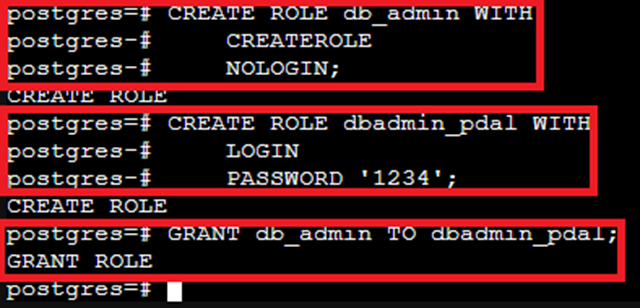
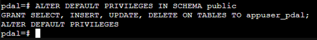
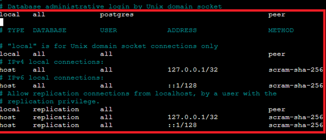
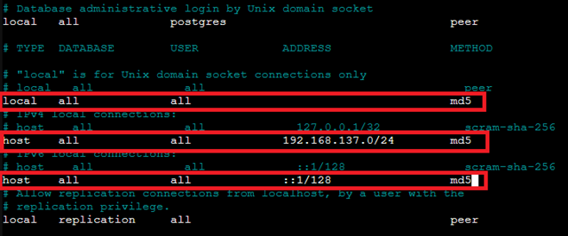
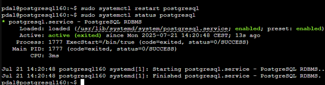

# 🐘 PostgreSQL auf LXC installieren, konfigurieren & absichern

PostgreSQL ist ein leistungsfähiges, objektrelationales Open-Source-Datenbanksystem mit Fokus auf Stabilität, Erweiterbarkeit und strikte SQL-Standardkonformität.

### Warum PostgreSQL und nicht MariaDB/MySQL?

Während Systeme wie MariaDB (oder MySQL) für einfache Webanwendungen (z. B. den LAMP-Stack) eine ausgezeichnete und schnelle Wahl sind, stellt das **PDAL-Projekt** höhere Anforderungen an die Datenintegrität, Flexibilität und erweiterte Analysefunktionen.

PostgreSQL wird oft als das technisch fortschrittlichere System angesehen und ist die bevorzugte Wahl für komplexe Datenanalyse- und kritische Unternehmensanwendungen.

| Feature | PostgreSQL | MariaDB/MySQL | Relevanz für PDAL |
| :--- | :--- | :--- | :--- |
| **Erweiterbarkeit** | **Überragend** (z.B. PostGIS, JSONB, TimescaleDB, FDWs) | Basisfunktionen (Plugins) | **ENTSCHEIDEND:** Ermöglicht komplexe Analysen (GIS, Zeitreihen, NoSQL-Daten). |
| **Datenintegrität** | **Sehr strikt** (volle ACID-Compliance, robuste MVCC) | Gut, aber weniger strikt in einigen Konfigurationen | **HOHE Priorität:** Stellt die Zuverlässigkeit der Analysedaten sicher. |
| **Moderne Datentypen** | Native Unterstützung für **JSONB** (indizierbar), Arrays, HStore. | JSON-Unterstützung ist weniger flexibel und indizierbar. | **WICHTIG:** Umgang mit semi-strukturierten Daten ohne externe NoSQL-DB. |
| **Lizenz** | Liberale BSD-Lizenz | GPL/Kommerzielle Lizenzen (gemischtes Modell) | **GARANTIE:** Langfristige Stabilität und 100% Open Source. |

**Fazit:** Die Entscheidung für PostgreSQL stellt sicher, dass das PDAL-Projekt eine **Datenplattform** nutzt, die nicht nur relationale Standardaufgaben bewältigt, sondern auch für die zukünftigen Anforderungen der Datenanalyse – einschließlich komplexer Geodaten, Zeitreihen und unstrukturierter Daten – bestens gerüstet ist.

Aber wie bei allen Entscheidungen: Es ist abhängig von den jeweigen Anforderungen.

## 🧾 Voraussetzungen

- LXC-Container mit Ubuntu 20.04, 22.04 oder 24.04

- Root- oder Sudo-Zugriff auf den Container

- Netzwerkzugriff (z. B. statische IP), in diesem Fall `192.168.137.160`

- Optional: TLS-Zertifikate oder CA-Setup für Verschlüsselung (siehe separate CA-Doku)
Bitte immer das aktuellste Release installieren, nach Möglichkeit immer aus der Paketverwaltung `apt` direkt.

## 🧩 1. Installation

```bash
sudo apt update
sudo apt install -y postgresql-16 postgresql-contrib
```


Nach der Installation wird der PostgreSQL-Dienst automatisch gestartet.

Mit der Option `postgresql-16` installieren wir die Version 16 von PostgreSQL. Die Standard-Version - `apt install -y postgresql ` - im Ubuntu-Respository kann abweichen. 
`postgresql-contrib` ist ein Paket, das zusätzliche Erweiterungen und Funktionen für PostgreSQL enthält, die nicht Teil der Kerninstallation sind, aber die Datenbank erweitert.

Zum testen der Version `psql --version` eingeben.

## 👤 2. PostgreSQL-Benutzer & -Zugriff

Der Standard-User bei der Erstinstallation ist `postgres`.

Zugriff auf die PostgreSQL-Konsole:

```bash
sudo -u postgres psql
```


## 2. PostgreSQL Benutzerrollen – Strukturierte Zuweisung von Rechten

Für eine saubere Trennung von Verantwortlichkeiten und erhöhte Sicherheit im PostgreSQL-Datenbanksystem werden drei verschiedene Benutzerrollen eingerichtet:
Diese Rollen können einzelnen Usern zugewiesen werden.

---
**1. Datenbank-Systemadministrator (z.B.`pdal`)**

Dieser Benutzer besitzt **vollständige Superuser-Rechte** für das gesamte PostgreSQL-System. Er darf:

- Datenbanken systemweit anlegen und löschen  
- Benutzer und Rollen verwalten  
- Systemkonfiguration ändern  
- Auf alle Datenbanken und deren Inhalte zugreifen

**Grund:**  
Zentrale und übergeordnete Verwaltung des gesamten DBMS – vergleichbar mit einem root-Nutzer im Betriebssystem.

---

**2. Datenbankadministrator je Datenbank (z. B. `dbadmin_<dbname>`, `dbadmin_<dbname>`)**

Dieser Benutzer hat **vollständige Rechte innerhalb einer bestimmten Datenbank**. Er darf:

- Benutzer für seine Datenbank anlegen und verwalten  
- Backups der Datenbank erstellen  
- Tabellen, Views, Prozeduren und Trigger erstellen, ändern und löschen  
- Daten in der Datenbank bearbeiten

**Grund:**  
Verantwortung liegt bei der jeweiligen Fachabteilung, ohne Zugriff auf systemweite Ressourcen oder andere Datenbanken.

---

**3. Anwendungs- bzw. Standardnutzer (z. B. `appuser_<dbname>`, `appuser_<dbname>`)**

Dieser Benutzer darf **nur mit den Daten innerhalb der ihm zugewiesenen Datenbank arbeiten**. Er hat folgende Rechte:

- `SELECT`: Daten lesen  
- `INSERT`: Neue Daten einfügen  
- `UPDATE`: Bestehende Daten ändern  
- `DELETE`: Daten löschen

**Grund:**  
Minimale Rechte für Anwendungen oder Endnutzer, um Daten zu bearbeiten, ohne administrative Funktionen auszuführen. Dies erhöht die Sicherheit und verhindert unbeabsichtigte Strukturänderungen.

---

### Vorteile dieser Struktur

- Klare Trennung zwischen Systemadministration, fachlicher Datenbankpflege und einfacher Datenverwendung  
- Sicherheitsprinzipien wie „Least Privilege“ werden eingehalten  
- Rollen lassen sich klar zuordnen und dokumentieren  
- Gute Skalierbarkeit und Nachvollziehbarkeit in Multi-User-Umgebungen

- Rechte zentral über Rollen verwalten und an Benutzer vergeben

- Vermeidung unnötiger Superuser-Rechte für Datenbank-Admins

### PostgreSQL: Rollenbasierte Benutzerverwaltung mit Benutzer-/Rollen-Trennung

Es werden Benutzer und Rollen **sauber getrennt**. Es werden drei funktionale Rollen erstellt und anschließend einzelnen Benutzern zugewiesen:

---

### PostgreSQL Benutzer- und Rollenverwaltung mit differenzierten Rechten

- **db_system_admin**: Systemweiter PostgreSQL-Superuser (Rolle ohne Login)
- **db_admin**: Datenbank-Administrator für eine einzelne Datenbank, mit Recht zur Benutzerverwaltung und Objektverwaltung, aber **ohne** Datenbankerstellung
- **standard_user**: Normaler Datenbanknutzer mit Lese- und Schreibrechten auf Daten

---

### 1. Rolle und Benutzer für Systemadministrator

```sql
CREATE ROLE db_system_admin WITH
    SUPERUSER
    CREATEROLE
    CREATEDB
    NOLOGIN;

CREATE ROLE pdal WITH
    LOGIN
    PASSWORD 'JadeHS20';

GRANT db_system_admin TO pdal;
```


### 2. Rolle und Benutzer für Datenbank-Administrator (für Datenbank pdal)

```sql
CREATE ROLE db_admin WITH
    CREATEROLE
    NOLOGIN;

CREATE ROLE dbadmin_pdal WITH
    LOGIN
    PASSWORD '1234';

GRANT db_admin TO dbadmin_pdal;
```



**Datenbank anlegen und Rechte vergeben (als Systemadministrator)**

```sql
CREATE DATABASE pdal OWNER dbadmin_pdal;

GRANT ALL PRIVILEGES ON DATABASE pdal TO dbadmin_pdal;
```


**Innerhalb der Datenbank pdal (Rechte für Objektverwaltung)**

```sql
\c pdal
```

### 3. Standardrechte für neue Tabellen, Funktionen, Sequenzen

```sql
ALTER DEFAULT PRIVILEGES IN SCHEMA public
GRANT ALL ON TABLES TO dbadmin_pdal;

ALTER DEFAULT PRIVILEGES IN SCHEMA public
GRANT ALL ON SEQUENCES TO dbadmin_pdal;

ALTER DEFAULT PRIVILEGES IN SCHEMA public
GRANT ALL ON FUNCTIONS TO dbadmin_pdal;
```


**Hinweis:**
    Das CREATEROLE Recht erlaubt dem Benutzer dbadmin_pdal, weitere Rollen (Benutzer) anzulegen und zu verwalten, jedoch keine Datenbanken.

### 4. Rolle und Benutzer für Standardnutzer mit Datenzugriff

```sql
CREATE ROLE standard_user WITH NOLOGIN;

CREATE ROLE appuser_pdal WITH
    LOGIN
    PASSWORD 'user_passwort';

GRANT standard_user TO appuser_pdal;

GRANT CONNECT ON DATABASE pdal TO appuser_pdal;
```


**Rechte für Datenzugriff in Datenbank `pdal`**

```sql
\c pdal
```

**-- Beispielhafte Tabelle:**

```sql
CREATE TABLE beispiel (
    id SERIAL PRIMARY KEY,
    name TEXT,
    wert INTEGER
);
```


**-- Datenrechte vergeben**

```sql
GRANT SELECT, INSERT, UPDATE, DELETE ON beispiel TO appuser_pdal;
```


**-- Standardrechte für neue Tabellen**

```sql
ALTER DEFAULT PRIVILEGES IN SCHEMA public
GRANT SELECT, INSERT, UPDATE, DELETE ON TABLES TO appuser_pdal;
```



**✅ Zusammenfassung**

| Benutzer       | Zugewiesene Rolle  | Beschreibung                                   |
|----------------|--------------------|-----------------------------------------------|
| pdal           | db_system_admin    | Voller Systemzugriff (Superuser)              |
| dbadmin_pdal   | db_admin           | Benutzer- und Objektverwaltung in DB pdal, keine DB-Erstellung |
| appuser_pdal   | standard_user      | Daten lesen, schreiben, löschen in DB pdal   |

## 📦 3. nützliche PostgreSQL-Befehle

-- Benutzer anzeigen

```sql
\du
```

-- Datenbanken anzeigen

```sql
\l
```

-- Tabellen anzeigen

```sql
\dt
```

-- Verbindung beenden

```sql
\q
```

## 🔐 4. Passwortauthentifizierung aktivieren

Öffne:

```bash
sudo nano /etc/postgresql/*/main/pg_hba.conf
```
Das `*` in dem Befehl steht für die Versionsnummer; in diesem Fall für die `16`. 


Ändere am Ende:

```bash
# alter Eintrag local   all             all                                     peer
local   all             all                                     md5

# alter Eintrag host    all             all             127.0.0.1/32            scram-sha-256
host    all             all             192.168.137.0/24            md5

# alter Eintrag host    all             all             ::1/128                 scram-sha-256
host    all             all             ::1/128                 md5
```



Alternativ kann man auch scram-sha-256 verwenden, aber dann muss das Passwort entsprechend gespeichert werden.

## 🌐 5. Netzwerkzugriff aktivieren

Öffne:

```bash
sudo nano /etc/postgresql/*/main/postgresql.conf
```

Ändere oder ergänze:

```bash
listen_addresses = '*'
```


## 🔁 6. Dienst neu starten

```bash
sudo systemctl restart postgresql
sudo systemctl status postgresql
```



## 🔐 6. TLS-Verschlüsselung (optional)

**📄 Zertifikate vorbereiten:**

Platzieren von:

>CA-Zertifikat: /etc/ssl/certs/ca.cert.pem
>
>Server-Zertifikat: /etc/ssl/certs/server.cert.pem
>
>Private Key: /etc/ssl/private/server.key.pem

Weitere Infos: [[0650 CA-sslmitSANZertifikat]]
In dieser Dokumentation ist es anhand des Beispiels Apache2 Server genau beschrieben, gleiche Vorgehensweise auch bei `PostgreSQL`.

---


**🔧 Konfiguration anpassen**

```bash
sudo nano /etc/postgresql/*/main/postgresql.conf
```


Ergänzen oder aktivieren:

```bash
ssl = on
ssl_ca_file = '/etc/ssl/certs/ca.cert.pem'
ssl_cert_file = '/etc/ssl/certs/server.cert.pem'
ssl_key_file  = '/etc/ssl/private/server.key.pem'
```

```bash
sudo chown postgres:postgres /etc/ssl/private/server.key.pem
sudo chmod 600 /etc/ssl/private/server.key.pem
```

**🚀 Neustarten:**

```bash
sudo systemctl restart postgresql
```

## 🔐 7. Authentifizierung mit Zertifikaten (Client-CA)(optional)

Auf dem Server eigene CA einrichten.
siehe: [[0650 CA-sslmitSANZertifikat]]

Signierte Client-Zertifikate verteilen

In pg_hba.conf ergänzen:

```bash
hostssl all all 192.168.137.0/24 cert clientcert=verify-full
```

**PostgreSQL-Dienst neustarten:**

## 🧪 8. Verbindung testen (lokal & remote)

```sql
psql -h localhost -U appuser_pdal -d pdal
```

Remote (z. B. über Workstation):

```sql
psql -h 192.168.137.160 -U appuser_pdal -d pdal
```

Falls nötig, installiere:

```bash
sudo apt install postgresql-client-16
```

## 🔄 10. Automatischer Start (systemd)

Bereits aktiviert nach Installation:

```bash
sudo systemctl enable postgresql
```

Manuell neu starten:

```bash
sudo systemctl restart postgresql
```

## 🧯 11. Sicherheitsmaßnahmen

- *Starke Passwörter verwenden oder Public-Key-Auth*

- *Firewall aktivieren, z. B. mit ufw:*

```bash
sudo ufw allow from 192.168.137.0/24 to any port 5432 proto tcp
```

Mit `192.168.137.0/24` wird dem gesammten Netzwerk erlaubt auf die Datenbank zu zugreifen.
Alternativ kann auch jeweils eine konkrete IP-Adresse frei gegeben werden.

- *Keine externen Verbindungen zulassen, außer explizit notwendig*

- *Zertifikatsbasierte Authentifizierung nutzen (siehe oben)*

- *Datenbank-Backups regelmäßig automatisieren mit pg_dump*

## 📚 Quellen

- „PostgreSQL 16.x Documentation“, PostgreSQL Documentation. Zugegriffen: 22. Juli 2025. [Online]. Verfügbar unter: [PostgreSQL Doc](https://www.postgresql.org/docs/16/index.html)
- „18.9. Secure TCP/IP Connections with SSL“, PostgreSQL Documentation. Zugegriffen: 22. Juli 2025. [Online]. Verfügbar unter: [PostgreSQL SSL](https://www.postgresql.org/docs/16/ssl-tcp.html)

---


### Lizenz
Dieses Werk ist lizenziert unter der **Creative Commons - Namensnennung - Weitergabe unter gleichen Bedingungen 4.0 International Lizenz**.
 
[Zum Lizenztext auf der Creative Commons Webseite](https://creativecommons.org/licenses/by-sa/4.0/legalcode.de)