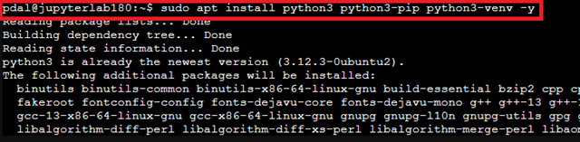
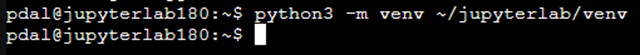
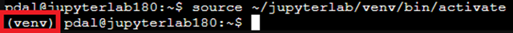
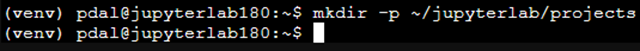
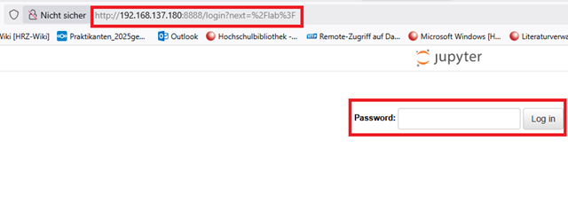
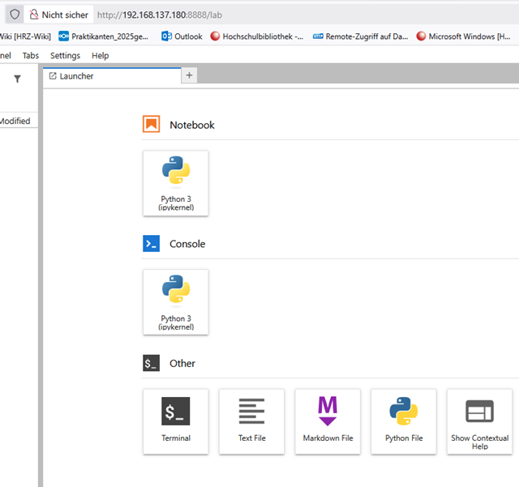
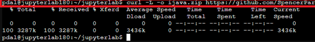
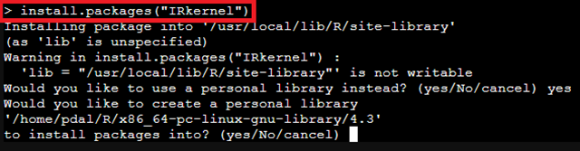
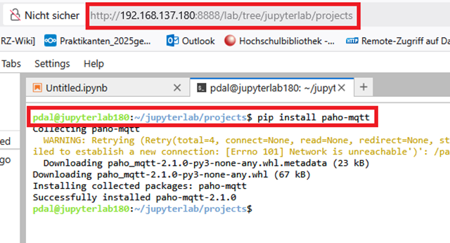

# 📘 JupyterLab im LXC-Container installieren & konfigurieren

(mit Python, R, Java, systemd-Dienst)

## 🔎 Einleitung

JupyterLab ist eine moderne, interaktive Weboberfläche für Programmierung, Datenanalyse und wissenschaftliches Rechnen. Als Nachfolger der klassischen Jupyter Notebooks bietet es Unterstützung für viele Sprachen wie Python, R oder Java sowie zahlreiche Visualisierungs- und Erweiterungsmöglichkeiten.

Diese Anleitung zeigt die Installation und Konfiguration von JupyterLab in einem Ubuntu-basierten LXC-Container, mit:

- Python (in venv)
- R-Kernel (IRkernel)
- Java-Kernel (IJava)
- systemd-Dienstbetrieb
- Passwortschutz
- SSL-Konfiguration (verlinkt)

## 📋 Voraussetzungen

| **Komponente**               | **Voraussetzung**                            |
|-----------------------------|----------------------------------------------|
| System                      | LXC-Container mit Ubuntu 22.04 / 24.04       |
| IP-Adresse des Containers   | z. B. `192.168.137.180`                       |
| Benutzer mit sudo-Rechten   | z. B. `pdal`                                  |
| Internetverbindung          | Ja                                           |

## 🧱 1. System aktualisieren

```bash
sudo apt update && sudo apt upgrade -y
```

**🔍** Dies stellt sicher, dass alle Paketquellen aktuell sind und die neuesten Sicherheitsupdates installiert werden. Dies ist eine wichtige Grundregel bei jeder Linux-Installation.
**📌 Ziel**: Das System ist auf dem neuesten Stand – besonders wichtig, bevor neue Software installiert wird.

## 🐍 2. Python + Pip + venv installieren

```bash
sudo apt install python3 python3-pip python3-venv -y
```



🔍 Dies installiert den Python-Interpreter (python3) sowie `pip`, den Paketmanager für Python. Beides wird benötigt, um später JupyterLab und zusätzliche Pakete zu installieren. Das dritte Paket installiert die virtuelle Umgebung für Python.
`apt` sorgt dafür, dass alle nötigen Abhängigkeiten aus den offiziellen Ubuntu-Repositories automatisch mit installiert werden.
(Venv) steht für virtuelles Environment und wird von Python und Jupyterlab benötigt.

## 📦 3. JupyterLab in virtueller Umgebung installieren

**🛡️ Warum eine virtuelle Umgebung verwenden?**
Die Installation von JupyterLab innerhalb einer `venv` stellt sicher, dass alle Python-Pakete unabhängig vom System verwaltet werden.
Dies verhindert Versionskonflikte, schützt die Systemumgebung und ermöglicht die einfache Reproduzierbarkeit und Portabilität der Installation – besonders wichtig in Containern und bei mehreren parallelen Python-Projekten.

Virtuelle Umgebungen verhindern Konflikte zwischen globalen und projektspezifischen Python-Paketen und sind Best Practice bei modernen Python-Projekten.

### 🔹 3.1 Virtuelle Umgebung erstellen

```bash
python3 -m venv ~/jupyterlab/venv
```



🔍 Erstellt eine neue virtuelle Umgebung im Verzeichnis `~/jupyterlab/venv`.
Diese Umgebung enthält einen eigenen Python-Interpreter sowie eine eigene pip-Installation.

**📁 Verzeichnisstruktur:**

`~/jupyterlab/venv/`
├── bin/          ← enthält python, pip, jupyterlab usw.
├── lib/          ← Python-Bibliotheken (site-packages)
└── pyvenv.cfg    ← Konfigurationsdatei

### 🔹 3.2 Virtuelle Umgebung aktivieren

```bash
source ~/jupyterlab/venv/bin/activate
```



🔍 Aktiviert die virtuelle Umgebung:

- Die Shell verwendet ab jetzt `python` und `pip` aus der Umgebung, nicht mehr die systemweiten Versionen.

- Der Terminal-Prompt zeigt typischerweise (venv) zur Kennzeichnung.

- Alle nachfolgenden Installationen gelten nur innerhalb dieser Umgebung.

### 🔹 3.3 pip in der virtuellen Umgebung aktualisieren

```bash
pip install --upgrade pip
```


🔍 Aktualisiert den Paketmanager pip innerhalb der virtuellen Umgebung.
Dies stellt sicher, dass aktuelle Funktionen und Kompatibilität gewährleistet sind.

### 🔹 3.4 JupyterLab installieren

```bash
pip install jupyterlab
```

🔍 Installiert JupyterLab sowie alle dazugehörigen Abhängigkeiten (z. B. notebook, traitlets, tornado) in die virtuelle Umgebung.

🔗 Nach der Installation ist JupyterLab über folgenden Pfad aufrufbar:

```bash
~/jupyterlab/venv/bin/jupyter-lab
```
JupyterLab kann mit `Ctrl + c` beendet werden; dann mit ja bestätigen. 
Die virtuelle Umgebung kann mit `deactivate` beendet werden.


## ✅ Ergebnis

- Eine vollständig isolierte, aktuelle und sichere JupyterLab-Installation – unabhängig von der System-Python-Umgebung.
- Geeignet für Server, Container und Umgebungen mit aktivem PEP 668, das globale Python-Installationen schützt.

---

## 📂 4. Arbeitsverzeichnis für Notebooks anlegen

### 🔹 4.1 Verzeichnis erstellen

```bash
mkdir -p ~/jupyterlab/projects
```



🔍 Erstellt das Verzeichnis `projects` im Ordner `~/jupyterlab`.
Die Option `-p` stellt sicher, dass auch der übergeordnete Ordner (jupyterlab) angelegt wird, falls er noch nicht existiert.

>Hinweis: Wechseln sie auf der Web-Oberfläche in das Verzeichnis `/jupyterlab/projects` um ihre Projekte dort zu speichern.

**✅ Ergebnis**

Ein sauber strukturierter Ort für eigene Notebook-Dateien, getrennt von der Python-Umgebung (venv).
Dies erleichtert Organisation, Backup und spätere Erweiterungen.

## 🔐 5. Passwortschutz aktivieren

### 🔹 5.1 Virtuelle Umgebung aktivieren

```bash
source ~/jupyterlab/venv/bin/activate
```

🔍 Aktiviert die zuvor eingerichtete virtuelle Umgebung.
Alle folgenden Jupyter-Befehle werden damit innerhalb der isolierten Umgebung ausgeführt. falls man sich noch nicht in der `venv` befindet.

### 🔹 5.2 Passwort für JupyterLab setzen

```bash
jupyter-lab password
```


🔍 Startet den interaktiven Dialog zur Vergabe eines Passworts für den Webzugang zu JupyterLab.
Das eingegebene Passwort wird gehasht und in der Datei:

```bash
~/.jupyter/jupyter_server_config.json
```
gespeichert.
Dieser Hash wird beim Start des Servers zur Authentifizierung verwendet.

>Hinweis: Ein Ordner mit vorangestelltem Punkt (`.jupyter`) ist mit dem `dir`-Befehl nicht sichtbar. Hier müsste man `ls -a -l` verwenden. 

**✅ Ergebnis**

Beim Öffnen von JupyterLab im Browser wird nun ein Login mit Benutzerpasswort verlangt.
Dies schützt den Server vor unberechtigtem Zugriff – insbesondere in Netzwerken ohne SSL.

Optional kann in einem späteren Schritt HTTPS aktiviert werden (siehe Punkt 10).
Für produktive Umgebungen ist die Kombination aus Passwort und TLS empfohlen.

## 🚀 6. JupyterLab starten (manuell)

### 🔹 6.1 JupyterLab manuell starten

```bash
~/jupyterlab/venv/bin/jupyter-lab --ip=0.0.0.0 --port=8888 --no-browser
```


🔍 Startet den JupyterLab-Server in der zuvor erstellten virtuellen Umgebung:

- --ip=0.0.0.0: JupyterLab lauscht auf allen Netzwerkadressen des Containers.
- --port=8888: Der Dienst wird auf Port 8888 bereitgestellt.
- --no-browser: Verhindert, dass ein lokaler Browser geöffnet wird (nützlich auf Servern oder Headless-Systemen).
- mit `strg` +`c` beendet man den Server wieder. Dies muss allerdings mit `y` innerhalb von 5 Sekunden bestätigt werden.

### 🔹 6.2 Webzugriff

📡 Der Zugriff auf JupyterLab erfolgt über einen Webbrowser auf ihrem Client-PC, z. B.:

```text
http://192.168.137.180:8888
```
>Hinweis: Achten sie darauf `http://<ihre-ip-adresse>:8888/lab` zu verwenden - `https://` funktioniert noch nicht.

🔐 Wenn ein Passwort gesetzt wurde (siehe Punkt 5), erscheint zunächst eine Anmeldemaske.




**✅ Ergebnis**

JupyterLab ist nun aktiv und über das Netzwerk erreichbar.
Die Session bleibt aktiv, solange der Terminalprozess läuft (z. B. via tmux, screen oder Hintergrundprozess).

Bei Bedarf kann im nächsten Schritt eine systemweite oder benutzerspezifische Service-Datei für automatischen Start hinterlegt werden.

## ⚙️ 7. systemd-Dienst erstellen

**🎯 Ziel:** JupyterLab automatisch beim Systemstart als Hintergrunddienst ausführen – ohne manuelles Starten im Terminal.

### 🔹 7.1 Dienstdatei anlegen

```bash
sudo nano /etc/systemd/system/jupyterlab.service
```

🔍 Öffnet einen neuen systemweiten Dienst unter `/etc/systemd/system/`.
Dieser Dienst wird von `systemd` verwaltet und kann automatisch gestartet und überwacht werden.

### 🔹 7.2 Inhalt der Dienstdefinition

```bash
[Unit]
Description=JupyterLab (via systemd)
After=network.target

[Service]
Type=simple
User=pdal
Group=pdal
WorkingDirectory=/home/pdal
Environment="PATH=/home/pdal/jupyterlab/venv/bin:/usr/bin:/bin"
ExecStart=/home/pdal/jupyterlab/venv/bin/jupyter-lab --ip=0.0.0.0 --port=8888 --no-browser
Restart=on-failure

[Install]
WantedBy=multi-user.target
```


🔍 Erklärung der wichtigsten Parameter:

- **User / Group**: Führt den Dienst unter dem Benutzer pdal aus (sicherheitsrelevant).

- **WorkingDirectory**: Startverzeichnis für den Dienst.

- **Environment**: Wichtig: Diese Zeile setzt die PATH-Variable, sodass alle Tools aus der `venv` benutzt werden (z. B. `python`, `pip`, `jupyter-lab`). Ohne das wird ggf. das systemweite Python benutzt.
- **ExecStart**: Startet JupyterLab aus der virtuellen Umgebung.

- **Restart=on-failure**: Automatischer Neustart bei Fehlern oder Abstürzen.

- **WantedBy=multi-user.target**: Aktiviert den Dienst für den regulären Mehrbenutzermodus.

### 🔹 7.3 Dienst aktivieren und starten

```bash
sudo systemctl daemon-reload
sudo systemctl enable jupyterlab
sudo systemctl start jupyterlab
```


🔍

- **daemon-reload**: Läd neue oder geänderte Dienstdateien neu ein.
- **enable**: Aktiviert den automatischen Start beim Booten.
- **start**: Startet den Dienst sofort.

✅ **Ergebnis**

JupyterLab wird nun beim Systemstart automatisch im Hintergrund gestartet und ist über das Netzwerk erreichbar.
Status- und Fehlermeldungen können jederzeit mit folgendem Befehl geprüft werden:

```bash
journalctl -u jupyterlab -f
```

## ☕ 8. Java installieren & Kernel (nur für JupyterLab + Nutzer) einrichten

**🎯 Ziel**: Java-Laufzeitumgebung bereitstellen und den Java-Kernel (IJava) für den Benutzer in JupyterLab verfügbar machen.

### 🔹 8.1 Java JDK installieren

Sollte die `venv` noch aktiv sein, so sollten sie zunächst mit dem Befehl `deactivate` beendet werden.

```bash
deactivate
```


Die Deaktivierung dient der Klarheit, da der folgende Befehl (`sudo apt install ...`) eine systemweite Installation ist, die außerhalb des venv-Kontexts liegt.

```bash
sudo apt install openjdk-21-jdk -y
```


🔍

- Installiert das Java Development Kit (JDK) Version 21, das für Java-Anwendungen und die Ausführung des Java-Kernels benötigt wird.
- Das Paket enthält Compiler, Laufzeitumgebung und weitere Werkzeuge.

### 🔹 8.2 IJava-Kernel installieren (nur für den aktuellen Benutzer)

Es muss unter Umständen noch das Paket `curl` und `unzip` nach installiert werden.

```bash
sudo apt install curl -y
sudo apt install unzip -y
```

```bash
cd ~/jupyterlab
curl -L -o ijava.zip https://github.com/SpencerPark/IJava/releases/download/v1.3.0/ijava-1.3.0.zip
```



```bash
unzip ijava.zip -d ijava-installer
```


```bash
cd ijava-installer
~/jupyterlab/venv/bin/python3 install.py --user
```


🔍
- Lädt die offizielle IJava-Kernel-Version 1.3.0 herunter und entpackt sie.
- Führt das Installationsskript mit dem Python aus der virtuellen JupyterLab-Umgebung aus.
- Die Option `--user` installiert den Kernel nur für den aktuellen Benutzer, ohne Systemänderungen.
- Der Kernel ist danach nur in der JupyterLab-Instanz innerhalb der `venv` für diesen Benutzer sichtbar und nutzbar.

Danach können die zip-Datei und der ijava-installer gelöscht werden; `rm -r ijava.zip` und `rm -r ijava-installer/`.

✅ **Ergebnis**

Der Java-Kernel steht im JupyterLab nur für den betreffenden Benutzer zur Verfügung und kann in Notebooks zur Ausführung von Java-Code verwendet werden.
Es erfolgt keine systemweite Installation oder Änderung.

## 📊 9. (Optional) R installieren & IRkernel einrichten (nur für Nutzer & JupyterLab)

R ist eine Programmiersprache, die hauptsächlich für statistische Analysen, Datenbereinigung, Datenimport und Datenvisualisierung verwendet wird. Sie ist ein mächtiges Werkzeug für Data Scientists und Wissenschaftler. 

**🎯 Ziel:** R-Programmiersprache und den IRkernel nur für den Benutzer in JupyterLab verfügbar machen.

>Hinweis: Machen Sie das, wenn sie die Sprache **R** benötigen. 

### 🔹 9.1 R installieren

```bash
sudo apt install r-base -y
```


🔍

- Installiert die Basis-R-Laufzeitumgebung.
- Ermöglicht die Ausführung von R-Skripten und -Paketen.

### 🔹 9.2 IRkernel installieren (nur für den aktuellen Benutzer und nur für die venv)

```bash
source ~/jupyterlab/venv/bin/activate
```

```bash
R
```


In der R-Konsole:

```bash
install.packages("IRkernel")
```
Antworte mit `yes`.



```bash
IRkernel::installspec(user = TRUE)
```


```bash
q()
```


🔍

- Installiert das IRkernel-Paket, das Jupyter die Ausführung von R-Notebooks ermöglicht.

- Die Funktion installspec(user = TRUE) registriert den Kernel nur für den aktuellen Benutzer.

- Nach Verlassen der R-Konsole (q()) steht der Kernel in JupyterLab nur für den Nutzer bereit.

✅ **Ergebnis**

Der R-Kernel ist ausschließlich für den jeweiligen Benutzer in JupyterLab verfügbar. Dies eignet sich besonders für LXC-Container oder Single-User-Umgebungen ohne systemweite Kernel-Installation.

**📌 Abfrage installierter JupyterLab-Kernel**

Um alle in JupyterLab verfügbaren Kernel (z. B. `Python`, `R`, `Java`) anzuzeigen, verwendet man  folgenden Terminal-Befehl in der `venv`:

```bash
jupyter kernelspec list
```


Dieser Befehl listet alle installierten Kernel auf und zeigt deren Namen sowie die zugehörigen Pfadverzeichnisse an.

**Beispielausgabe:**

Available kernels:

| Kernelname | Pfad                                                                 |
|------------|----------------------------------------------------------------------|
| python3    | `/home/pdal/jupyterlab/venv/share/jupyter/kernels/python3`            |
| ir         | `/home/pdal/.local/share/jupyter/kernels/ir`                          |
| java       | `/home/pdal/.local/share/jupyter/kernels/java`                        |

Erläuterung:

| Kernelname | Beschreibung                                     |
|------------|--------------------------------------------------|
| python3    | Python-Kernel (z. B. aus einer virtuellen Umgebung) |
| ir         | R-Kernel (bereitgestellt durch IRkernel)         |
| java       | Java-Kernel (bereitgestellt durch IJava)         |

Alle aufgelisteten Kernel stehen dir im JupyterLab-Launcher sowie beim Kernel-Wechsel innerhalb von Notebooks zur Auswahl.

## 📦 10 Zusätzliche Python-Bibliotheken für JupyterLab installieren (Beispiel: paho-mqtt)

Zusätzliche Bibliotheken müssen innerhalb der Jupyterlab-Instanz installiert werden.

```bash
source ~/jupyterlab/venv/bin/activate
pip install paho-mqtt
```


🔍

- Aktiviert zuerst die virtuelle Umgebung von JupyterLab.
- Installiert mit pip die Python-Bibliothek paho-mqtt.
- paho-mqtt ist ein Beispiel für eine MQTT-Client-Bibliothek, die in Jupyter-Notebooks verwendet werden kann.
- Weitere Bibliotheken können analog innerhalb der virtuellen Umgebung installiert werden, um Konflikte mit Systempaketen zu vermeiden.

**💡 Alternative: Installation über JupyterLab-Oberfläche**
**Option 1:** Terminal in JupyterLab öffnen

```text
Menü → File → New → Terminal
```

Dann dort:

```bash
pip install <paketname>
```



**Option 2:** Direkt im Notebook installieren

Im Codefeld einer Notebook-Zelle:

```python
!pip install paho-mqtt
```

**Hinweis:**
Diese Methode funktioniert nur innerhalb der aktiven Kernel-Umgebung (z. B. Python venv) und setzt voraus, dass der Kernel korrekt initialisiert wurde.
✅ **Ergebnis**
Installierte Pakete stehen direkt im Notebook zur Verfügung – ideal für dynamisches Arbeiten mit z. B. matplotlib, pandas, numpy, paho-mqtt usw.

## 🔐 10. (Optional) SSL-Verschlüsselung

JupyterLab kann mit TLS/SSL abgesichert betrieben werden.

SSL-Konfiguration siehe offizielle Dokumentation:

[HTTPS in Jupyter aktivieren](https://tljh.jupyter.org/en/latest/howto/admin/https.html)

Für die Integration eigener Zertifikate (z. B. aus einer lokalen CA):

**Siehe separate Anleitung:** 
[0650CA-sslmitSANZertifikat.md]

**📌 Zusammenfassung**

| **Komponente**     | **Status / Wert**                                   |
|--------------------|-----------------------------------------------------|
| Python-Version     | 3.x                                                 |
| JupyterLab         | Aktuell via venv + pip                             |
| Java               | OpenJDK 21, IJava (nur für Nutzer)                  |
| R                  | r-base, IRkernel (nur für Nutzer)                   |
| Startport          | `http://<IP>:8888`                                    |
| Dienstbetrieb      | ✅ via systemd                                       |
| SSL                | optional, siehe externe Anleitung                   |
| Passwortschutz     | ✅ (via `jupyter-lab password`)                      |
| Systemuser         | z. B. `pdal`                                        |

## 📚 Hinweise zu Erweiterungen, Updates & Backup

- Erweiterungen (z. B. jupyterlab-git, jupyterlab-lsp) sind optional und können über den Extension Manager oder pip installiert werden.

- Updates:

```bash
pip list --outdated
pip install --upgrade <paketname>
```

Backups:
Einfach per rsync, z. B.:

```bash
rsync -a ~/jupyterlab/projects /mnt/backup/jupyterlab/
```

## 📚 Quellen

- „Documentation · IRkernel“. Zugegriffen: 28. Juli 2025. [Online]. Verfügbar unter: [IKernel](https://irkernel.github.io/docs/)
- „Get Started — JupyterLab 4.5.0a1 documentation“. Zugegriffen: 28. Juli 2025. [Online]. Verfügbar unter: [Jupyterlab getting_started](https://jupyterlab.readthedocs.io/en/latest/getting_started/overview.html)
- „Installation — JupyterLab 4.5.0a1 documentation“. Zugegriffen: 28. Juli 2025. [Online]. Verfügbar unter: [Jupyterlab Installation](https://jupyterlab.readthedocs.io/en/latest/getting_started/installation.html)
- S. Park, SpencerPark/IJava. (27. Juli 2025). Java. Zugegriffen: 28. Juli 2025. [Online]. Verfügbar unter: [Github IJava](https://github.com/SpencerPark/IJava)

--- 

## Lizenz

Dieses Werk ist lizenziert unter der **Creative Commons Namensnennung - Nicht-kommerziell - Weitergabe unter gleichen Bedingungen 4.0 International Lizenz**.

[Zum Lizenztext auf der Creative Commons Webseite](https://creativecommons.org/licenses/by-nc-sa/4.0/deed.de)

