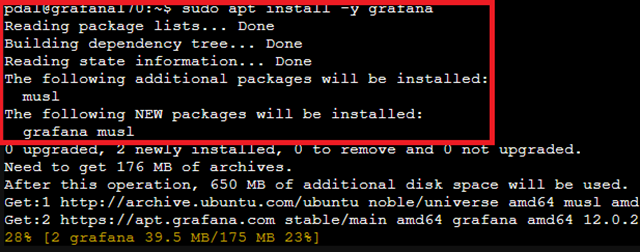
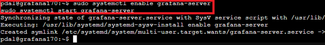
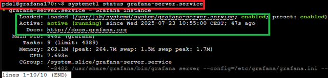
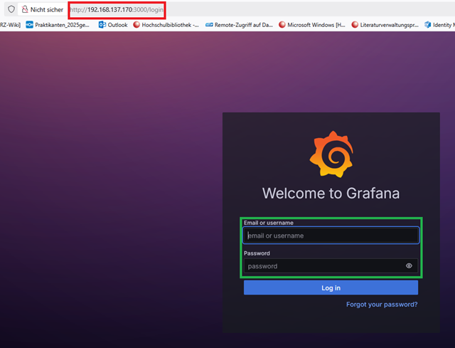
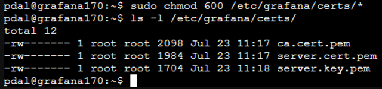

# Grafana in einem LXC-Container installieren und mit TLS über eine interne CA absichern

## Ziel

Diese Anleitung beschreibt die vollständige Installation und Konfiguration von Grafana in einem bestehenden LXC-Container unter Ubuntu. Zusätzlich wird die Absicherung der Weboberfläche mit einem SAN-Zertifikat einer internen CA behandelt.

---

## 1. Hintergrund: Was ist Grafana?

Grafana ist eine webbasierte Open-Source-Plattform zur Visualisierung von Daten (auch Zeitreihen). Sie unterstützt zahlreiche Datenquellen wie Prometheus, InfluxDB, PostgreSQL, Elasticsearch oder MQTT. Grafana ermöglicht die Erstellung interaktiver Dashboards mit verschiedenen Diagrammtypen sowie die Verwaltung von Benutzern und Alarmierungsregeln.

---

## 2. Voraussetzungen

- Ein funktionierender LXC-Container mit Ubuntu 22.04 oder 24.04 ist vorhanden.
- Ein Benutzer mit `sudo`-Rechten im Container ist verfügbar (`pdal`).
- Ein gültiges Serverzertifikat mit SAN-Eintrag (Subject Alternative Name) für die IP-Adresse des Grafana-Containers (IP `192.168.137.190`, DNS `grafana.local`) liegt vor.
- Die eigene interne CA ist im Client-System vertrauenswürdig eingebunden.

---

## 3. System aktualisieren

```bash
sudo apt update && sudo apt upgrade -y
```

**Erläuterung:**
Die Paketlisten des Systems werden aktualisiert und alle installierten Pakete auf den neuesten Stand gebracht. Dies stellt sicher, dass keine veraltete Softwarebasis verwendet wird.

## 4. Notwendige Pakete installieren

```bash
sudo apt install -y software-properties-common apt-transport-https wget curl gnupg2
```


**Erläuterung:**
Diese Pakete sind erforderlich, um externe Paketquellen einzubinden (apt-transport-https), Signaturen zu verarbeiten (gnupg2) und Dateien von entfernten Servern herunterzuladen (wget, curl).

## 5. Grafana-Repository einrichten

Da Grafana nicht zum Standard-Repository von Ubuntu zählt, fügen wir es dem Repository hinzu. Damit ist gewährleistet, dass bei System-Update/Upgrade auch Grafana überprüft wird.

```bash
# Vorbereitung für die moderne, sichere GPG-Key-Verwaltung
sudo mkdir -p /etc/apt/keyrings

# GPG-Signatur von Grafana herunterladen, dearmorieren und im  keyrings-Verzeichnis speichern
wget -q -O - https://apt.grafana.com/gpg.key | gpg --dearmor | sudo tee /etc/apt/keyrings/grafana.gpg > /dev/null

# Offizielles APT-Repository einbinden. Das 'signed-by' Attribut verweist auf den Keyring.
echo "deb [signed-by=/etc/apt/keyrings/grafana.gpg] https://apt.grafana.com stable main" | sudo tee /etc/apt/sources.list.d/grafana.list

# Paketlisten aktualisieren
sudo apt update
```


**Erläuterung:**
Die GPG-Signatur von Grafana wird importiert, um die Integrität der Pakete sicherzustellen. Anschließend wird das offizielle APT-Repository von Grafana eingebunden und die Paketlisten erneut aktualisiert.

## 6. Grafana installieren

```bash
sudo apt install -y grafana
```



**Erläuterung:**
Das Grafana-Paket wird aus dem zuvor eingebundenen Repository heruntergeladen und installiert. Dabei werden die benötigten Dienste und Konfigurationsdateien im Verzeichnis `/etc/grafana/` abgelegt.

## 7. Grafana-Dienst aktivieren, starten und Status abfragen

```bash
sudo systemctl enable grafana-server
sudo systemctl start grafana-server
sudo systemctl status grafana-server
```




**Erläuterung:**
- Der Dienst `grafana-server` wird aktiviert, sodass er beim Systemstart automatisch gestartet wird. 
- Anschließend wird der Dienst direkt gestartet, um die Weboberfläche bereitzustellen. 
- Zum Schluss wird noch den Status abfragen um Sicher zu stellen, dass der Dienst sowohl `enabled` als auch gestartet ist.

## 8. Initialer Zugriff über HTTP

Browseraufruf:

```cpp
http://<IP-Adresse>:3000
```

als Beispiel: `http://192.168.137.170:3000`




**Erläuterung:**
Standardmäßig lauscht Grafana auf Port 3000 ohne Verschlüsselung. Die Anmeldung erfolgt mit dem Benutzer `admin` und dem Passwort `admin`. Beim ersten Login wird ein neues Passwort festgelegt.

## 9. (Optional) TLS/SSL-Verschlüsselung mit internem SAN-Zertifikat

Wenn sie **Grafana** nur in PDAL verwenden ist dieser Schritt (9) nicht unbedingt notwendig.

### 9.1 Verzeichnisstruktur für Zertifikate anlegen

```bash
sudo mkdir -p /etc/grafana/certs
```


**Erläuterung:**
Ein dediziertes Verzeichnis zur Ablage des Zertifikats und des privaten Schlüssels wird erstellt.

### 9.2 Zertifikat und Schlüssel kopieren

Die vorhandenen Zertifikate und Schlüssel müssen zuvor auf den Container hochgeladen werden.
Eine genaue Beschreibung findet man in der Dokumentation [[0650 CA-sslmitSANZertifikat.md]] anhand des Beispiels Apache2.
Auch bei Grafana ist es die gleiche Vorgehensweise.

```bash
sudo cp /etc/ssl/certs/server.cert.pem /etc/grafana/certs/
sudo cp /etc/ssl/private/server.key.pem /etc/grafana/certs/
sudo cp /etc/ssl/certs/ca.cert.pem /etc/grafana/certs/
```


```bash
sudo chmod 600 /etc/grafana/certs/*
```



**Erläuterung:**
Das Serverzertifikat (server.cert.pem) und der private Schlüssel (server.key.pem) werden in das Grafana-Verzeichnis kopiert. Die Dateiberechtigungen werden so gesetzt, dass nur Root lesenden Zugriff hat.

>**⚠️Hinweis:** Die Zertifikatsdatei (cert_file) sollte das Serverzertifikat und idealerweise die gesamte Zertifikatskette (Intermediate CA) enthalten..

### 9.3 TLS in der Grafana-Konfiguration aktivieren

```bash
sudo nano /etc/grafana/grafana.ini
```

**Folgende Abschnitte anpassen:**

```ini
[server]
protocol = https
http_port = 443
cert_file = /etc/grafana/certs/server.cert.pem
cert_key  = /etc/grafana/certs/server.key.pem
;domain = grafana.local
;enforce_domain = true
```

**Erläuterung:**
Die Kommunikation wird von HTTP auf HTTPS umgestellt. Die Zertifikatsdateien werden eingebunden.
>**⚠️Hinweis:**
Da kein DNS verwendet wird und das Zertifikat IP-Adressen im SAN enthält, werden `domain` und `enforce_domain` deaktiviert. Dadurch erfolgt kein Redirect auf nicht auflösbare Hostnamen.

### 9.4 Grafana neu starten

```bash
sudo systemctl restart grafana-server
```

**Erläuterung:**
Die geänderte Konfiguration wird durch einen Neustart des Dienstes übernommen.

### 9.5 Zugriff über HTTPS testen

**Browseraufruf:**

`https://192.168.137.170`

**Erläuterung:**
Grafana ist nun über HTTPS erreichbar. Wenn die interne CA im System des Clients eingebunden ist, erscheint keine Zertifikatswarnung.

### 9.6 CA-Zertifikat auf dem Client einbinden (optional)

Bei Systemen ohne eingebundene CA kann diese manuell installiert werden.
**Linux (Debian/Ubuntu):**

```bash
sudo cp ca.crt /usr/local/share/ca-certificates/myca.crt
sudo update-ca-certificates
```

**Windows/macOS:**

Das CA-Zertifikat muss manuell in den System-Zertifikatsspeicher als vertrauenswürdig importiert werden.

## 10. Datenquelle in Grafana hinzufügen

- Im Webinterface auf „Connections“ → „Data Sources“ navigieren.
- Eine unterstützte Datenquelle auswählen, z. B. PostgreSQL, InfluxDB, Prometheus.
- Zugangsdaten und Adresse der Quelle eintragen.
- Verbindung testen und speichern.

**Erläuterung:**
Grafana verwendet „Data Sources“, um externe Systeme abzufragen und Daten in Panels darzustellen. Eine gültige Verbindung ist Voraussetzung für die Erstellung von Dashboards.

## 11. Dashboard erstellen

- Über das Menü „+ Create“ → „Dashboard“ auswählen.
- Neues Panel hinzufügen.
- Datenquelle auswählen und Abfrage definieren.
- Darstellung und Zeitbereich anpassen.

**Erläuterung:**
Dashboards ermöglichen eine strukturierte Anzeige von Daten mit verschiedenen Visualisierungstypen (Graphen, Tabellen, Statistiken). Sie sind individuell anpassbar.

## 12. Benutzerverwaltung (optional)

Grafana bietet rollenbasierte Benutzerverwaltung:

- Admin: volle Rechte
- Editor: kann Dashboards bearbeiten
- Viewer: nur Leserechte

**Erläuterung:**
Die Benutzerverwaltung erfolgt über das Webinterface unter „Server Admin“ → „Users“. Für LDAP/OAuth-Integration sind zusätzliche Konfigurationen erforderlich.

## Weiterführende Nutzung

Diese Dokumentation behandelt nur grundlegende Funktionen von Grafana, wie das Hinzufügen von Datenquellen oder das Erstellen einfacher Dashboards.

Die Weboberfläche von Grafana bietet jedoch eine Vielzahl an weiteren Möglichkeiten zur Visualisierung, Alarmierung, Benutzerverwaltung und Integration externer Systeme. Es wird empfohlen, sich mit den erweiterten Funktionen vertraut zu machen, indem das interaktive Getting Started Tutorial auf der Startseite der Weboberfläche genutzt wird.

Zusätzlich bietet die offizielle Dokumentation unter:

`https://grafana.com/tutorials/`

einen umfassenden Überblick über alle verfügbaren Features, Konfigurationsoptionen und Best Practices für den produktiven Einsatz.

## 13. Deinstallation (optional)

```bash
sudo systemctl stop grafana-server
sudo apt purge --autoremove grafana -y
sudo rm -rf /etc/grafana /etc/apt/sources.list.d/grafana.list /etc/grafana/certs
```

**Erläuterung:**
Grafana wird vollständig entfernt, inklusive Konfigurationen und Zertifikate.

## 14. Ergebnis

Grafana ist installiert und durch ein TLS-Zertifikat einer internen CA abgesichert. Die Weboberfläche ist über HTTPS erreichbar. Die Plattform ist einsatzbereit für die Anbindung von Datenquellen und die Erstellung von Dashboards.

### ⚠️Sicherheitshinweis

Die Verwendung eines serverseitigen TLS-Zertifikats aus einer eigenen `CA` verbessert die Sicherheit in der internen Umgebung.

## Quellen

- „Tutorials“, Grafana Labs. Zugegriffen: 23. Juli 2025. [Online]. Verfügbar unter: [Grafana Tutorials](https://grafana.com/tutorials/)
- „Grafana fundamentals“, Grafana Labs. Zugegriffen: 23. Juli 2025. [Online]. Verfügbar unter: [Grafana Fundamentals](https://grafana.com/tutorials/grafana-fundamentals/)
- „Grafana OSS and Enterprise | Grafana documentation“, Grafana Labs. Zugegriffen: 23. Juli 2025. [Online]. Verfügbar unter: [Grafana Doc](https://grafana.com/docs/grafana/latest/)
- „Set up Grafana HTTPS for secure web traffic | Grafana documentation“, Grafana Labs. Zugegriffen: 23. Juli 2025. [Online]. Verfügbar unter: [Grafana Setup](https://grafana.com/docs/grafana/latest/setup-grafana/set-up-https/)
- „Technical documentation“, Grafana Labs. Zugegriffen: 23. Juli 2025. [Online]. Verfügbar unter: [Grafana](https://grafana.com/docs/)

---

## Lizenz

Dieses Werk ist lizenziert unter der **Creative Commons Namensnennung - Nicht-kommerziell - Weitergabe unter gleichen Bedingungen 4.0 International Lizenz**.

[Zum Lizenztext auf der Creative Commons Webseite](https://creativecommons.org/licenses/by-nc-sa/4.0/deed.de)
