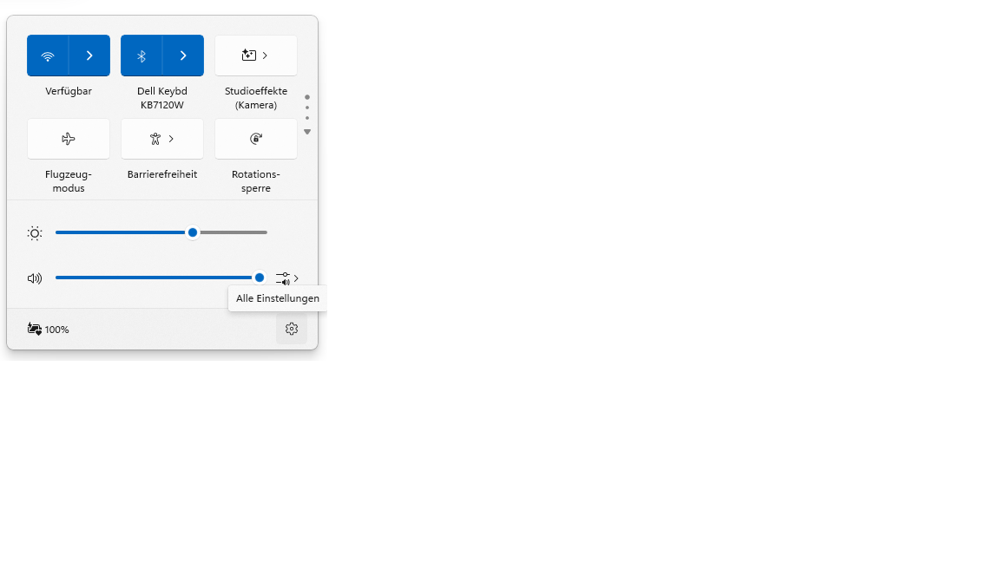
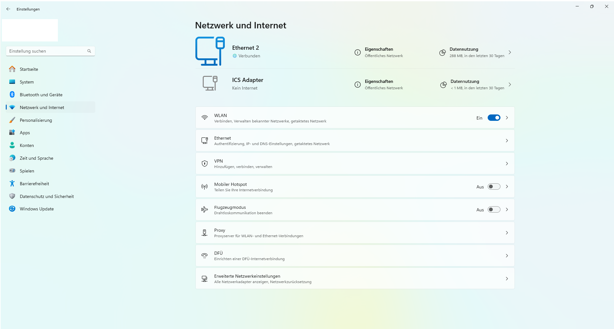
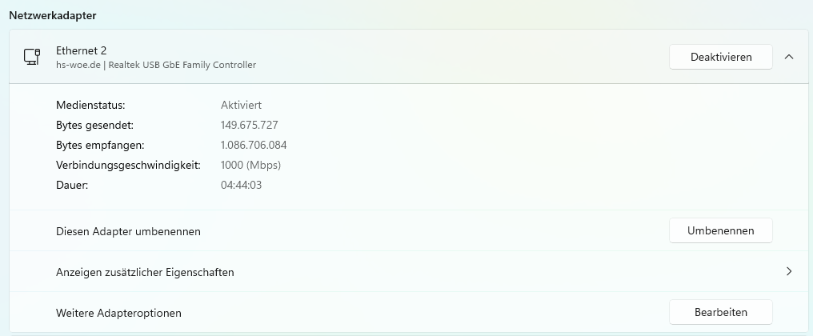
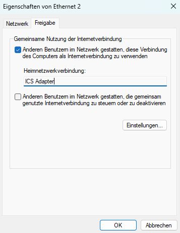

# 00 - USB to RJ45 Network Adapter Experiment

## 1. Problem & Hypothesis

Is it possible to achieve internet connectivity with the network adapters listed below via ICS (Internet Connection Sharing), and how is this implemented?

An internet connection is established after network configuration on both the ICS host and the LAN device.

## 2. Setup

### The Device on which ICS is Configured

A notebook with Windows 11 is used for the device where ICS is configured (ICS is available from Windows 8.1).
```text
System Manufacturer: Dell Inc.
System Model: Latitude 5550
Processor: Intel Core Ultra 5 125U, 1300 MHz, 12 Cores, 14 logical processors
Operating System Name: Microsoft Windows 11 Pro
Version: 10.0.26100 Build 26100
````

### The Device that Uses ICS

A Raspberry Pi is used to perform the first network test.

```text
System Manufacturer: Raspberry
System Model: PI500
Processor: 2.4 GHz Quad-Core 64-Bit Arm Cortex-A76 CPU
Operating System Name: Raspberry PIOS 64bit/ Debian Bookworm
```

If a second computer is not available, the network tests can be performed later.

### Adapter List (Tested Adapters)

1.  Startech.com USB2.0 Asix AX88772B
2.  Logilink USB3.0 Asix AX88179
3.  MAXTRACK USB-C Realtec GBe Family

-----

## 3\. Setting up the ICS Connection

The following diagram shows how ICS works.


Accordingly, the internal network is protected by the Windows firewall or antivirus programs. The internal network is thereby isolated and not part of the protected network.

-----

Plug the USB network adapter into the computer with an active internet connection.

Plug the network cable into the PDAL.
Now, on the internet computer, open the Settings

Then, select **Network & internet** from the left side.


Next, select **Advanced network settings**.


Now, select the Ethernet adapter that has an active internet connection.


Now click on **More adapter options** under **Related settings**.
The adapter's properties window will appear.
Check the box for **Internet Connection Sharing**.
Then, select the adapter for the home network connection.
Ideally, you should have renamed the home network adapter beforehand.


After clicking **OK**, Windows will automatically perform an IP configuration and assign the IP `192.168.137.1` to the home network adapter. Confirm the process with **OK**.

## 4\. Observation

After setting up ICS and physically connecting the LAN device and the internet computer, there was a connection to the internet.
It was observed that name resolution via DNS was working. To check for connectivity using the console and ping commands, we first pinged the computer providing ICS, then externally, e.g., Google's DNS IP `8.8.8.8`. For name resolution, we sent a ping to `heise.de`, and a connection was also established here.

Next, we checked if there were any current updates for the system. We found that error messages appeared, which were due to time synchronization issues. A quick look at the clock on the device in the home network showed that it was not synchronized with the time of the ICS computer.
Since we are in a university network, we know that UDP port 123 is blocked externally.
To solve this problem, we had to go into `timesyncd.conf` and specify a different time server. In this case, it was `time.jade-hs.de`.
After the university's time server was specified and the configuration file was saved, updates/upgrades for the Raspberry OS could also be downloaded and installed using `apt update` and `apt upgrade`.

Connections to websites, which were not possible without adjusting `timesyncd.conf`, could also be established.
DNS and Gateway settings are not made on the network adapter that leads from the ICS system to the LAN device, as these settings are automatically handled by ICS. No entries for DNS and Gateway should be made, as this will prevent an internet connection from being established.

The network configuration on the target system can be done via both DHCP and manually.
With DHCP, no settings need to be made, whereas with manual settings, the IP, Subnet Mask, DNS, and Gateway must all be entered.

## 5\. Interpretation

The configuration is very simple but restricts the choice of IP address for the local network. Windows 11 always assigns the IP address `192.168.137.1` for Internet Connection Sharing.

While it's possible to assign this manually, it involves detours.

## 6\. Sources

[Creating and Configuring Internet Sharing Experiences](https://learn.microsoft.com/de-de/windows-hardware/drivers/mobilebroadband/creating-and-configuring-internet-sharing-experiences)

---

### License
This work is licensed under the **Creative Commons Attribution - ShareAlike 4.0 International License**.
 
[To the license text on the Creative Commons website](https://creativecommons.org/licenses/by-sa/4.0/legalcode.en)
