# Installing Proxmox VE on a Tiny PC

**Task**:
The Tiny PC is to be set up as a virtualization host with **Proxmox Virtual Environment (VE)**. The goal is to create a functional Proxmox installation that can be administered via a web interface.

**Expected Outcome**:
A ready-to-use Proxmox VE host that supports VMs and containers and is accessible over the network.

-----

## b. Preparation

**Hardware**:

**Tiny PC**:

  - Processor: Supports virtualization (e.g., Intel VT-x, AMD-V)
  - RAM: At least 4 GB (recommended: 8 GB)
  - Hard drive: At least 32 GB (recommended: 128 GB or more)
  - Network card: Gigabit Ethernet

**Peripherals**:

  - Monitor, keyboard, mouse for installation (not needed after installation)
  - Bootable USB stick (8 GB or larger)


**Software**:

  - **Proxmox VE ISO image**: [Proxmox](https://www.proxmox.com/de/downloads/proxmox-virtual-environment/iso) (Version: e.g., 8.0)
  - **Bootloader tool**: [Rufus](https://rufus.ie/de/) (Windows) or [Balena Etcher](https://etcher.balena.io/) (Linux/MacOS)

**Setup**:

1.  **Configure BIOS/UEFI**:

  - Activate virtualization (e.g., Intel VT-x or AMD-V).
  - Disable Secure Boot.
  - Set the boot order so the USB stick boots first.


2.  **Create a bootable USB stick**:

  - Write the ISO image to the USB stick using Rufus or Balena Etcher.

-----

## c. Execution

### Step 1: Configure BIOS/UEFI

1.  **Configure BIOS/UEFI**:
    After starting the computer, press the `Del` key to enter the BIOS/UEFI.
    Navigate to the "Advanced" section to "CPU Configuration" to enable virtualization.

    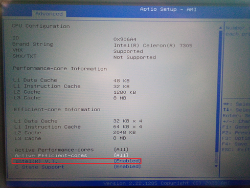

  - Activate virtualization (e.g., `Intel VT-x` or `AMD-V`).
    In the "Security" section, disable Secure Boot.

    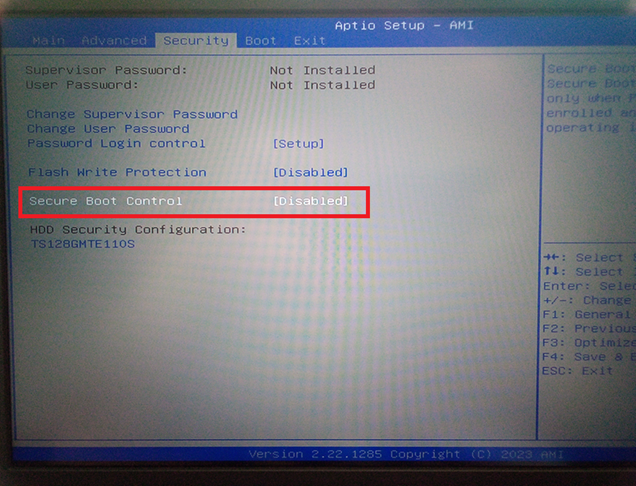

  - Disable Secure Boot.

  - Set the boot order so the USB stick starts first.

**There are 2 ways to adjust the boot order.**

a) Change the boot order in the BIOS/UEFI. This can be done in the "Boot" section under "Boot Option."


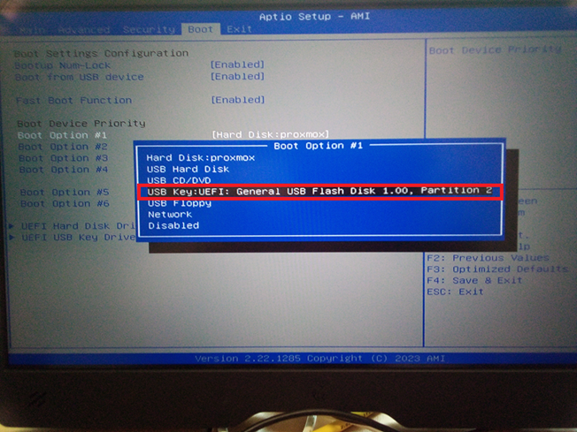

Then go to "EXIT" and select and confirm `Save Changes and Exit`.

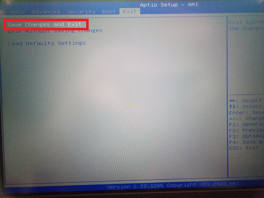


b) To select a specific boot medium, it is sufficient to call up the BBS menu. The key for this varies depending on the manufacturer, from `F2` to `F7`.

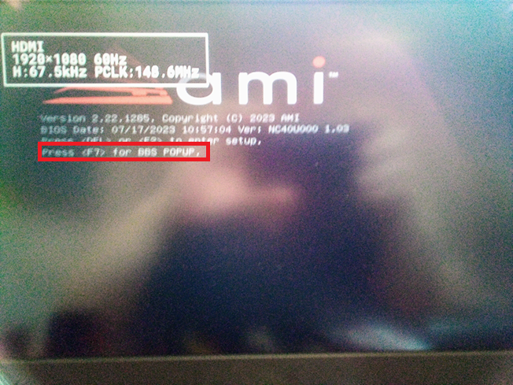

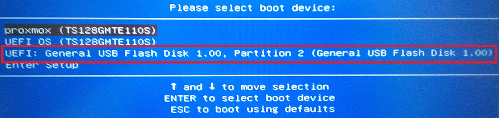

-----

### Step 2: Download the Proxmox ISO and create a bootable USB stick

1.  Go to the [Proxmox download page](https://www.google.com/search?q=https://www.proxmox/downloads).

2.  Download the latest Proxmox VE ISO image (e.g., `proxmox-ve_8.x.iso`).


3.  Create a bootable USB stick with Rufus (Windows) or Balena Etcher (Linux/MacOS).

  - Select the ISO image and the USB stick.
  - Click "Start" to create the stick.
    Creating a bootable USB stick with Rufus:


1.  Select the drive to which the image should be written.
2.  Select the image to be written to the USB stick.

-----
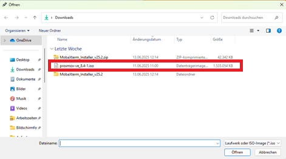

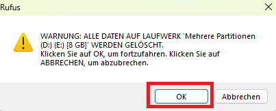

If the USB stick already contains data, please confirm the warning if the data may be deleted.


Simply confirm the warning with OK.

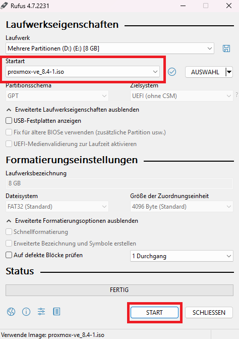

After selection, the ISO file appears in the red-marked area at the top.
Now simply click on START.

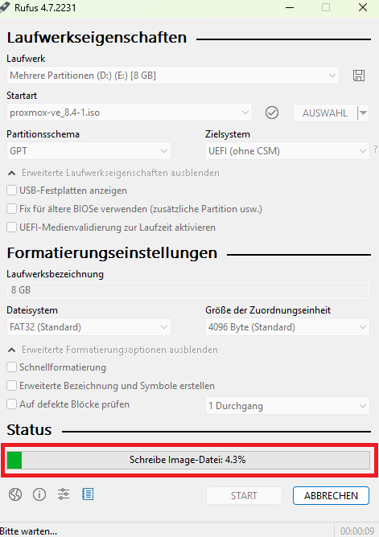

Wait until the status says "Ready."


After the writing process is complete, simply click on `CLOSE`.

### Step 3: Start the Proxmox installation

1.  Plug the USB stick into the Tiny PC and start the Tiny PC.

2.  In the boot menu (usually via `F2` to `F8`, depending on the motherboard manufacturer), select the USB stick.


3.  In the Proxmox boot menu, select `Install Proxmox VE Terminal UI` or `Install Proxmox VE Graphic`.
    The installation process is the same.

The following describes the installation of Proxmox with the graphical user interface:

### Step 4: Install Proxmox

1.  **Accept license terms**:

  - Read and agree to the license terms.
  
  

2.  **Select hard drive**:

  - Select the hard drive for the installation (all data on the hard drive will be deleted).
   
    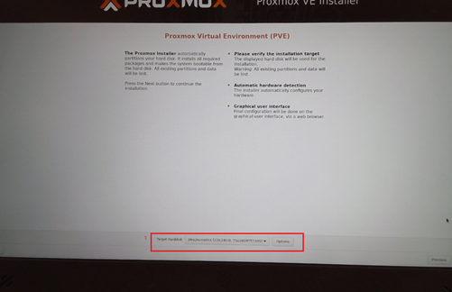

3.  **Set time zone and language**:

  - Select the desired time zone and keyboard layout.
   
    

4.  **Password and email**:

  - Set a strong root password.
  - Enter an email address for system notifications.
   
    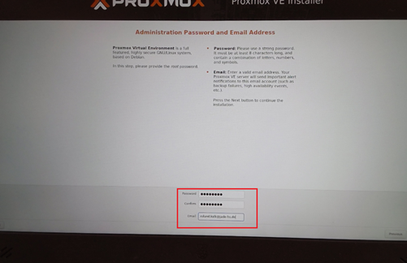

-----

` >Note: Servers are not allowed in the university network. Therefore, we use a network configuration realized with ICS in the university network.  `

-----

5.  **Configure network settings**:

  - Select the network adapter from `eno1`.
  - Enter the hostname, e.g., `proxmox.local`.
  - For the static IP, enter the IP address in the following format `192.168.137.***/24`, Gateway `192.168.137.1`, and DNS Server `192.168.137.1`.
  
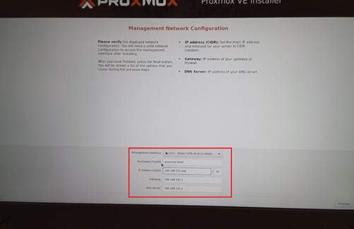

> [\!info] Why a static IP address?
> A static IP address ensures that the VM always uses the same network address (e.g., `192.168.1.100`), regardless of how often it is started or reconnected. This makes it always reachable for other devices or VMs at the same address. This is important when the VM serves as a server (e.g., database or web server).
>
> Further information: [[04 Execution Static IP for an Ubuntu LTS VM]]

>Note: We use `*.local` to specify the domain of our virtual environment. This will be used consistently for naming the other servers/LXCs. This domain is important for various requirements, such as a unique FQDN (fully qualified domain name), SSL certificates, DNS resolution, etc.

### Step 5: Complete the installation

1.  Check the settings and click `Install`.

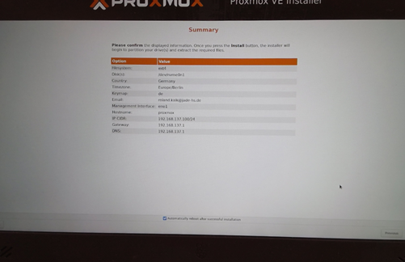

2\. Wait until the installation is complete (approx. 10–20 minutes).
3\. Remove the USB stick and restart the Tiny PC.

### Step 6: Check network connectivity

To check network connectivity, we use the CLI (Command Line) of the newly installed Proxmox system.
Proxmox already displays the address that will be needed later in the web interface.
To do this, we first have to log in to the system. This is done with the user `root` and the password set during installation.
Please do not be surprised when entering the password that no placeholders are shown for the characters you type.
In the CLI on Linux-based systems, the cursor remains in place when entering the password.

The output looks like this:

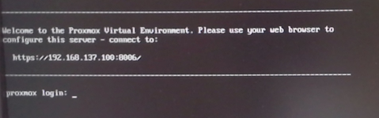

after entering the user `root`


now press `Enter`

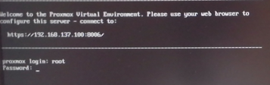

Now enter the password:

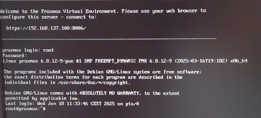

1.  First, we try to ping the computer that shares the internet connection with our virtual network.
    Since we are using the ICS function of Windows here, we ping the address `192.168.137.1`.

We end the ping with `CTRL + C`.

> Further information: [00 - Network Card Experiment](../Netzwerkverbindung/00%2520-%2520Netzwerkkarte%2520Experiment.md)
>
> This explains how to configure a USB network adapter via ICS.

The command is: `ping 192.168.137.1`
If we have configured everything correctly during the installation, we should get this output:

   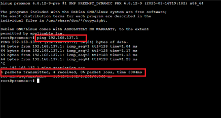

2.  After we have established that there is a network connection to our ICS computer, we check whether there is a connection to the internet.
    To do this, we also use the `ping` command and enter the IP address of Google's DNS (Domain Name Server) as the IP address: `ping 8.8.8.8`
    Here too, if everything is configured correctly, we should get this output.

   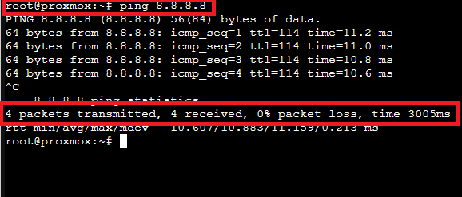

3.  Finally, we test the name resolution to the internet.
    To do this, we also use the `ping` command and as the destination, we now enter a web address. In this example, we use the address of Heise.
    `ping heise.de`
    If everything is configured correctly, it should look something like this.

   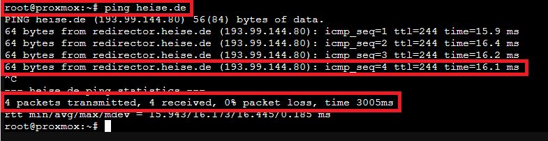

so that we can download and install updates and upgrades from the Debian repositories, as the source servers are entered as web addresses in the source list.

### Step 7: Access the Proxmox web interface

1.  Open a browser on another device and enter the Proxmox URL:

  - `https://<Proxmox-IP-Address>:8006`
  
   

2.  Due to a missing certificate, a warning will be issued, which shows the page as unsafe.
    Click on "Advanced" here (see the image below) and select "Allow Exception."

   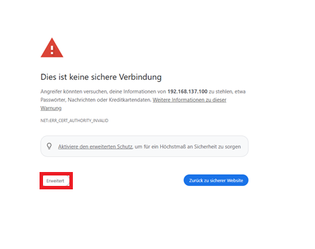

3.  Log in with `root` and the password set during installation. Here you can also set the language of the web interface.

   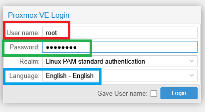

### Step 8: Import Proxmox CA certificate into the client

1.  Proxmox automatically creates a Root CA certificate with the corresponding RSA key during installation.
    To avoid getting certificate error messages, we need to import the certificate created by Proxmox into our client as a trusted certificate.

2.  To copy the Proxmox certificate to our client, we use an SFTP-capable program like WinSCP.
    Here is the download link for WinSCP: [WinSCP](https://winscp.net/download/WinSCP-6.5.3-Setup.exe/download)
    We open an `SFTP` session in WinSCP to our Proxmox host with the IP `192.168.137.100` with port 22 and user:`root`


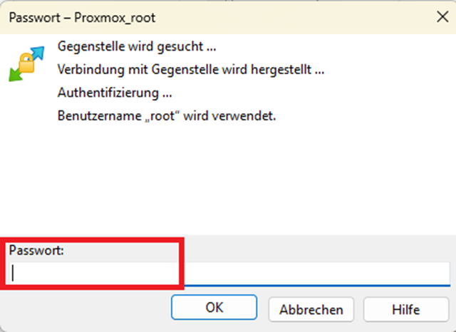

3.  We now switch to the directory
    `/etc/pve/` and download the file `pve-root-ca.pem` to our tmp directory on drive `C:\tmp\`.

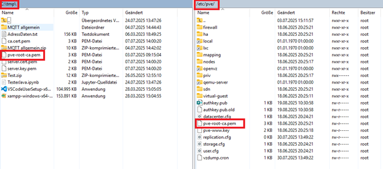

4.  Now, in the Windows search bar on our ICS client, enter `Manage user certificates` and select the top result from the list.


5.  In CertMngr, we navigate to the `Trusted Root Certification Authorities` directory and click the arrow on the left to display the directory structure.

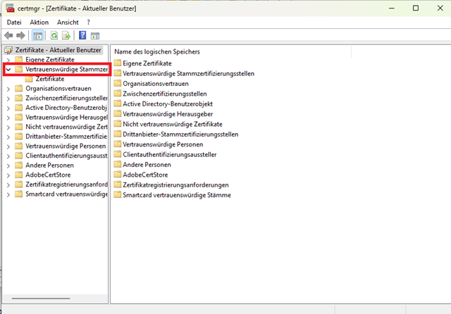

Now right-click on the "Certificates" subfolder and then click on "All Tasks" and then on "Import."

6.  The Certificate Import Wizard will now open.


    Click "Next."
   
    
   
    Now we click "Browse" and select the directory where we previously downloaded the Proxmox certificate.
   
    
   
    We select the previously downloaded Proxmox certificate and click "Open."
   
    
   
    Now click on "Next."
    We will now receive a security warning.
    Simply confirm this, and the Proxmox certificate has been imported into the client.
   
    
   
    We will have to repeat this procedure later with other certificates to be able to establish a secure connection via TLS/SSL for our apache2, mariadb, and other applications.

> \!Note\! In production systems, however, public, trusted certification authorities or an internal certification authority, which is centrally managed in a company, are used for this.

### Step 9: Adjusting Chrony time server configuration for the university network

This describes how to configure the time server `time.jade-hs.de` in **Proxmox VE** using the **Chrony service**.

We have to adjust the time server because the Jade University blocks NTP port 123, which means that no time synchronization can take place.

> Further information: The document [Explanation of why time synchronization is important] deals with this topic in more detail.

-----

1.  Adjust Chrony configuration

Open the Chrony configuration file with an editor:

```bash
nano /etc/chrony/chrony.conf
```

   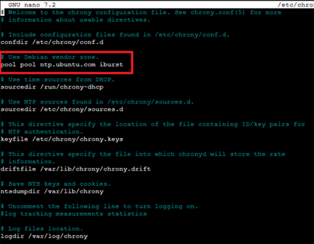

Look for the lines that start with `pool` or `server` (e.g., `pool ntp.ubuntu.com iburst`) and comment them out or delete them.

Instead, add the following time server:

```bash
server time.jade-hs.de iburst
```

   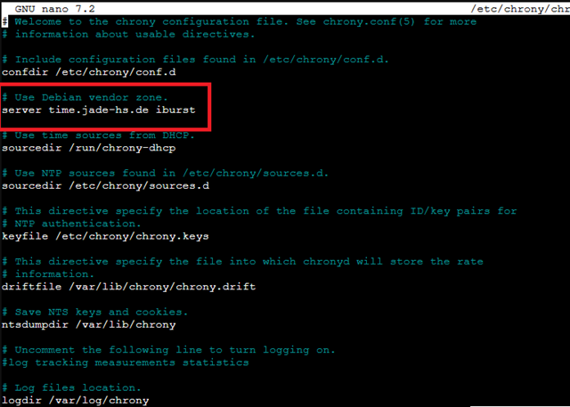

Info: `iburst` ensures faster synchronization at startup.

2.  Save and close the configuration file

In nano: Press `Ctrl + O` to save and `Ctrl + X` to exit.

3.  Restart Chrony

```bash
systemctl restart chrony
```

4.  Check status and synchronization
    Show Chrony status:

```bash
systemctl status chrony
```

   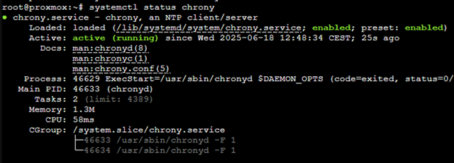

Check NTP synchronization:

```bash
chronyc sources
```

   

Or for more precise information:

```bash
chronyc tracking
```

   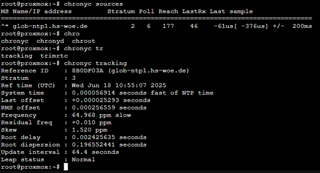


Notes

> The `/etc/chrony/chrony.conf` file is loaded automatically when Chrony starts.
>
> If Proxmox is running in an isolated network, make sure the time server is reachable.

### Step 10: Perform Proxmox Update and Upgrade

1.  In the Proxmox web interface, select "Proxmox" on the left side and then select "Updates."

2.  Now click on "Refresh." A popup window will open, and Proxmox will try to download information about updates. An error message will appear here.
    These errors relate to the Proxmox Enterprise version, which is not free.


3.  To fix this error, we have to change the Proxmox repository.
    The Enterprise repository is currently entered here, as can be seen in the picture.

    

    We can disable this at the top of the web interface.

4.  Now we have to add a new repository to be able to perform updates or upgrades.

    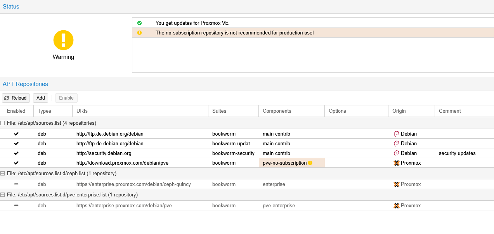

    There, we select "Add" and in the following menu, we select `No Subscription`.
    Now we can update and upgrade Proxmox.

-----

### d. Sources

  - "balenaEtcher - Flash OS Images to SD Cards & USB Drives." Accessed June 11, 2025. [Etcher](https://www.balena.io/etcher).

  - "Network Configuration - Proxmox VE." Accessed June 6, 2025. [Proxmox Wiki](https://pve.proxmox.com/wiki/Network_Configuration#sysadmin_network_vlan).

  - "Proxmox VE Documentation Index." Accessed June 4, 2025. [Proxmox Docs](https://pve.proxmox.com/pve-docs/).

  - "Rufus - Create bootable USB drives easily." Accessed June 11, 2025. [Rufus](https://rufus.ie/de/).

  - "chrony - Documentation." Accessed June 18, 2025. [Chrony Doc](https://chrony-project.org/documentation.html).

  - "Time Synchronization - Proxmox VE." Accessed June 18, 2025. [Proxmox Wiki Time\_Synchronization](https://pve.proxmox.com/wiki/Time_Synchronization).

  - "Table of Contents :: WinSCP." Accessed: August 19, 2025. [Online]. Available at: [WinSCP Docs](https://winscp.net/eng/docs/start)

  - **Tiny PC BIOS Documentation**: Manufacturer's documentation for BIOS/UEFI options.

**Related Documentation**:

  - Guide to setting up an Ubuntu VM with Proxmox

-----

**Note**: Make sure that the Tiny PC always has a constant power supply and network connection after installation to ensure a stable virtualization environment.

---

### License
This work is licensed under the **Creative Commons Attribution - ShareAlike 4.0 International License**.
 
[To the license text on the Creative Commons website](https://creativecommons.org/licenses/by-sa/4.0/legalcode.en)
