# Creating an LXC Container

This document describes how to create and configure a standard LXC container.

The following documents will only describe the installation and configuration of applications within a functional LXC container.

## 🎯 Goal

Create an LXC container with the following specifications:

  - **CTID:** 110
  - **Hostname:** apache110
  - **IP:** 192.168.137.110/24
  - **Gateway:** 192.168.137.1
  - **DNS:** inherited from the host
  - **RAM:** 512 MB
  - **Hard Drive:** 8 GB
  - **Template:** `/var/lib/vz/template/cache/ubuntu-24.04-standard_24.04-2_amd64.tar.zst`

### Additional Steps

1.  Create a user `pdal` (sudoer) with the password: `myPassword`.
2.  Perform a system update (`apt update/upgrade`).
3.  Set the `timedatectl` timezone to `Europe/Berlin` or yout timezone.
4.  Check network connectivity (Gateway & DNS resolution).

> Note: For the PDAL project, you can exceptionally use the same user and password every time. This should, of course, never be done in production systems.

-----

## 🧭 1. Check and Upload the Template

  - Check under `Datacenter → <local> → Templates` to see if your template is available.


  - If not: **Upload** or download via the web UI.
  

  - Navigate to "Templates":


  - Select the corresponding template and click "Download".


After the download, the template should now be displayed.

-----

## 🛠️ 2. Create the Container

1.  Right-click on the node → **Create CT**
2.  **General**:
      - CT ID: `110`
      - Hostname: `apache110`
      - Password: (set root password)
      - Unprivileged: ✅
   

> Note: Proxmox uses three-digit numbers for the CT ID. We will use the last octet of the IP address as an identifier. You should also choose a descriptive name, for example, "apache110."

3.  **Template**:

      - Storage: e.g., `local`
      - Select template
  
   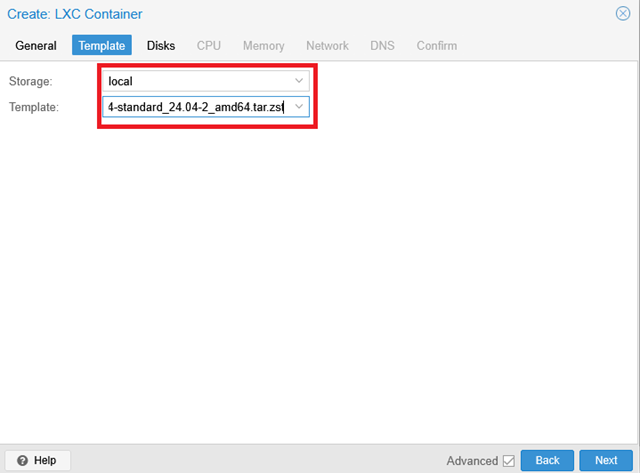

4.  **Root Disk**:

      - Storage: `local-lvm`
      - Size: `8 GiB`

   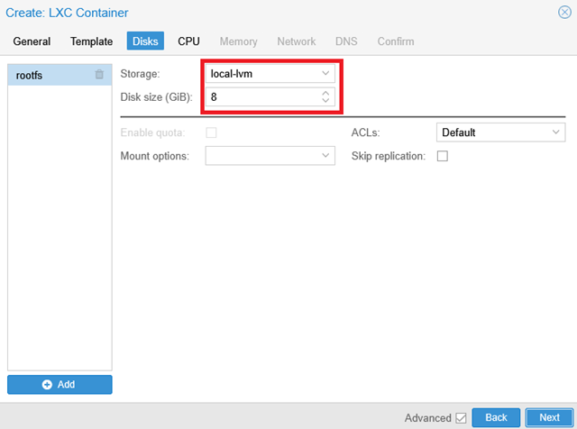

5.  **CPU & Memory**:

      - Cores: `1`
      - Memory: `512 MiB`, Swap optional `512 MiB`
   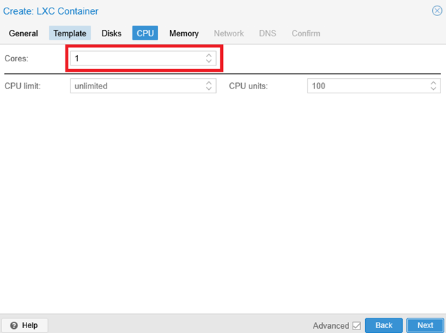
   

6.  **Network**:

      - Bridge: `vmbr0`
      - IPv4: Static `192.168.137.110/24`
      - Gateway: `192.168.137.1`

   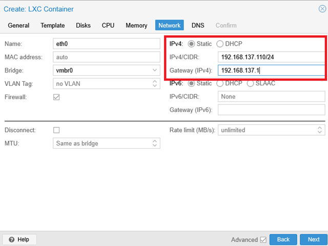

7.  **DNS**:

      - "Use DNS from host" (Default)
   

8.  **Confirm**:

      - "Start after created": ✅
      - Click **Finish**
   

-----

## ▶️ 3. Start Container & First Steps

  - The container will start automatically or can be started manually via the web UI.
  - Open the Console → log in with `root` + the password you set.
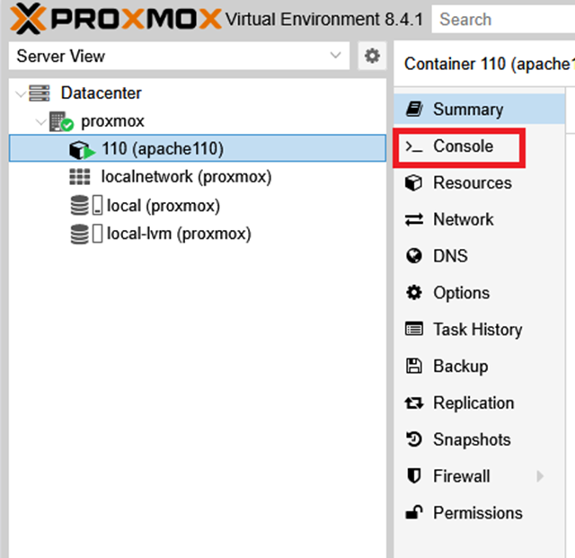
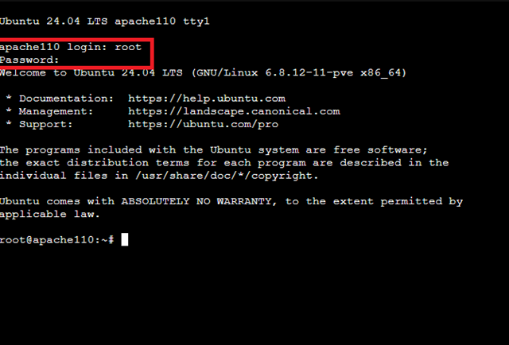

-----

## 👤 4. Create User `pdal` & Set as Sudoer

```bash
adduser pdal
# Password: meinPasswort
usermod -aG sudo pdal
```

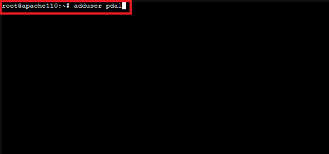


Set and confirm the password for user `pdal`.


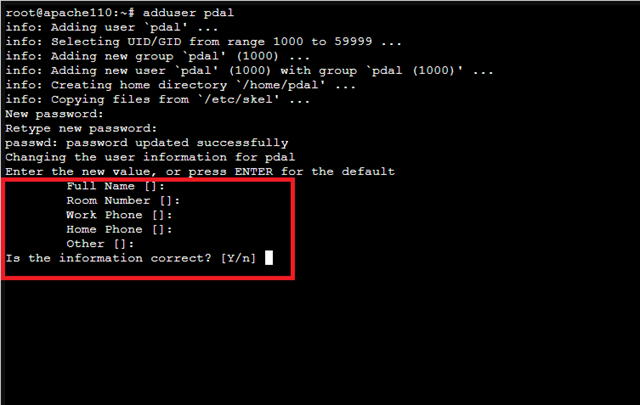


## 🌐 5. Network Check

In this step, we ensure that the new container has a network connection.

```bash
ping -c3 192.168.137.1
```

> Note: The `-c3` option executes only three pings.


This step ensures that a network connection exists. If problems occur here, please check the container's network settings - `ContainerID → Network → Network Settings`.

```bash
ping -c3 8.8.8.8
```


This step ensures that external IP addresses can be reached.

```bash
ping -c3 heise.de
```

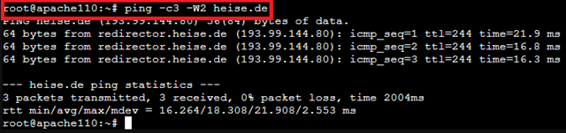

This step ensures that DNS resolution is working correctly.

## 🔄 6. Update the System

With a correctly functioning network, you can now update the system:

```bash
apt update && apt upgrade -y
```


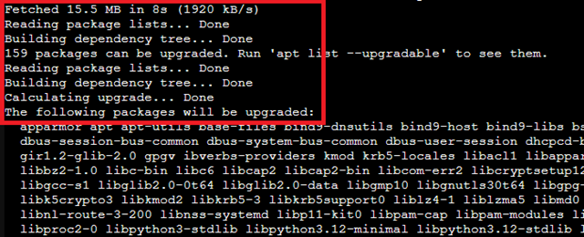
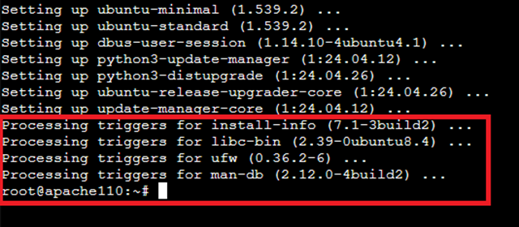

## 🕒 7. Configure Timezone for Display Only and Check Status

```bash
timedatectl set-timezone Europe/Berlin
```

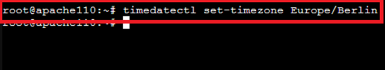

```bash
timedatectl status
```


> Note: The container gets its system time from the host system (Proxmox). If the system time here is incorrect, check the settings in Proxmox.

✅ 🚀 Result

The `apache110` container is now:

  - Configured with user pdal (sudo).
  - Network checked (Gateway, DNS).
  - Fully updated (apt update/upgrade).
  - Timezone set to Europe/Berlin.

You can now use the container for your purposes and install or configure corresponding applications.

-----

## 8\. Setting the UTF-8 Character Set

Choosing the correct character set can often simplify your work.
First, check which character set is currently set:

```bash
locale
```

If the output appears as:

```text
LANG=C
LANGUAGE=
LC_CTYPE="C"
LC_NUMERIC="C"
LC_TIME="C"
LC_COLLATE="C"
LC_MONETARY="C"
LC_MESSAGES="C"
LC_PAPER="C"
LC_NAME="C"
LC_ADDRESS="C"
LC_TELEPHONE="C"
LC_MEASUREMENT="C"
LC_IDENTIFICATION="C"
LC_ALL=
```

the **ASCII character set** is active. This set does not support country-specific special characters—e.g., **ü, Ü, €, etc.**

Therefore, it makes sense to switch to a UTF-8 character set.

-----

### 💡 What is UTF-8?

**UTF-8** (**U**nicode **T**ransformation **F**ormat - 8-bit) is the **globally dominant character encoding** today. Unlike older encodings (like ASCII or ISO-8859-1), UTF-8 can represent **all characters** and symbols from all languages (including umlauts, accents, Chinese, emojis) in a uniform format. Using UTF-8 ensures that text in log files, console output, and configuration files is displayed **correctly and consistently**.

-----

### 🌐 National vs. Neutral UTF-8 Locales

UTF-8 character sets come in neutral and country-specific forms. These are defined in the **Locale** (the regional setting).

The Locale determines not only the encoding but also country-specific rules for:

* **Date and Time**
* **Currency and Number Format** (e.g., comma vs. period as decimal separator)
* **Sort Order** (`LC_COLLATE`)

For servers and containers used internationally or for scripts, the **neutral C.UTF-8 locale** is often the best standard.

| Locale | Meaning | Application |
| :--- | :--- | :--- |
| **`de_DE.UTF-8`** | **National Locale** (German, Germany) | Aligns formats (numbers, sorting) with German rules. Good for desktop users. |
| **`C.UTF-8`** | **Neutral Locale** (C-Standard with UTF-8) | Uses standardized, binary sorting rules and a period as the decimal separator. **Optimal for servers and scripts** as it provides consistent and predictable output. |

If you prefer a local setting, look up the correct designation in the list under `nano /etc/locale.gen` and replace `C.UTF-8` with the desired designation.

-----

### 🛠️ Setting up the Neutral C.UTF-8 Locale

By default, the outdated `LANG=C` (ASCII) is often used in the container. To switch this to the modern standard **`C.UTF-8`**, follow these steps:

1.   **Generate Locale (if necessary):** Ensure that the locale is available.

```bash
sudo locale-gen C.UTF-8  
```

1.   **Set Standard Locale Permanently:** Overwrite the old `C` settings with `C.UTF-8` in the system's configuration files.

```bash    
sudo update-locale LANG=C.UTF-8 LC_ALL=C.UTF-8
```

3.   **Activate Changes:** Log out of the shell and log back in, or restart the container.

```bash     
exit # and log back in      
``` 

4.   **Verification:** Check the new settings.

```bash     
locale      
```

    \> **Result:** The output should now show `LANG=C.UTF-8` and `LC_ALL=C.UTF-8`.

---

## Sources

  - "Proxmox VE Documentation Index." Accessed: June 4, 2025. [Online]. Available at: [Proxmox PVE-Docs](https://pve.proxmox.com/pve-docs/)
  - canonical, "Ubuntu Server how-to guides." [Online]. Available at: [Ubuntu Server How-To](https://documentation.ubuntu.com/_/downloads/server/en/latest/pdf/)

-----

### License
This work is licensed under the **Creative Commons Attribution - ShareAlike 4.0 International License**.
 
[To the license text on the Creative Commons website](https://creativecommons.org/licenses/by-sa/4.0/legalcode.en)
