# Creating Your Own CA (Certificate Authority) and Manually Distributing Certificates

## What is this about?

Why do we need certificates in IT?

In IT, certificates are used to uniquely and reliably prove the identity of devices, services, or people. They also enable encrypted and secure communication over networks, e.g., via HTTPS or VPN.
Even in a closed network, you should use your own certificates. Since public Certificate Authorities (CAs) don't have access to internal systems, we need our own CA.

Our own certificates enable encrypted and authenticated communication over protocols like HTTPS, SMTPS, LDAPS, FTPS, as well as with databases like MariaDB, PostgreSQL, and message brokers like MQTT or Kafka. This gives you full control over the security, validity, and distribution of certificates within the network.
**Certificates created locally in the application container vs. a dedicated CA (Certificate Authority)**.
It's possible to create your own certificates in each application container (LXC), but we decided against it. Instead, we'll set up our own CA to minimize the complexity of distributing individual certificates. With a dedicated CA, we have uniform, centrally managed certificates.

This guide shows you how to use **OpenSSL** on your server `ssl-ca140` (IP: 192.168.137.140) to create your own **Certificate Authority (CA)** and a **single certificate for all services**. Afterward, you'll manually distribute the certificates to the various services and client computers (Windows, Mac, Linux).

---

## Why a single certificate — and why multiple?

- **A single certificate (SAN certificate)** is practical:
  You only need one file that's valid for all your services.
  This saves effort and is often sufficient for small or test environments.

- **Multiple certificates (recommended for production):**
  Each service gets its own certificate, which improves security because if one is compromised, only that service is affected.
  Management (renewal, revocation) also becomes more flexible, but it's significantly more complex or requires automation.

---

### Prerequisites

- An LXC container `ssl-ca140` with OpenSSL installed
- Familiarity with basic Linux commands
- SSH access to the server

```bash
sudo apt install openssl
````

-----

### 1. Creating the folder structure

```bash
sudo mkdir -p ~/myCA/{certs,crl,newcerts,private}
sudo chmod 700 ~/myCA/private
sudo touch ~/myCA/index.txt
echo 1000 | sudo tee ~/myCA/serial
```


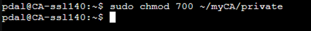

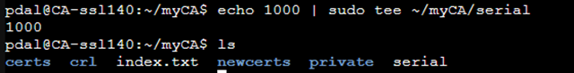

## 2. Creating the CA (Certificate Authority)

### 2.1 Creating the OpenSSL configuration file openssl.cnf

In the `~/myCA` folder, create the `openssl.cnf` file with the following content (simplified example):

```bash
sudo nano ~/myca/openssl.cnf
```

```bash
[ ca ]
default_ca = CA_default

[ CA_default ]
dir               = /home/pdal/myCA
certs             = $dir/certs
crl_dir           = $dir/crl
new_certs_dir     = $dir/newcerts
database          = $dir/index.txt
serial            = $dir/serial
RANDFILE          = $dir/private/.rand

private_key       = $dir/private/ca.key.pem
certificate       = $dir/certs/ca.cert.pem

default_days      = 3650
default_crl_days  = 30
default_md        = sha256

policy            = policy_loose

[ policy_loose ]
countryName           = optional
stateOrProvinceName   = optional
localityName          = optional
organizationName      = optional
organizationalUnitName = optional
commonName            = supplied
emailAddress          = optional

[ req ]
default_bits      = 4096
distinguished_name = req_distinguished_name
string_mask        = utf8only

[ req_distinguished_name ]
countryName           = Country Name (2 letter code)
stateOrProvinceName   = State or Province Name
localityName          = Locality Name
organizationName      = Organization Name
organizationalUnitName = Organizational Unit Name
commonName            = Common Name
emailAddress          = Email Address

[ v3_ca ]
subjectKeyIdentifier=hash
authorityKeyIdentifier=keyid:always,issuer
basicConstraints = critical, CA:true
keyUsage = critical, digitalSignature, cRLSign, keyCertSign

[ v3_server ]
basicConstraints = CA:FALSE
keyUsage = digitalSignature, keyEncipherment
extendedKeyUsage = serverAuth
subjectAltName = @alt_names

[ alt_names ]
DNS.1 = apache.local
IP.1 = 192.168.137.101
DNS.2 = mariadb.local
IP.2 = 192.168.137.120
DNS.3 = pgadmin4.local
IP.3 = 192.168.137.130
DNS.4 = CA-ssl.local
IP.4 = 192.168.137.140
DNS.5 = kafka.local
IP.5 = 192.168.137.150
DNS.6 = postgressql.local
IP.6 = 192.168.137.160
DNS.7 = mqtt.local
IP.7 =192.168.137.170
```

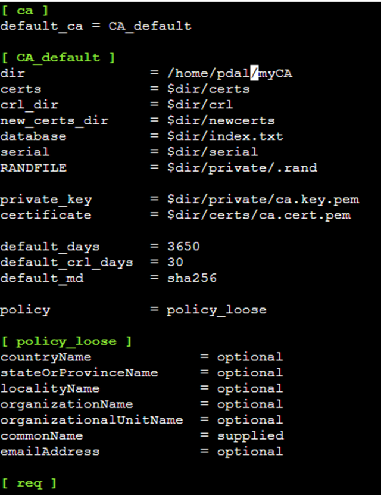


> Note: Adjust paths and names as needed. Replace `/home/username` with your actual path.
> Explanation of the configuration file:

#### [ ca ]

```bash
default_ca = CA_default
```

Specifies which CA configuration to use.

**CA_default** refers to the following section `[ CA_default ]`.

#### [ CA_default ]

```bash
dir               = /home/pdal/myCA
```

`dir` is the root directory for your CA files (adjust `username` to your username).

All following paths are based on this.

```bash
certs             = $dir/certs
crl_dir           = $dir/crl
new_certs_dir     = $dir/newcerts
database          = $dir/index.txt
serial            = $dir/serial
RANDFILE          = $dir/private/.rand
```

**certs**: Stores issued certificates.

**crl_dir**: For revoked certificates (Certificate Revocation Lists).

**new_certs_dir**: Internal folder for new certificates.

**database**: File where OpenSSL documents the issued certificates.

**serial**: File with the current serial number.

**RANDFILE**: Helper file for random data (e.g., for key generation).

```bash
private_key       = $dir/private/ca.key.pem
certificate       = $dir/certs/ca.cert.pem
```

Storage locations for the CA key and CA certificate.

```bash
default_days      = 3650
default_crl_days  = 30
default_md        = sha256
```

**default_days**: Validity period for a new certificate (here: 10 years).

**default_crl_days**: How long a revocation list is valid.

**default_md**: Hash algorithm (here: sha256, more secure than e.g., md5).

```bash
policy            = policy_loose
```

Defines how strictly OpenSSL validates the entered fields (e.g., if country or organization is mandatory).

#### [ policy_loose ]

```bash
countryName           = optional
stateOrProvinceName   = optional
localityName          = optional
organizationName      = optional
organizationalUnitName = optional
commonName            = supplied
emailAddress          = optional
```

This is a loose policy: most fields are optional, only `commonName` (the server name like `apache.local`) must be provided.

#### [ req ]

```bash
default_bits      = 4096
distinguished_name = req_distinguished_name
string_mask        = utf8only
```

Configuration for new Certificate Signing Requests (CSRs).

**default_bits**: Key length in bits (the more, the more secure – 4096 is strong).

**distinguished_name**: Which fields are prompted for during the CSR process.

**string_mask = utf8only**: Only UTF-8 characters are allowed.

#### [ req_distinguished_name ]

```bash
countryName           = Country Name (2 letter code)
stateOrProvinceName   = State or Province Name
...
```

Here, it's defined which fields are prompted for when creating a certificate (e.g., Country, Organization, Common Name).

#### [ v3_ca ]

```bash
subjectKeyIdentifier=hash
authorityKeyIdentifier=keyid:always,issuer
basicConstraints = critical, CA:true
keyUsage = critical, digitalSignature, cRLSign, keyCertSign
```

Extensions for CA certificates.

**basicConstraints = CA:true**: Makes it clear that this certificate is allowed to issue certificates.

**keyUsage**: Which actions are permitted with the key.

#### [ v3_server ]

```bash
basicConstraints = CA:FALSE
keyUsage = digitalSignature, keyEncipherment
extendedKeyUsage = serverAuth
subjectAltName = @alt_names
```

Extensions for server certificates:

  * **CA:FALSE**: This certificate is not a CA certificate.

  * **keyUsage**: For digital signatures and encryption.

  * **extendedKeyUsage**: May be used as a TLS server certificate.

  * **subjectAltName**: Refers to the list of alternative names below.

#### [ alt_names ]

```bash
DNS.1 = apache.local
IP.1 = 192.168.137.101
DNS.2 = mariadb.local
IP.2 = 192.168.137.120
DNS.3 = pgadmin4.local
IP.3 = 192.168.137.130
DNS.4 = CA-ssl.local
IP.4 = 192.168.137.140
DNS.5 = kafka.local
IP.5 = 192.168.137.150
DNS.6 = postgressql.local
IP.6 = 192.168.137.160
DNS.7 = mqtt.local
IP.7 =192.168.137.170
```

This is the SAN list (Subject Alternative Name).

It allows the certificate to secure multiple names and IP addresses, e.g., `apache.local` for Apache, `mariadb.local` for MariaDB, etc.

This means you only need a single certificate for all services – this is the so-called pdal certificate.

### Conclusion

This configuration defines a private CA with:

> loose input requirements,
>
> strong key (4096 bit),
>
> SAN support for many services,
>
> 1 certificate for all servers (pdal certificate).

### 2.2 Creating the CA key and CA certificate

```bash
sudo openssl genrsa -aes256 -out private/ca.key.pem 4096
```

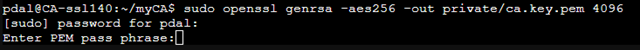

For confirmation, you enter a password. In our example, we choose `JadeHS20`; after entering it, you must confirm the password again.


```bash
sudo chmod 400 private/ca.key.pem
```

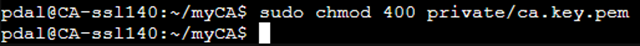

```bash
sudo openssl req -config openssl.cnf \
      -key private/ca.key.pem \
      -new -x509 -days 3650 -sha256 -extensions v3_ca \
      -out certs/ca.cert.pem
```

You'll be asked for details like country, organization, etc. You can fill these in appropriately.
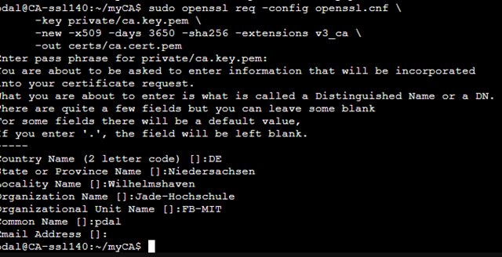

## 3. Creating the server certificate with SAN (for all services)

### 3.1 Creating a private key for the server

```bash
sudo openssl genrsa -out private/server.key.pem 2048
sudo chmod 400 private/server.key.pem
```

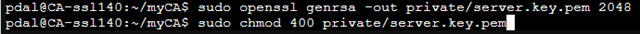

### 3.2 Creating the certificate signing request (CSR) with SAN

Create a file named `server.ext` with the following content (SANs for all services):

```bash
sudo nano server.ext
```

```bash
authorityKeyIdentifier=keyid,issuer
basicConstraints=CA:FALSE
keyUsage = digitalSignature, keyEncipherment
extendedKeyUsage = serverAuth
subjectAltName = @alt_names

[ alt_names ]
DNS.1 = apache.local
IP.1 = 192.168.137.101
DNS.2 = mariadb.local
IP.2 = 192.168.137.120
DNS.3 = pgadmin4.local
IP.3 = 192.168.137.130
DNS.4 = CA-ssl.local
IP.4 = 192.168.137.140
DNS.5 = kafka.local
IP.5 = 192.168.137.150
DNS.6 = postgressql.local
IP.6 = 192.168.137.160
DNS.7 = mqtt.local
IP.7 =192.168.137.170
```

If the list of included servers is identical to the SAN list, the shorthand `subjectAltName = @alt_names` can be used.


**Creating the CSR (Certificate Signing Request):**
What is a CSR?

A CSR is a file that:

  - contains a public key,
  - was created along with identity information (e.g., Common Name, Organization, Location, SANs),
  - is intended to be signed by a Certificate Authority (CA) to generate a valid certificate from it.


```bash
sudo openssl req \
  -new \
  -key private/server.key.pem \
  -out server.csr.pem \
  -config /home/pdal/myCA/openssl.cnf \
  -subj "/C=DE/ST=Niedersachsen/L=Wilhelmshaven/O=Jade-Hochschule/OU=FB-MIT/CN=all-services.local"
```


Afterward, you can check if the key was actually created using the following commands:

```bash
ls -l server.csr.pem
openssl req -in server.csr.pem -noout -text
```


### 3.3 Signing the certificate with SAN

```bash
sudo openssl ca -config openssl.cnf -extensions v3_server -days 825 -notext -md sha256 -in server.csr.pem -out certs/server.cert.pem
```

You'll be asked if you want to sign the certificate – confirm with `y`.
Then you'll need to confirm again with `y` for the certificate to be created and written to the database.

Afterward, you must set the permissions for the certificate.

```bash
sudo chmod 444 certs/server.cert.pem
```


## 4. Distributing and configuring certificates on services

The certificate `server.cert.pem`, the key `server.key.pem`, and the CA certificate `ca.cert.pem` are needed on all servers/services.

### 🔐 Goal

We want to:

  - Move the files `ca.cert.pem`, `server.cert.pem`, and `server.key.pem` to `/home/pdal/download` in the CA container.
  - Download these files to your local computer at `C:\tmp` using WinSCP via SFTP.
  - Upload the files to the Apache2 container at `/home/pdal/download` using WinSCP via SFTP.
  - From there, move the files to the corresponding directories in the Apache2 container.

### 📁 Prerequisites

  - LXC containers for CA (`ca-container`) and Apache2 (`apache110`) are active.
  - The `pdal` user exists in both containers.
  - SFTP access via IP or hostname is possible.
  - An SFTP client like WinSCP is installed on your Windows machine (but it also works without a separate client using the command line).

🔹 1. Preparing files in the CA container

### Creating the download directory

First, we create a directory named `download` in the `pdal` user's home directory within the CA container.

```bash
sudo mkdir -p /home/pdal/download
```


### Adjusting paths if necessary

Now we copy the individual certificates and the server key into the download directory.
Since the `/home/pdal/myca/private` directory belongs to `root` and only `root` can access it, we'll need to log in as `root` in the container later.
We do this as follows: We're currently logged in as `pdal` and must enter `sudo -i` to switch to the `root` user to get access to the private directory.

```bash
sudo cp /home/pdal/myca/certs/ca.cert.pem /home/pdal/download/
sudo cp /home/pdal/myca/certs/server.cert.pem /home/pdal/download/
sudo -i
cp /home/pdal/myca/private/server.key.pem /home/pdal/download/
```

This follows the syntax `sudo cp fileToBeCopiedWithPath destinationDirectory`.

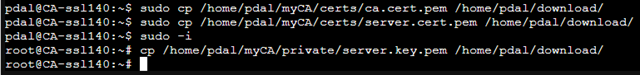

### Adjusting permissions (optional, so the pdal user has access)

We are still logged in as `root` in the container. If not, please switch to `root` with `sudo -i`.

The files we just copied all belong to the `root` user and have very strict permissions. To download these files via an SFTP client, we must change the permissions and the owner of the files. We'll do this with the `chown` and `chmod` commands.

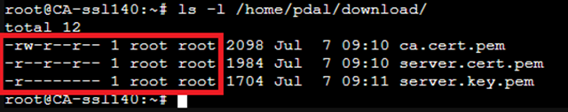

```bash
chown pdal:pdal /home/pdal/download/*.pem
chmod 600 /home/pdal/download/*.pem
```


🔹 2. Downloading files from the CA container with WinSCP via SFTP.
Steps:

  - Start WinSCP.
  - Open a new SFTP session:
  - Host: IP of your CA container
  - User: pdal
  - Password: Password
  - Navigate in the right window (Remote Browser) to:

```bash
/home/pdal/download/
```

  - Select the files `ca.cert.pem`, `server.cert.pem`, `server.key.pem`.
  - Drag them to the local directory on your PC:

`C:\tmp`
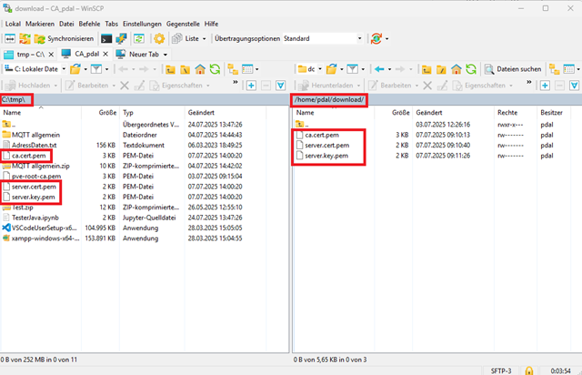

It's also possible to do this without an extra app like WinSCP. From Windows 10/11 onwards, I have the option to download files using the `scp` command in the command prompt. Here are the steps on how that works.
We open the command prompt on our Windows client as an administrator.

```bash
scp pdal@192.168.137.140:/home/pdal/download/*.pem C:\tmp\
```


You'll be asked if you want to continue the connection, as the host is not recognized.
You must confirm here with `yes`. It's possible you might need to type `zes` and **\!Attention\!** what you type won't be displayed.
The 3 files are now in the `tmp` directory under `C:`.

🔹 3. Uploading files to the Apache2 container via SFTP.

In WinSCP, open a new SFTP session to the Apache2 container:

  - Host: `192.168.137.101`
  - User: `pdal`
  - Password: `JadeHS20`

Navigate in the Remote Browser to the destination:

```bash
/home/pdal/download/
```

Drag the three `.pem` files from the local window (`C:\tmp`) into it.


🔹 4. Moving files to destination locations in the Apache2 container
Example: You log into the Apache2 container's console via the Proxmox web interface:

### Certificate Directory

```bash
/etc/ssl/certs
/etc/ssl/private
```

### Checking/moving files

```bash
ls -l /home/pdal/download/
sudo mv /home/pdal/download/ca.cert.pem /etc/ssl/certs/
sudo mv /home/pdal/download/server.cert.pem /etc/ssl/certs/
sudo mv /home/pdal/download/server.key.pem /etc/ssl/private/
```

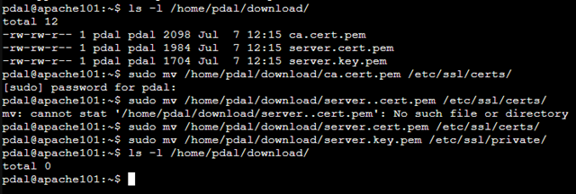

### Adjusting permissions (important for Apache2)

```bash
chmod 644 /etc/ssl/certs/ca.cert.pem
chmod 644 /etc/ssl/certs/server.cert.pem
sudo -i # switch to root, as the /etc/ssl/private directory can only be read by root
chmod 600 /etc/ssl/private/server.key.pem
```

You can clearly see from the images that we check the permissions with `ls -l` after each change.

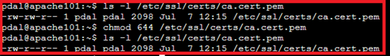
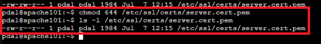


Now we can type `exit` in the console to return to the `pdal` user.

📎 Note on Apache2 configuration

Don't forget to correctly specify the paths in the Apache2 configuration (e.g., `/etc/apache2/sites-available/default-ssl.conf`):

```bash
sudo nano /etc/apache2/sites-available/default-ssl.conf

SSLCertificateFile /etc/ssl/certs/server.cert.pem
SSLCertificateKeyFile /etc/ssl/private/server.key.pem
SSLCACertificateFile /etc/ssl/certs/ca.cert.pem
```


Then:

```bash
a2enmod ssl
a2ensite default-ssl
sudo systemctl restart apache2
```


### 4.1 Apache2 (Example)

```bash
SSLCertificateFile /etc/ssl/certs/server.cert.pem
SSLCertificateKeyFile /etc/ssl/private/server.key.pem
SSLCACertificateFile /etc/ssl/certs/ca.cert.pem
```

## 5. Installing the certificate on Windows, Mac, Linux

Import the CA certificate (`ca.cert.pem`) as a trusted Certificate Authority in the respective operating systems. We do this step so that browsers or other tools can establish a secure connection without certificate errors.

This way, your clients will recognize all certificates from your CA as trustworthy.


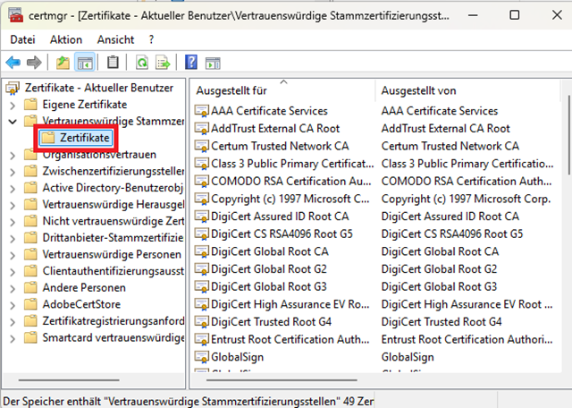


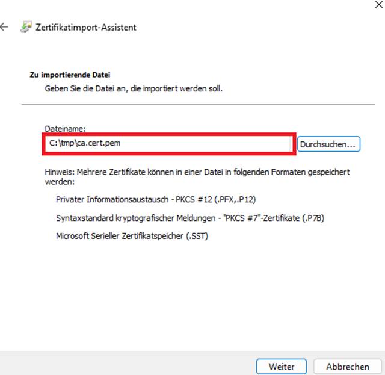

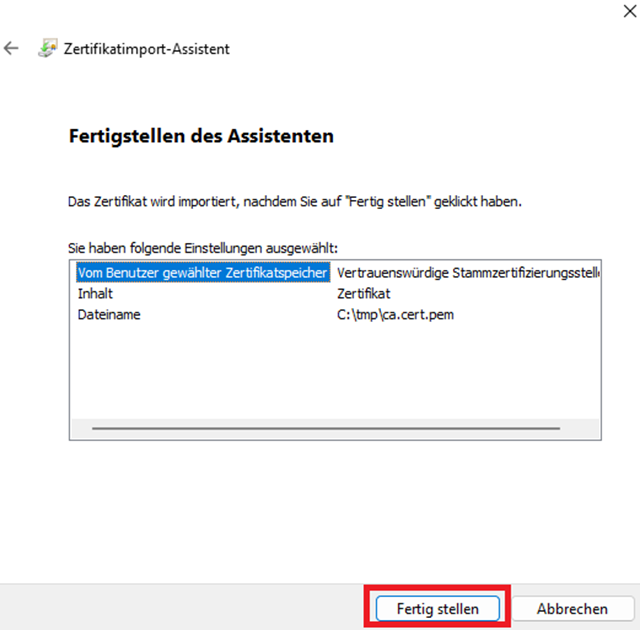
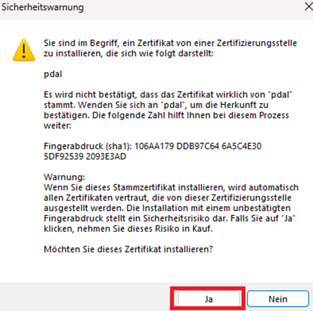
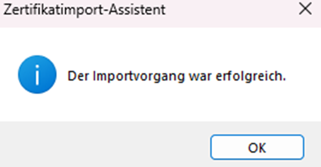

## 6. Summary and Recommendations

A SAN certificate for all services is quick and easy for small environments.

For production and more security: Create a separate certificate for each service (with its own CSR and signing).

Always store private keys securely\!

Distribute the CA certificate to all clients so that TLS connections are recognized as secure.

## Sources

  - "Eigene Zertifikate mit openssl — Linux und Open Source". Accessed: August 26, 2025. [Online]. Available at: [OpenSSL Basic Knowledge](https://www.grund-wissen.de/linux/server/openssl.html)
  - "CA › Wiki › ubuntuusers.de". Accessed: August 26, 2025. [Online]. Available at: [CA Wiki Ubuntuusers](https://wiki.ubuntuusers.de/CA/)

---

### License
This work is licensed under the **Creative Commons Attribution - ShareAlike 4.0 International License**.
 
[To the license text on the Creative Commons website](https://creativecommons.org/licenses/by-sa/4.0/legalcode.en)

