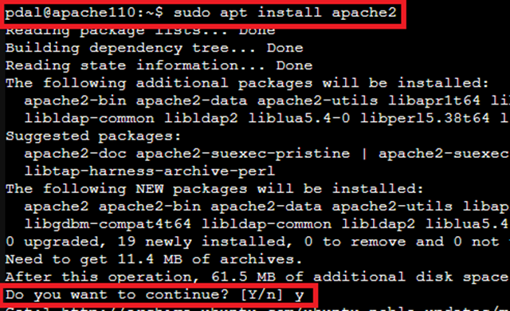
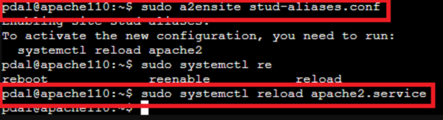

# 🧑‍💻 Apache2 Web Server & User Management in an LXC Container

This guide will show you step-by-step how to install the Apache2 web server, create users with different permissions, and configure Apache aliases in an already set up Ubuntu LXC container (`apache110`).

-----

Before we begin, we log into the Proxmox server via the web interface and then go to the console of container 110 through Proxmox.
Now we log in as pdal with the previously set password.


## 🌐 1. Installing Apache2

### Introduction to Apache2

**Apache2** is a widely used **web server** that receives HTTP requests from clients (e.g., web browsers) and delivers content based on them. It's part of the **open-source software family** and is used on many operating systems, especially Linux.

### Key Features of Apache2

  - **Website Delivery:** Provides HTML, PHP, or other web content via HTTP/HTTPS.
  - **Web Application Management:** Allows hosting dynamic web applications, often in conjunction with PHP, Python, or other server-side languages.
  - **Virtual Hosts:** Supports multiple websites on one server, each with its own domain name and web directory.
  - **Security and Configuration:** Offers modules for authentication, access control, encryption (SSL/TLS), and logging.

Apache2 is used to make **websites and web applications accessible to users**. It processes requests, delivers the corresponding files, and can dynamically generate content, for example, by integrating with PHP.

### A Quick Comparison to Nginx

  - **Architecture:** Apache2, in its default configuration, uses a **process-based or thread-based approach**, while Nginx uses an **event-driven, asynchronous model**.
  - **Performance:** Nginx is often **more resource-efficient and faster** with static content under high traffic, while Apache2 offers more flexibility with dynamic content.
  - **Configuration:** Apache2 relies heavily on modular, per-directory configuration (.htaccess), while Nginx uses centralized configuration files.
  - **Use Cases:** Apache2 is well-suited for classic PHP web applications, while Nginx is often used as a **reverse proxy** or for highly scalable web services.

### Update Package Lists

```bash
sudo apt update
```

This command updates the package information on the system.


-----

### Install Apache2

```bash
sudo apt install apache2 -y
```


This command installs the Apache2 web server and starts it automatically.
Check the status:

```bash
systemctl status apache2
```

-----

### Default Web Directory

After installation, the **default web directory** (Document Root) is located here:

```bash
/var/www/html
```

This directory contains the default website (`index.html`).
It can be accessed at `http://<server-ip>`.

-----

### The Meaning of a Web Directory

The web directory is the storage location for files that `Apache2` delivers via `HTTP`.

Example:

  - File: `/var/www/html/test.html`
  - Accessible in the browser: `http://<server-ip>/test.html`

-----

### Managing HTML Documents on the Apache Server

#### Creating Directly in the Document Root

Small HTML documents or simple test pages can be created directly on the server:

  - Write, save, and close the file in the console (e.g., Proxmox-\>LXC-\>Console or with SSH).
  - The page is then accessible in the browser at `http://<server-ip>/meineseite.html`.

<!-- end list -->

```bash
sudo nano /var/www/html/meineseite.html
```

#### For Larger Projects or Multiple Files

For more extensive websites or projects, it's more efficient to develop the files locally and upload them to the server via **FTP/SFTP**:

1.  Install an FTP client (e.g., FileZilla, WinSCP).

2.  Connect to the server:

      - Host: `<Server-IP>`
      - Username and password of the server account
      - Port: 22 for SFTP (secure)

3.  Select the local project directory.

4.  Upload the files to the server directory `/var/www/html/`.

5.  Check permissions and adjust if necessary:

<!-- end list -->

```bash
sudo chown -R www-data:www-data /var/www/html/mein_projekt
sudo chmod -R 755 /var/www/html/mein_projekt
```

The website will be available in the browser after uploading and setting the permissions.

Example content:

```html
<!DOCTYPE html>
<html lang="en">
<head>
  <meta charset="utf-8">
  content="width=device-width, initial-scale=1">
  <title>Apache Test Page</title>
  <meta name="description" content="A W3C-compliant example document to verify the Apache configuration">
</head>
<body>
  <header>
    <h1>Apache Test Page works!</h1>
  </header>
  <div>
    <p>This page serves as a simple function test of the web server.</p>
    <h2>Server Information</h2>
    <ul>
      <li>Document Root: <code>/var/www/html</code></li>
      <li>HTTP Status: OK</li>
    </ul>
  </div>
</body>
</html>
```

Save the file and close the editor.

**Testing**
Open in the browser:

```text
http://<server-ip/meineseite.html>
```

The message **"Apache Test Page works\!"** should appear, confirming that the web directory is correctly configured.

-----

## 2. Installing and Testing PHP

### Introduction

PHP (Hypertext Preprocessor) is a server-side scripting language specifically designed for web development. It allows you to create dynamic websites that can generate content based on user input, databases, or external systems.

**Advantages over static HTML pages**:

  - Content can be updated automatically (e.g., current news, user profiles, statistics).
  - Enables interaction with databases (e.g., MySQL, PostgreSQL).
  - Supports sessions and forms to provide user logins and personalized content.
  - Reduces maintenance effort, as content can be managed centrally and delivered dynamically.

### Install PHP and Required Modules

```bash
sudo apt update
sudo apt install php libapache2-mod-php php-cli -y
```

This installs PHP, the Apache2 PHP module, and the PHP CLI.

-----

#### Reload Apache

```bash
sudo systemctl reload apache2
```

-----

### Managing PHP Documents on the Apache Server

#### Creating a PHP Document Directly in the Document Root

Small PHP files or simple test scripts can be created directly on the server:

```bash
sudo nano /var/www/html/phpinfo.php
```

Example content:

```php
<?php
phpinfo();
?>
```

  - Save and close the file.
  - The PHP page is then accessible in the browser at `http://<server-ip>/phpinfo.php`.

**Testing**
Open in the browser:

```bash
http://<server-ip>/phpinfo.php
```

The PHP info page should appear, displaying information about the PHP installation.

#### For Larger PHP Projects or Multiple Files

For more extensive PHP projects, it's more efficient to develop the files locally and upload them to the server via **FTP/SFTP**:

1.  Install an FTP client (e.g., FileZilla, WinSCP).

2.  Connect to the server:

      - Host: `<Server-IP>`
      - Username and password of the server account
      - Port: 22 for SFTP (secure)

3.  Select the local project directory.

4.  Upload the files to the server directory `/var/www/html/`.

5.  Check permissions and adjust if necessary:

<!-- end list -->

```bash
sudo chown -R www-data:www-data /var/www/html/mein_projekt
sudo chmod -R 755 /var/www/html/mein_projekt
```

The PHP web application will be available in the browser after uploading and setting the permissions.

-----

## 📦 3. Create Groups (Optional)

On a Linux server, user groups are used to centrally manage permissions for multiple users. Groups simplify the management of file and directory access and determine which users can perform certain actions without having to assign rights to each user individually.

Why create groups on an Apache2 server?

1.  **`stud` Group**

      - This group can be created for students or developers who need to access specific web directories or files, especially when multiple users need access.
      - Members of this group can then be granted read or write permissions on web content without individual user adjustments.
      - Example: If `/var/www/html/my_website` belongs to the `stud` group, all group members can make changes to the files, while other users have only read permissions or no access at all.

2.  **`apacherestart` Group**

      - This group is used to control the permission to restart or reload Apache.
      - Not every user should be able to restart or reload the web server, as this affects live operations.
      - By creating the group and adding authorized users to it, management can be done securely and in a controlled manner.
      - Example: Members of the `apacherestart` group can restart the server via `sudo systemctl reload apache2` or `sudo systemctl restart apache2` without needing root privileges for all users.

### Advantages of Group Management

  - **Centralized Rights Management:** Permission changes only need to be made once for the group.
  - **Security:** Only specific users receive privileged rights (e.g., restarting the web server).
  - **Flexibility:** New users can be easily added to the appropriate group without manually adjusting file permissions.

> Note: The commands

```bash
sudo groupadd stud
sudo groupadd apacherestart
```

> create the groups. Error messages can be ignored if the groups already exist.


## 🔐 4. Sudo Rights for Apache Services

**Why set up sudo rights for Apache services?**

The Apache web server is typically run under a **non-privileged user** (`www-data`) to increase security. However, actions such as **restarting or reloading** the Apache service require **root privileges**, as they directly affect system services.

To avoid giving every user root privileges, the `apacherestart` group is used in this case:

  - Only members of this group are allowed to **restart or reload Apache services**.
  - Permissions are controlled via `sudo`, so authorized users get **temporarily elevated privileges** for these specific commands.
  - This increases security, as only authorized users can perform critical actions, while other users still have limited access.

> Advantage: No general root privileges are required; permission management is handled centrally via the `apacherestart` group.

We use `visudo` to set up sudo rights for specific users or user groups.

**Why `visudo` is used for sudo rights**
`visudo` is a **secure tool for editing the sudo configuration file** `/etc/sudoers`.

**Features and Advantages of `visudo`:**

  - **Syntax Check:** `visudo` checks for correct file formatting upon saving. Errors in `/etc/sudoers` can otherwise prevent any sudo commands from being executed.
  - **Locking Mechanism:** Only one user can edit the file at a time to prevent conflicts.
  - **Secure Configuration:** Changes to user or group rights are reliably applied without compromising the system.

**Connection to the `apacherestart` group:**

  - When sudo rights are set up for the `apacherestart` group, the `/etc/sudoers` file is modified.
  - `visudo` ensures that the new rule is correctly implemented, allowing group members to run Apache services with `sudo systemctl restart apache2` or `sudo systemctl reload apache2` without gaining root privileges for the entire system.

```bash
sudo visudo
```


Add the following lines at the end of the file:

```bash
%apacherestart ALL=(ALL) NOPASSWD: /bin/systemctl reload apache2
%apacherestart ALL=(ALL) NOPASSWD: /bin/systemctl restart apache2
```


Save with `Ctrl + O` followed by `Enter`.
Now, close the editor with `Ctrl + X`.

## 👤 5. Create User user1

In this step, a new user `user1` is created, assigned a home directory and the Bash shell, the password is set, and the user is added to both the `stud` group for web content access and the `apacherestart` group for restarting or reloading Apache services.

```bash
sudo useradd -m -d /home/user1 -s /bin/bash -g stud user1
echo "user1:mypassword" | sudo chpasswd
sudo usermod -aG apacherestart user1
```


## 📁 6. Set Up a Web Directory for user1

In this step, a personal web directory is created for the user `user1`, ownership rights are set to `user1` and the `stud` group, and the access rights of the home directory are adjusted so the user can access their web content. The default user does not have write permissions to the standard Apache2 web directory `/var/www/html/`.
For this reason, a web directory is created in the user's `/home` directory, which is then integrated into the Apache configuration.

```bash
sudo mkdir -p /home/user1/www
sudo chown user1:stud /home/user1/www
sudo chmod 755 /home/user1
```


## 🧩 7. Apache Alias Configuration for user1

### Goal

To set up an alias directory for a specific user (`user1`) so that the content of the `/home/user1/www` directory is accessible via a web browser.

### Creating a New Apache Configuration File

Open an editor of your choice (e.g., `nano`) and create the file:

```bash
sudo nano /etc/apache2/sites-available/stud-aliases.conf
```

Now, add the following content to the file.

```properties
<IfModule alias_module>
    Alias /user1 /home/user1/www
    <Directory /home/user1/www>
        Options Indexes FollowSymLinks
        AllowOverride All
        Require all granted
    </Directory>
</IfModule>
```

Save with `CTRL+O`, confirm with Enter, and close the editor with `CTRL+X`.


## 🌀 8. Enable & Reload Apache Site

```bash
sudo a2ensite stud-aliases.conf
sudo systemctl reload apache2
```



## ✅ Result

  - Apache2 is installed
  - User user1 has a web directory under /home/user1/www accessible via:

<!-- end list -->

```bash
http://<IP-des-Containers>/user1
```

user1 can reload Apache, e.g., with:

```bash
sudo systemctl reload apache2
```

🧪 Tips for Testing
Test web access:

```bash
curl http://localhost/user1
```

Apache status:

```bash
systemctl status apache2
```

## Sources

  - "Apache HTTP Server Version 2.4 Documentation - Apache HTTP Server Version 2.4." Accessed: September 22, 2025. [Online]. Available at: [apache doc](https://httpd.apache.org/docs/2.4/de/)
  - "Access Control - Apache HTTP Server Version 2.4." Accessed: September 24, 2025. [Online]. Available at: [Apache2 Access Control](https://httpd.apache.org/docs/2.4/de/howto/access.html)
  - "Apache HTTP Server Tutorial: .htaccess files - Apache HTTP Server Version 2.4." Accessed: September 24, 2025. [Online]. Available at: [Apache2 htaccess](https://httpd.apache.org/docs/2.4/de/howto/htaccess.html)
  - "Apache httpd Tutorial: Introduction to Server Side Includes - Apache HTTP Server Version 2.4." Accessed: September 24, 2025. [Online]. Available at: [Apache2 SSI](https://httpd.apache.org/docs/2.4/de/howto/ssi.html)
  - "Apache SSL/TLS Encryption - Apache HTTP Server Version 2.4." Accessed: September 24, 2025. [Online]. Available at: [Apache2 SSL/TLS](https://httpd.apache.org/docs/2.4/de/ssl/)
  - "Starting Apache - Apache HTTP Server Version 2.4." Accessed: September 24, 2025. [Online]. Available at: [Apache2 starten](https://httpd.apache.org/docs/2.4/de/invoking.html)
  - "Apache Tutorial: Dynamic Content with CGI - Apache HTTP Server Version 2.4." Accessed: September 24, 2025. [Online]. Available at: [Apache2 CGI](https://httpd.apache.org/docs/2.4/de/howto/cgi.html)
  - "Authentication and Authorization - Apache HTTP Server Version 2.4." Accessed: September 24, 2025. [Online]. Available at: [Apache2 Authentication](https://httpd.apache.org/docs/2.4/de/howto/auth.html)
  - "Server-Wide Configuration - Apache HTTP Server Version 2.4." Accessed: September 24, 2025. [Online]. Available at: [Apache2 Server Konfiguration](https://httpd.apache.org/docs/2.4/de/server-wide.html)
  - "Configuration Files - Apache HTTP Server Version 2.4." Accessed: September 24, 2025. [Online]. Available at: [Apache2 Konfigurationsdateien](https://httpd.apache.org/docs/2.4/de/configuring.html)
  - "Getting Started - Apache HTTP Server Version 2.4." Accessed: September 24, 2025. [Online]. Available at: [Apache2 getting started](https://httpd.apache.org/docs/2.4/de/getting-started.html)
  - "Command Overview › Shell › Wiki › ubuntuusers.de." Accessed: August 20, 2025. [Online]. Available at: [Shell Commands](https://wiki.ubuntuusers.de/Shell/Befehls%C3%BCbersicht/)

---

### License
This work is licensed under the **Creative Commons Attribution - ShareAlike 4.0 International License**.
 
[To the license text on the Creative Commons website](https://creativecommons.org/licenses/by-sa/4.0/legalcode.en)
