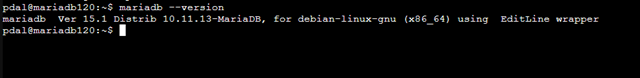
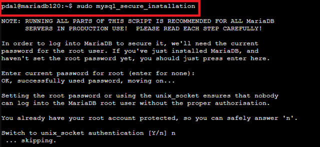
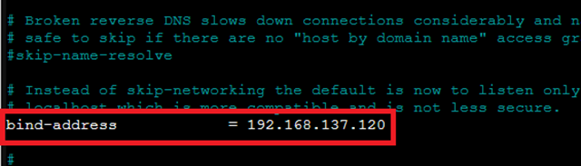
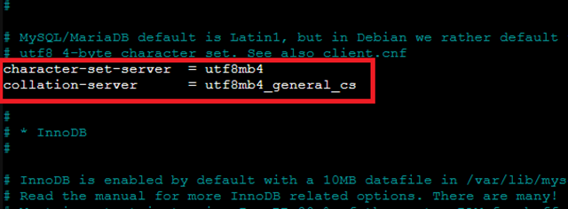
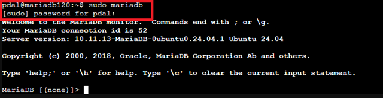
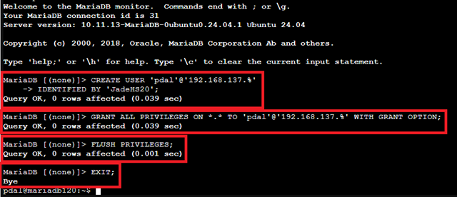

# 📄 Installation and Configuration of MariaDB in an LXC Container

## Introduction

MariaDB is a powerful, open-source **Relational Database Management System (RDBMS)** that was developed as a free fork of **MySQL**. It originated after Oracle acquired MySQL, aiming to ensure its openness and community-driven development.

MariaDB is used anywhere structured data needs to be stored, processed, and queried—from small web applications to large enterprise systems. Typical use cases include:

  - **Web Applications**: Storing user data, content, and configuration data.
  - **Business Applications**: Managing orders, customer data, or inventories.
  - **Data Analysis & Reporting**: Serving as the foundation for Business Intelligence tools.
  - **Cloud and Container Environments**: As a scalable, highly available database solution.

Due to its high compatibility with MySQL, good performance, replication, and clustering features, MariaDB is one of the most popular databases in the open-source world.

> **ℹ️ Note on Terminology:**
> Although MariaDB is an independent database management system, terms like **`mysql`** are often still used in the command line and tools—for example, with commands like `mysql_secure_installation` or the database client `mysql`.
> The reason for this is the complete compatibility with MySQL: MariaDB intentionally uses the same command names and interfaces so that existing applications, scripts, and documentation can be reused without changes.
> The appearance of the term "mysql" therefore does not mean that MySQL is installed—it is merely retained naming to ensure compatibility.

-----

## 🧾 Prerequisites

  - LXC container with Ubuntu 20.04/22.04/24.04 (tested with Ubuntu 24.04)
  - Network access to the container
  - Root or **`sudo`** permissions
  - User `pdal` set up with sudo rights

-----

## 🧱 1. Update Package List

```bash
sudo apt update
```

## 📦 2. Install MariaDB

```bash
sudo apt install mariadb-server -y
```


Check the installation:

```bash
mariadb --version
```



## 🚀 3. Start and Enable MariaDB Service

```bash
sudo systemctl start mariadb
sudo systemctl enable mariadb
```


Check status:

```bash
sudo systemctl status mariadb
```


After starting and enabling the MariaDB service, the database server is now running in the background and is accessible via localhost by default. This means that local applications or commands like `mysql -u root -p` can immediately establish a connection to the database.

In the next steps, the database will first be secured to prevent unauthorized access. The integrated security script is executed for this purpose: `sudo mysql_secure_installation`

This script helps set a root password, remove anonymous users, disable remote root login, and delete the test database. Only after this will the necessary adjustments be made to allow secure **remote access** to the database.

## 🔐 4. Secure MariaDB

```bash
sudo mysql_secure_installation
```

**Recommended Answers**:

> switch to unix socket authentication? **N**
>
> change root password? **Y**
>
> Remove anonymous users? **Y**
>
> Disallow root login remotely? **Y** (for production systems)
>
> Remove test database and access to it? **Y**
>
> Reload privilege tables? **Y**




## 🌐 5. Allow Remote Access (Optional)

> Allow external connections, e.g., from a web server container. The listen address needs to be changed for this.

Adjust the configuration file:

```bash
sudo nano /etc/mysql/mariadb.conf.d/50-server.cnf
```

Find the following line:

`bind-address = 127.0.0.1`


Change it to:

`bind-address = 192.168.137.120` (IP address of your own LXC container)



> 🔎 Explanation:
> With this change, the MariaDB server no longer listens only on localhost but also on the specified container IP address (192.168.137.120).
> This makes the database accessible from the local network, e.g., from another LXC container or an external server.
> A client can now connect using the following command: `mysql -h 192.168.137.120 -u USERNAME -p`
> ⚠️ Important: For connections from external clients, the firewall (if active) must also allow access to port 3306/tcp. Furthermore, the database user must have corresponding privileges for **%** (all hosts) or the specific IP of the client.

> Alternatively, you can use the IP address **`0.0.0.0`**. This tells MariaDB to listen on all ports. This option is recommended if you use a DHCP/DNS server and cannot ensure that the container/server always receives the same IP address.

## 🔤 6. Define Default Character Set and Collation

> **ℹ️ Introduction:**
> In a database, the **default character set** (`character set`) and **collation** (`collation`) define how text data is stored, compared, and sorted.
>
>   - The **character set** defines which characters can be stored at all (e.g., letters, numbers, special characters, emojis).
>   - **Collation** determines how these characters are compared, e.g., whether case is considered or which sorting order is used.
>
> A consistent setting for character set and collation is important to avoid problems with queries, comparisons, and data migrations, and to ensure that all applications interpret the data correctly.

For safety, add or adjust the character set and collation parameters in the same configuration file (section `[mysqld]`):

Before:

```bash
character-set-server = utf8mb4
collation-server = utf8mb4_general_cs
```

Change to:

```bash
character-set-server = utf8mb4
collation-server = utf8mb4_general_ci
```



> **🔎 Explanation:**
> **`character-set-server = utf8mb4`** ensures that the database uses the modern UTF-8 character set by default, which supports all Unicode characters (e.g., emojis or special characters).
> For collation, there are two variants:
>
>   - `utf8mb4_general_cs` → **case-sensitive**, case is considered during comparison (e.g., "Test" ≠ "test").
>   - **`utf8mb4_general_ci`** → **case-insensitive**, case is not considered (e.g., "Test" = "test").
>     The **`utf8mb4_general_ci`** setting is commonly used because it is more practical for most use cases like usernames, logins, or search functions.


Then restart MariaDB:

```bash
sudo systemctl restart mariadb
```

## 👤 7. Create MariaDB User for External Access

> **ℹ️ Introduction:**
> In this step, a database user is created who can access MariaDB from an external computer or container. This is a **pure database user** who does not necessarily have to exist as a system user (`pdal`) on the server. The name and password can be chosen freely.
> With the privileges set (`GRANT ALL PRIVILEGES`), the user gains access to all databases and tables and can grant privileges to other users.

Log in to the database:

```bash
sudo mariadb
```



Create user and set privileges:

```sql
CREATE USER 'pdal'@'192.168.137.%' IDENTIFIED BY 'JadeHS20';
GRANT ALL PRIVILEGES ON *.* TO 'pdal'@'192.168.137.%' WITH GRANT OPTION;
FLUSH PRIVILEGES;
EXIT;
```

**🔎 Explanation of Commands:**

  - `CREATE USER 'pdal'@'192.168.137.%' IDENTIFIED BY 'JadeHS20';`
    Creates a new database user named `pdal` who can connect from all IP addresses in the network range `192.168.137.*`, with the password `JadeHS20`.
  - `GRANT ALL PRIVILEGES ON *.* TO 'pdal'@'192.168.137.%' WITH GRANT OPTION;`
    Grants all rights on all databases and tables to this user. With `WITH GRANT OPTION`, the user can also grant privileges to other users.
  - `FLUSH PRIVILEGES;`
    Updates the privileges so that the changes take effect immediately.
  - `EXIT;`
    Disconnects from the MariaDB database and returns to the shell.



> Note: If access from outside the local network is required (e.g., from the client PC), 'pdal'@'%' would have to be used. This allows any IP address.

## 🔍 8. Check Port Release (Optional)

The standard port for MariaDB is **3306**. Test with:

```bash
ss -tulpen | grep 3306
```

The output of the command `ss -tulpen | grep 3306` shows the network connections (or sockets) that are active on port 3306 (standard port for MySQL/MariaDB). You used the options -tulpen:

> \-t: TCP
> \-u: UDP
> \-l: only listening sockets
> \-p: show process information
> \-e: extended information (e.g., inode, sk)
> \-n: show IPs/Ports instead of DNS names

Explanation of your line (broken down):

```bash
tcp   LISTEN 0      80     192.168.137.120:3306      0.0.0.0:*    uid:108 ino:27953 sk:2005 cgroup:/system.slice/mariadb.service <->
```

| Column / Field | Meaning |
| :--- | :--- |
| `tcp` | Protocol: TCP |
| `LISTEN` | Socket state: listening for incoming connections |
| `0` | `Recv-Q`: Receive Queue (0 = nothing waiting for processing) |
| `80` | `Send-Q`: Send Queue (e.g., waiting packets; almost always \>0 for LISTEN) |
| `192.168.137.120:3306` | IP address and port (MariaDB is listening here on this interface/port) |
| `0.0.0.0:*` | Remote Address/Port: accepts connections from all IPs (all clients) |
| `uid:108` | UID of the process (User, e.g., `mysql` or `mariadb`) |
| `ino:27953` | Inode number of the socket (for internal management in the kernel) |
| `sk:2005` | Socket ID (reference to kernel socket, useful for debugging) |
| `cgroup:/system.slice/mariadb.service` | CGroup (Systemd service `mariadb.service`) |
| `<->` | Placeholder (irrelevant for LISTEN as no counterparty exists) |

Summary:

✅ What this specifically means:

  - MariaDB has started successfully
  - is listening on Port **3306**
  - on all network interfaces, i.e.:
      - 127.0.0.1 (localhost)
      - 192.168.137.120 (your container IP)
      - possibly other local IPs
  - Connections from the network (e.g., 192.168.137.0/24) are possible – provided that:
      - the user is correctly set up (in our case, pdal@192.168.137.%)
      - there is no firewall rule blocking access

🔐 Tip: Test Access

From another host in the same network:

```bash
mysql -u pdal -p -h 192.168.137.120
```


A minimalist Mariadb client is required for this. You can use the **`mariadb-client-core`**.
To do this, simply enter the following in another container:

```bash
sudo apt install mariadb-client-core
```

and confirm with `y`.

If this works: ✅ Network access is functional.

If not: Check if a firewall (e.g., ufw or iptables) is blocking the port on the client:

```bash
sudo ufw status
```

Our applications can now automatically reach MariaDB directly (e.g., direct access from our programs).
For manual access, we will set up phpMyAdmin to administer MariaDB in the next document.

## Sources

  - "MariaDB Documentation | MariaDB Documentation". Accessed: September 25, 2025. [Online]. Available at: [MariaDB Documentation](https://mariadb.com/docs)
  - "Installing MariaDB Server Guide | MariaDB Documentation". Accessed: September 25, 2025. [Online]. Available at: [MariaDB Server Installation](https://mariadb.com/docs/server/mariadb-quickstart-guides/installing-mariadb-server-guide)
  - "Connecting to MariaDB Server | MariaDB Documentation". Accessed: September 25, 2025. [Online]. Available at: [Connecting MariaDB Server](https://mariadb.com/docs/server/server-usage/connecting/mariadb-connecting-guide-1)
  - "Essential Queries Guide | MariaDB Documentation". Accessed: September 25, 2025. [Online]. Available at: [Essential Querries Guide](https://mariadb.com/docs/server/mariadb-quickstart-guides/mariadb-advanced-sql-guide)
  - "Server Management | MariaDB Documentation". Accessed: September 25, 2025. [Online]. Available at: [Server Management](https://mariadb.com/docs/server/server-management)
  - "Security | MariaDB Documentation". Accessed: September 25, 2025. [Online]. Available at: [Security](https://mariadb.com/docs/server/security)

---

### License
This work is licensed under the **Creative Commons Attribution - ShareAlike 4.0 International License**.
 
[To the license text on the Creative Commons website](https://creativecommons.org/licenses/by-sa/4.0/legalcode.en)
