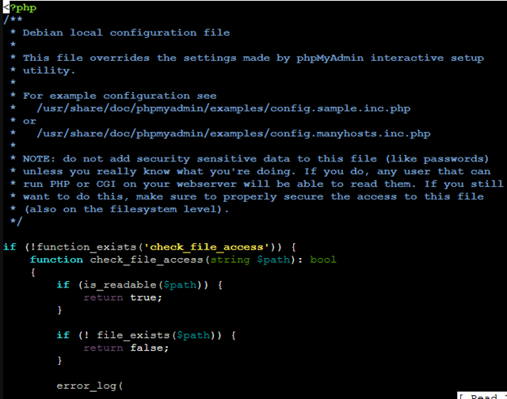
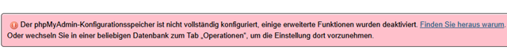
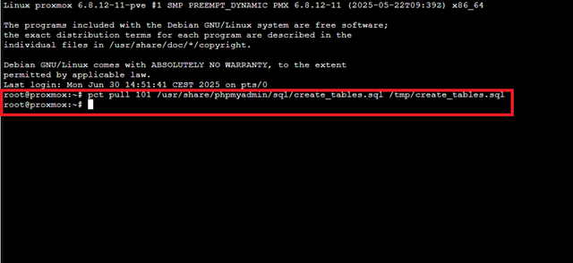
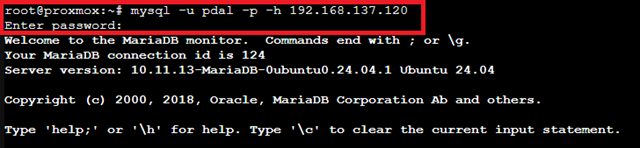
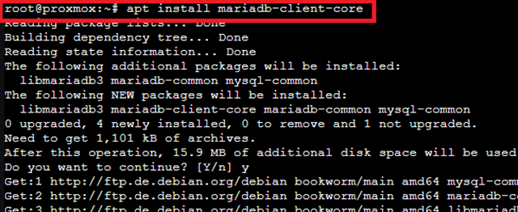
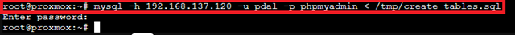
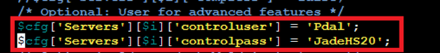
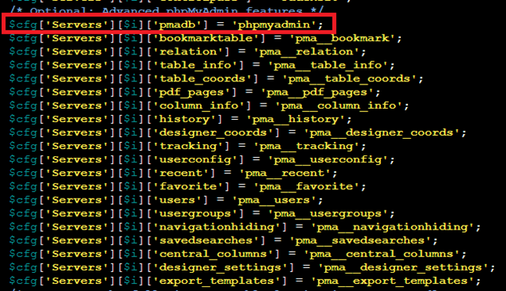
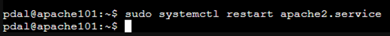

# 📘 Installation and Configuration of phpMyAdmin in an Apache2 LXC (MariaDB in Separate Container)

## Introduction to phpMyAdmin

phpMyAdmin is a **web-based administration interface** for MySQL and MariaDB databases. It allows users to easily create, manage, and edit databases via a browser without having to use the command line directly.

Typical uses of phpMyAdmin include:

  - **Database Administration:** Creating, deleting, and editing databases and tables.
  - **Data Management:** Inserting, editing, or deleting data records.
  - **SQL Queries:** Executing SQL commands and queries directly through the user interface.
  - **Backup and Restore:** Exporting and importing databases for backups or migrations.
  - **User and Privilege Management:** Creating database users and assigning permissions.

phpMyAdmin is primarily used to simplify database management for administrators and developers and is especially common in web server environments.

## 🔧 Prerequisites

  - Apache2 is installed and running in the container.
  - MariaDB is running in a separate LXC container (`mariadb`) and is configured to accept **external connections** (e.g., `bind-address = 192.168.137.120`) and has an admin user.
  - The containers are on the same network.

-----

## 📦 1. Install phpMyAdmin in the Web Server Container

💡 Note: "phpMyAdmin" is a PHP web application that runs on an existing web server (e.g., Apache or Nginx). Therefore, phpMyAdmin cannot be started "alone" in a container—it always requires a web server and an existing database connection to function.

```bash
apt update
apt install -y phpmyadmin php-mysql
```


💡 During Installation:

Web server selection: If prompted, select **apache2** (Spacebar → Tab → OK).


Database configuration with dbconfig-common: → Select **No**, as MariaDB is running externally.


If the web server selection doesn't appear, manually link phpMyAdmin:

```bash
ln -s /usr/share/phpmyadmin /var/www/html/phpmyadmin
```

Then restart Apache:

```bash
systemctl restart apache2
```

-----

## ⚙️ 2. Configure Remote MariaDB Connection in phpMyAdmin

Edit the configuration file:

```bash
sudo nano /etc/phpmyadmin/config.inc.php
```


Füge unterhalb der Zeile:

Add the following below the line:

```bash
if (empty($dbserver)) $dbserver = 'localhost';
```

Add:

```bash
$cfg['Servers'][$i]['host'] = '192.168.137.120'; // IP address of the MariaDB container
$cfg['Servers'][$i]['connect_type'] = 'tcp';
```


> 📌 **Adjust the IP address** to the actual address of the MariaDB container.

Save and close `Ctrl + O` -\> `Enter` -\> `Ctrl + X`.

-----

## 🔄 3. Restart Apache

```bash
systemctl restart apache2
```

-----

## 🌐 4. Access phpMyAdmin in the Browser

Open in the browser:

`http://IP-of-phpMyAdmin-Container/phpmyadmin`

Example:

`http://192.168.137.101/phpmyadmin`

Log in with the MySQL/MariaDB user who has access from the phpMyAdmin container.


-----

## 🧪 5. Troubleshooting

> Note: This error should only occur if you have not completely executed the script "Installation and Configuration of MariaDB in the LXC Container." If you have created the user correctly, check connectivity to the database LXC.

❌ Access denied

> Switch to the MariaDB container and ensure that the user in MariaDB is correctly enabled for our local network:

```sql
CREATE USER 'pdal'@'192.168.137.120' IDENTIFIED BY 'JadeHS20';
GRANT ALL PRIVILEGES ON *.* TO 'pdal'@'192.168.137.120' WITH GRANT OPTION;
FLUSH PRIVILEGES;
```

✅ Conclusion

phpMyAdmin is now ready and connects to the external MariaDB database. You can manage databases, create users, make backups, etc., via the web interface.

-----

Currently, a notice is displayed in the phpMyAdmin WebGUI indicating that the configuration storage is not fully configured.
This will be explained in the following steps.




## 6\. Setting up the phpMyAdmin Configuration Storage (Advanced Features)

### Goal

Set up the internal phpMyAdmin configuration storage to enable advanced features such as Designer, Bookmarks, and Relation display.

-----

### Prerequisites

  - **Apache Container (where phpMyAdmin runs)**: CTID `101`, Hostname: `apache101`
  - **MariaDB Container (where the MySQL database runs)**: e.g., CTID `120`
  - **Database access user exists** with all privileges
  - Access data for phpMyAdmin configuration storage:
      - Username: `pdal`
      - Password: `JadeHS20`

-----

### Step 6.1: Copy SQL file from Apache Container to Host

💡 **Explanation:**

phpMyAdmin requires specific internal tables in the database to support features like Bookmarks, Relations, or PDF export. These tables are defined by the file `create_tables.sql`. Since in our environment **phpMyAdmin runs in the Apache container** but the **MariaDB runs in a separate container**, phpMyAdmin **cannot create the tables directly itself**.

We therefore use the safe and simple path via the Host (Proxmox):

```bash
pct pull 101 /usr/share/phpmyadmin/sql/create_tables.sql /tmp/create_tables.sql
```



  - The file is retrieved from CT 101 to the Host under `/tmp/create_tables.sql`.
  - It is now outside the containers on the Host and can be further used as needed.

### Step 6.2: Copy SQL file to the MariaDB Container

```bash
pct push 120 /tmp/create_tables.sql /tmp/create_tables.sql
```


  - Pushes the file to CT 120 so that MariaDB can execute it.
  - The tables can then be created using MySQL commands.

💡 **Alternative Methods:**

  - Direct transfer from container to container over the network (e.g., via `scp`)
  - Use of a shared directory mounted by both containers
  - Direct download of the SQL file within the MariaDB container

These methods are possible but require more network or configuration effort. The **Host intermediate step** is therefore **simple, safe, and reproducible**.

### Step 6.3: Create Configuration Database in MariaDB

💡 **Explanation:**

Although the MariaDB database runs in a separate container (CT 120), we access the database **via the Proxmox Host** instead of entering the container directly:

  - **Central Access:** From the Host, we can reach every container directly without having to log in first.
  - **No unnecessary container login:** MariaDB accepts network connections, so the MySQL client is sufficient.
  - **Flexibility:** Multiple containers and databases can be reached simultaneously from the Host.

💡 **Alternative Method:**

  - Direct access in the container via `pct exec 120 -- mysql ...` or `pct enter 120`.
  - Advantage: directly in the container.
  - Disadvantage: additional steps, less centralized.

Log in to the MariaDB container **from the Proxmox Host**:

```bash
mysql -u pdal -p -h 192.168.137.120
```



Prerequisite: we have installed the mariadb-client-core (on the Proxmox Host)



At the MySQL prompt:

```sql
CREATE DATABASE phpmyadmin;
EXIT;
```

### Step 6.4: Execute SQL File and Create Tables

💡 **Explanation:**

In this step, we execute the previously copied SQL file `create_tables.sql` in the MariaDB container. This creates the necessary tables for phpMyAdmin.

1.  **Establish connection to MariaDB (from Proxmox Host):**

  ` bash   mysql -h 192.168.137.120 -u pdal -p phpmyadmin < /tmp/create_tables.sql    `

  - `-h 192.168.137.120` → Address of the MariaDB container
  - `-u pdal` → User with privileges to create the phpMyAdmin tables
  - `-p` → Password prompt for the user
  - `phpmyadmin` → Database where the tables will be created

2.  **Execute the SQL file:**

<!-- end list -->

  - All tables and structures defined in `create_tables.sql` are automatically created in the `phpmyadmin` database.
  - This activates the extended features of phpMyAdmin such as Bookmarks, PDF Export, and Relation features.

<!-- end list -->

3.  **No manual input necessary:**

<!-- end list -->

  - The file contains all `CREATE TABLE` commands, so no SQL commands need to be entered individually.

💡 **In Summary:**

  - With this step, we initialize the phpMyAdmin-specific tables in the database so that the web interface can be used correctly and completely.



### Step 6.5: Grant Privileges to User Pdal for Configuration Storage

> Note: The user `pdal` already exists and has full privileges, so creating a new user is omitted.

### Step 6.6: Adjust phpMyAdmin Configuration

Open the file on the Apache container:

```bash
sudo nano /etc/phpmyadmin/config.inc.php
```

Add the following lines (replace existing lines with the following lines if they differ):

```bash
$cfg['Servers'][$i]['controluser'] = 'pdal';
$cfg['Servers'][$i]['controlpass'] = 'JadeHS20';
$cfg['Servers'][$i]['pmadb'] = 'phpmyadmin';
$cfg['Servers'][$i]['bookmarktable'] = 'pma__bookmark';
$cfg['Servers'][$i]['relation'] = 'pma__relation';
$cfg['Servers'][$i]['table_info'] = 'pma__table_info';
$cfg['Servers'][$i]['table_coords'] = 'pma__table_coords';
$cfg['Servers'][$i]['pdf_pages'] = 'pma__pdf_pages';
$cfg['Servers'][$i]['column_info'] = 'pma__column_info';
$cfg['Servers'][$i]['history'] = 'pma__history';
$cfg['Servers'][$i]['designer_coords'] = 'pma__designer_coords';
$cfg['Servers'][$i]['tracking'] = 'pma__tracking';
$cfg['Servers'][$i]['userconfig'] = 'pma__userconfig';
$cfg['Servers'][$i]['recent'] = 'pma__recent';
$cfg['Servers'][$i]['favorite'] = 'pma__favorite';
$cfg['Servers'][$i]['users'] = 'pma__users';
$cfg['Servers'][$i]['usergroups'] = 'pma__usergroups';
$cfg['Servers'][$i]['navigationhiding'] = 'pma__navigationhiding';
$cfg['Servers'][$i]['savedsearches'] = 'pma__savedsearches';
$cfg['Servers'][$i]['central_columns'] = 'pma__central_columns';
$cfg['Servers'][$i]['designer_settings'] = 'pma__designer_settings';
$cfg['Servers'][$i]['export_templates'] = 'pma__export_templates';
```






### Step 6.7: Restart Apache in the Container

```bash
systemctl restart apache2
```



Result

After setup, the warning message in phpMyAdmin should be gone:

> "The phpMyAdmin configuration storage is not completely configured, some extended features have been deactivated."

Additional features like Designer and Relations are now available.

-----

## Task (Optional): Set up an Alias for PhpMyAdmin

The document "Apache2 Web Server & User Management in the LXC Container" explains how to set up an alias.

Move the PhpMyAdmin directory from `/var/www/html/phpmyadmin` to `/var/www/phpmyadmin` and set up an **Alias** for PhpMyAdmin.
This keeps the HTML directory free for your applications.

## Sources

  - "Introduction — phpMyAdmin 6.0.0-dev documentation". Accessed: September 25, 2025. [Online]. Available at: [Introduction](https://docs.phpmyadmin.net/de/latest/intro.html)
  - "Requirements — phpMyAdmin 6.0.0-dev documentation". Accessed: September 25, 2025. [Online]. Available at: [Requirements](https://docs.phpmyadmin.net/de/latest/require.html)
  - "Installation — phpMyAdmin 6.0.0-dev documentation". Accessed: September 25, 2025. [Online]. Available at: [Installation](https://docs.phpmyadmin.net/de/latest/setup.html)
  - "Configuration — phpMyAdmin 6.0.0-dev documentation". Accessed: September 25, 2025. [Online]. Available at: [Configuration](https://docs.phpmyadmin.net/de/latest/config.html)
  - "User Guide — phpMyAdmin 6.0.0-dev documentation". Accessed: September 25, 2025. [Online]. Available at: [User Guide](https://docs.phpmyadmin.net/de/latest/user.html)
  - "FAQ - Frequently Asked Questions — phpMyAdmin 6.0.0-dev documentation". Accessed: September 25, 2025. [Online]. Available at: [FAQ](https://docs.phpmyadmin.net/de/latest/faq.html)

---

### License
This work is licensed under the **Creative Commons Attribution - ShareAlike 4.0 International License**.
 
[To the license text on the Creative Commons website](https://creativecommons.org/licenses/by-sa/4.0/legalcode.en)
