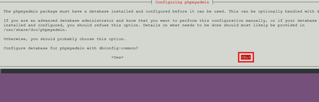
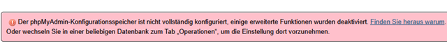

# 📘 Installation and Configuration of phpMyAdmin in the Apache2 LXC (MariaDB in a separate Container)

## Introduction to phpMyAdmin

phpMyAdmin is a web-based administration interface for MySQL and MariaDB databases. It allows users to easily create, manage, and edit databases via a browser without having to use the command line directly.

Typical Use Cases for phpMyAdmin include:

  * **Database Administration:** Creating, deleting, and editing databases and tables.
  * **Data Management:** Inserting, editing, or deleting data records.
  * **SQL Queries:** Executing SQL commands and queries directly via the user interface.
  * **Backup and Recovery:** Exporting and importing databases for backups or migrations.
  * **User and Permissions Management:** Creating database users and assigning permissions.

phpMyAdmin is primarily used to simplify database management for administrators and developers and is especially common in web server environments.

-----

## 🔧 Prerequisites

  * Apache2 is installed and running in the container.
  * MariaDB is running in a separate LXC container (`mariadb`) and is configured to accept external connections (e.g., `bind-address = 192.168.137.120`) and has an Admin user.
  * The containers are located in the same network.

-----

## 📦 1. Install phpMyAdmin in the Web Server Container

💡 Note: "phpMyAdmin" is a **PHP web application** that runs on an existing web server (e.g., Apache or Nginx). Therefore, phpMyAdmin cannot be started "alone" in a container—it always requires a web server and an existing database connection to function.

```bash
apt update
apt install -y phpmyadmin php-mysql
```


💡 During Installation:

**Web server selection:** When prompted, select **apache2** (Spacebar → Tab → OK).


**Database configuration with dbconfig-common:** → **No**, as MariaDB is running externally.



If the web server selection does not appear, manually link phpMyAdmin:

```bash
ln -s /usr/share/phpmyadmin /var/www/html/phpmyadmin
```

Afterward, restart Apache:

```bash
systemctl restart apache2
```

-----

## ⚙️ 2. Configure Remote MariaDB Connection in phpMyAdmin

Since we are running MariaDB in a separate container, phpMyAdmin needs to know that the database server is not **`localhost`** but the **external IP** of the MariaDB container.

Edit the configuration file **`config-db.php`**, as this contains the primary server variables used by `config.inc.php`:

```bash
sudo nano /etc/phpmyadmin/conf.d/config-db.php
```

In this file, find the line defining the server and enter the IP address of the MariaDB container (e.g., `192.168.137.120`).

**Attention:** The content of this file may vary. Typically, the relevant part for defining the database host looks like this:

```php
// Add this line to the file or change the existing host definition:
$dbserver = '192.168.137.120'; // IP address of the MariaDB container
```

> **📌 Important Change:** The phpMyAdmin web server now connects via TCP to the specified IP. Since `$dbserver` is no longer `'localhost'`, `connect_type = 'tcp'` is automatically set in `config.inc.php`.

Save and close (`Ctrl + O` -\> `Enter` -\> `Ctrl + X`).

-----

## 🔄 3. Restart Apache

```bash
systemctl restart apache2
```

-----

## 🌐 4. Access phpMyAdmin in the Browser

Open in your browser:

`http://IP-of-the-phpMyAdmin-Container/phpmyadmin`

Example:

`http://192.168.137.101/phpmyadmin`

Log in with the MySQL/MariaDB user that has access from the phpMyAdmin container.


-----

## 🧪 5. Troubleshooting

> Note: this error should only occur if you have not fully executed the script "Installation and Configuration of MariaDB in the LXC Container."
> If you have correctly created the user, check connectivity to the database LXC.

❌ Access denied

> Switch to the MariaDB container and ensure that the user in MariaDB is correctly granted access for our local network:

```sql
CREATE USER 'pdal'@'192.168.137.%' IDENTIFIED BY 'JadeHS20';
GRANT ALL PRIVILEGES ON *.* TO 'pdal'@'192.168.137.%' WITH GRANT OPTION;
FLUSH PRIVILEGES;
```

> Note: If you only want to allow access from one LXC container, change the last octet of the IP address from 'pdal'@'192.168.137.%' to 'pdal'@'192.168.137.123' (IP of the container from which access should be granted). This would significantly increase security.

✅ Conclusion

phpMyAdmin is now ready and connects to the external MariaDB database. You can manage databases, create users, make backups, etc., via the web interface.

-----

Currently, we see a notice in the phpMyAdmin WebGUI stating that the configuration storage is not fully configured.
This is explained in the following steps.




## 6\. Setting up the phpMyAdmin Configuration Storage (Advanced Features)

Set up the internal phpMyAdmin configuration storage to use advanced features such as Designer, Bookmarks, and Relation View.

💡 **Explanation:**

phpMyAdmin requires certain internal tables in the database to support features like Bookmarks, Relations, or PDF export. These tables are defined by the `create_tables.sql` file. Since **phpMyAdmin is running in the Apache container** in our environment, but **MariaDB is in a separate container**, phpMyAdmin cannot **directly create the tables itself**.

We therefore choose the secure and simple path via the web interface:

  * Go to the **"Databases"** tab.
  * Under "Create new database," enter the name **`phpmyadmin`**. Click "Create."
  * You are automatically taken to the newly created database; otherwise, select the **`phpmyadmin`** database.
  * Go to the **"More"** tab (or **"Operations"** tab, depending on the version).
  * At the top, there is a message: "The phpMyAdmin configuration storage is not completely configured, some extended features have been deactivated." Click on the link **"Find out why."**
  * Now click on **"Create"** and the tables will be created automatically.

The configuration is complete.

💡 **In Summary:**

  * This step initializes the phpMyAdmin-specific tables in the database so that the web interface can be used correctly and completely.

-----

## Optional Task: Set up an Alias for PhpMyAdmin

The document "Apache2 Webserver & User Management in the LXC Container" explains how to set up an alias.

Move the phpMyAdmin directory from `/var/www/html/phpmyadmin` to `/var/www/phpmyadmin` and set up an **Alias** for phpMyAdmin. This keeps the HTML directory free for your applications.

-----

## Sources

  * "Introduction — phpMyAdmin 6.0.0-dev documentation". Accessed: September 25, 2025. [Online]. Available at: [Einführung](https://docs.phpmyadmin.net/de/latest/intro.html)
  * "Requirements — phpMyAdmin 6.0.0-dev documentation". Accessed: September 25, 2025. [Online]. Available at: [Anforderungen](https://docs.phpmyadmin.net/de/latest/require.html)
  * "Installation — phpMyAdmin 6.0.0-dev documentation". Accessed: September 25, 2025. [Online]. Available at: [Installation](https://docs.phpmyadmin.net/de/latest/setup.html)
  * "Configuration — phpMyAdmin 6.0.0-dev documentation". Accessed: September 25, 2025. [Online]. Available at: [Konfiguration](https://docs.phpmyadmin.net/de/latest/config.html)
  * "User Guide — phpMyAdmin 6.0.0-dev documentation". Accessed: September 25, 2025. [Online]. Available at: [Benutzerhandfbuch](https://docs.phpmyadmin.net/de/latest/user.html)
  * "FAQ - Frequently Asked Questions — phpMyAdmin 6.0.0-dev documentation". Accessed: September 25, 2025. [Online]. Available at: [FAQ](https://docs.phpmyadmin.net/de/latest/faq.html)

-----

### License

This work is licensed under the **Creative Commons Attribution - ShareAlike 4.0 International License**.

[Link to the license text on the Creative Commons website](https://creativecommons.org/licenses/by-sa/4.0/legalcode.de)
