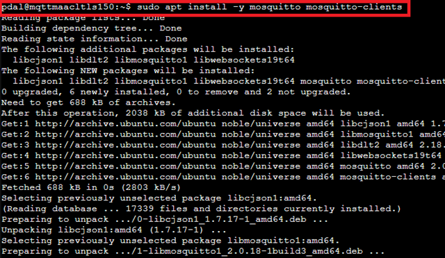
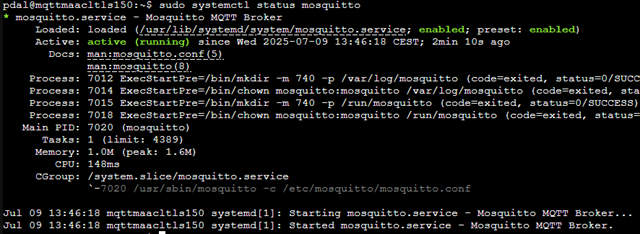
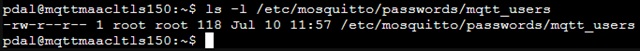
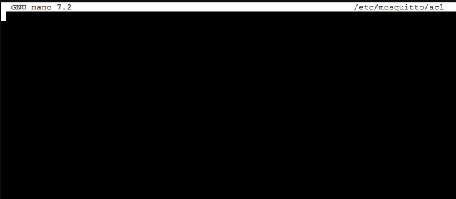
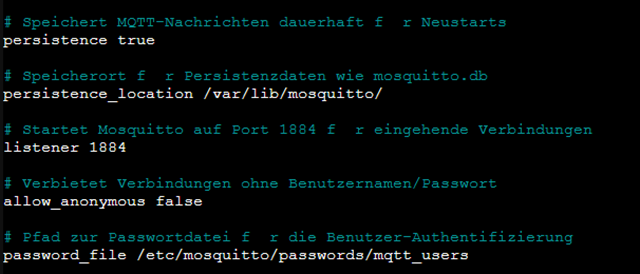
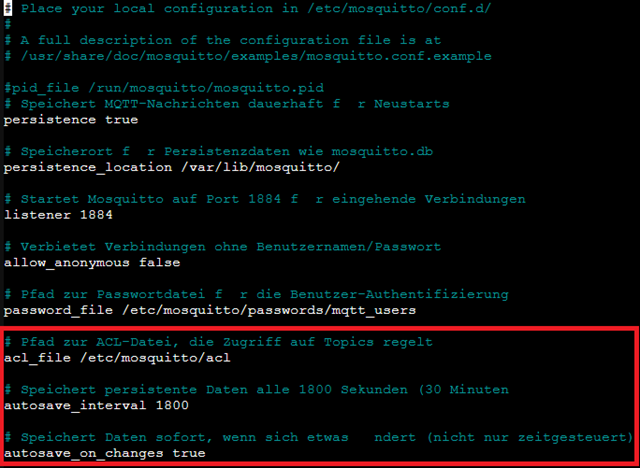

# 📘 Installing and Configuring MQTT on an existing LXC

MQTT stands for "Message Queuing Telemetry Transport" and is a lightweight, open communication protocol developed for transmitting messages between devices in a network. It was specifically designed for M2M (Machine-to-Machine) and IoT (Internet of Things) applications where reliable and efficient data transfer is required with limited resources.

Here are some fundamental concepts and properties of MQTT:

**1. Publisher/Subscriber Model:**
MQTT is based on the Publisher/Subscriber messaging model. There is a central intermediary called the **Broker**. Devices that want to send data are called **Publishers**, while devices that want to receive data are called **Subscribers**. Publishers send messages to specific **Topics**, and Subscribers subscribe to these topics to receive messages addressed to them.

**2. Topics:**
Topics are hierarchical names or channels used to organize and filter messages. They can be named as desired and allow for flexible categorization of messages. For example, a topic like "SensorData/Temperature" can be used to subscribe to all messages related to temperature measurements from sensors.

**3. Quality of Service (QoS):**
MQTT supports various QoS levels for message delivery. There are three levels:
   - ***QoS 0:*** "At most once" - The message is sent once without acknowledgment or delivery verification. Messages may be lost.
   - ***QoS 1:*** "At least once" - The message is delivered at least once. However, duplicates may occur.
   - ***QoS 2:*** "Exactly once" - The message is delivered exactly once, and duplicates are avoided. This level requires the most extensive communication mechanisms.

**4. Lightweight:**
MQTT is designed to be resource-efficient, both in terms of network bandwidth and device system resources. The message headers are small, which improves transmission efficiency. Therefore, MQTT is well suited for environments with limited resources, such as embedded systems or IoT devices.

**5. Reliability:**
MQTT supports reliable message transmission by offering mechanisms such as acknowledgment and retry mechanisms. This enables robust communication in unstable network environments.

MQTT is frequently used in IoT applications where sensors, actuators, and other devices need to exchange data. It provides a simple and efficient way to transfer messages between devices and enables the scalability of IoT systems.

-----

## 🧾 Prerequisites

  - LXC container with Ubuntu 20.04/22.04/24.04 (tested with Ubuntu 24.04)
  - Network access to the container
  - Root or other user with `sudo` permissions

-----

Mosquitto is developed by the **Eclipse Foundation** and released under the free licenses **EPL/EDL**.

## 🔧 Preparation: Installing Mosquitto

```bash
sudo apt update
sudo apt install -y mosquitto mosquitto-clients
```

(Mosquitto-Clients are only needed for testing on the system.)


```bash
sudo systemctl enable mosquitto
sudo systemctl start mosquitto
```


## 🧪 Anonymous, Unencrypted MQTT Communication

**1. Adjust Configuration File**

```bash
sudo nano /etc/mosquitto/mosquitto.conf
```

Content:

```bash
# Persistently stores MQTT messages for restarts
persistence true

persistence_location /var/lib/mosquitto/

listener 1883
allow_anonymous true
```


This configuration allows all clients unencrypted access without authentication.

**2. Restart Service**

```bash
sudo systemctl restart mosquitto
```


Check whether the service is `enabled`. (Ensures the service starts automatically when the container boots)
 ```bash
 sudo systemctl status mosquitto 
 ```


**3. Test on the MQTT Host**

We use the MQTT Explorer for testing. (CC-BY-ND-4.0)
You can download it [MQTT-Explorer](https://mqtt-explorer.com) here.
MQTT Explorer is a graphical desktop tool for visualizing, analyzing, and managing MQTT data streams. Its main purpose is to connect to an MQTT broker and display sent and received messages in a clear tree structure. It shows all topics, their hierarchy, and the associated message contents (Payloads), including information such as QoS level, Retain status, and timestamp.

With MQTT Explorer, messages can not only be observed but also actively sent to any topic (Publish function). The tool is ideally suited for testing, debugging, and monitoring IoT devices, smart home systems, or other MQTT-based applications. It also supports security features such as connecting via TLS, using usernames and passwords, and certificate authentication.

Thanks to its user-friendly interface and real-time display, MQTT Explorer is particularly helpful for quickly gaining an overview of the status of an MQTT system or identifying sources of error. It is cross-platform available for Windows, macOS, and Linux.


-----

**Publisher**
Test with Mqtt Client:

```bash
mosquitto_pub -h 192.168.137.150 -t test/topic -m "Hallo MQTT"
```


The result is immediately visible in MqttExplorer.

**Subscriber**

Test with Mqtt Client:

```bash
mosquitto_sub -h 192.168.137.150 -t test/topic
```

Send a message via MqttExplorer.


-----

For a long-term test, you can create two additional LXC containers.
One container will be used as the Publisher, and the other as the Subscriber.
Detailed instructions for this can be found in this documentation.
[[0755 MqttClients]]

-----

## 🔐 MQTT with User Login, Unencrypted

To improve access control, users with passwords are set up.

**1. Create Password File**

```bash

sudo mkdir -p /etc/mosquitto/passwords
sudo mosquitto_passwd -c /etc/mosquitto/passwords/mqtt_users pdal
```


Now a password is requested, which must be set for the user `pdal`.
For this example, the password `JadeHS20` was chosen.

After creating the file `mqtt_users`, permissions may need to be adjusted.

```bash
ls -l /etc/mosquitto/passwords/mqtt_users
```

The permissions must be set as follows for the Mosquitto service to function properly.

```bash
sudo chown root:root /etc/mosquitto/passwords/mqtt_users
sudo chmod 644 /etc/mosquitto/passwords/mqtt_users
```


**1.** `sudo chown root:root /etc/mosquitto/passwords/mqtt_users`

The command sets the owner and group of the file `mqtt_users` to `root`, so that only the system administrator (root) has full access to it.

**2.** `sudo chmod 644 /etc/mosquitto/passwords/mqtt_users`

The command allows the file owner to read and write to it, while the group and other users can only read the file.
After the permissions and owner have been changed, check with the following command to see if they were actually adjusted.

```bash
ls -l /etc/mosquitto/passwords/mqtt_users
```


Additional users can be created this way.

```bash
sudo mosquitto_passwd /etc/mosquitto/passwords/mqtt_users Kai
```

Now a password is requested, which must be set for the user `Kai`.
For this example, the password `1234` was chosen.


It is possible that a warning appears here because the permission for the file `mqtt_users` was set to `644`. This warning states: `Warning: The file /etc/mosquitto/passwords/mqtt_users is readable by all users. Future versions will refuse to load this file.`
Here you can work with **Capabilities** so that the "service user" `mosquitto` still gets read rights for the file `mqtt_users`, even though the permission is set to `root:root` and `600`.

### 🔗 Useful Links for Linux Capabilities


- [Linux Capabilities – man7.org (offizielle Doku)](https://www.man7.org/linux/man-pages/man7/capabilities.7.html)
- [Einführung in Linux Capabilities – linuxconfig.org](https://linuxconfig.org/introduction-to-linux-capabilities)
- [setcap und getcap erklärt – commandmasters.com](https://www.insecure.ws/2013/12/17/getcap-setcap.html)
- [Capabilities vs Root – insecure.ws](https://www.insecure.ws/2013/12/17/getcap-setcap.html)
- [Linux Capabilities verständlich erklärt – baeldung.com](https://www.baeldung.com/linux/set-modify-capability-permissions)

**2. Update Configuration**

```bash
sudo nano /etc/mosquitto/mosquitto.conf
```


```bash
# Persistently stores MQTT messages for restarts
persistence true

# Storage location for persistence data like mosquitto.db
persistence_location /var/lib/mosquitto/

# Starts Mosquitto on port 1883 for incoming connections
listener 1883

# Disallows connections without username/password
allow_anonymous false

# Path to the password file for user authentication
password_file /etc/mosquitto/passwords/mqtt_users
```


Now it is no longer possible to log in as an anonymous user.

At this point (`listener 1883`), you could also change the standard port for the MQTT broker; for example, if you need multiple MQTT brokers.

**3. Restart Service and Check Status**

```bash
sudo systemctl restart mosquitto
sudo systemctl status mosquitto
```


From now on, no anonymous user will be accepted by MQTT. Test this with the "MQTT-Explorer"; first try to establish the connection without a user and password. Then use the user "Kai".

**4. Test**

```bash
mosquitto_pub -h 192.168.137.150 -p 1883 -t topic/ -u pdal -P JadeHS20 -m "Hello from the Client"
```

You have protected access to the MQTT service.

  - The option `-h` stands for the **Host** (MQTT Broker),
  - the option `-p` stands for the **Port**,
  - the option `-t` stands for the **Topic**,
  - the option `-u` stands for the **User**,
  - the option `-P` stands for the **Password** of the user,
  - the option `-m` stands for the **Message** (the message we want to send).

Adjust the `mosquitto_sub` command accordingly and send a message with the "MQTT-Explorer".

-----

## 🧑‍🤝‍🧑 MQTT with ACLs, User-Dependent Topics, and Sessions

**Why use Access Control Lists, user-dependent topics, and sessions.**

The use of MQTT with **Access Control Lists (ACLs)**, **user-dependent Topics**, and **Sessions** further increases the security, control, and reliability of communication in MQTT-based systems.

ACLs enable fine-grained access control by precisely defining which user is allowed to read or write to which topics. This prevents unauthorized clients from accessing sensitive data or interfering with other devices.

User-dependent topics ensure that each client interacts only with its own data area. This increases data security and separation between users or devices – a crucial factor in multi-user or IoT environments.

Persistent Sessions ensure that a client does not lose messages, even if it is temporarily disconnected from the broker. The broker stores messages and delivers them once the client reconnects – important for reliability and data consistency.

Overall, these functions enable a secure, scalable, and stable MQTT architecture, especially in production or security-critical applications.

**1. Create ACL File**

```bash
nano /etc/mosquitto/acl
```


Example:

```bash
# User: pdal
user pdal

# Read and write permissions for pdal and subtopics
topic readwrite pdal
topic readwrite pdal/#

# Read permission for Kai/inbox
topic read Kai/inbox

# User: Kai
user Kai

# Write permission for Kai/inbox
topic write Kai/inbox

# Read permissions for Kai and subtopics
topic read Kai
topic read Kai/#
```


**Which ACL permissions are available in MQTT**

In MQTT combined with a broker like Mosquitto, the following permissions are controlled via ACLs:

## ✅ MQTT Permissions (ACLs)

**1.** `read`

Allows subscribing to Topics.

```text
topic read sensor/temperatur
```

**🔎 Means:** The client is allowed to receive messages from the topic `sensor/temperatur`, but not to send them.

**2.** `write`

Allows publishing messages to a Topic.

```text
topic write sensor/temperatur
```

**🛠️ Means:** The client is allowed to send messages to `sensor/temperatur`, but not to subscribe to it.

**3.** `readwrite` (Default)

Allows both reading (Subscribe) and writing (Publish) on the Topic.

```text
topic readwrite sensor/temperatur
```

**🔁 Means:** The client is allowed to receive and send.

**4. Wildcards for Topics in ACLs**

MQTT-typical wildcards can be used:

    **+** for one level

    **#** for multiple levels

Example:

```text
topic read sensors/+/status
topic write users/+/data/#
```

**5.** Combining ACLs with Users

```text
user Kai
topic readwrite user/Kai/#
```

**➡️ Means:** Only user Kai is allowed to use topics in the path `user/Kai/...`.

**🔐 Summary**
| Permission | Description |
|--------------|---------------------------------------|
| read         | Subscribe only                        |
| write        | Publish only                         |
| readwrite    | Both: Subscribe + Publish |

ACLs thus allow finely graded access control to topics – an important component of any secure MQTT architecture.

-----

**2. Extend Configuration**

We change the port in this configuration to mark this increased security level or to keep Port 1883 free for another purpose later.

```bash
nano /etc/mosquitto/mosquitto.conf
```


```bash
# Activates saving the message status (e.g., retained messages)
persistence true     

# Path where persistent data is stored
persistence_location /var/lib/mosquitto/

# Broker listens on Port 1884 (Standard is 1883, deliberately different here)  
listener 1884                         

# Disables anonymous connections – username & password are required
allow_anonymous false                

# Path to the password file with valid users
password_file /etc/mosquitto/passwords/mqtt_users  

# Path to the ACL file, which regulates topic access
acl_file /etc/mosquitto/acl          

# Saves persistent data every 1800 seconds (30 minutes)
autosave_interval 1800               

# Saves data immediately when something changes (not just timed)
autosave_on_changes true             
```


**3. Restart Service**

```bash
sudo systemctl restart mosquitto
```

**4. Test**

##### Allowed:

```bash
mosquitto_pub -h 192.168.137.150 -p 1884 -t Kai/logs -m "Log Entry" -u Kai -P <password>
```

##### Forbidden (e.g., Bob on Kai/#):

```bash
mosquitto_pub -h 192.168.137.150 -p 1884 -t Kai/logs -m "Unauthorized" -u bob -P <password>
```

Replace the field `<passwort>` with the set password.

Now the MQTT system is even more secure.
***However,*** all topics must be maintained in the ACL list.

There is another document that explains how an MQTT broker can be secured using certificates.

In the **PDAL**, you can omit password-based user management and **ACLs** for the sake of simplicity. In publicly accessible systems, brokers should **never** be operated **unprotected**.

-----

## Sources

  - CommandMasters. "Understanding 'setcap' Command (with Examples)." Accessed July 10, 2025. [https://commandmasters.com/commands/setcap-linux/](https://commandmasters.com/commands/setcap-linux/).
  - Destuynder (:kang), Guillaume. "Getcap, Setcap and File Capabilities." kang's things & stuff, December 17, 2013. [https://www.insecure.ws/2013/12/17/getcap-setcap.html](https://www.insecure.ws/2013/12/17/getcap-setcap.html).
  - Docile, Egidio. "Introduction to Linux Capabilities." LinuxConfig (blog), November 1, 2023. [https://linuxconfig.org/introduction-to-linux-capabilities](https://linuxconfig.org/introduction-to-linux-capabilities).
  - Inc, EMQ Technologies. "MQTT Guide 2025: Beginner to Advanced." [www.emqx.com](https://www.emqx.com). Accessed July 9, 2025. [https://www.emqx.com/en/mqtt-guide](https://www.emqx.com/en/mqtt-guide).
  - Kerrisk, Michael. The Linux Programming Interface: A Linux Und UNIX System Programming Handbook. Ninth printing. San Francisco, CA: No Starch Press, 2018.
  - "Linux Capabilities: Setting and Modifying Permissions | Baeldung on Linux," October 26, 2023. [https://www.baeldung.com/linux/set-modify-capability-permissions](https://www.baeldung.com/linux/set-modify-capability-permissions).
  - Nordquist, Thomas. "MQTT Explorer." MQTT Explorer. Accessed July 8, 2025. [http://mqtt-explorer.com/](http://mqtt-explorer.com/).
  - "paho-mqtt: MQTT version 3.1.1 client class." MacOS :: MacOS X, Microsoft :: Windows, POSIX, Python. Accessed July 9, 2025. [http://eclipse.org/paho](http://eclipse.org/paho).

-----

### License
This work is licensed under the **Creative Commons Attribution - ShareAlike 4.0 International License**.
 
[To the license text on the Creative Commons website](https://creativecommons.org/licenses/by-sa/4.0/legalcode.en)
