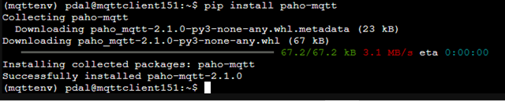
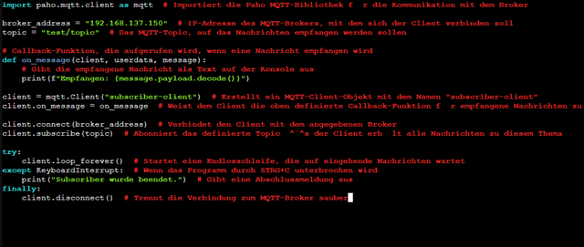
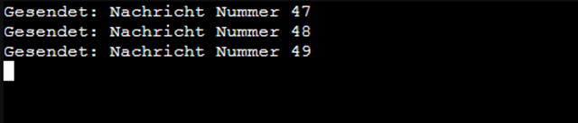

# 🧪 MQTT Clients with Python on Two LXCs

## 💡 Introduction to the MQTT Publisher/Subscriber Model

MQTT ("Message Queuing Telemetry Transport") is a lightweight, open messaging protocol specifically designed for **M2M (Machine-to-Machine)** communication and the **IoT (Internet of Things)**. Instead of relying on a direct dialogue between sender and receiver (like HTTP), MQTT uses the **Publisher/Subscriber Model**.

This model completely separates the sending and receiving devices. A central intermediary, the **Broker**, manages and forwards all messages.

-----

### The Broker (Intermediary)

The **Broker** is the heart of any MQTT system. It receives messages from Publishers, manages all registered Subscribers, and forwards messages to the correct recipients based on **Topics**.

### 1\. The Publisher (Sender)

A **Publisher** is any device or application that **sends data to the Broker**.

  * **Role:** A Publisher is solely responsible for sending messages. It **doesn't need to know** how many or which devices will ultimately receive the data.
  * **Action:** The Publisher sends a message to a **specific Topic** on the Broker (e.g., a temperature sensor sends the value $20.5^\circ C$ to the topic `sensor/keller/temperatur`).

### 2\. The Subscriber (Receiver)

A **Subscriber** is any device or application that **wants to receive data from the Broker**.

  * **Role:** A Subscriber is solely responsible for receiving messages. It **doesn't need to know** who originally sent the data.
  * **Action:** The Subscriber informs the Broker which **Topics** it is interested in (it **subscribes** to these Topics). Whenever the Broker receives a new message for that Topic, it forwards it to the Subscriber.

-----

### Topics – The Communication Channels

**Topics** are simple, hierarchical strings used as channels to organize messages (e.g., `house/floor/light`, `car/motor/temperatur`).

  * The Publisher assigns each message to a Topic.
  * The Subscriber filters messages by only subscribing to the Topics it needs.

This system provides high flexibility and scalability: if you add a new device (a Publisher or a Subscriber), you **don't** need to reconfigure the other devices—it only needs to register with the Broker using the appropriate Topic.

-----

Here, we describe a simple example in Python to demonstrate a Publisher and a Subscriber on separate LXCs. For this, we first use the MQTT Broker from the last exercise in the "Anonymous" configuration.
To do this, modify the `/etc/mosquitto/mosquitto.conf` and set `allow_anonymous true`. Now load the configuration – `systemctl reload mosquitto.service` (add ` sudo  ` before the command depending on the user you are logged in as).

To work with MQTT in Python, we need an external library (`paho-mqtt`) which must be installed.

-----

## 🖥️ System Requirements

Proxmox environment with Ubuntu LXC containers

IPs:

  * 192.168.137.151 – Publisher
  * 192.168.137.152 – Subscriber

The MQTT Broker (e.g., Mosquitto) must be reachable (e.g., 192.168.137.150, if from an earlier project)

## 📦 Setup of Both LXC Containers

Perform the following steps in both containers:
**1. Update System and Install Python**

```bash
sudo apt update && sudo apt upgrade -y
```


```bash
sudo apt install -y python3 python3-venv python3-pip
```


Python does not allow running external libraries that are not part of the standard repository directly in the runtime environment (security concerns).
Therefore, a Virtual Environment (`venv`) is required as an isolated directory with its own runtime environment.

**2. Create and Activate Python Environment (venv)**

```bash
python3 -m venv mqttenv
source mqttenv/bin/activate
```


A Virtual Environment (venv) is an isolated copy of the Python runtime environment that allows you to install dependent packages (libraries) for a specific project without causing conflicts with other projects or the global Python system.

**3. Install MQTT Client Library**

Install the Mqtt client library in `venv`.

```bash
pip install paho-mqtt
```



## 🧾 Python Programs

Both programs should work on the same MQTT Broker and use the topic `test/topic`.

**📤 Publisher (on 192.168.137.151)**

Save, for example, as `publisher.py` in the `mqttenv` (venv directory):

```python
import time  # For pausing between messages
import paho.mqtt.client as mqtt  # Import MQTT client from Paho

broker_address = "192.168.137.150"  # IP address of the broker
topic = "test/topic"  # MQTT Topic to publish to

# Create MQTT client, using CallbackAPIVersion.VERSION2 for Paho >= 2.0.0
client = mqtt.Client(mqtt.CallbackAPIVersion.VERSION2, client_id="publisher-client")

client.connect(broker_address)  # Connect to the broker

try:
    counter = 1  # Start message counter
    while True:
        message = f"Nachricht Nummer {counter}"  # Construct message
        client.publish(topic, message)  # Send message to the topic
        print(f"Gesendet: {message}")  # Output to console
        counter += 1  # Increment counter
        time.sleep(5)  # Wait 5 seconds until the next message
except KeyboardInterrupt:
    print("Publisher wurde beendet.")  # Program stopped via CTRL+C
finally:
    client.disconnect()  # Disconnect from the broker
```


**📥 Subscriber (on 192.168.137.152)**

Save, for example, as `subscriber.py` in the `mqttenv` (venv directory):

```python
import paho.mqtt.client as mqtt  # Import the Paho MQTT library for communication with the broker

broker_address = "192.168.137.150"  # IP address of the MQTT broker the client should connect to
topic = "test/topic"  # The MQTT Topic on which messages should be received

# Callback function that is called when a message is received
def on_message(client, userdata, message):
    # Output the received message as text to the console
    print(f"Empfangen: {message.payload.decode()}")

# Create an MQTT client object with the name "subscriber-client"
client = mqtt.Client(mqtt.CallbackAPIVersion.VERSION2, client_id="subscriber-client")
client.on_message = on_message  # Assign the defined callback function for received messages to the client

client.connect(broker_address)  # Connect the client to the specified broker
client.subscribe(topic)  # Subscribe to the defined topic – the client receives all messages on this topic

try:
    client.loop_forever()  # Start an endless loop that waits for incoming messages
except KeyboardInterrupt:  # If the program is interrupted by CTRL+C
    print("Subscriber wurde beendet.")  # Output a closing message
finally:
    client.disconnect()  # Cleanly disconnect from the MQTT broker
```



## ▶️ Start Programs

Start the Subscriber first, then the Publisher.

In both containers after activating the venv:

```bash
source mqttenv/bin/activate
python3 subscriber.py  # on 152
```


```bash
source mqttenv/bin/activate
python3 publisher.py   # on 151
```


You can end the programs with `Ctrl + c`.

## ✅ Test

If the MQTT Broker is running and reachable at 192.168.137.150, the Subscriber should receive messages as follows:

```bash
Empfangen: Nachricht Nummer 1
Empfangen: Nachricht Nummer 2
```

In the MQTT Explorer, it will look like the image below.


All further functions can be found in the documentation of [Paho](https://eclipse.dev/paho/files/paho.mqtt.python/html/).

-----

## MQTT with Username

To do this, modify the `/etc/mosquitto/mosquitto.conf` and set `allow_anonymous false`. Now load the configuration – `systemctl reload mosquitto.service` (add ` sudo  ` before the command depending on the user you are logged in as).

Now add the following entry directly after `client = mqtt.Client()` in the `publisher.py` and `subscriber.py` programs:
Use the user "Kai" from the last exercise.

```python
client = mqtt.Client(mqtt.CallbackAPIVersion.VERSION2, client_id="...")
client.username_pw_set(username="Kai", password="1234")
```

Now start the Subscriber first, then the Publisher again. If you want to check the results in the "MQTT Explorer", you must also log in there again with the user and password.

The connections to the Broker are now protected by a password.
If you also use ACLs, you must pay attention to the correct Topics.

**End VENV** - You end the "Virtual Environment" (venv) with the command `deactivate`. As long as the **VENV** is not reactivated with `source mqttenv/bin/activate`, Python scripts cannot use the installed Paho-MQTT library.

## Sources

"client module — Eclipse paho-mqtt documentation". Accessed July 9, 2025. [https://eclipse.dev/paho/files/paho.mqtt.python/html/client.html](https://eclipse.dev/paho/files/paho.mqtt.python/html/client.html).
Craggs, Ian. "Eclipse Paho | The Eclipse Foundation". Accessed July 9, 2025. [https://eclipse.dev/paho/index.html?page=clients/python/index.php](https://eclipse.dev/paho/index.html?page=clients/python/index.php).
"Eclipse Paho™ MQTT Python Client — Eclipse paho-mqtt documentation". Accessed July 9, 2025. [https://eclipse.dev/paho/files/paho.mqtt.python/html/](https://eclipse.dev/paho/files/paho.mqtt.python/html/).
"paho-mqtt 2.1.0"-Documentation, Accessed October 17, 2025, [https://pypi.org/project/paho-mqtt/](https://pypi.org/project/paho-mqtt/)
Nordquist, Thomas. "MQTT Explorer". MQTT Explorer. Accessed July 8, 2025. [http://mqtt-explorer.com/](http://mqtt-explorer.com/).
"paho-mqtt: MQTT version 3.1.1 client class". MacOS :: MacOS X, Microsoft :: Windows, POSIX, Python. Accessed July 9, 2025. [http://eclipse.org/paho](http://eclipse.org/paho).

-----

### License

This work is licensed under the **Creative Commons Attribution - ShareAlike 4.0 International License**.

[To the license text on the Creative Commons website](https://creativecommons.org/licenses/by-sa/4.0/legalcode.en)