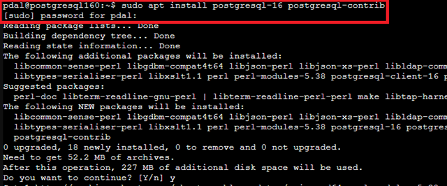
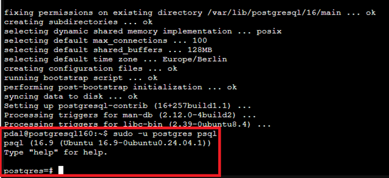
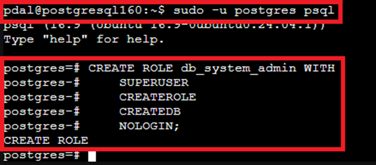
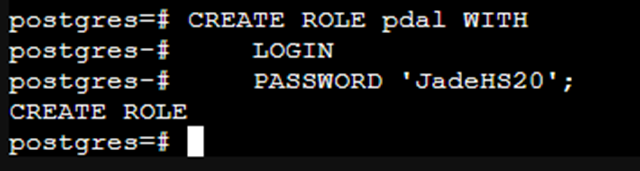
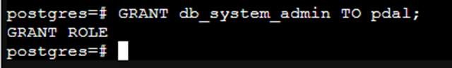
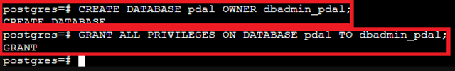
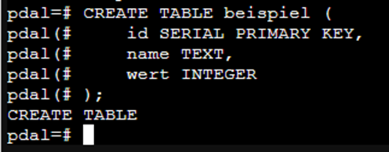
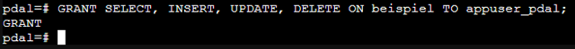
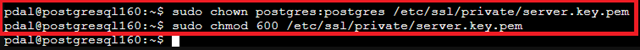
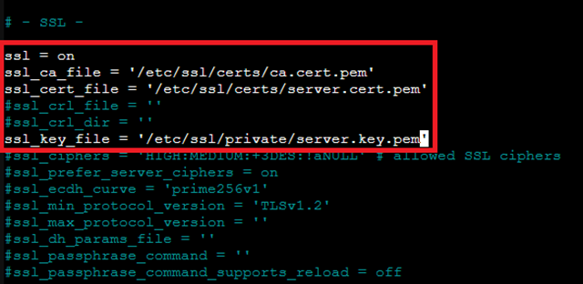

# 🐘 Installing, Configuring, and Securing PostgreSQL on LXC

PostgreSQL is a powerful, open-source object-relational database system focused on stability, extensibility, and SQL standards compliance.

### Why PostgreSQL and not MariaDB/MySQL?

While systems like MariaDB (or MySQL) are an excellent and fast choice for simple web applications (e.g., the LAMP stack), the **PDAL Project** demands higher requirements for data integrity, flexibility, and advanced analytical functions.

PostgreSQL is often regarded as the technically more advanced system and is the preferred choice for complex data analysis and critical enterprise applications.

| Feature | PostgreSQL | MariaDB/MySQL | Relevance for PDAL |
| :--- | :--- | :--- | :--- |
| **Extensibility** | **Superior** (e.g., PostGIS, JSONB, TimescaleDB, FDWs) | Basic functions (Plugins) | **CRUCIAL:** Enables complex analysis (GIS, time series, NoSQL data). |
| **Data Integrity** | **Very strict** (full ACID compliance, robust MVCC) | Good, but less strict in some configurations | **HIGH Priority:** Ensures the reliability of analytical data. |
| **Modern Data Types** | Native support for **JSONB** (indexable), Arrays, HStore. | JSON support is less flexible and indexable. | **IMPORTANT:** Handling semi-structured data without an external NoSQL DB. |
| **License** | Liberal BSD License | GPL/Commercial Licenses (mixed model) | **GUARANTEE:** Long-term stability and 100% Open Source. |

**Conclusion:** The decision for PostgreSQL ensures that the PDAL Project utilizes a **data platform** that not only handles standard relational tasks but is also excellently equipped for the future requirements of data analysis—including complex geospatial data, time series, and unstructured data.

But as with all decisions: It depends on the specific requirements.

## 🧾 Prerequisites

  * LXC container with Ubuntu 20.04, 22.04, or 24.04
  * Root or Sudo access on the container
  * Network access (e.g., static IP), in this case `192.168.137.160`
  * Optional: TLS certificates or CA setup for encryption (see separate CA documentation)

Please always install the latest release, whenever possible directly from the `apt` package manager.

## 🧩 1. Installation

```bash
sudo apt update
sudo apt install -y postgresql-16 postgresql-contrib
```



After installation, the PostgreSQL service is started automatically.

With the option `postgresql-16`, we install version 16 of PostgreSQL. The default version – `apt install -y postgresql` – in the Ubuntu repository may vary.
`postgresql-contrib` is a package that includes additional extensions and functions for PostgreSQL that are not part of the core installation but extend the database.

To test the version, enter `psql --version`.

## 👤 2. PostgreSQL User & Access

The default user upon initial installation is `postgres`.

Accessing the PostgreSQL console:

```bash
sudo -u postgres psql
```



## 2\. PostgreSQL User Roles – Structured Assignment of Rights

To ensure a clean separation of responsibilities and increased security in the PostgreSQL database system, three different user roles are set up:
These roles can be assigned to individual users.

-----

**1. Database System Administrator (e.g., `pdal`)**

This user possesses **full superuser rights** for the entire PostgreSQL system. They are allowed to:

  * Create and delete databases system-wide
  * Manage users and roles
  * Modify system configuration
  * Access all databases and their contents

**Reason:**
Central and overarching administration of the entire DBMS – comparable to a root user in the operating system.

-----

**2. Database Administrator per Database (e.g., `dbadmin_<dbname>`, `dbadmin_<dbname>`)**

This user has **full rights within a specific database**. They are allowed to:

  * Create and manage users for their database
  * Create backups of the database
  * Create, modify, and delete tables, views, procedures, and triggers
  * Edit data in the database

**Reason:**
Responsibility lies with the respective department, without access to system-wide resources or other databases.

-----

**3. Application or Standard User (e.g., `appuser_<dbname>`, `appuser_<dbname>`)**

This user is allowed to **only work with the data within the database assigned to them**. They have the following rights:

  * `SELECT`: Read data
  * `INSERT`: Insert new data
  * `UPDATE`: Modify existing data
  * `DELETE`: Delete data

**Reason:**
Minimum rights for applications or end-users to process data without performing administrative functions. This increases security and prevents unintentional structure changes.

-----

### Advantages of this Structure

  * Clear separation between system administration, technical database maintenance, and simple data usage
  * Security principles like "Least Privilege" are maintained
  * Roles can be clearly assigned and documented
  * Good scalability and traceability in multi-user environments
  * Manage rights centrally via roles and assign them to users
  * Avoid unnecessary superuser rights for database admins

### PostgreSQL: Role-Based User Management with User/Role Separation

Users and roles are **cleanly separated**. Three functional roles are created and subsequently assigned to individual users:

-----

### PostgreSQL User and Role Management with Differentiated Rights

  * **db\_system\_admin**: System-wide PostgreSQL superuser (Role without login)
  * **db\_admin**: Database administrator for a single database, with the right to user and object management, but **without** database creation
  * **standard\_user**: Normal database user with read and write permissions for data

-----

### 1\. Role and User for System Administrator

```sql
CREATE ROLE db_system_admin WITH
    SUPERUSER
    CREATEROLE
    CREATEDB
    NOLOGIN;

CREATE ROLE pdal WITH
    LOGIN
    PASSWORD 'JadeHS20';

GRANT db_system_admin TO pdal;
```






### 2\. Role and User for Database Administrator (for database pdal)

```sql
CREATE ROLE db_admin WITH
    CREATEROLE
    NOLOGIN;

CREATE ROLE dbadmin_pdal WITH
    LOGIN
    PASSWORD '1234';

GRANT db_admin TO dbadmin_pdal;
```


**Create database and assign rights (as System Administrator)**

```sql
CREATE DATABASE pdal OWNER dbadmin_pdal;

GRANT ALL PRIVILEGES ON DATABASE pdal TO dbadmin_pdal;
```



**Inside the database pdal (Rights for Object Management)**

```sql
\c pdal
```

### 3\. Default Rights for New Tables, Functions, Sequences

```sql
ALTER DEFAULT PRIVILEGES IN SCHEMA public
GRANT ALL ON TABLES TO dbadmin_pdal;

ALTER DEFAULT PRIVILEGES IN SCHEMA public
GRANT ALL ON SEQUENCES TO dbadmin_pdal;

ALTER DEFAULT PRIVILEGES IN SCHEMA public
GRANT ALL ON FUNCTIONS TO dbadmin_pdal;
```


**Note:**
The CREATEROLE right allows the user `dbadmin_pdal` to create and manage further roles (users), but not databases.

### 4\. Role and User for Standard User with Data Access

```sql
CREATE ROLE standard_user WITH NOLOGIN;

CREATE ROLE appuser_pdal WITH
    LOGIN
    PASSWORD 'user_passwort';

GRANT standard_user TO appuser_pdal;

GRANT CONNECT ON DATABASE pdal TO appuser_pdal;
```


**Rights for Data Access in Database `pdal`**

```sql
\c pdal
```

**-- Example Table:**

```sql
CREATE TABLE beispiel (
    id SERIAL PRIMARY KEY,
    name TEXT,
    wert INTEGER
);
```



**-- Assign Data Rights**

```sql
GRANT SELECT, INSERT, UPDATE, DELETE ON beispiel TO appuser_pdal;
```



**-- Default Rights for New Tables**

```sql
ALTER DEFAULT PRIVILEGES IN SCHEMA public
GRANT SELECT, INSERT, UPDATE, DELETE ON TABLES TO appuser_pdal;
```


**✅ Summary**

| User | Assigned Role | Description |
| :--- | :--- | :--- |
| pdal | db\_system\_admin | Full system access (Superuser) |
| dbadmin\_pdal | db\_admin | User and object management in DB pdal, no DB creation |
| appuser\_pdal | standard\_user | Read, write, delete data in DB pdal |

## 📦 3. Useful PostgreSQL Commands

\-- Show users

```sql
\du
```

\-- Show databases

```sql
\l
```

\-- Show tables

```sql
\dt
```

\-- End connection

```sql
\q
```

## 🔐 4. Enable Password Authentication

Open:

```bash
sudo nano /etc/postgresql/*/main/pg_hba.conf
```

The `*` in the command stands for the version number; in this case, for `16`.


Change at the end:

```bash
# old entry local    all              all                                     peer
local   all             all                                     md5

# old entry host    all             all             127.0.0.1/32            scram-sha-256
host    all             all             192.168.137.0/24            md5

# old entry host    all             all             ::1/128                 scram-sha-256
host    all             all             ::1/128                 md5
```


Alternatively, you can use `scram-sha-256`, but then the password must be stored accordingly.

## 🌐 5. Enable Network Access

Open:

```bash
sudo nano /etc/postgresql/*/main/postgresql.conf
```

Change or add:

```bash
listen_addresses = '*'
```


## 🔁 6. Restart Service

```bash
sudo systemctl restart postgresql
sudo systemctl status postgresql
```


## 🔐 6. TLS Encryption (optional)

**📄 Prepare Certificates:**

Placing:

> CA Certificate: /etc/ssl/certs/ca.cert.pem
>
> Server Certificate: /etc/ssl/certs/server.cert.pem
>
> Private Key: /etc/ssl/private/server.key.pem

Further info: [[0650 CA-sslmitSANZertifikat]]
This documentation describes the procedure exactly using the Apache2 Server example; the same procedure applies to `PostgreSQL`.

-----



**🔧 Adjust Configuration**

```bash
sudo nano /etc/postgresql/*/main/postgresql.conf
```



Add or enable:

```bash
ssl = on
ssl_ca_file = '/etc/ssl/certs/ca.cert.pem'
ssl_cert_file = '/etc/ssl/certs/server.cert.pem'
ssl_key_file  = '/etc/ssl/private/server.key.pem'
```

```bash
sudo chown postgres:postgres /etc/ssl/private/server.key.pem
sudo chmod 600 /etc/ssl/private/server.key.pem
```

**🚀 Restart:**

```bash
sudo systemctl restart postgresql
```

## 🔐 7. Authentication with Certificates (Client CA) (optional)

Set up a private CA on the server.
See: [[0650 CA-sslmitSANZertifikat]]

Distribute signed client certificates

Add to `pg_hba.conf`:

```bash
hostssl all all 192.168.137.0/24 cert clientcert=verify-full
```

**Restart PostgreSQL service:**

## 🧪 8. Test Connection (local & remote)

```sql
psql -h localhost -U appuser_pdal -d pdal
```

Remote (e.g., via Workstation):

```sql
psql -h 192.168.137.160 -U appuser_pdal -d pdal
```

If necessary, install:

```bash
sudo apt install postgresql-client-16
```

## 🔄 10. Automatic Start (systemd)

Already enabled after installation:

```bash
sudo systemctl enable postgresql
```

Manually restart:

```bash
sudo systemctl restart postgresql
```

## 🧯 11. Security Measures

  * *Use strong passwords or Public-Key Auth*
  * *Activate firewall, e.g., with ufw:*

<!-- end list -->

```bash
sudo ufw allow from 192.168.137.0/24 to any port 5432 proto tcp
```

With `192.168.137.0/24`, the entire network is allowed to access the database.
Alternatively, a specific IP address can be granted access.

  * *Do not allow external connections unless explicitly necessary*
  * *Use certificate-based authentication (see above)*
  * *Regularly automate database backups with pg\_dump*

## 📚 Sources

  * "PostgreSQL 16.x Documentation", PostgreSQL Documentation. Accessed: July 22, 2025. \[Online]. Available at: [PostgreSQL Doc](https://www.postgresql.org/docs/16/index.html)
  * "18.9. Secure TCP/IP Connections with SSL", PostgreSQL Documentation. Accessed: July 22, 2025. \[Online]. Available at: [PostgreSQL SSL](https://www.postgresql.org/docs/16/ssl-tcp.html)

-----

### License

This work is licensed under the **Creative Commons Attribution-ShareAlike 4.0 International License**.

[To the license text on the Creative Commons website](https://creativecommons.org/licenses/by-sa/4.0/legalcode.de)