# 📘 Installing & Configuring JupyterLab in an LXC Container

(with Python, R, Java, systemd service)

## 🔎 Introduction

JupyterLab is a modern, interactive web interface for programming, data analysis, and scientific computing. As the successor to the classic Jupyter Notebooks, it offers support for many languages such as Python, R, or Java, as well as numerous visualization and extension options.

This guide shows the installation and configuration of JupyterLab in an Ubuntu-based LXC container, including:

  * Python (in venv)
  * R Kernel (IRkernel)
  * Java Kernel (IJava)
  * systemd service operation
  * Password protection
  * SSL configuration (linked)

## 📋 Prerequisites

| **Component** | **Requirement** |
|:---|:---|
| System | LXC Container with Ubuntu 22.04 / 24.04 |
| Container IP Address | e.g., `192.168.137.180` |
| User with sudo rights | e.g., `pdal` |
| Internet Connection | Yes |

## 🧱 1. Update System

```bash
sudo apt update && sudo apt upgrade -y
```

**🔍** This ensures that all package sources are current and the latest security updates are installed. This is an important basic rule for any Linux installation.
**📌 Goal**: The system is up to date – especially important before installing new software.

## 🐍 2. Install Python + Pip + venv

```bash
sudo apt install python3 python3-pip python3-venv -y
```


🔍 This installs the Python interpreter (python3) as well as `pip`, the package manager for Python. Both are needed to install JupyterLab and additional packages later. The third package installs the virtual environment for Python.
`apt` ensures that all necessary dependencies from the official Ubuntu repositories are automatically installed.
(Venv) stands for virtual Environment and is required by Python and JupyterLab.

## 📦 3. Install JupyterLab in a Virtual Environment

**🛡️ Why use a Virtual Environment?**
Installing JupyterLab inside a `venv` ensures that all Python packages are managed independently of the system.
This prevents version conflicts, protects the system environment, and enables easy reproducibility and portability of the installation – especially important in containers and with multiple parallel Python projects.

Virtual environments prevent conflicts between global and project-specific Python packages and are best practice for modern Python projects.

### 🔹 3.1 Create Virtual Environment

```bash
python3 -m venv ~/jupyterlab/venv
```


🔍 Creates a new virtual environment in the directory `~/jupyterlab/venv`.
This environment contains its own Python interpreter and its own pip installation.

**📁 Directory Structure:**

`~/jupyterlab/venv/`
├── bin/ ← contains python, pip, jupyterlab, etc.
├── lib/ ← Python libraries (site-packages)
└── pyvenv.cfg ← configuration file

### 🔹 3.2 Activate Virtual Environment

```bash
source ~/jupyterlab/venv/bin/activate
```


🔍 Activates the virtual environment:

  * The shell now uses `python` and `pip` from the environment, no longer the system-wide versions.
  * The terminal prompt typically shows `(venv)` for identification.
  * All subsequent installations apply only within this environment.

### 🔹 3.3 Update pip in the Virtual Environment

```bash
pip install --upgrade pip
```

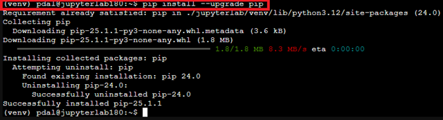

🔍 Updates the pip package manager within the virtual environment.
This ensures current features and compatibility are maintained.

### 🔹 3.4 Install JupyterLab

```bash
pip install jupyterlab
```

🔍 Installs JupyterLab and all associated dependencies (e.g., notebook, traitlets, tornado) into the virtual environment.

🔗 After installation, JupyterLab can be called via the following path:

```bash
~/jupyterlab/venv/bin/jupyter-lab
```

JupyterLab can be terminated with `Ctrl + c`; then confirm with `y`.
The virtual environment can be terminated with `deactivate`.

## ✅ Result

  * A completely isolated, up-to-date, and secure JupyterLab installation – independent of the system Python environment.
  * Suitable for servers, containers, and environments with active PEP 668, which protects global Python installations.

-----

## 📂 4. Create Workspace Directory for Notebooks

### 🔹 4.1 Create Directory

```bash
mkdir -p ~/jupyterlab/projects
```


🔍 Creates the `projects` directory in the `~/jupyterlab` folder.
The `-p` option ensures that the parent folder (jupyterlab) is also created if it does not already exist.

> Hint: Switch to the directory `/jupyterlab/projects` in the web interface to save your projects there.

**✅ Result**

A cleanly structured location for your own notebook files, separate from the Python environment (venv).
This facilitates organization, backup, and later extensions.

## 🔐 5. Enable Password Protection

### 🔹 5.1 Activate Virtual Environment

```bash
source ~/jupyterlab/venv/bin/activate
```

🔍 Activates the previously set up virtual environment.
All subsequent Jupyter commands are executed within the isolated environment if you are not already in the `venv`.

### 🔹 5.2 Set Password for JupyterLab

```bash
jupyter-lab password
```

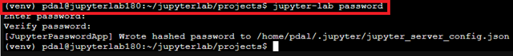

🔍 Starts the interactive dialog to set a password for web access to JupyterLab.
The entered password is hashed and saved in the file:

```bash
~/.jupyter/jupyter_server_config.json
```

This hash is used for authentication when the server starts.

> Hint: A folder preceded by a dot (`.jupyter`) is not visible with the `dir` command. Here you would need to use `ls -a -l`.

**✅ Result**

When opening JupyterLab in the browser, a login with a user password is now required.
This protects the server from unauthorized access – especially in networks without SSL.

Optionally, HTTPS can be activated in a later step (see Point 10).
For production environments, the combination of password and TLS is recommended.

## 🚀 6. Start JupyterLab (Manually)

### 🔹 6.1 Start JupyterLab Manually

```bash
~/jupyterlab/venv/bin/jupyter-lab --ip=0.0.0.0 --port=8888 --no-browser
```

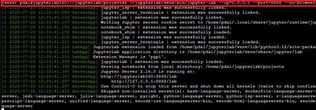

🔍 Starts the JupyterLab server in the previously created virtual environment:

  * `--ip=0.0.0.0`: JupyterLab listens on all network addresses of the container.
  * `--port=8888`: The service is provided on port 8888.
  * `--no-browser`: Prevents a local browser from opening (useful on servers or headless systems).
  * The server is terminated with `Ctrl + c`. This must be confirmed with `y` within 5 seconds.

### 🔹 6.2 Web Access

📡 Access to JupyterLab is via a web browser on your client PC, e.g.:

```text
http://192.168.137.180:8888
```

> Hint: Make sure to use `http://<your-ip-address>:8888/lab` - `https://` does not work yet.

🔐 If a password has been set (see Point 5), a login screen will appear first.


**✅ Result**

JupyterLab is now active and reachable over the network.
The session remains active as long as the terminal process is running (e.g., via tmux, screen, or background process).

If necessary, a system-wide or user-specific service file for automatic startup can be configured in the next step.

## ⚙️ 7. Create systemd Service

**🎯 Goal:** Run JupyterLab automatically as a background service upon system startup – without manual starting in the terminal.

### 🔹 7.1 Create Service File

```bash
sudo nano /etc/systemd/system/jupyterlab.service
```

🔍 Opens a new system-wide service under `/etc/systemd/system/`.
This service is managed by `systemd` and can be automatically started and monitored.

### 🔹 7.2 Content of the Service Definition

```bash
[Unit]
Description=JupyterLab (via systemd)
After=network.target

[Service]
Type=simple
User=pdal
Group=pdal
WorkingDirectory=/home/pdal
Environment="PATH=/home/pdal/jupyterlab/venv/bin:/usr/bin:/bin"
ExecStart=/home/pdal/jupyterlab/venv/bin/jupyter-lab --ip=0.0.0.0 --port=8888 --no-browser
Restart=on-failure

[Install]
WantedBy=multi-user.target
```

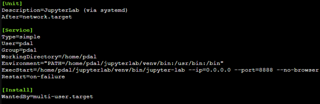

🔍 Explanation of the most important parameters:

  * **User / Group**: Executes the service under the user `pdal` (security relevant).
  * **WorkingDirectory**: Starting directory for the service.
  * **Environment**: Important: This line sets the PATH variable so that all tools from the `venv` are used (e.g., `python`, `pip`, `jupyter-lab`). Without this, the system-wide Python might be used.
  * **ExecStart**: Starts JupyterLab from the virtual environment.
  * **Restart=on-failure**: Automatic restart on errors or crashes.
  * **WantedBy=multi-user.target**: Activates the service for the regular multi-user mode.

### 🔹 7.3 Enable and Start Service

```bash
sudo systemctl daemon-reload
sudo systemctl enable jupyterlab
sudo systemctl start jupyterlab
```

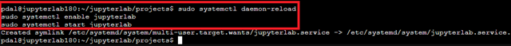

🔍

  * **daemon-reload**: Reloads new or changed service files.
  * **enable**: Activates automatic startup at boot time.
  * **start**: Starts the service immediately.

✅ **Result**

JupyterLab will now start automatically in the background upon system startup and is accessible over the network.
Status and error messages can be checked at any time with the following command:

```bash
journalctl -u jupyterlab -f
```

## ☕ 8. Install Java & Set up Kernel (Only for JupyterLab + User)

**🎯 Goal**: Provide Java Runtime Environment and make the Java Kernel (IJava) available to the user in JupyterLab.

### 🔹 8.1 Install Java JDK

If the `venv` is still active, it should first be exited with the `deactivate` command.

```bash
deactivate
```


The deactivation serves for clarity, as the following command (`sudo apt install ...`) is a system-wide installation that lies outside the venv context.

```bash
sudo apt install openjdk-21-jdk -y
```

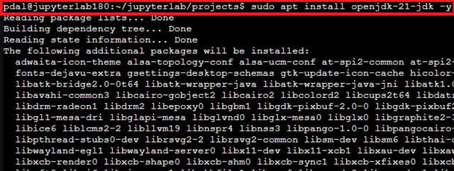

🔍

  * Installs the Java Development Kit (JDK) Version 21, which is required for Java applications and running the Java kernel.
  * The package contains the compiler, runtime environment, and other tools.

### 🔹 8.2 Install IJava Kernel (Only for the Current User)

The packages `curl` and `unzip` may need to be installed beforehand.

```bash
sudo apt install curl -y
sudo apt install unzip -y
```

```bash
cd ~/jupyterlab
curl -L -o ijava.zip https://github.com/SpencerPark/IJava/releases/download/v1.3.0/ijava-1.3.0.zip
```


```bash
unzip ijava.zip -d ijava-installer
```

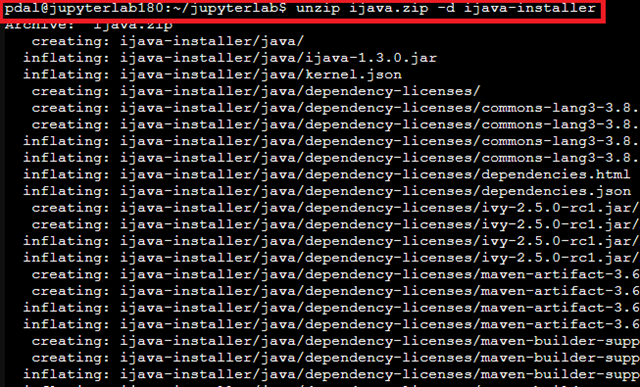

```bash
cd ijava-installer
~/jupyterlab/venv/bin/python3 install.py --user
```

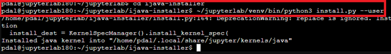

🔍

  * Downloads the official IJava kernel version 1.3.0 and unzips it.
  * Executes the installation script with the Python from the virtual JupyterLab environment.
  * The `--user` option installs the kernel only for the current user, without system changes.
  * The kernel is then only visible and usable by this user in the JupyterLab instance within the `venv`.

Afterward, the zip file and the ijava-installer can be deleted; `rm -r ijava.zip` and `rm -r ijava-installer/`.

✅ **Result**

The Java kernel is available in JupyterLab only for the relevant user and can be used in notebooks for executing Java code.
No system-wide installation or change occurs.

## 📊 9. (Optional) Install R & Set up IRkernel (Only for User & JupyterLab)

R is a programming language primarily used for statistical analysis, data cleaning, data import, and data visualization. It is a powerful tool for data scientists and researchers.

**🎯 Goal:** Make the R programming language and the IRkernel available only to the user in JupyterLab.

> Hint: Do this if you need the **R** language.

### 🔹 9.1 Install R

```bash
sudo apt install r-base -y
```

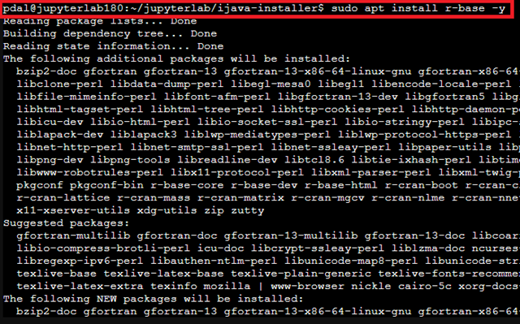

🔍

  * Installs the base R runtime environment.
  * Enables the execution of R scripts and packages.

### 🔹 9.2 Install IRkernel (Only for the Current User and only for the venv)

```bash
source ~/jupyterlab/venv/bin/activate
```

```bash
R
```

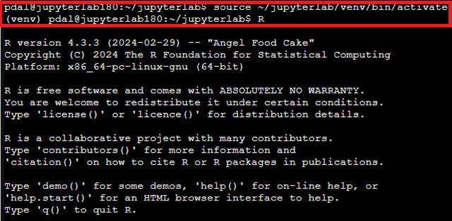

In the R console:

```bash
install.packages("IRkernel")
```

Answer with `yes`.


```bash
IRkernel::installspec(user = TRUE)
```


```bash
q()
```


🔍

  * Installs the IRkernel package, which allows Jupyter to execute R notebooks.
  * The function `installspec(user = TRUE)` registers the kernel only for the current user.
  * After exiting the R console (`q()`), the kernel is available to the user only in JupyterLab.

✅ **Result**

The R kernel is exclusively available to the respective user in JupyterLab. This is particularly suitable for LXC containers or single-user environments without system-wide kernel installation.

**📌 Query Installed JupyterLab Kernels**

To display all kernels available in JupyterLab (e.g., `Python`, `R`, `Java`), use the following terminal command in the `venv`:

```bash
jupyter kernelspec list
```

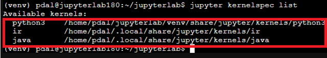

This command lists all installed kernels and shows their names and associated path directories.

**Example Output:**

Available kernels:

| Kernel Name | Path |
|:---|:---|
| python3 | `/home/pdal/jupyterlab/venv/share/jupyter/kernels/python3` |
| ir | `/home/pdal/.local/share/jupyter/kernels/ir` |
| java | `/home/pdal/.local/share/jupyter/kernels/java` |

Explanation:

| Kernel Name | Description |
|:---|:---|
| python3 | Python Kernel (e.g., from a virtual environment) |
| ir | R Kernel (provided by IRkernel) |
| java | Java Kernel (provided by IJava) |

All listed kernels are available for selection in the JupyterLab Launcher as well as when switching kernels within notebooks.

## 📦 10 Install Additional Python Libraries for JupyterLab (Example: paho-mqtt)

Additional libraries must be installed within the JupyterLab instance.

```bash
source ~/jupyterlab/venv/bin/activate
pip install paho-mqtt
```
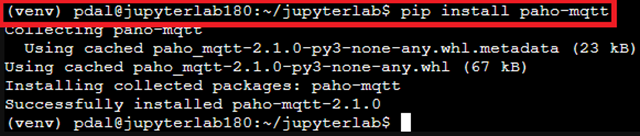

🔍

  * First activates the JupyterLab virtual environment.
  * Installs the Python library `paho-mqtt` using `pip`.
  * `paho-mqtt` is an example of an MQTT client library that can be used in Jupyter Notebooks.
  * Other libraries can be installed analogously within the virtual environment to avoid conflicts with system packages.

**💡 Alternative: Installation via JupyterLab Interface**
**Option 1:** Open Terminal in JupyterLab

```text
Menu → File → New → Terminal
```

Then, in the Terminal:

```bash
pip install <package-name>
```


**Option 2:** Install Directly in the Notebook

In the code field of a notebook cell:

```python
!pip install paho-mqtt
```

**Note:**
This method only works within the active kernel environment (e.g., Python venv) and assumes that the kernel has been initialized correctly.
✅ **Result**
Installed packages are directly available in the notebook – ideal for dynamic work with e.g., matplotlib, pandas, numpy, paho-mqtt, etc.

## 🔐 10. (Optional) SSL Encryption

JupyterLab can be operated securely with TLS/SSL.

For SSL configuration, see the official documentation:

[HTTPS in Jupyter aktivieren](https://tljh.jupyter.org/en/latest/howto/admin/https.html)

For integrating custom certificates (e.g., from a local CA):

**See separate guide:**
[0650CA-sslmitSANZertifikat.md]

**📌 Summary**

| **Component** | **Status / Value** |
|:---|:---|
| Python Version | 3.x |
| JupyterLab | Current via venv + pip |
| Java | OpenJDK 21, IJava (user only) |
| R | r-base, IRkernel (user only) |
| Start Port | `http://<IP>:8888` |
| Service Operation | ✅ via systemd |
| SSL | optional, see external guide |
| Password Protection | ✅ (via `jupyter-lab password`) |
| System User | e.g., `pdal` |

## 📚 Notes on Extensions, Updates & Backup

  * Extensions (e.g., jupyterlab-git, jupyterlab-lsp) are optional and can be installed via the Extension Manager or pip.

  * Updates:

<!-- end list -->

```bash
pip list --outdated
pip install --upgrade <package-name>
```

Backups:
Simply use rsync, e.g.:

```bash
rsync -a ~/jupyterlab/projects /mnt/backup/jupyterlab/
```

## 📚 Sources

  * "Documentation · IRkernel". Accessed: July 28, 2025. [Online]. Available at: [IKernel](https://irkernel.github.io/docs/)
  * "Get Started — JupyterLab 4.5.0a1 documentation". Accessed: July 28, 2025. [Online]. Available at: [Jupyterlab getting\_started](https://jupyterlab.readthedocs.io/en/latest/getting_started/overview.html)
  * "Installation — JupyterLab 4.5.0a1 documentation". Accessed: July 28, 2025. [Online]. Available at: [Jupyterlab Installation](https://jupyterlab.readthedocs.io/en/latest/getting_started/installation.html)
  * S. Park, SpencerPark/IJava. (July 27, 2025). Java. Accessed: July 28, 2025. [Online]. Available at: [Github IJava](https://github.com/SpencerPark/IJava)

---

## License

This work is licensed under the **Creative Commons Attribution-NonCommercial-ShareAlike 4.0 International License**.

[To the license text on the Creative Commons website](https://creativecommons.org/licenses/by-nc-sa/4.0/deed.de)
