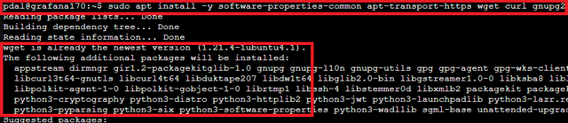
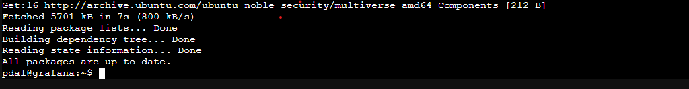
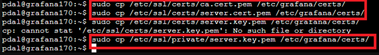

# Installing Grafana in an LXC Container and Securing it with TLS via an Internal CA

## Objective

This guide describes the complete installation and configuration of **Grafana** in an existing **LXC container** running **Ubuntu**. Additionally, it covers securing the web interface with a **SAN certificate** from an internal Certificate Authority (CA).

-----

## 1\. Background: What is Grafana?

Grafana is a web-based, open-source platform for visualizing data (especially time series). It supports numerous data sources such as **Prometheus, InfluxDB, PostgreSQL, Elasticsearch, or MQTT**. Grafana allows for the creation of interactive dashboards with various chart types, as well as the management of users and alert rules.

-----

## 2\. Prerequisites

  * A functioning LXC container with **Ubuntu 22.04 or 24.04** is available.
  * A user with **`sudo` rights** is available in the container (`pdal`).
  * A valid **server certificate** with a **SAN (Subject Alternative Name)** entry for the IP address of the Grafana container (IP `192.168.137.190`, DNS `grafana.local`) must be present.
  * The internal CA must be **trusted** in the client system.

-----

## 3\. Update the System

```bash
sudo apt update && sudo apt upgrade -y
```

**Explanation:**
The system's package lists are updated, and all installed packages are brought to the latest version. This ensures that an outdated software base is not used.

## 4\. Install Necessary Packages

```bash
sudo apt install -y software-properties-common apt-transport-https wget curl gnupg2
```



**Explanation:**
These packages are required to integrate external package sources (`apt-transport-https`), process signatures (`gnupg2`), and download files from remote servers (`wget`, `curl`).

## 5\. Set up the Grafana Repository

Since Grafana is not included in the standard Ubuntu repository, we will add it to the repository list. This ensures that Grafana is also checked during system updates/upgrades.

```bash
# Preparation for modern, secure GPG key management
sudo mkdir -p /etc/apt/keyrings

# Download Grafana's GPG signature, dearmor, and save it in the keyrings directory
wget -q -O - https://apt.grafana.com/gpg.key | gpg --dearmor | sudo tee /etc/apt/keyrings/grafana.gpg > /dev/null

# Integrate the official APT repository. The 'signed-by' attribute points to the keyring.
echo "deb [signed-by=/etc/apt/keyrings/grafana.gpg] https://apt.grafana.com stable main" | sudo tee /etc/apt/sources.list.d/grafana.list

# Update package lists
sudo apt update
```



**Explanation:**
Grafana's GPG signature is imported to ensure package integrity. Subsequently, the official Grafana APT repository is integrated, and the package lists are updated again.

## 6\. Install Grafana

```bash
sudo apt install -y grafana
```


**Explanation:**
The Grafana package is downloaded and installed from the previously integrated repository. The necessary services and configuration files are placed in the `/etc/grafana/` directory.

## 7\. Enable, Start, and Check Grafana Service Status

```bash
sudo systemctl enable grafana-server
sudo systemctl start grafana-server
sudo systemctl status grafana-server
```


**Explanation:**

  * The `grafana-server` service is **enabled** so it starts automatically upon system boot.
  * The service is then **started immediately** to make the web interface available.
  * Finally, the status is checked to ensure that the service is both `enabled` and running.

## 8\. Initial Access via HTTP

Browser call:

```cpp
http://<IP-Address>:3000
```

Example: `http://192.168.137.170:3000`


**Explanation:**
By default, Grafana listens on **Port 3000** without encryption. Log in with the user **`admin`** and the password **`admin`**. A new password must be set upon the first login.

## 9\. (Optional) TLS/SSL Encryption with Internal SAN Certificate

If you only use **Grafana** within PDAL, this step (9) is not strictly necessary.

### 9.1 Create Directory Structure for Certificates

```bash
sudo mkdir -p /etc/grafana/certs
```


**Explanation:**
A dedicated directory is created for storing the certificate and the private key.

### 9.2 Copy Certificate and Key

The existing certificates and keys must be uploaded to the container beforehand.
A detailed description can be found in the documentation [[0650 CA-sslmitSANZertifikat.md]] using the Apache2 example.
The procedure is the same for Grafana.

```bash
sudo cp /etc/ssl/certs/server.cert.pem /etc/grafana/certs/
sudo cp /etc/ssl/private/server.key.pem /etc/grafana/certs/
sudo cp /etc/ssl/certs/ca.cert.pem /etc/grafana/certs/
```



```bash
sudo chmod 600 /etc/grafana/certs/*
```


**Explanation:**
The server certificate (`server.cert.pem`) and the private key (`server.key.pem`) are copied to the Grafana directory. File permissions are set so that only **Root** has read access.

> **⚠️Note:** The certificate file (`cert_file`) should contain the server certificate and ideally the entire certificate chain (Intermediate CA).

### 9.3 Enable TLS in the Grafana Configuration

```bash
sudo nano /etc/grafana/grafana.ini
```

**Adjust the following sections:**

```ini
[server]
protocol = https
http_port = 443
cert_file = /etc/grafana/certs/server.cert.pem
cert_key  = /etc/grafana/certs/server.key.pem
;domain = grafana.local
;enforce_domain = true
```

**Explanation:**
Communication is switched from HTTP to **HTTPS**. The certificate files are integrated.

> **⚠️Note:**
> Since no DNS is used and the certificate contains IP addresses in the SAN, `domain` and `enforce_domain` are disabled. This prevents a redirect to unresolvable hostnames.

### 9.4 Restart Grafana

```bash
sudo systemctl restart grafana-server
```

**Explanation:**
The changed configuration is applied by restarting the service.

### 9.5 Test Access via HTTPS

**Browser call:**

`https://192.168.137.170`

**Explanation:**
Grafana is now accessible via **HTTPS**. If the internal CA is integrated into the client's system, no certificate warning will appear.

### 9.6 Integrate CA Certificate on the Client (Optional)

For systems without an integrated CA, it can be installed manually.
**Linux (Debian/Ubuntu):**

```bash
sudo cp ca.crt /usr/local/share/ca-certificates/myca.crt
sudo update-ca-certificates
```

**Windows/macOS:**

The CA certificate must be manually imported into the system's certificate store as trustworthy.

## 10\. Add Data Source in Grafana

  * In the web interface, navigate to "Connections" → "Data Sources".
  * Select a supported data source, e.g., PostgreSQL, InfluxDB, Prometheus.
  * Enter access data and the source's address.
  * Test the connection and save.

**Explanation:**
Grafana uses **"Data Sources"** to query external systems and display data in panels. A valid connection is a prerequisite for creating dashboards.

## 11\. Create a Dashboard

  * Select " + Create" → "Dashboard" from the menu.
  * Add a new panel.
  * Select the data source and define the query.
  * Adjust the visualization and time range.

**Explanation:**
Dashboards allow for a structured display of data with various visualization types (graphs, tables, statistics). They are individually customizable.

## 12\. User Management (Optional)

Grafana offers role-based user management:

  * **Admin:** full rights
  * **Editor:** can edit dashboards
  * **Viewer:** read-only rights

**Explanation:**
User management is done via the web interface under "Server Admin" → "Users". Additional configurations are required for LDAP/OAuth integration.

## Further Use

This documentation only covers basic Grafana functions, such as adding data sources or creating simple dashboards.

However, the Grafana web interface offers a multitude of other possibilities for visualization, alerting, user management, and integration of external systems. It is recommended to familiarize yourself with the extended features by using the interactive Getting Started Tutorial on the start page of the web interface.

Additionally, the official documentation under:

`https://grafana.com/tutorials/`

provides a comprehensive overview of all available features, configuration options, and best practices for productive use.

## 13\. Uninstallation (Optional)

```bash
sudo systemctl stop grafana-server
sudo apt purge --autoremove grafana -y
sudo rm -rf /etc/grafana /etc/apt/sources.list.d/grafana.list /etc/grafana/certs
```

**Explanation:**
Grafana is completely removed, including configurations and certificates.

## 14\. Result

Grafana is installed and secured by a **TLS certificate** from an internal CA. The web interface is accessible via **HTTPS**. The platform is ready for connecting data sources and creating dashboards.

### ⚠️Security Notice

The use of a server-side TLS certificate from your own `CA` improves security within the internal environment.

## Sources

  * "Tutorials", Grafana Labs. Accessed: July 23, 2025. [Online]. Available at: [Grafana Tutorials](https://grafana.com/tutorials/)
  * "Grafana fundamentals", Grafana Labs. Accessed: July 23, 2025. [Online]. Available at: [Grafana Fundamentals](https://grafana.com/tutorials/grafana-fundamentals/)
  * "Grafana OSS and Enterprise | Grafana documentation", Grafana Labs. Accessed: July 23, 2025. [Online]. Available at: [Grafana Doc](https://grafana.com/docs/grafana/latest/)
  * "Set up Grafana HTTPS for secure web traffic | Grafana documentation", Grafana Labs. Accessed: July 23, 2025. [Online]. Available at: [Grafana Setup](https://grafana.com/docs/grafana/latest/setup-grafana/set-up-https/)
  * "Technical documentation", Grafana Labs. Accessed: July 23, 2025. [Online]. Available at: [Grafana](https://grafana.com/docs/)

-----

## License

This work is licensed under the **Creative Commons Attribution - NonCommercial - ShareAlike 4.0 International License**.

[Link to the license text on the Creative Commons website](https://creativecommons.org/licenses/by-nc-sa/4.0/deed.en)
